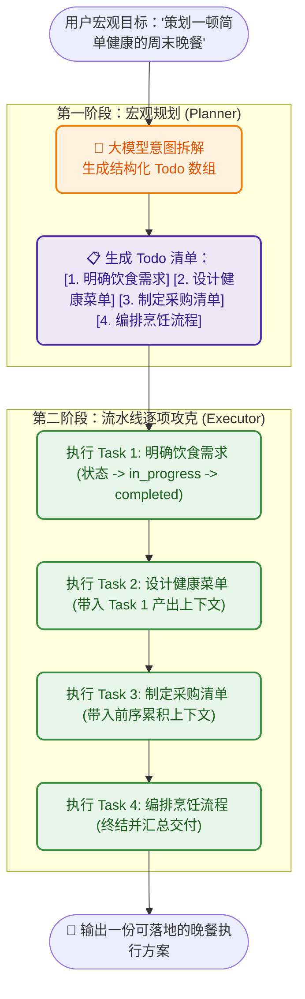

# 8.3 Plan and Execute 规划范式：任务清单拆解与 Todo 状态机

> **“无头苍蝇式干活是走到哪算哪；专业项目经理则是先拉一张甘特图，把宏观目标拆成 1-2-3-4 个清晰子任务，做完一项打一个勾！”**

***

## 🧗 为什么需要 Plan and Execute？

上一节我们学习了 ReAct（边想边干）。但随着任务复杂度的上升，**单纯的 ReAct 很容易产生两大严重缺陷**：
1. **“走着走着跑偏了”**：面对需要 10 步以上的长链条任务时，大模型容易在中间某一步被琐碎报错带偏，彻底忘记了最初的目标；
2. **Token 浪费严重**：每动一步都要把所有历史重新推理一遍，冗余开销巨大。

为了破解这一痛点，学术界与工业界（如开源社区著名的 **[Plan-and-Solve Prompting](https://arxiv.org/abs/2305.04091)** 与 **[learn-claude-code s05 TodoWrite](https://github.com/shareAI-lab/learn-claude-code/tree/main/s05_todo_write)**）提出了 **Plan and Execute（先规划，再执行）** 架构。



***

## 📊 ReAct vs Plan-and-Execute 对比矩阵

| 维度 | ReAct 思考范式 | Plan and Execute 规划范式 |
| :--- | :--- | :--- |
| **生活比喻** | 边炒菜边尝咸淡的大厨 | 先写完整施工图再砌墙的建筑师 |
| **核心策略** | 单步战术试错（Tactical） | 全局战略拆解（Strategic） |
| **任务形态** | 交互式排错、即时工具调用、短平快任务 | 复杂系统设计、长文本调研、多阶段重构 |
| **抗漂移能力** | 较弱（容易被突发报错带偏） | **极强（Todo 清单始终锚定全局主线）** |
| **代表工程** | 标准终端执行器 | Claude Code 的 `TodoWrite`、Devin 任务白板 |

***

## 💻 源码实现：TodoItem 状态机与两阶段调度

在 `code/s03_plan_and_execute.py` 中，我们利用 `pydantic` 定义了结构化任务模型：

```python
class TodoItem(BaseModel):
    id: int = Field(description="任务编号")
    title: str = Field(description="任务简要标题")
    detail: str = Field(description="执行该任务的具体操作细节")
    status: str = Field(default="pending", description="状态: pending | in_progress | completed | failed")
    result: Optional[str] = Field(default="", description="任务执行后的产出结果")
```

### 两阶段执行核心引擎：

```python
# 1. 第一阶段：生成纯 JSON 任务清单
def create_plan(self, goal: str) -> List[TodoItem]:
    prompt = f"请将目标拆解为 3~5 个顺序递进的子任务，输出纯 JSON 数组：{goal}"
    res = self.client.chat([{"role": "user", "content": prompt}], temperature=0.3,
                            response_format={"type": "json_object"})  # 结构化输出：保证返回纯 JSON
    raw_items = json.loads(clean_json(res.choices[0].message.content))
    self.todos = [TodoItem(**item) for item in raw_items]
    return self.todos

# 2. 第二阶段：单步执行与状态流转（限制输出长度 + 调低思考档位提速）
def execute_step(self, item: TodoItem, context: str) -> str:
    item.status = "in_progress"                       # 状态锁：标记为执行中
    res = self.client.chat([{"role": "user", "content": f"当前任务：{item.detail}\n上下文：{context}"}],
                            temperature=0.6,
                            max_tokens=1000,          # 限制单步输出长度，防止模型无上限生成导致超时/卡死
                            reasoning_effort="low")   # 思考档位调至 low：GLM-5.3 始终思考、不支持关闭，调低可大幅提速
    item.result = res.choices[0].message.content
    item.status = "completed"                         # 标记完成打勾
    return item.result

# 3. 汇总调度：逐项执行 + 上下文递进累积 + 终端进度提示
def run_all(self, goal: str):
    self.create_plan(goal)
    accumulated_context = f"全局最终目标: {goal}\n"

    for item in self.todos:
        print(f"▶ 正在执行子任务 #{item.id}: {item.title} ...")  # 进度提示，避免看起来像卡住
        res = self.execute_step(item, accumulated_context)
        accumulated_context += f"\n【步骤 {item.id} - {item.title} 产出】:\n{res}\n"
        print(f"✔ 子任务 #{item.id} 完成")
```

> 💡 **小提示（防"卡死"实战技巧）**：`glm-5.3-flash` 这类带思考（reasoning）的模型，默认会先生成大量"思考 token"再输出正文。若不加以限制，单步执行可能耗时极长、甚至看起来像卡死。注意 **GLM-5.3 始终思考、不支持关闭**（传 `thinking={"type": "disabled"}` 会报错 `1210`），正确做法是用 **`reasoning_effort="low"`** 把思考档位压到最低来提速，同时用 **`max_tokens`** 限制输出长度。若某一步确实需要深度推理，可把 `reasoning_effort` 调为 `high` / `max` 并相应调大 `max_tokens`。

***

## 🕹️ 在 Gradio 中动手体验

在 `code/app.py` 中切换至 **`8.3 Plan & Execute 规划范式`** 标签页：

1. 输入目标：`为一家独立咖啡店设计会员成长体系方案`；
2. 点击 **📝 拆解并全自动执行**；
3. 你将看到实时更新的 Todo 状态机（`pending` ➔ `in_progress` ➔ `completed`），以及各步骤递进生成的完整策划方案！

***

## 🔀 进阶深化：三范式选型矩阵与"计划自适应重规划"（参考 deepagents write_todos）

### 三大经典范式如何选型？

| 范式 | 管什么 | 适用场景 | 代表工程 |
| :--- | :--- | :--- | :--- |
| **ReAct** | 能不能做对（单步试错） | 交互排错、即时工具调用 | 通用终端执行器 |
| **Plan & Execute** | 方向别跑偏（宏观拆解） | 长文本调研、多阶段重构 | Claude Code `TodoWrite`、[deepagents](https://github.com/langchain-ai/deepagents) `write_todos` |
| **Reflection** | 质量够不够硬（自我批判） | 方案评审、文档撰写、代码审查 | hello-agents 第四章 |

### 计划不是死的：执行中要能"自适应重规划"

现实中计划永远赶不上变化：当你执行到第 3 步时发现第 2 步的产出推翻了最初设想，死磕原计划只会浪费时间。因此 [deepagents](https://github.com/langchain-ai/deepagents) 的 `write_todos` 工具特别强调：**计划是可编辑的**。我们在 `run_all` 中加一个"计划再协商"钩子，当某步执行失败或目标漂移时，让模型基于错误信息重写剩余 Todo 即可：

```python
if item.status == "failed":
    new_plan = self.client.chat([{"role": "user", "content":
        f"步骤 [{item.title}] 执行失败，请基于错误信息重规划剩余任务，输出纯 JSON 数组：\n{item.result}"}],
        response_format={"type": "json_object"})  # 结构化输出：保证返回纯 JSON
    # 用新计划替换剩余 todos 并继续执行（状态机复位为 pending）
    self.todos = [TodoItem(**x) for x in json.loads(clean_json(new_plan.choices[0].message.content))]
```

> 项目再宏大，也架不住"打不过就跑"的战术微调——**Plan 负责定方向，Execute 负责带反馈**，两者循环才是完整体。

***

## 📝 本节小结

- **状态机锚定意图**：通过结构化的 `TodoItem` 状态机，Agent 永远清楚自己“做完了什么、正在做什么、下一步该做什么”；
- **上下文递进交付**：每一步只依赖前置步骤的交付物，大幅降低了上下文混乱度；
- **下一步演进**：我们已经有了 ReAct（单步工具执行）与 Plan-and-Execute（宏观任务拆解）。接下来，我们要让大模型调用真正的外部 Python 函数——**[8.4 工具注册与分发机制](04_工具注册与分发机制.md)**！
