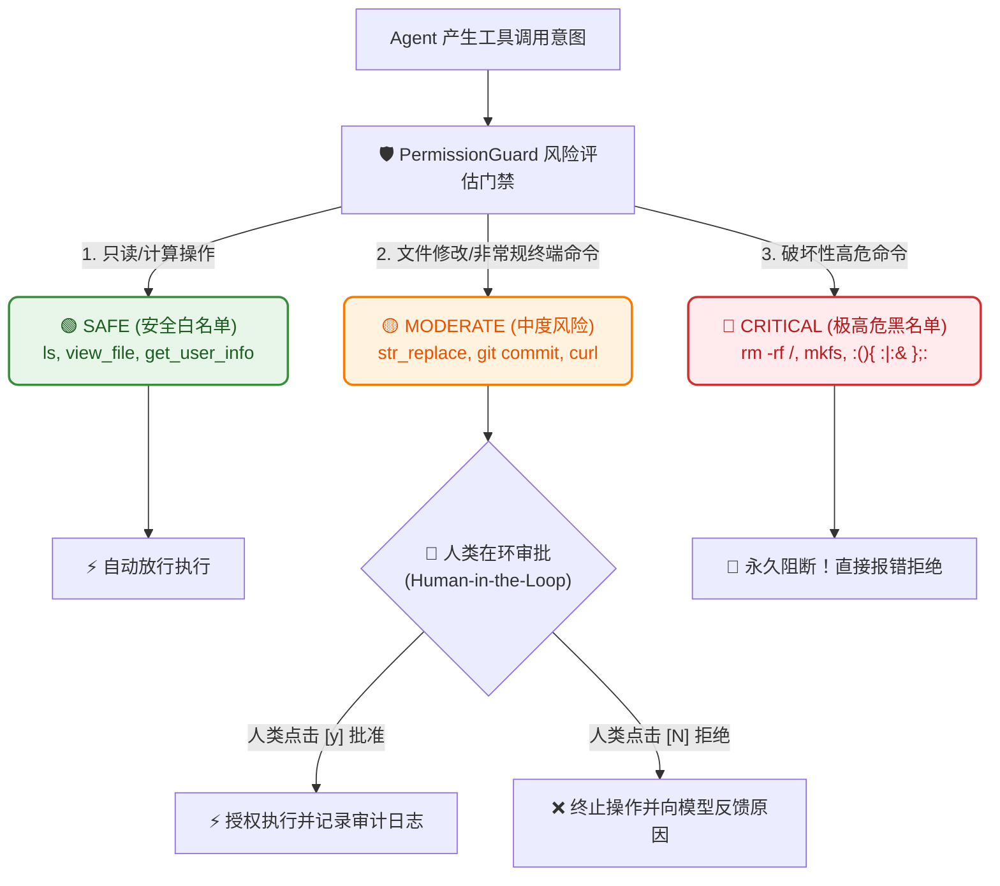

# 8.6 权限控制与人类在环：危险指令拦截与 Human-in-the-Loop 门禁

> **“给实习生一把办公室钥匙是出于信任，但在服务器上执行 `DROP DATABASE` 之前，必须叫来总监当面签字批准！”**

***

## 🛡️ 为什么自主 Agent 必须戴上“安全紧箍咒”？

在前面的章节中，我们赋予了 Agent 执行 Bash 命令和读写文件的强大能力。然而，**能力越大，破坏力也越大**：
- 如果大模型推理失误，执行了 `rm -rf *`，工作区所有未提交的代码将瞬间化为乌有；
- 如果 Prompt 遭遇注入攻击，恶意指令可能诱导 Agent 将本地包含 API 密钥的 `.env` 发往外部服务器；
- 如果代码陷入死循环，可能不断产生垃圾文件耗尽磁盘空间。

因此，工业级 Agent 必须具备 **分级权限控制（Permission Guard）** 与 **人类在环审批（Human-in-the-Loop, HITL）** 机制（参考 [learn-claude-code s03 Permission](https://github.com/shareAI-lab/learn-claude-code/tree/main/s03_permission)）。



***

## 📊 三级风险判定矩阵

| 风险级别 | 典型工具 / 操作行为 | 处置策略 | 核心目标 |
| :--- | :--- | :--- | :--- |
| **🟢 SAFE (安全)** | `view_file`、`list_dir`、`ls`、`git status`、数学计算 | **全自动秒级放行** | 保证 Agent 流畅的只读分析与检索体验 |
| **🟡 MODERATE (中危)** | `str_replace` 修改代码、`git push`、创建文件、安装依赖 | **弹出审批请求，人类授权** | 保证所有修改都在人类掌控之中 |
| **🔴 CRITICAL (高危)** | `rm -rf /`、系统关机、格式化磁盘、Fork 炸弹 | **硬编码永久拦截** | 筑牢最底层的防毁灭级底线 |

***

## 💻 源码实现：`PermissionGuard` 拦截与审批闭环

在 `code/s06_permissions_hitl.py` 中，门禁系统的核心审核流转逻辑如下：

```python
def check_and_execute(self, tool_name: str, args: Dict[str, Any], execution_fn: Callable) -> Dict[str, Any]:
    risk, reason = self.evaluate_risk(tool_name, args)

    # 1. 高危黑名单直接阻断
    if risk == ActionRiskLevel.CRITICAL:
        return {"success": False, "message": f"🚫 [永久阻断] {reason}"}

    # 2. 安全白名单直接执行
    if risk == ActionRiskLevel.SAFE:
        res = execution_fn(**args)
        return {"success": True, "message": "🟢 [自动放行]", "result": res}

    # 3. 中危操作触发人类审批
    if self.approval_callback:
        approved = self.approval_callback(tool_name, args)
    else:
        # CLI 交互降级提示
        approved = (input(f"⚠️ 正在请求执行 [{tool_name}]，是否批准？(y/N): ").strip().lower() == "y")

    if approved:
        res = execution_fn(**args)
        return {"success": True, "message": "🟡 [人类审批通过已执行]", "result": res}
    else:
        return {"success": False, "message": "❌ [人类已拒绝执行]"}
```

***

## 🕹️ 在 Gradio 中动手体验

在 `code/app.py` 中切换到 **`8.6 权限控制与人类在环`** 标签页：

1. 选择工具：`run_bash`，输入高危命令：`rm -rf /`，点击测试 ➔ 查看被安全门禁直接判定为 `CRITICAL` 并彻底阻断；
2. 输入只读命令：`ls -l` ➔ 查看判定为 `SAFE` 并直接自动放行；
3. 选择 `str_replace` 编辑本地文件 ➔ 查看判定为 `MODERATE` 并触发人类审批流！

***

## 🎛️ 进阶深化一：Steering —— 运行中的人类"遥控器"（参考 Pi / deepagents interrupts）

本节的门禁只覆盖"执行前审批"。但真实场景更常见的是：Agent 已经在跑，方向却肉眼可见地跑偏了。工业级 Agent（如 [Pi](https://github.com/earendil-works/pi) 的 `steer`、[deepagents](https://github.com/langchain-ai/deepagents) 的 interrupt）都支持**中途打断（Steering）**：用户随时发一句话，Agent 立刻把这句话作为最高优先级指令注入上下文，纠正当前动作：

```python
def steer(self, steering_text: str):
    """🎮 人类中途遥控：把纠偏指令以最高优先级压入上下文"""
    self.messages.append({"role": "system",
        "content": f"🚨 [人类中途干预] 请立即停止当前动作并按以下指令调整：{steering_text}"})
    # 若模型正陷入某个长工具调用，还可在此强制中断并重新决策
```

## 🧱 进阶深化二："信任 LLM" vs 沙箱隔离的边界哲学（参考 deepagents）

[deepagents](https://github.com/langchain-ai/deepagents) 明确定义了两种安全姿态：
- **信任 LLM（Trust the LLM）**：默认相信模型，权限在**工具层/沙箱层强制执行**（本节的 `PermissionGuard` 就是这种思路——靠规则墙兜底，而非靠模型自觉）；
- **沙箱隔离（Sandbox）**：干脆把 Agent 关进一个无权限的容器（如 Docker）里，即使模型被注入攻击，也碰不到宿主机。

> 生产环境的最佳实践是**两者叠加**：规则门禁负责"防呆"，容器沙箱负责"防炸"。本节先教会你第一层，足够做出安全可用的本地 Agent 了。

***

## 📝 本节小结

- **安全边界**：无约束的 Agent 是隐患，带安全门禁的 Agent 才是可靠的生产力；
- **人类在环 (HITL)**：在最关键的修改步骤保留人类裁判权，兼顾自动化与安全性；
- **下一步演进**：如果想在每个工具执行前后做耗时统计、敏感信息清洗或埋点监控，该怎么做？请进入——**[8.7 Hooks 生命周期机制](07_Hooks生命周期机制.md)**！
