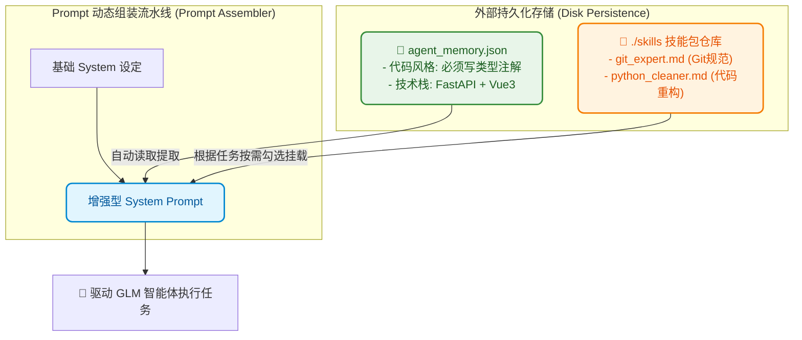

# 8.9 记忆系统与技能挂载：长期 Memory 持久化与 SKILL.md 动态挂载

> **“老管家不仅记得你的咖啡习惯不加糖（长期记忆），当你需要报税时，他还能随手翻开一本《个税申报指南》（动态技能包），立刻变身专业财务助理！”**

***

## 🧠 记忆系统与技能包：让 Agent 跨会话持续进化

在现代 Agent 体系中，一个真正聪明的助手必须具备两种跨越单次会话的进化机制：
1. **长期记忆系统（Long-term Memory）**：记录用户偏好、项目架构规约、业务黑话，关闭终端甚至重启电脑后依然不丢失；
2. **动态技能挂载（Skills Injection）**：将专业领域的 SOP（如 Git 提交规范、Docker 部署指南）打包为独立的 Markdown 文件（`SKILL.md`），按需动态挂载进 System Prompt（参考 [learn-claude-code s07 Skill Loading](https://github.com/shareAI-lab/learn-claude-code/tree/main/s07_skill_loading) 与 [s09 Memory](https://github.com/shareAI-lab/learn-claude-code/tree/main/s09_memory)）。



***

## 💡 为什么技能包采用 Markdown（`SKILL.md`）？

1. **对大模型最友好**：大模型对 Markdown 的标题、列表和加粗具有最天然的语义解析能力；
2. **零代码热插拔**：任何人想要教 Agent 一个新技能（例如《企业内部发布流程》），只需新建一个 `deploy_guide.md` 扔进 `skills/` 目录，无需修改任何 Python 源码；
3. **按需挂载节约 Token**：平时不挂载，做 Git 操作时才加载 `git_expert.md`，极致保持上下文清爽。

***

## 💻 源码实现：`MemoryStore` 与 `SkillLoader`

在 `code/s09_memory_and_skills.py` 中，核心架构实现如下：

```python
class MemoryStore:
    """本地 JSON 持久化记忆仓库"""
    def __init__(self, storage_file: str = "agent_memory.json"):
        self.storage_file = storage_file
        self.memories = self._load()

    def remember(self, key: str, value: str):
        """存盘记录"""
        self.memories[key] = value
        with open(self.storage_file, "w", encoding="utf-8") as f:
            json.dump(self.memories, f, ensure_ascii=False, indent=2)

    def recall(self) -> str:
        """格式化导出所有记忆"""
        return "\n".join([f"- [{k}]: {v}" for k, v in self.memories.items()])

class SkillLoader:
    """扫描 ./skills 目录下的所有 md 文件"""
    def __init__(self, skills_dir: str = "skills"):
        self.skills_dir = skills_dir
        self.loaded_skills = {}
        self.reload_skills()

    def reload_skills(self):
        md_files = glob.glob(os.path.join(self.skills_dir, "*.md"))
        for path in md_files:
            name = os.path.splitext(os.path.basename(path))[0]
            with open(path, "r", encoding="utf-8") as f:
                self.loaded_skills[name] = f.read().strip()

    def assemble_system_prompt(self, base_prompt: str, active_skills: List[str], memory: MemoryStore) -> str:
        """动态组装注入了记忆与技能的增强 Prompt"""
        prompt = base_prompt + "\n\n"
        prompt += f"🧠 【长期用户偏好与规则记忆】:\n{memory.recall()}\n\n"
        if active_skills:
            prompt += "🛠️ 【挂载的专业技能插件包】:\n"
            for s_name in active_skills:
                prompt += f"\n--- 技能插件: {s_name} ---\n{self.loaded_skills.get(s_name, '')}\n"
        return prompt
```

***

## 🕹️ 在 Gradio 中动手体验

在 `code/app.py` 中切换到 **`8.9 记忆系统与技能挂载`** 标签页：

1. 添加一条长期记忆：键名 `技术栈偏好`，内容 `必须使用 TailwindCSS 与 FastAPI` ➔ 点击保存；
2. 勾选动态技能：`git_expert` 和 `python_cleaner`；
3. 点击 **⚡ 生成注入了记忆与技能的增强 System Prompt**，查看右侧完整组装出的超强 Prompt！

***

## 🪜 进阶深化：技能的"渐进式披露"两层加载（参考 learn-claude-code s05）

本节把整份技能正文一股脑塞进 System Prompt，简单但不够省。工业界的标准做法是 **渐进式披露（Progressive Disclosure）**：System Prompt 里只放每个技能的 `name + description` 轻量元数据（约 100 Token/个），当模型确认需要时，再通过一次 `load_skill` 工具调用按需取回全文（放进 tool_result，不进 System）——正如 [learn-claude-code s05 Skill Loading](https://github.com/shareAI-lab/learn-claude-code/tree/main/s05_skill_loading) 的设计：

```python
def get_descriptions(self) -> str:
    """第一层：只向 System Prompt 暴露元数据，约 100 Token/技能"""
    lines = [f"- {name}: {skill['meta'].get('description', '')}" for name, skill in self.skills.items()]
    return "\n".join(lines) or "(no skills available)"

@registry.register
def load_skill(name: str) -> str:
    """第二层：模型主动点名时，才把完整技能正文作为 tool_result 注入"""
    skill = self.skill_loader.loaded_skills.get(name)
    return skill if skill else f"❌ 未知技能 {name}，可用: {', '.join(self.skill_loader.loaded_skills)}"
```

这要求技能文件带 YAML frontmatter 元数据（`name` / `description`）。收益：**10 个技能也只需常驻 ~1000 Token，其余按需加载，上下文永久清爽**。

***

## 📝 本节小结

- **记忆持久化**：让 Agent 具备跨会话的持续学习和习惯记忆能力；
- **技能插件化**：用纯 Markdown 规范扩展能力边界，实现即插即用的专家能力注入；
- **新思考**：当遇到极其庞大的多领域复杂任务时，一个全能 Agent 难免分身乏术，如何派发多个子代理分头行动？请进入——**[8.10 Subagents 子代理协作](10_Subagents子代理协作.md)**！
