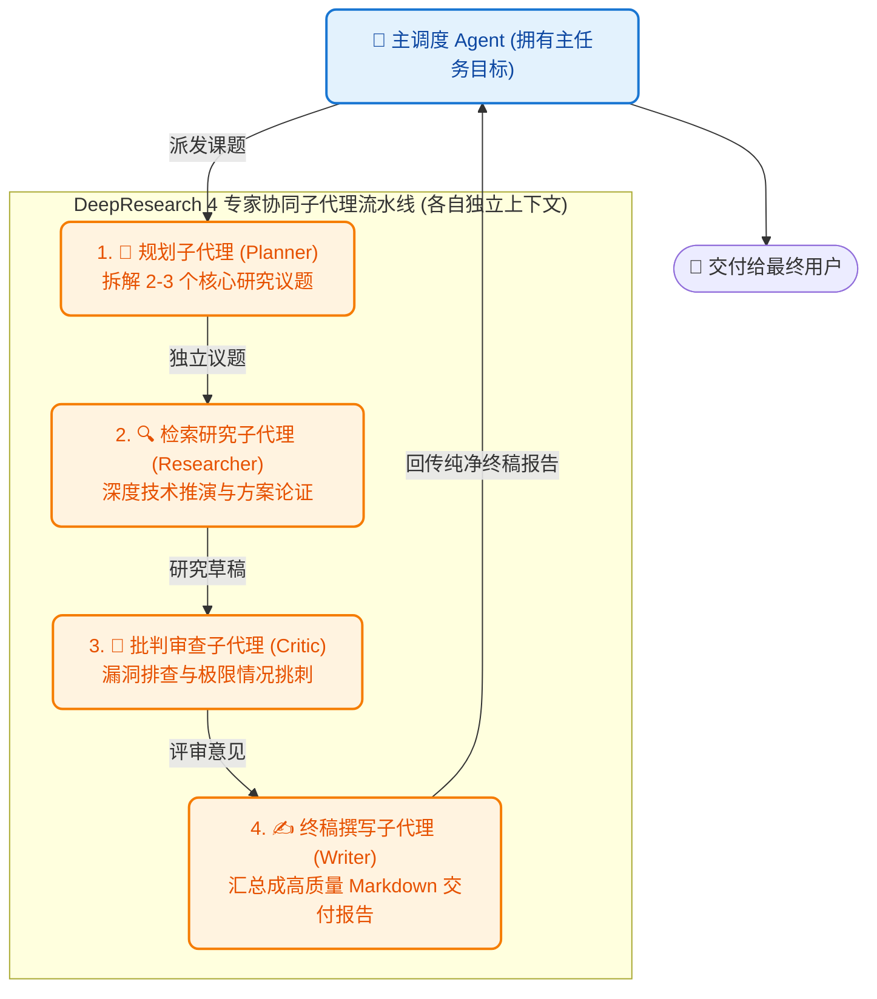

# 8.10 Subagents 子代理协作：上下文隔离与 DeepResearch 多角色流水线

> **“五星级饭店的主厨绝不会自己又切菜、又洗碗、又去菜市场砍价；他会把采购任务派给专职学徒，学徒在自己的小车间搞定一切，只把洗净称好的顶级食材端回主厨厨房！”**

***

## 👥 为什么单 Agent 会遇到瓶颈？Subagent 的核心价值

在处理大型工程任务（如写一篇深度技术调研报告、或者重构整个项目的认证模块）时，如果我们把所有搜索结果、几十个文件的长代码全塞给同一个 Agent，**主 Agent 的上下文会瞬间被海量噪音污染**。

为了解决这一问题，现代顶尖架构（如 [learn-claude-code s06 Subagent](https://github.com/shareAI-lab/learn-claude-code/tree/main/s06_subagent) 与 [hello-agents 第十四章自动化深度研究](https://github.com/datawhalechina/hello-agents)）引入了 **Subagent（子代理）机制**：
- **上下文彻底隔离（Context Isolation）**：每个子代理拥有完全属于自己的全新 `messages[]`，它内部查了几十次网页、产生了上万 Token 的中间试错，都不会污染主 Agent 的主线程；
- **只返回纯净交付物（Clean Text Back）**：子代理完成任务后，仅将提炼后的最终文本结论返回给父级。



***

## 💻 源码实现：`Subagent` 隔离与 `DeepResearchPipeline`

在 `code/s10_subagents.py` 中，子代理的本质就是一个具备专属 System Prompt 与隔离上下文的极简执行器：

```python
class Subagent:
    def __init__(self, name: str, role_prompt: str, client: ZhipuGLMClient):
        self.name = name
        self.role_prompt = role_prompt
        self.client = client

    def run(self, task_input: str) -> str:
        """为子任务分配全新独立的 messages 列表，完全隔绝外部干扰"""
        isolated_messages = [
            {"role": "system", "content": self.role_prompt},
            {"role": "user", "content": task_input}
        ]
        response = self.client.chat(messages=isolated_messages, temperature=0.5)
        return response.choices[0].message.content.strip()
```

### 四专家流水线串联：

```python
class DeepResearchPipeline:
    def __init__(self, client: ZhipuGLMClient):
        self.planner = Subagent("规划师", "拆解2个核心议题...", client)
        self.researcher = Subagent("研究员", "深入分析技术优缺点...", client)
        self.critic = Subagent("审查员", "尖锐挑刺并提出补充建议...", client)
        self.writer = Subagent("主编", "汇总生成精美Markdown报告...", client)

    def execute_research(self, topic: str):
        # 1. 拆解议题
        plan = self.planner.run(topic)
        # 2. 深度推导
        research = self.researcher.run(f"课题: {topic}\n议题: {plan}")
        # 3. 审查挑刺
        critic = self.critic.run(f"研究: {research}")
        # 4. 汇总终稿
        final_report = self.writer.run(f"研究: {research}\n审查: {critic}")
        return final_report
```

***

## 🕹️ 在 Gradio 中动手体验

在 `code/app.py` 中切换到 **`8.10 Subagents 多智能体协作`** 标签页：

1. 输入研究课题：`2026年 Agentic Coding 与传统 IDE 的架构融合趋势`；
2. 点击 **🚀 启动 4 专家协同深度研究**；
3. 观察多智能体协同流水线：规划师拆解 ➔ 研究员深度推演 ➔ 审查员挑刺 ➔ 主编汇总，最终生成一份逻辑严密的万字深度调研报告！

***

## ⚡ 进阶深化：子代理也可以"并行开工"（进阶课题）

目前的多智能体流水线是**串行**的：Planner 跑完才轮到 Researcher。但深度调研里，多个独立议题完全可以**并行**让多个子代理同时开工（参考 [learn-claude-code s08 Background Tasks](https://github.com/shareAI-lab/learn-claude-code/tree/main/s08_background_tasks) 的后台线程 + 通知队列思想，以及 [deepagents](https://github.com/langchain-ai/deepagents) 的并发任务派发）。这属于进阶课题，感兴趣的读者可在完成 **[8.13 综合实战：打造个人 Mini-Agent](13_综合实战_打造个人MiniAgent.md)** 后，自己把 `Subagent.run` 丢进线程池再统一收集结果，让流水线从"排队叫号"升级为"多窗口并行"。

***

## 📝 本节小结

- **分而治之**：复杂任务拆解给垂直专家子代理，各自拥有独立上下文，主线程轻装上阵；
- **流水线闭环**：通过 Planner ➔ Researcher ➔ Critic ➔ Writer 链条，大幅提升生成质量并杜绝单模型自说自话的盲区；
- **终极冲刺**：现在，我们已经掌握了环境、思考、规划、工具、文件、权限、切面、压缩、记忆、子代理全部 10 大核心模块！下一节，我们要把所有模块精密组装成最终的完整形态——**[8.13 综合实战：打造个人 Mini-Agent](13_综合实战_打造个人MiniAgent.md)**！
