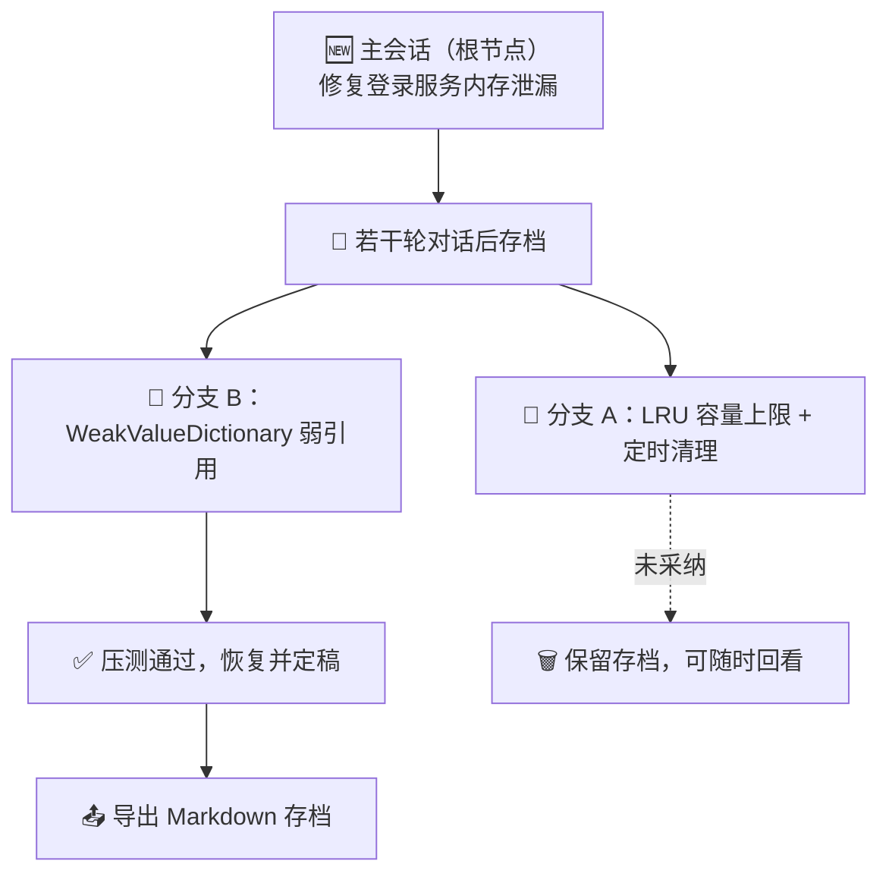

# 8.11 会话持久化与多分支管理：给 Agent 装上存档读档与平行宇宙

> **“工程师不会只写一版方案就定稿，而是把每个思路存成一份草稿，随时回退、随时从任意一步重新开一个分支——好代码从来不是‘写出来’的，而是‘分叉 + 收敛’试出来的。”**

***

## 🧠 为什么需要会话持久化：从「内存易失」到「磁盘持久」

前几节里，我们的 Agent 完成任务的整个过程都活在一段 **内存中的 `messages` 列表** 里：Agent 调用工具、收到反馈、继续思考……所有上下文都在 Python 进程的 RAM 中随用随丢。一旦用户 **关闭终端、`Ctrl+C` 中断任务、或电脑崩溃重启**，这段宝贵的对话上下文就灰飞烟灭了——第二天想继续昨天做到一半的重构，只能从零开始重新讲一遍需求。

> 🧠 **内存易失 vs 磁盘持久**
>
> | 维度 | 内存中的 `messages`（易失） | 落盘后的会话（持久） |
> | :--- | :--- | :--- |
> | 生命周期 | 进程结束即消失 | 写入 JSON 文件，重启后依然存在 |
> | 断点续跑 | 不可（一切重来） | 一键 `load()` 恢复，接着干 |
> | 可回退 | 不可（历史被覆盖） | 可回溯到任意历史节点 |
> | 可并行 | 不可 | 可 fork 多个分支平行探索 |
> | 可分享 | 不可 | 可导出 Markdown / HTML 存档 |

这就是**会话持久化（Session Persistence）** 的价值：它把 Agent 的“思考现场”像游戏存档一样固化到磁盘，让 **断点续跑（Resume）**、**多方案并行（Fork）** 与 **会话导出（Export）** 成为可能。业界顶尖终端编码 Agent 早已把这一能力作为标配：

- **[Pi agent](https://github.com/earendil-works/pi)（earendil-works）**：把每次会话保存为一棵 **树状分支结构（session tree）**，每个条目都有 `id` 与 `parentId`；用 `/tree` 原地跳回任意历史节点继续，用 `/fork` 从历史某条消息分叉出新会话，用 `/export` 导出为 HTML，用 `/resume` 在历史会话间切换；
- **[learn-claude-code](https://github.com/shareAI-lab/learn-claude-code)**：完整复刻了 Claude Code 的会话机制——会话以 JSONL 文件按项目目录持久化（`~/.claude/projects/<project>/<session-id>.jsonl`），消息通过 `parentUuid` 链接成可分支的链式结构，配合 `--continue` / `--resume` 恢复、`/branch` 分叉、`/export` 导出。

本节我们就用原生 Python 手搓一套迷你版：**`SessionStore` 会话仓库 + `SessionNode` 树节点**，完整复刻“存档 / 读档 / 分叉 / 恢复 / 导出”五大能力。

***

## 🌳 树状分支 vs 线性历史：两种会话组织方式

传统的会话只是一条 **线性历史（Linear History）**：新消息永远接在旧消息后面，一旦“退回三步换个思路”，后面的成果就全部丢弃。而树状分支（Tree Branching）则把会话组织成一棵 **树**：同一个“岔路口”可以长出一左一右两条分支，互不干扰，随时切换、随时合并收敛。

| 对比维度 | 线性历史（Linear） | 树状分支（Tree） |
| :--- | :--- | :--- |
| 历史结构 | 一条单向链表 | 一棵多叉树（`parent_id` 指向父节点） |
| 回退重来 | ❌ 回退即丢失后续 | ✅ 可回退到任意节点再开新分支 |
| 多方案对比 | ❌ 只能串行尝试 | ✅ 平行探索 A/B 方案 |
| 恢复位置 | 只能恢复“最近一次” | ✅ 可从任意历史节点 `load` 续跑 |
| 实现复杂度 | 低 | 中（需维护父/子关系与持久化） |



对照 Pi agent 的设计：Pi 的每条会话记录都带 `id / parentId`，当前所在位置就是“活动的叶子节点”；用户随时可以 `navigate` 回某个历史节点，从那里长出新叶子（分支），旧分支不会被破坏。这正是我们接下来要实现的 `SessionNode` 的 **父 / 子关系**。

***

## 💻 源码实现：`SessionNode` 与 `SessionStore`

完整代码见 `code/s11_session.py`（仅依赖 `os / json / uuid / time` 等标准库，**纯本地、不联网、不需要 API Key**）。核心架构拆解如下：

### 1️⃣ 树节点 `SessionNode`：一条可被分叉的消息历史

```python
class SessionNode:
    """树状会话节点：一条完整消息历史，可被 fork 分叉出多个子分支"""
    def __init__(self, session_id=None, title="未命名会话", parent_id=None,
                 messages=None, created_at=None):
        self.session_id = session_id or uuid.uuid4().hex[:12]   # 🆔 全局唯一 ID
        self.title = title
        self.parent_id = parent_id                              # 🌳 父分支 ID，None 为根会话
        self.messages = messages if messages is not None else []
        self.created_at = created_at or time.strftime("%Y-%m-%d %H:%M:%S")

    def to_dict(self) -> Dict[str, Any]:
        """📦 序列化为 JSON 友好字典（存档）"""
        return {"session_id": self.session_id, "title": self.title,
                "parent_id": self.parent_id, "messages": self.messages,
                "created_at": self.created_at}

    @classmethod
    def from_dict(cls, data: Dict[str, Any]) -> "SessionNode":
        """♻️ 从字典还原节点（读档）"""
        return cls(session_id=data.get("session_id"), title=data.get("title", "未命名会话"),
                   parent_id=data.get("parent_id"), messages=data.get("messages", []),
                   created_at=data.get("created_at"))
```

**拆解**：`parent_id` 是整棵树的关键——`None` 表示它是“根会话”，非 `None` 则指向父分支，由此把散落的 JSON 文件串成一棵可回溯的树；`to_dict / from_dict` 成对出现，负责“内存对象 ⇄ 磁盘 JSON”的双向转换。

### 2️⃣ 会话仓库 `SessionStore`：存档、读档、分叉、导出

```python
class SessionStore:
    """🗄️ 会话仓库：以 JSON 文件持久化会话树，支持存档/读档/分叉/导出"""
    def __init__(self, storage_dir: str = "sessions"):
        self.storage_dir = storage_dir
        os.makedirs(storage_dir, exist_ok=True)  # 📁 自动创建会话目录

    def save(self, session: SessionNode) -> None:
        """💾 存档：把会话节点写回磁盘"""
        with open(self._path(session.session_id), "w", encoding="utf-8") as f:
            json.dump(session.to_dict(), f, ensure_ascii=False, indent=2)

    def create_session(self, title: str, messages: Optional[List[Dict[str, Any]]] = None) -> str:
        """🆕 新建根会话并立即存档，返回 session_id"""
        session = SessionNode(title=title, messages=messages or [])
        self.save(session)
        return session.session_id

    def load(self, session_id: str) -> Optional[SessionNode]:
        """📂 读档：从磁盘恢复指定会话（断点续跑）"""
        path = self._path(session_id)
        if not os.path.exists(path):
            return None
        with open(path, "r", encoding="utf-8") as f:
            return SessionNode.from_dict(json.load(f))

    def list_sessions(self) -> List[Dict[str, Any]]:
        """📋 返回全部会话摘要（按创建时间倒序）"""
        summaries = []
        for fname in os.listdir(self.storage_dir):
            if not fname.endswith(".json"):
                continue
            try:
                with open(os.path.join(self.storage_dir, fname), "r", encoding="utf-8") as f:
                    data = json.load(f)
                summaries.append({"session_id": data.get("session_id"),
                                  "title": data.get("title", "未命名会话"),
                                  "parent_id": data.get("parent_id"),
                                  "message_count": len(data.get("messages", [])),
                                  "created_at": data.get("created_at", "")})
            except Exception:
                continue  # 跳过损坏文件
        summaries.sort(key=lambda s: s["created_at"], reverse=True)
        return summaries
```

**拆解**：`save` 用 `ensure_ascii=False` 保证中文可读；`load` 找不到文件时返回 `None` 而不是抛异常，让调用方可以优雅降级；`list_sessions` 扫描目录下所有 `.json`，只提取摘要字段（标题、父分支、消息数），方便工作台渲染会话列表。

### 3️⃣ 分叉与导出：`fork` 与 `export_markdown`

```python
    def fork(self, parent_id: str, new_messages: Optional[List[Dict[str, Any]]] = None) -> SessionNode:
        """🌿 分叉：继承父会话历史并追加新消息，生成指向父节点的子分支"""
        parent = self.load(parent_id)
        if parent is None:
            raise ValueError(f"❌ 未找到父会话: {parent_id}，无法分叉！")
        child = SessionNode(title=f"{parent.title} · 分支", parent_id=parent.session_id,
                            messages=list(parent.messages) + (new_messages or []))
        self.save(child)
        return child

    def export_markdown(self, session_id: str) -> str:
        """📤 把该会话 messages 渲染成可读 Markdown 文本"""
        session = self.load(session_id)
        if session is None:
            return f"(未找到会话: {session_id})"
        lines = [f"# 🗂️ 会话导出：{session.title}", "",
                 f"- **会话 ID**：`{session.session_id}`",
                 f"- **父分支**：`{session.parent_id or '无（根会话）'}`",
                 f"- **创建时间**：{session.created_at}",
                 f"- **消息条数**：{len(session.messages)}", "", "---", ""]
        for i, msg in enumerate(session.messages, 1):
            role = msg.get("role", "unknown")
            lines += [f"### {i}. {ROLE_ICONS.get(role, '📄')} `{role}`", "",
                      str(msg.get("content", "")), ""]
        return "\n".join(lines)

    def delete(self, session_id: str) -> bool:
        """🗑️ 删除指定会话文件"""
        path = self._path(session_id)
        if os.path.exists(path):
            os.remove(path)
            return True
        return False
```

**拆解**：`fork` 的精髓是 **“继承父会话全部历史 + 追加新消息”**——新分支完整保留主干的对话上下文，再继续探索自己的方案，`parent_id` 指向父节点形成树形关系；`export_markdown` 把每条消息按角色渲染成 `### 序号 · 角色 emoji` 的章节结构，一份干净可分享的会话报告就出炉了。

***

## 🎬 实战演示：主会话 → 两个分支 → 恢复 → 导出

下面我们用一次完整的“内存泄漏排查”过程，走一遍整棵树的生命周期：

```python
def demo_tree_branching(store: SessionStore) -> Dict[str, Any]:
    """🎬 演示：创建主会话 → 模拟对话 → 分叉 2 个方案 → 恢复其一 → 导出 Markdown"""
    main_id = store.create_session("修复登录服务内存泄漏", [
        {"role": "system", "content": "你是一名资深 Python 后端工程师，负责诊断并修复 Web 服务内存泄漏。"},
        {"role": "user", "content": "服务连续运行 3 天后，内存占用从 200MB 一路涨到 3GB，帮我定位根因。"},
    ])
    main = store.load(main_id)
    main.messages.append({"role": "assistant", "content": "已初步检查日志：怀疑全局缓存未清理 + 长连接未释放，先深入阅读代码确认。"})
    main.messages.append({"role": "user", "content": "我怀疑是 event_listener 注册表无限增长，帮忙重点排查。"})
    main.messages.append({"role": "assistant", "content": "已 grep 全局注册表，定位到 cache_store 与 ws_pool 两处高度可疑的点。"})
    store.save(main)  # 💾 中途存档，随时可断点续跑

    branch_a = store.fork(main_id, [
        {"role": "assistant", "content": "方案 A：为 cache_store 增加 LRU 容量上限，并注册定时清理任务。"},
        {"role": "user", "content": "可以，按方案 A 继续实施。"},
    ])
    branch_b = store.fork(main_id, [
        {"role": "assistant", "content": "方案 B：改用 WeakValueDictionary 弱引用缓存，让 GC 自动回收。"},
        {"role": "user", "content": "先别改代码，我要先对比 A/B 两套方案的压测数据再拍板。"},
    ])

    resumed = store.load(branch_b.session_id)  # 📂 恢复分支 B（断点续跑）
    resumed.messages.append({"role": "user", "content": "压测完成：方案 B 峰值内存更低、吞吐更稳，决定采用方案 B。"})
    resumed.messages.append({"role": "assistant", "content": "✅ 已按弱引用方案完成重构，内存曲线回归平稳，问题闭环。"})
    store.save(resumed)

    return {"main_id": main_id, "branch_a_id": branch_a.session_id,
            "branch_b_id": branch_b.session_id,
            "export_md": store.export_markdown(resumed.session_id)}
```

运行后，`sessions/` 目录下会真实落盘 3 个 JSON 文件，形成一棵会话树（为便于阅读，消息用省略号压缩）：

```json
// ① 根会话（主会话，5 条消息）
{ "session_id": "5d38f60f4c00", "title": "修复登录服务内存泄漏", "parent_id": null,
  "messages": [ {"role":"system",...}, {"role":"user",...}, {"role":"assistant",...},
                {"role":"user",...}, {"role":"assistant",...} ],
  "created_at": "2026-08-25 18:46:40" }

// ② 分支 A（继承主干 5 条 + 新增 2 条 = 7 条）
{ "session_id": "4d67e2e6b66c", "title": "修复登录服务内存泄漏 · 分支",
  "parent_id": "5d38f60f4c00",
  "messages": [ /* 主干 5 条 */, {"role":"assistant","content":"方案 A：LRU 容量上限 + 定时清理..."},
                {"role":"user","content":"可以，按方案 A 继续实施。"} ] }

// ③ 分支 B（恢复后定稿：主干 5 条 + 新增 4 条 = 9 条）
{ "session_id": "0994dd416b46", "title": "修复登录服务内存泄漏 · 分支",
  "parent_id": "5d38f60f4c00",
  "messages": [ /* 主干 5 条 */, {"role":"assistant","content":"方案 B：WeakValueDictionary 弱引用缓存..."},
                {"role":"user","content":"先别改代码，先对比 A/B 压测数据再拍板。"},
                {"role":"user","content":"压测完成：方案 B 峰值内存更低，决定采用方案 B。"},
                {"role":"assistant","content":"✅ 按弱引用方案完成重构，问题闭环。"} ] }
```

`export_markdown(branch_b)` 渲染出的导出文本（节选）：

```markdown
# 🗂️ 会话导出：修复登录服务内存泄漏 · 分支
- **会话 ID**：`0994dd416b46`  |  **父分支**：`5d38f60f4c00`
- **创建时间**：2026-08-25 18:46:40  |  **消息条数**：9
---
### 1. 🧠 `system`
你是一名资深 Python 后端工程师，负责诊断并修复 Web 服务内存泄漏。
### 2. 👤 `user`
服务连续运行 3 天后，内存占用从 200MB 一路涨到 3GB，帮我定位根因。
...
### 9. 🤖 `assistant`
✅ 已按弱引用方案完成重构，内存曲线回归平稳，问题闭环。
```

这段“主会话 → 双分支 → 恢复定稿 → 导出”的流转，与 Pi agent 的 `/tree`（原地跳转节点）+ `/fork`（分叉新会话）+ `/export`（导出 HTML）的设计一一对应，只是我们用 **几十行原生 Python** 就把内核跑通了。

***

## 🕹️ 在 Gradio 中动手体验

在 `code/app.py` 工作台中为会话管理新增一个 `8.11 会话持久化与多分支管理` 标签页，即可获得类似 Pi 终端的可视化体验：

1. **新建会话**：输入标题与系统提示词，点击「🆕 新建会话」，右侧即时生成 `session_id` 并自动存档；
2. **保存进度**：在对话框中继续多轮对话，每次回复后点击「💾 保存」，消息实时写入对应 JSON 文件——关闭页面再回来，从「📚 历史会话」下拉框选中即可 **断点续跑**；
3. **分叉分支**：选中某个历史会话后，勾选「🌿 分叉为新分支」并输入新的方案指令，工作台自动生成指向父节点的子会话，A/B 两套方案平行并存、互不干扰；
4. **导出记录**：任选一个会话点击「📤 导出 Markdown」，在文本框中直接复制会话报告，或一键下载为 `.md` 存档分享。

在界面里你还能直接看到 `list_sessions()` 返回的会话摘要树：每一行都标注了 `标题 / 父分支 / 消息数`，一眼看清整棵“平行宇宙”的脉络。

***

## 📝 本节小结

- **会话持久化**：把 Agent 的内存 `messages` 用 JSON 文件固化到磁盘，实现 **断点续跑**，再也不怕关终端丢进度；
- **树状分支**：`SessionNode.parent_id` 把线性历史升级为可 **分叉 / 回退 / 平行探索** 的会话树，参考了 [Pi agent](https://github.com/earendil-works/pi) 的 session tree（`id / parentId`）与 [learn-claude-code](https://github.com/shareAI-lab/learn-claude-code) 复刻的 Claude Code 会话机制（JSONL + `--resume` / `/branch` / `/export`）；
- **导出能力**：`export_markdown` 让每次探索都能沉淀为可分享的 Markdown 报告，与 Pi 的 `/export`（HTML）异曲同工。

现在，Agent 已经能 **存档、读档、开平行宇宙** 了——可一旦任务变复杂、分支变多，我们该如何量化它的表现、定位性能瓶颈？请进入——**[8.12 可观测性与性能评估](12_可观测性与性能评估.md)**！
