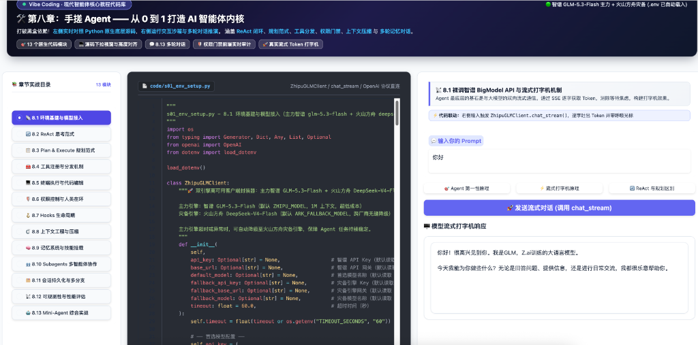
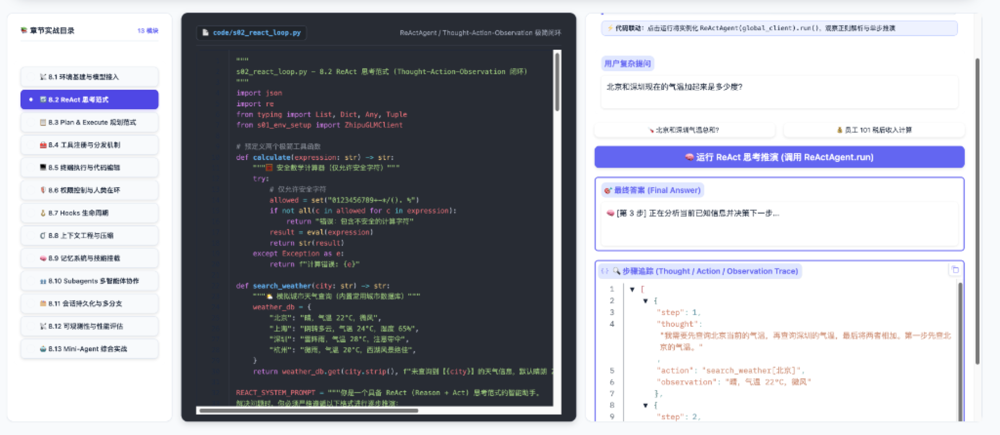
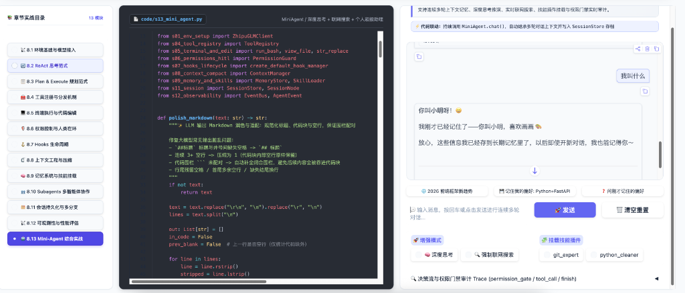

# 🛠️ 第八章手搓 Agent 配套代码库 (Code Base)

本目录包含了第八章从 8.1 到 8.13 的全部手搓实现，以及一个**全功能 13-Tab 统一 Gradio 交互工作台**。

> 💡 **两种玩法，任选其一**：每个脚本既能**终端命令行**直接跑（看底层日志、流式打字机、Token/缓存统计），也能通过 **Gradio 网页界面**点按运行（图形化、零门槛）。

***

## 🎯 代码定位说明：刻意简化，不是生产项目

> **先想清楚"这份代码是干嘛用的"再动手跑，体验会好很多。**

本目录的代码是**教学演示**，不是可以直接上线的生产项目。它的"简单"是**刻意设计**的：

- **每个小节 100\~150 行左右**，是为了让你一眼看穿某个机制的最小工作模型（比如 8.7 的 `HookManager` 用 4 个列表 + 3 个 run 方法就讲透了 AOP 切面拦截的骨架）；
- **不依赖 LangChain / CrewAI 等重型框架**，只用 Python 原生机制 + 官方 SDK，把 Agent 的"真实内脏"直接摊开给你看——这正是"手搓"的意义；
- **复杂度是逐步抬升的**：前 12 节各自独立、轻量，到了 [s13\_mini\_agent.py](s13_mini_agent.py)（约 330 行）才把所有机制真正串起来，组成一个**能跑真对话、会联网搜索、会存档、带轨迹回放**的完整 Mini-Agent 内核。

### ⚠️ 它刻意"简化"了哪些东西（想上生产请认准这些坑）

| 维度   | 本目录的简化实现                          | 生产级通常怎么做                          |
| :--- | :-------------------------------- | :-------------------------------- |
| 并发   | 单线程同步 ReAct 循环                    | asyncio 异步 + 并行工具调用               |
| 联网搜索 | DuckDuckGo HTML 正则抓取；失败时明确报错，不生成兜底答案 | Tavily / Bing / SerpAPI 等稳定搜索 API |
| 记忆   | 本地 JSON 文件                        | 向量库 + RAG / 关系型数据库                |
| 沙箱隔离 | 无（直接跑本地命令）                        | Docker / 容器化隔离执行                  |
| 生态接入 | 仅原生工具                             | MCP 生态、A2A 协议、后台任务与团队协作           |
| 评测   | 简易 `EvalSuite` 统计                 | 大规模分布式评测与持续观测平台                   |

> 📌 **一句话总结**：这份代码的价值在于**看懂 Agent 是怎么运转的**；如果你要的是"开箱即用的生产级 Agent"，请直接用 opencode / Claude Code / Pi 等成熟工具，或参考后续章节（LangChain / LangGraph / 自建项目）在它的基础上做工程化升级。

***

## 🧩 什么是 Gradio？（先花 30 秒认识它）

[Gradio](https://www.gradio.app/) 是一个开源的 Python 网页界面库，核心作用一句话：**把普通 Python 函数自动变成浏览器里的表单 + 按钮**。

- 你平时在终端写 `print(input("请输入"))` 是"命令行交互"；Gradio 则自动为你生成一个网页（默认 `http://127.0.0.1:7860`），在浏览器里输入文字、点按钮、看输出，**完全不用手写 HTML/JS**；
- 就好比**给命令行程序装上一个遥控器面板**：底层代码逻辑不变，只是多了一个可视化遥控器，方便调试、演示和教学；
- 本章把它用在 `app.py` 里，构建了 **「左侧源码联动 + 右侧交互沙箱」** 的 13 模块全景工作台，一次启动、逐个体验。

<div align="center">
  
  <p><em>▲ 模块 8.1 演示：智谱 BigModel API 基础接入与 SSE Token 流式打字机</em></p>
</div>

<div align="center">
  
  <p><em>▲ 模块 8.2 演示：ReAct 思考闭环推演与结构化步骤追踪 (Trace)</em></p>
</div>

<div align="center">
  
  <p><em>▲ 模块 8.13 演示：Mini-Agent 综合实战（多轮气泡对话、长期记忆、联网搜索与技能插件）</em></p>
</div>

### 🧪 Gradio 运行口径速查

| 类型 | 对应小节 | 说明 |
| :--- | :--- | :--- |
| 🟢 **调用真实模型** | **8.1 / 8.2 / 8.3 / 8.4 / 8.10 / 8.13** | 需要 `ZHIPU_API_KEY`。8.2 的天气、8.4 的员工档案是内置教学数据，但模型决策和 Function Calling 握手依然是真实请求。8.10 和 8.13 还可能访问真实搜索页面。 |
| 🟠 **混合模式** | **8.8 / 8.12** | 8.8 的截断按钮是本地逻辑，`/compact` 与全策略对比会调真模型；8.12 同时提供“本地 Mock 评估”和“真实引擎联动评估”两个按钮。 |
| 🔵 **本地真实逻辑** | **8.5 / 8.9 / 8.11** | 不消耗模型 Token，但会真实执行受控命令、写入记忆/会话文件或导出 Markdown，不是“假按钮”。 |
| 🟡 **Mock 工具演示** | **8.6 / 8.7** | 不调模型。8.6 真实运行风险判定，但最终执行器是安全 Mock；8.7 用 `mock_tool` 演示真实 Hooks 脱敏与计时。 |

> 完整的逐节说明见 [第八章 README](../README.md#-gradio-各小节到底是-mock-还是真模型)。没有 Key 时，可先体验蓝色、黄色以及 8.12 的本地 Mock 按钮。

***

## ⚡ 极速启动 (Quick Start with uv)

我们推荐使用现代 Python 包管理工具 `uv`（也可以使用普通 `pip`）：

```bash
# 1. 进入代码目录
cd 08_手搓Agent/code

# 2. 复制并配置环境变量
cp .env.example .env
# 编辑 .env 填入智谱 API Key（ZHIPU_API_KEY）与火山方舟灾备 Key（ARK_API_KEY）
# 主力模型默认 glm-5.3-flash，异常时自动降级至火山方舟 deepseek-v4-flash

# 3. 首次：创建虚拟环境 .venv 并安装依赖（后续无需重复）
uv sync

# 4a. 想用可视化网页（Gradio）：一键启动 13-Tab 工作台
uv run python app.py

# 4b. 想在终端直接跑某个章节（例如 8.1）：二选一
uv run python s01_env_setup.py
```

- 走 `4a`：浏览器打开 `http://127.0.0.1:7860`，在 13 个标签页里点按体验所有核心特性；
- 走 `4b`：直接在终端看该脚本的日志输出、流式打字机与 Token/缓存统计。

***

## 🚀 逐小节启动指南（终端 or Gradio 标签页）

每个脚本都内置了 `if __name__ == "__main__"` 自测入口，可在终端独立运行；对应的功能也都能在 Gradio 的对应标签页里体验。

| 章节                  | 脚本                         | 终端一键运行                                   | Gradio 对应标签页              |
| :------------------ | :------------------------- | :--------------------------------------- | :------------------------ |
| 8.1 环境基建            | `s01_env_setup.py`         | `uv run python s01_env_setup.py`         | 「8.1 环境基建与模型接入」           |
| 8.2 ReAct 思考范式      | `s02_react_loop.py`        | `uv run python s02_react_loop.py`        | 「8.2 ReAct 思考范式」          |
| 8.3 Plan & Execute  | `s03_plan_and_execute.py`  | `uv run python s03_plan_and_execute.py`  | 「8.3 Plan & Execute 规划范式」 |
| 8.4 工具注册分发          | `s04_tool_registry.py`     | `uv run python s04_tool_registry.py`     | 「8.4 工具注册与分发」             |
| 8.5 终端与编辑           | `s05_terminal_and_edit.py` | `uv run python s05_terminal_and_edit.py` | 「8.5 终端执行与代码编辑」           |
| 8.6 权限与人类在环         | `s06_permissions_hitl.py`  | `uv run python s06_permissions_hitl.py`  | 「8.6 权限控制与人类在环」           |
| 8.7 Hooks 生命周期      | `s07_hooks_lifecycle.py`   | `uv run python s07_hooks_lifecycle.py`   | 「8.7 Hooks 生命周期」          |
| 8.8 上下文工程与压缩     | `s08_context_compact.py`   | `uv run python s08_context_compact.py`   | 「8.8 上下文工程与压缩」            |
| 8.9 记忆与技能           | `s09_memory_and_skills.py` | `uv run python s09_memory_and_skills.py` | 「8.9 记忆系统与技能挂载」           |
| 8.10 Subagents 协作   | `s10_subagents.py`         | `uv run python s10_subagents.py`         | 「8.10 Subagents 多智能体协作」   |
| 8.11 会话持久化          | `s11_session.py`           | `uv run python s11_session.py`           | 「8.11 会话持久化与多分支」          |
| 8.12 可观测性评估         | `s12_observability.py`     | `uv run python s12_observability.py`     | 「8.12 可观测性与性能评估」          |
| 8.13 综合实战 MiniAgent | `s13_mini_agent.py`        | `uv run python s13_mini_agent.py`        | 「8.13 Mini-Agent 综合实战」    |

> 提示：`uv run python app.py` 是"总开关"，启动后任意标签页都能体验对应小节；单独跑 `sXX.py` 则是"只看该小节"，日志更聚焦、更适合观察底层 JSON 报文与流式输出。

***

## 📂 代码文件结构索引

| 脚本文件                           | 对应章节                | 核心功能说明                                                                                          |
| :----------------------------- | :------------------ | :---------------------------------------------------------------------------------------------- |
| **`s01_env_setup.py`**         | 8.1 环境基建            | 原生封装 `ZhipuGLMClient`，主力智谱 BigModel（`glm-5.3-flash`）+ 火山方舟 `deepseek-v4-flash` 跨厂商灾备，支持流式输出与高可用 |
| **`s02_react_loop.py`**        | 8.2 ReAct思考范式       | 纯手写 `Thought ➔ Action ➔ Observation` 单步试错循环                                                     |
| **`s03_plan_and_execute.py`**  | 8.3 Plan & Execute  | 结构化任务清单与 `TodoItem` 状态机流转                                                                       |
| **`s04_tool_registry.py`**     | 8.4 工具注册分发          | `@tool` 装饰器、自动生成 JSON Schema 与分发路由器                                                             |
| **`s05_terminal_and_edit.py`** | 8.5 终端与编辑           | 安全 `run_bash` 终端执行与 Claude Code 招牌 `str_replace` 行替换                                            |
| **`s06_permissions_hitl.py`**  | 8.6 权限与人类在环         | `PermissionGuard` 危险命令拦截与 Human-in-the-Loop 审核                                                  |
| **`s07_hooks_lifecycle.py`**   | 8.7 Hooks生命周期       | AOP 切面拦截、自动敏感信息脱敏（保护 API Key）与耗时统计                                                              |
| **`s08_context_compact.py`**   | 8.8 上下文工程与压缩     | 双轨机制：0ms 滑动窗口截断、工具输出首尾裁剪与手写 `/compact` 深度历史摘要                                         |
| **`s09_memory_and_skills.py`** | 8.9 记忆与技能插件         | 本地 JSON 长期记忆库与 `skills/*.md` 动态挂载注入                                                             |
| **`s10_subagents.py`**         | 8.10 Subagents协作    | 上下文隔离的子代理、可插拔搜索提供方、证据台账与研究/审查/写作流水线                                               |
| **`s11_session.py`**           | 8.11 会话持久化与多分支      | `SessionStore` 存档读档、树状 `fork` 分叉、断点续跑与 Markdown 导出                                              |
| **`s12_observability.py`**     | 8.12 可观测性与性能评估      | `EventBus`、显式价格配置、`EvalCase` 验证器与成功率/时延/Token 评估                                             |
| **`s13_mini_agent.py`**        | 8.13 综合实战 MiniAgent | 整合全部机制，打造会联网搜索、会深度思考的个人对话助手（最终回答经 `polish_markdown` 润色适配）                                       |
| **`app.py`**                   | 综合可视化界面             | 13 个 Tab 聚合的 Master Gradio 交互工作台（8.3/8.10/8.13 的 LLM 输出统一 Markdown 润色后渲染）                       |

***

## 🩺 常见问题排查与避坑指南 (FAQ & Troubleshooting)

运行代码或启动 Gradio 工作台遇到问题？请先参考详尽的故障排查手册：  
👉 **[8.14 手搓 Agent 常见问题与排查指南](../14_常见问题与排查指南.md)**

### ⚡ 30 秒高频排查速查：
1. **长时间没反应/转圈卡死**：
   - 检查是否勾选了“🧠 深度思考”（CoT 推理需 10~30 秒，查看底端 Trace 折叠面板）；
   - 检查终端是否有 `PermissionGuard` 的 `[y/N]` 审批拦截提示；
   - 检查是否开启了全局科学上网 VPN（建议将 `open.bigmodel.cn` 加入直连白名单）；
   - 终端先单独跑 `uv run python s01_env_setup.py` 验证 API 连通性。
2. **打开 `app.py` 页面排版挤压变形/重叠**：
   - 浏览器按 **`Cmd -`** (Mac) 或 **`Ctrl -`** (Win) 缩小至 **80%~90%** 即可恢复完美三栏 IDE 视效；
   - 临时关闭 Dark Reader 等第三方暗黑网页强制反色插件。
3. **`ModuleNotFoundError` 报错**：
   - 请务必在 `08_手搓Agent/code` 目录下执行 `uv sync`，并使用 `uv run python app.py` 运行。
