# 🔍 9.7 Callbacks 回调与可观测性中间件

> **“在未建立可观测性之前，不要将任何 AI Agent 推向生产环境。”**  
> 大模型的调用就像一个黑盒，何时发起请求、消耗了多少 Token、耗时多久、有没有报错？LangChain 的 Callbacks 机制就是为大模型应用量身定制的“飞机黑匣子”与“安检探针”。

---

## 💡 先看一个直观例子：飞机黑匣子与安检探针

### 1. 生产环境的黑盒危机
当你把一个复杂的 Agent 系统上线后，用户突然反馈：“这个请求卡了 30 秒”、“为什么回答报错了”、“这个月账单为什么暴涨了 1 万美元？”  
如果没有回调监控系统，你只能面对空荡荡的日志发呆。

### 2. 生活比喻：航班黑匣子与安检 X 光机
- **`BaseCallbackHandler`**：就像飞机的**飞行数据记录仪（黑匣子）**，飞机起飞（`on_llm_start`）、巡航（`on_tool_start`）、降落（`on_llm_end`）、发生颠簸异常（`on_llm_error`）时，黑匣子都会自动记录下每一个毫秒级时间戳与参数；
- **敏感数据脱敏探针**：就像机场的**安检 X 光机**，在乘客登机（Prompt 发送给大模型）前，自动扫描并把打火机和违禁品（手机号、身份证、API Key）自动用 `[REDACTED]` 保护起来！

<!-- 图表源文件：img/diagrams/07-diagram-01.mmd；视觉风格：Pastel 多巴胺 -->
<p align="center">
  <a href="img/diagrams/07-diagram-01.svg">
    
  </a>
</p>

---

## 💻 核心实操：编写自定义 Token 审计与脱敏回调

### 1. 继承 BaseCallbackHandler 打造审计探针

```python
# code/s07_callbacks_and_tracing.py
import time
import re
from typing import Any, Dict, List
from langchain_core.callbacks import BaseCallbackHandler
from langchain_core.outputs import LLMResult

class PerformanceAndCostCallback(BaseCallbackHandler):
    """自定义性能监控与 Token 财务审计处理器"""
    
    def __init__(self, input_cost_per_1k: float = 0.002, output_cost_per_1k: float = 0.008):
        super().__init__()
        self.input_cost_per_1k = input_cost_per_1k
        self.output_cost_per_1k = output_cost_per_1k
        self.start_time = 0.0
        self.total_tokens = 0
        self.prompt_tokens = 0
        self.completion_tokens = 0
        self.total_cost = 0.0

    def on_llm_start(self, serialized: Dict[str, Any], prompts: List[str], **kwargs: Any) -> None:
        self.start_time = time.time()
        print("🔍 [Callback] LLM 请求已发出，计时启动...")

    def on_llm_end(self, response: LLMResult, **kwargs: Any) -> None:
        elapsed = time.time() - self.start_time
        # 版本兼容：旧版伙伴包把用量放在 llm_output；新版（langchain-openai ≥ 0.3）
        # 的 llm_output 常为 None，用量改挂在 generations[0].message.usage_metadata
        token_usage = (response.llm_output or {}).get("token_usage", {})
        if not token_usage and response.generations:
            top = response.generations[0]
            first = top[0] if top else None
            usage = getattr(getattr(first, "message", None), "usage_metadata", None) or {}
            token_usage = {
                "prompt_tokens": usage.get("input_tokens", 0),
                "completion_tokens": usage.get("output_tokens", 0),
                "total_tokens": usage.get("total_tokens", 0),
            }
        self.prompt_tokens = token_usage.get("prompt_tokens", 0)
        self.completion_tokens = token_usage.get("completion_tokens", 0)
        self.total_tokens = token_usage.get("total_tokens", self.prompt_tokens + self.completion_tokens)
        
        # 估算成本 (USD)
        self.total_cost = (
            (self.prompt_tokens / 1000.0) * self.input_cost_per_1k +
            (self.completion_tokens / 1000.0) * self.output_cost_per_1k
        )
        print(f"✅ [Callback] 调用结束！耗时: {elapsed:.3f}s, Token: {self.total_tokens}, 预估: ${self.total_cost:.6f}")

    def on_llm_error(self, error: Exception, **kwargs: Any) -> None:
        print(f"❌ [Callback] 发生异常: {error}")
```

### 2. 挂载执行并实时获取审计数据

在任何 LCEL 链调用时，只需在 `config` 字典中传入 `callbacks` 列表：

```python
from langchain_core.prompts import ChatPromptTemplate
from langchain_core.output_parsers import StrOutputParser
from s01_model_io import get_chat_model

perf_callback = PerformanceAndCostCallback()
chain = ChatPromptTemplate.from_template("请用 20 字概括量子力学：{q}") | get_chat_model() | StrOutputParser()

# 挂载回调
result = chain.invoke(
    {"q": "什么是波粒二象性？"},
    config={"callbacks": [perf_callback]}
)

# 随时读取审计属性
print(f"本次请求累计消耗 Token 数: {perf_callback.total_tokens}")
```

---

## 🌐 企业级可观测性：云端追踪平台（本教程暂不接入）

生产环境通常还会把调用栈、延迟、输入输出等 Trace 上传到云端可观测平台做全链路监控，主流选择有官方的 **LangSmith** 与开源的 **Langfuse**。出于"零配置、零外部依赖"的教学门槛考虑，**本教程暂时不接入**任何云端可观测平台——上面亲手写的 Callbacks 审计回调（Token 黑匣子账单 + 隐私脱敏）与 `AgentMiddleware` 观测钩子，已足够覆盖教学场景与轻量生产需求。

> 💡 **预留接口**：如果你后续有全链路 Trace、评估集与回归对比的需求，我们会单独出一小节，系统介绍 **LangSmith 与 Langfuse 两大可观测性平台的接入**。届时只需在 `.env` 配置几行环境变量（如 LangSmith 的 `LANGSMITH_TRACING=true` + `LANGSMITH_API_KEY`），LangChain 即可自动上报全部调用链路。
>
> 🔄 **版本提示**：旧版教程常写的 `LANGCHAIN_TRACING_V2=true` 已属**遗留写法**（作为别名仍兼容，但官方已不推荐），新项目请统一使用 `LANGSMITH_TRACING=true` 前缀。
>
> 💡 **1.4 新机制：Agent Middleware 观测钩子**。`create_agent` 的中间件机制提供了比 Callbacks 更内聚的观测入口 —— 自定义 `AgentMiddleware` 并覆写 `before_model` / `after_model`，即可在“模型调用前注入审计上下文”、“模型调用后统计 Token/耗时”：

```python
from typing import Any
from langchain.agents import create_agent
from langchain.agents.middleware import AgentMiddleware, AgentState
from langgraph.runtime import Runtime

class AuditMiddleware(AgentMiddleware):
    """官方标准写法：子类化 AgentMiddleware 并覆写钩子方法；返回 None 表示不修改状态"""

    def before_model(self, state: AgentState, runtime: Runtime) -> dict[str, Any] | None:
        print(f"🔍 请求开始，当前消息数: {len(state['messages'])}")
        return None

    def after_model(self, state: AgentState, runtime: Runtime) -> dict[str, Any] | None:
        last = state["messages"][-1]
        usage = last.usage_metadata or {}
        print(f"✅ 请求结束，Token: {usage.get('total_tokens')}")
        return None   # 若返回 dict，则会被合并进 Agent 状态（经 reducer 处理）

agent = create_agent(model=get_chat_model(), tools=[], middleware=[AuditMiddleware()])
```

> ⚙️ 另请注意：1.4 起 **Callbacks 默认后台异步执行**（不阻塞主流程）；无服务器环境下若需保证追踪在函数结束前完成，可显式设置 `LANGCHAIN_CALLBACKS_BACKGROUND=false`。

---

## 🆕 1.1+ 官方预置中间件全家桶：零手写，即插即用

上面我们手写了 `AgentMiddleware`，适合深度定制；而 1.1 起官方直接内置了一批高频中间件，一行装配即可获得生产级可靠性。到 **1.4（2026-09-03 发布）** 为止，`langchain.agents.middleware` 顶层已内置 **16 个预置中间件**，按"防线"分成四类，全部本地实测核对过签名：

**第一类 · 稳如老狗（重试 / 容灾）**——快递送不到就换家物流再试：

| 中间件 | 作用 | 关键参数（1.4 实测） |
| :--- | :--- | :--- |
| **`ModelRetryMiddleware`** | 模型调用失败自动重试，指数退避 | `max_retries=2`、`retry_on`、`on_failure='continue'`、`backoff_factor=2.0`、`jitter=True`；不可重试异常直接重抛 |
| **`ModelFallbackMiddleware`** | 主模型失败后**依次**切换备用模型 | `ModelFallbackMiddleware("openai:gpt-5.5", "anthropic:claude-...")`：位置参数传模型串或实例 |
| **`ToolRetryMiddleware`** | 工具调用失败自动重试（同款退避算法） | `max_retries=2`、`tools`（可只对指定工具生效）、`on_failure='continue'` |
| **`ToolErrorMiddleware`**（1.3.14+） | 把选中工具异常转成 `ToolMessage(status="error")` 喂回模型自愈 | `on_error` 回调：返回内容=转错误消息，返回 `None`=照常抛出；**opt-in 设计**，内部异常默认不会泄给模型 |

**第二类 · 省钱护栏（限额 / 脱敏）**——信用卡设消费上限 + 账单打码：

| 中间件 | 作用 | 关键参数（1.4 实测） |
| :--- | :--- | :--- |
| **`ModelCallLimitMiddleware`** | 限制**模型**调用次数，防死循环烧钱 | `thread_limit`（跨轮累计）/ `run_limit`（单轮）、`exit_behavior='end'\|'error'` |
| **`ToolCallLimitMiddleware`** | 限制**工具**调用次数 | 同上三参数 + `tool_name`（只限某个工具）；`exit_behavior` 多 `'continue'`（封禁超限工具但继续跑） |
| **`PIIMiddleware`** | 识别并处置 PII：`email` / `credit_card`（Luhn 校验）/ `ip` / `mac_address` / `url` | `strategy='redact'\|'mask'\|'block'\|'hash'`、`detector`（正则或函数自定义类型）、`apply_to_input/output/tool_results` 三开关 |

**第三类 · 上下文管家（瘦身 / 精选）**——会议纪要秘书 + 门禁分诊台：

| 中间件 | 作用 | 关键参数（1.4 实测） |
| :--- | :--- | :--- |
| **`SummarizationMiddleware`** | 超长历史自动摘要（详见 9.6 的参数精读） | `trigger`（messages/tokens/fraction 三量法 + AND/OR 组合）、`keep=('messages', 20)` |
| **`ContextEditingMiddleware`** | Token 超阈值时**清除旧工具结果**（对齐 Anthropic `clear_tool_uses_20250919` 行为） | `edits=[ClearToolUsesEdit(trigger=100000, keep=3, placeholder='[cleared]', exclude_tools=...)]`、`token_count_method='approximate'` |
| **`LLMToolSelectorMiddleware`** | 工具太多时，先让一个**小模型**预筛选出相关的几把再交给主模型 | `model`（默认主模型）、`max_tools=3`、`always_include=['...']`、`on_parsing_failure='error'` |
| **`ProviderToolSearchMiddleware`** | 把工具**延迟挂载**到厂商服务端工具搜索（Anthropic Sonnet 4+ / OpenAI gpt-5.5+），请求体不再背全量 schema | `searchable_tools=[...]`，或工具自带 `extras={"defer_loading": True}` 自动延迟 |
| **`TodoListMiddleware`** | 注入 `write_todos` 工具 + 任务规划系统提示（Claude Code 同款待办清单） | `system_prompt`、`tool_description` 可自定义 |

**第四类 · 兜底交互（审批 / 执行）**：

| 中间件 | 作用 | 关键参数（1.4 实测） |
| :--- | :--- | :--- |
| **`HumanInTheLoopMiddleware`** | 高危工具执行前暂停等人工批准（详见 9.9） | `interrupt_on={"send_email": True}`；需配 checkpointer |
| **`ShellToolMiddleware`** | 给 Agent 一个**持久 shell 会话**工具 | `execution_policy=HostExecutionPolicy / DockerExecutionPolicy / CodexSandboxExecutionPolicy` 三档隔离强度、`redaction_rules` 出参脱敏 |
| **`FilesystemFileSearchMiddleware`** | 注入 Glob（按文件名通配）/ Grep（按内容搜索）两把文件检索工具 | `root_path`（必填，限死搜索范围）、`use_ripgrep=True`、`max_file_size_mb=10` |
| **`LLMToolEmulator`** | 用 LLM **假装执行**指定工具（测试神器：真 Agent 假工具，零成本走通全流程） | `tools=None` 模拟全部 / 传名单只模拟指定工具、`model` |

```python
# code/s07_callbacks_and_tracing.py —— demo_builtin_middleware()
from langchain.agents import create_agent
from langchain.agents.middleware import ModelRetryMiddleware, PIIMiddleware

middleware = [
    ModelRetryMiddleware(max_retries=2, initial_delay=1.0),   # 弱网/429/5xx 自动重试
    PIIMiddleware("email", strategy="redact", apply_to_input=True),  # 输入邮箱自动脱敏
]

agent = create_agent(model=llm, tools=[...], system_prompt="...", middleware=middleware)
```

生产级组合拳示例（重试 → 限额 → 脱敏 → 摘要，一层一个职责）：

```python
from langchain.agents.middleware import (
    ModelRetryMiddleware, ModelCallLimitMiddleware, PIIMiddleware, SummarizationMiddleware,
)

middleware = [
    ModelRetryMiddleware(max_retries=2),                    # 第 1 层：瞬时故障自愈
    ModelCallLimitMiddleware(run_limit=20, thread_limit=100,
                             exit_behavior="end"),          # 第 2 层：费用熔断
    PIIMiddleware("email", strategy="redact",
                  apply_to_input=True, apply_to_output=True),  # 第 3 层：合规脱敏
    SummarizationMiddleware(model=llm, trigger=("tokens", 60000)),  # 第 4 层：长对话瘦身
]
```

> 📌 **导入路径提醒**：官方预置中间件统一从 `langchain.agents.middleware` **顶层导入**（如 `from langchain.agents.middleware import ModelRetryMiddleware, PIIMiddleware`）。手写 Callbacks/自定义 `AgentMiddleware` 与官方预置中间件**并不冲突**——前者用于深度定制探针，后者用于一键装备高频能力。
>
> 🔎 **1.4 全量清单速查**：除上表 16 个外，同一命名空间还导出 `HumanInTheLoopMiddleware` 配套类型（`InterruptOnConfig`）、`ClearToolUsesEdit`（上下文清除策略）、`TriggerClause`（摘要触发子句）、`PIIMatch` / `PIIDetectionError`（自定义检测器返回类型）与 `TracePolicy`（中间件链路脱敏，见 9.11）。以 `dir(langchain.agents.middleware)` 实测输出为准，升级版本后跑一下即可看到最新全家桶。

---

## 📚 权威官方资料直达

- 🔗 **Callbacks 回调官方概念**：[LangChain Callbacks Concepts](https://docs.langchain.com/oss/python/langchain/agents#callbacks)
- 🔗 **自定义回调处理器指南**：[How to create custom callback handlers](https://docs.langchain.com/oss/python/langchain/agents#callbacks)
- 🔗 **Agent Middleware 官方指南**：[LangChain Agent Middleware](https://docs.langchain.com/oss/python/langchain/agents#middleware)
- 🔗 **内置中间件（1.4 全量 16 个）**：[Built-in Middleware](https://docs.langchain.com/oss/python/langchain/middleware/built-in)

---

## 日志要能串起一次完整运行

为每次运行生成统一的 `run_id`，并在模型、工具、检索和中间件事件中沿用，才能还原一条完整轨迹。日志至少包含步骤、耗时、状态和错误类型；提示词与工具结果则应按数据敏感程度决定是否保存，并在写入前脱敏。

可观测系统本身也会失败。上报超时不应拖垮主任务，重复投递也不应产生重复账单。线上排查通常需要指标发现异常、轨迹定位步骤、业务日志核对事实，三者各有用途。

## 🎯 本节小结与思考

1. **核心收获**：掌握了 `BaseCallbackHandler` 的生命周期切面机制，实现了 Token 财务账单审计与敏感隐私拦截；学会了 1.4 的 `AgentMiddleware`（`before_model` / `after_model`）内聚观测钩子；同时盘点了 **1.4 全量 16 个官方预置中间件**（重试容灾 / 限额脱敏 / 上下文管家 / 审批执行四大防线）——LangSmith / Langfuse 等云端可观测平台的定位本教程暂不接入，需要时再单独成节。
2. **下一步探索**：大模型拥有了强大的逻辑推理能力，但它的训练数据停留在过去，且不知道企业内部的私有文档。如何给大模型配备海量知识库？下一节我们学习 **9.8 RAG 核心链路与向量检索增强**。
