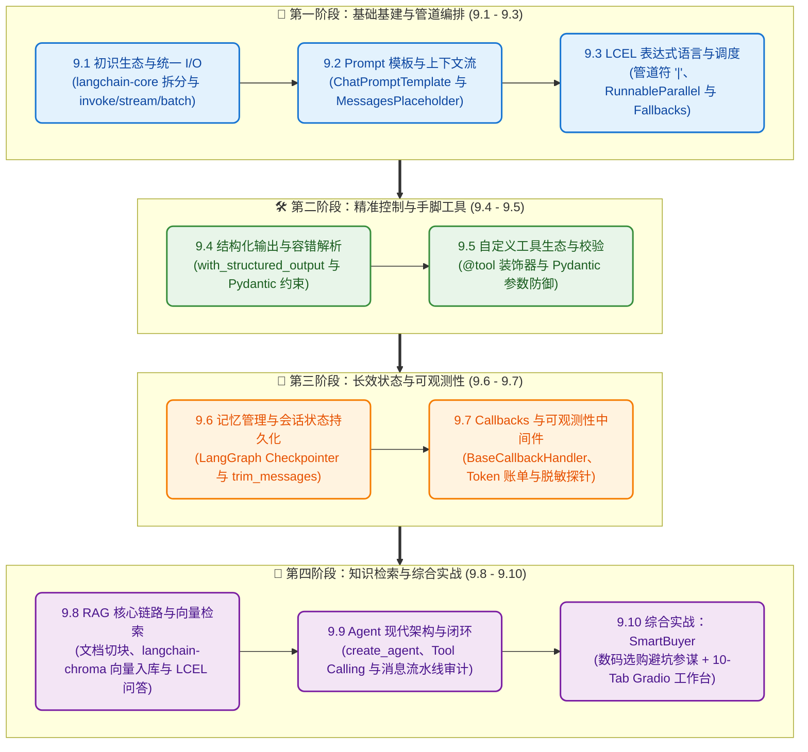

# 🦜 第九章：LangChain 搭建 Agent —— 从 LCEL 管道到工业级智能体编排

> **“掌握了原生手搓的底层原理之后，我们便拥有了驾驭现代化工业级框架的最佳内功。”**  
> 本章将带你系统迈入 **LangChain 1.0 (0.3+ / 1.0)** 的现代化架构体系，告别陈旧混乱的历史包袱，以 **LCEL (LangChain Expression Language)** 为骨架，通过标准协议与模块化拆分，打造高韧性、可观测、具备企业级交付能力的智能体系统！

***

## 📖 本章导读 (Chapter Overview)

在第八章中，我们用原生 Python 一行行手搓了 Agent 的思考循环、工具分发与记忆管理。你已经对大模型底层如何调度工具心知肚明。但在企业真实研发中，面对多模型适配、高并发批处理、复杂管道编排与海量私有知识库，我们需要一套**标准化、工业级的 AI 开发框架**。

本章参考了社区优秀开源项目 **[Langchain1.0-Langgraph1.0-Learning](https://github.com/BrandPeng/Langchain1.0-Langgraph1.0-Learning)**，结合 LangChain 1.0 的官方标准规范，从最基础的模型 I/O 出发，循序渐进地带你通关：
- **核心基石**：统一模型 I/O（`init_chat_model`）、Prompt 模板与四大消息模型；
- **编排艺术**：LCEL 管道符 `|`、多分支并行调度与高可用容灾 Fallbacks；
- **精准控制**：Pydantic 强类型结构化输出、`@tool` 装饰器与参数边界防御；
- **长期运行**：LangGraph Checkpointer 线程级记忆、`trim_messages` 窗口裁剪、Callbacks 账单审计与隐私脱敏；
- **知识增强与闭环**：`langchain-chroma` 向量检索 RAG 与现代 `create_agent` 智能体；
- **综合收官实战**：打造 **`SmartBuyer`（AI 智能数码选购与避坑决策参谋）** 与 10-Tab 聚合的 Gradio 现代化工作台！
- **版本前沿**：全章基于 **LangChain 1.3** 编写，1.1~1.3 新特性已按主题**融入各章节**（模型能力档案 `.profile` → 9.1、工具 `extras` 与厂商内建工具 → 9.5、官方预置中间件 → 9.7、`response_format` / 动态工具注册 / v3 流式 → 9.9），边学边用，无需另开速览章节。

***

## 🗺️ 10 步进阶全景路线图 (Roadmap)



***

## 📑 章节目录与核心攻关目标

| 章节编号 | 文档名称 | 对应生活比喻 | 核心攻关目标与产出 |
| :--- | :--- | :--- | :--- |
| **9.1** | [初识LangChain与生态架构](01_初识LangChain与生态架构.md) | 万能转换插头与乐高卡扣 | 掌握 `langchain-core` 拆分、统一模型工厂与 invoke/stream/batch 调用 |
| **9.2** | [Prompt模板与上下文消息流](02_Prompt模板与上下文消息流.md) | 剧组提词器与对话场记本 | 掌握四大消息模型、`ChatPromptTemplate` 与 `MessagesPlaceholder` 动态注入 |
| **9.3** | [LCEL表达式语言与流式调度](03_LCEL表达式语言与流式调度.md) | 自动化传送带与双路备用发电机 | 掌握 LCEL 管道符 `\|`、`RunnableParallel` 并行分支与 `with_fallbacks` 容灾 |
| **9.4** | [结构化输出与容错解析](04_结构化输出与容错解析.md) | 海关标准报关单与质检机器人 | 掌握 `.with_structured_output()` 与 Pydantic 强类型数据校验提取 |
| **9.5** | [自定义工具生态与参数校验](05_自定义工具生态与参数校验.md) | 瑞士军刀卡槽与带卡尺接头 | 掌握 `@tool` 装饰器、Pydantic `args_schema` 约束与 `llm.bind_tools()` 底层机制 |
| **9.6** | [记忆管理与会话状态持久化](06_记忆管理与会话状态持久化.md) | 办公桌抽屉与智能历史剪报员 | 掌握 `create_agent` + LangGraph `Checkpointer` 线程级记忆与 `trim_messages` 窗口裁剪 |
| **9.7** | [Callbacks回调与可观测性中间件](07_Callbacks回调与可观测性中间件.md) | 航班黑匣子与安检 X 光机 | 掌握 `BaseCallbackHandler` 切面、Token 账单自动审计与隐私正则脱敏 |
| **9.8** | [RAG核心链路与向量检索增强](08_RAG核心链路与向量检索增强.md) | 智能图书索引员与开卷参考书 | 掌握 TextSplitter 切块、`langchain-chroma` 向量入库与标准 LCEL RAG 检索问答管道 |
| **9.9** | [Agent现代架构与create_agent](09_Agent现代架构与create_agent.md) | 高级私人秘书与他的工作草稿本 | 掌握 1.0 标准 `create_agent` 智能体、Tool Calling 与消息流水线推理审计 |
| **9.10** | [综合实战：AI智能数码选购与避坑决策Agent](10_综合实战_AI智能数码选购与避坑决策Agent.md) | 资深数码评测家兼消费参谋 | 内置数码避坑宝典 + 全网差评搜索 + 参数测算 + Pydantic 选购报告 |

> 💡 **版本说明**：全章基于 **LangChain 1.3**，1.1~1.3 新特性（模型能力档案、工具 `extras`、官方中间件、`response_format`、v3 流式等）已分散融入 9.1 / 9.5 / 9.6 / 9.7 / 9.9 各节，跟随章节顺序即可完整掌握，无需单独的速览章节。

***

## 🚀 快速启动（Quick Start）

本章全部配套代码均存放在 [`code/`](code/) 目录，推荐使用现代 Python 包管理工具 **`uv`**：

```bash
# 1. 进入代码目录
cd 09_LangChain搭建Agent/code

# 2. 复制并配置环境变量（填入 OPENAI_API_KEY / OPENAI_API_BASE / MODEL_NAME）
cp .env.example .env

# 3. 首次：创建虚拟环境 .venv 并安装全部依赖（后续无需重复）
uv sync

# 4. 一键启动 10-Tab Master Gradio 交互工作台
uv run python app.py
# 或运行单个章节脚本，例如：
uv run python s01_model_io.py
uv run python s10_smart_buyer.py
```

浏览器访问 `http://127.0.0.1:7860` 即可实时调试与体验全套 10 个模块！

> 💡 **IDE 提示**：在 VS Code / Trae 中打开 `09_LangChain搭建Agent/code` 后，请在右下角状态栏（或 `Cmd+Shift+P` → **Python: Select Interpreter**）选择解释器 `09_LangChain搭建Agent/code/.venv/bin/python`，即可消除“无法解析导入”标红并支持直接点 ▶ 运行。
