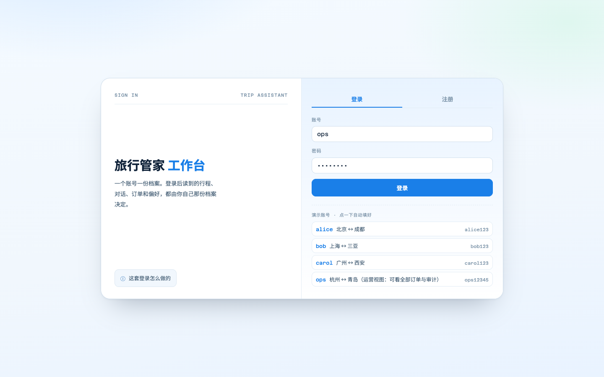
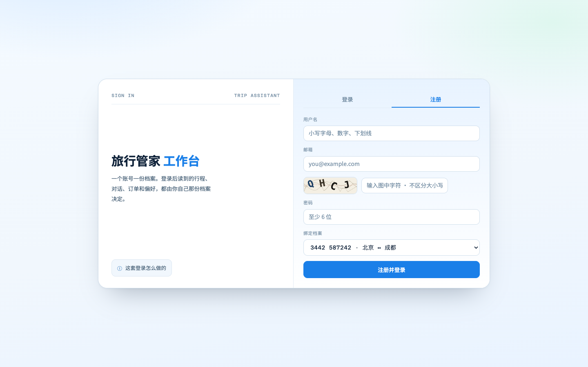
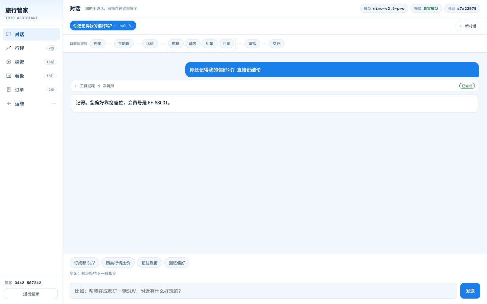
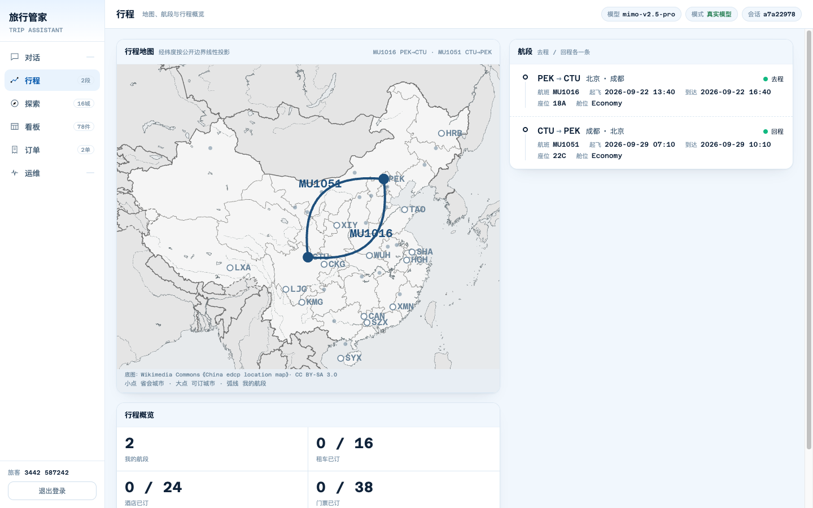
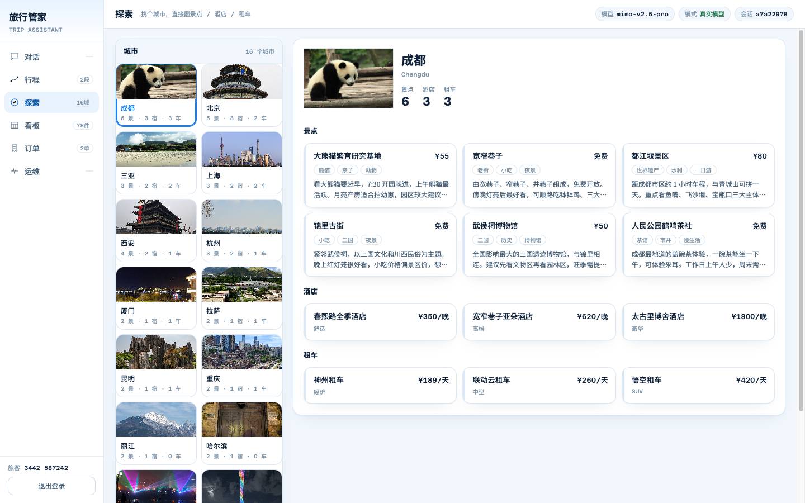
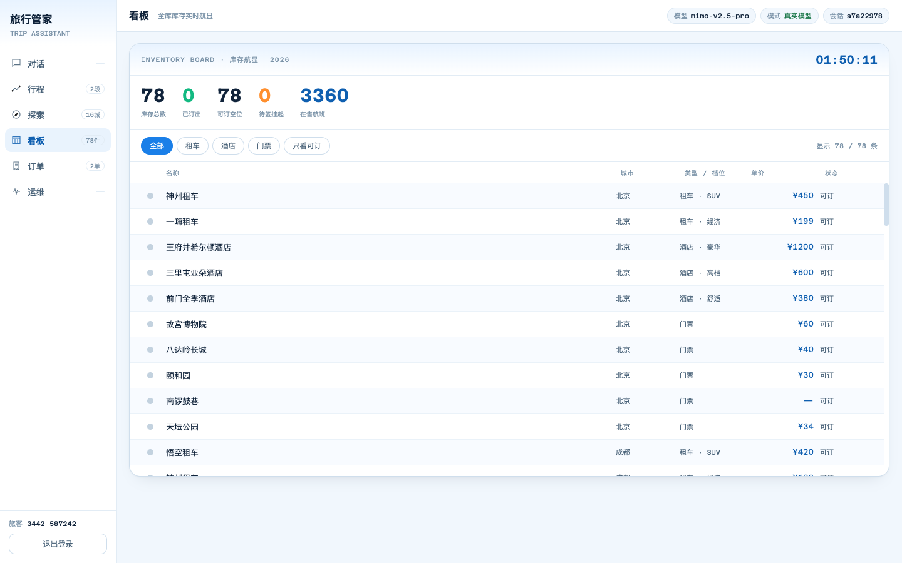
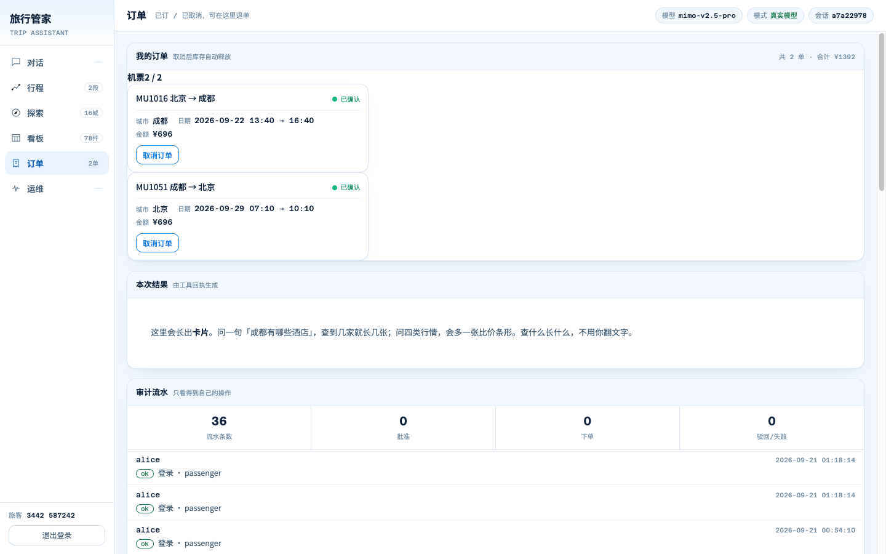
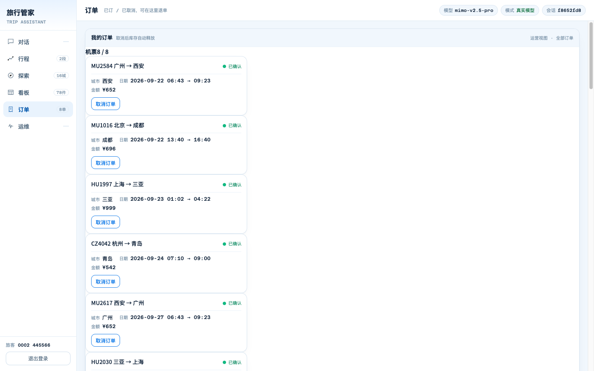
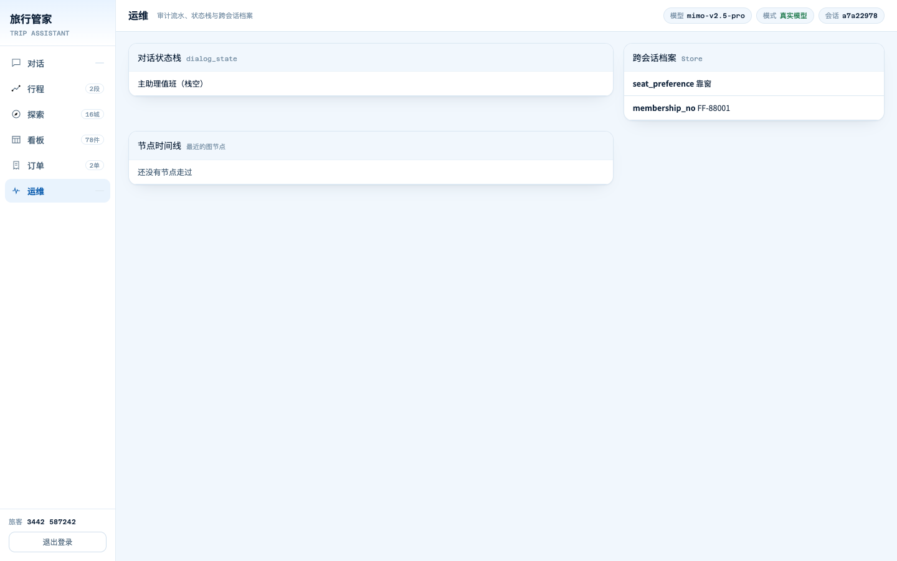
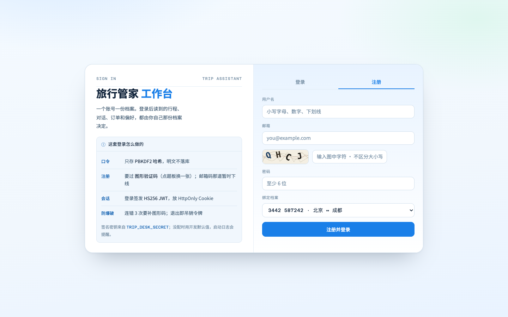

# Trip Assistant —— 国内旅行助手（LangGraph 多智能体整机）

基于 [LangGraph](https://docs.langchain.com/oss/python/langgraph/overview) 1.x 的 Multi-Agent 旅行助手。主助理只负责分诊，四个专员（机票 / 酒店 / 租车 / 景点门票）各管一摊；所有“写”操作在执行前都会进入节点内 [`interrupt()`](https://docs.langchain.com/oss/python/langgraph/interrupts) 动态审批。

浏览器里看到的是一台**旅行工作台**：左侧导航切六个分页——对话（工具过程可折叠、正文 Markdown、token 流式）、行程（真实底图 + 航段）、探索（挑城市直接翻库存）、看板（一整块出发信息板：大字计数 + 类型筛选 + 等宽行表）、订单（含本次生成的卡片与审计流水）、运维（状态栈 / 档案 / 时间线）。

> **定位**：国内旅行攻略 + 订车 / 订票 / 订酒店。数据集是国内机场、国内航司、国内酒店与租车品牌、国内景点玩法。

浏览器里的画面（截图来自本机 `uv run uvicorn web.app:app --host 127.0.0.1 --port 7860`，alice / ops 登录，1440×900）。章节正文对应位置在 [`16_综合实战_旅行助手项目.md`](../../16_综合实战_旅行助手项目.md)。

<p align="center">
  <a href="../../img/screenshots/16-login.png">
    
  </a>
</p>
<p align="center">
  <a href="../../img/screenshots/16-register.png">
    
  </a>
</p>
<p align="center">
  <a href="../../img/screenshots/16-chat.png">
    
  </a>
</p>
<p align="center">
  <a href="../../img/screenshots/16-trip.png">
    
  </a>
</p>
<p align="center">
  <a href="../../img/screenshots/16-explore.png">
    
  </a>
</p>
<p align="center">
  <a href="../../img/screenshots/16-board.png">
    
  </a>
</p>
<p align="center">
  <a href="../../img/screenshots/16-orders.png">
    
  </a>
</p>
<p align="center">
  <a href="../../img/screenshots/16-orders-ops.png">
    
  </a>
</p>
<p align="center">
  <a href="../../img/screenshots/16-ops.png">
    
  </a>
</p>
<p align="center">
  <a href="../../img/screenshots/16-login-hint.png">
    
  </a>
</p>

## 这个整机有哪些东西

| 能力 | 说明 |
| :--- | :--- |
| **登录认证** | 账号密码 + PBKDF2 哈希；签发 HS256 的 JWT 放 HttpOnly Cookie；退出登录走 `jti` 吊销名单 |
| **注册验证码** | 图形验证码（服务端出题、SVG 渲染、一题一用、**点题板就能换一张**）；邮箱验证码那道**暂时下线**（演示环境没邮件服务，前端与端点都注释掉了，恢复步骤写在代码旁） |
| **登录防爆破** | 同一账号连错 3 次就要补图形验证码；账号不存在与密码错误返回同一个 401 |
| **界面** | 按「航显 + 纸面」组织：一页一件事，状态用信号灯说（绿=落定 / 橙=待签 / 红=出事），时间编号金额一律等宽对齐；看板按机场出港牌排 |
| **真实底图与实景照** | 行程画在真实的定位地图上（Wikimedia 定位地图，经纬度线性投影落点），叠三层符号：31 座省会底点 / 有库存的城市 / 我的航段；16 个城市各有实景照片，授权与署名见 `static/img/CREDITS.md` |
| **生成式 UI** | 工具回执用 `ast.literal_eval` 还原成结构，长出航班 / 酒店 / 租车 / 景点卡片，四类同问再多一张比价条形 |
| **探索面板** | 不靠对话直接按城市翻库存：景点 / 酒店 / 租车三类卡片，和专员工具共用同一份数据 |
| **结构化审批卡** | `interrupt()` 的数据包补成「动作 / 对象 / 日期 / 金额 / 合计」，签字时看得清同意的是什么 |
| **会话历史与持久化** | 对话存档落到 `db/checkpoints.sqlite`（SqliteSaver），重启服务历史还在；支持新建 / 切换 / 改名 / 删除，每个账号各一份；空草稿自动清理（列表里最多留一条没聊过的新对话） |
| **身份随请求走** | 「现在是谁、在哪条会话上」是每个请求自己带的一份 `Desk`（`web/runtime/identity.py`），不是进程全局——**两个账号同时用不会串台**；同一账号开两个标签页可用 `X-Thread-Id` 各聊各的 |
| **上下文窗口** | 存档保全量（TimeTravel / 审计要用），喂模型只给最近一段（`agent/context.py`，从人类发言起切、绝不返回空）；快照只推最近 30 轮，截断时带 `history_truncated` 标记 |
| **订单中心** | 下单、退单在这里留痕。订单存在 `db/app.sqlite`（**不**跟会重建的库存混放），金额按库存单价 × 天数算 |
| **审计与运维面板** | 「运维」页对谁都开（状态栈 / 档案 / 时间线）；全量订单和全量流水只在订单页的审计区，且必须 `role=ops` |
| **租车真子图** | 租车助理独立 `compile()` 后作为父图的一个节点接入，敏感操作的刹车装在子图内部，中断向上穿透；四个专员共用一张注册表 + 一个装配工厂（`agent/graph.py`） |
| **多业务并行比价** | `ToMultiQuote` 转交后，`Send` 同时扇出四路查询，`aggregate` 汇总 |
| **长期记忆** | `save_preference` / `recall_preferences` 经 `InjectedStore` 注入，按账号隔离，落 `db/preferences.sqlite`（SqliteStore，重启还在）；`fetch_user_info` 开局把档案自动拼进 `user_info`，不靠模型自觉去回忆 |
| **动态审批闸门** | `interrupt()` 返回工具名、参数与调用 ID；批准才执行，驳回必须补齐 ToolMessage |
| **只读节点重试** | `fetch_user_info` 与比价 worker 挂 `RetryPolicy`；敏感写节点绝不重试 |
| **节点级 SSE** | 行程卡片、智能体流程节点、对话 token 都由一次 `stream` 推给前端 |
| **全网搜索（可选）** | 主助理可挂 [Tavily](https://tavily.com/)；`.env` 不配、空着或仍是占位符时，这件工具不会进工具池，订票 / 订酒店主流程不受影响 |

## 目录结构

```
travel_agent_v2/
├── main.py               # 组合根：build_graph() 装配总图，main() 启动终端对话
├── langgraph.json        # 本地 Server / Studio 入口（指向 build_graph）
├── pyproject.toml        # 依赖清单（uv 原生，唯一一份；Web 层要求 Python >= 3.13）
├── uv.lock               # 锁定的依赖版本：uv sync 按它装，换机器结果一致
├── .python-version       # 钉住解释器版本（3.13）：requires-python 允许到 3.14，但这套栈只验过 3.13
├── .env.example          # 环境变量模板
├── order_faq.md          # 国内旅行政策与攻略知识库（lookup_policy 检索它）
│
├── agent/                # ① 智能体层：图本身（只认识 tools / memory / infra）
│   ├── state.py          # State + dialog_state 栈（谁在跟旅客说话）
│   ├── models.py         # 转交意图的 Pydantic 模型（含 ToMultiQuote）
│   ├── primary.py        # 前台 Prompt 与转交工具
│   ├── specialists.py    # 四个专员的 Prompt 与安全 / 敏感工具池
│   ├── graph.py          # 拼装厂：专员注册表 + 装配工厂、真子图、Send、审批闸门
│   ├── context.py        # 喂模型的上下文窗口（存档保全量，上下文保够用）
│   └── nodes.py          # 入口节点工厂（压栈 + 补 ToolMessage）与出图
├── tools/                # ② 工具层：业务读写（只认识标准库与 langchain）
│   ├── flights.py        # 航班：查询 / 改签 / 退票
│   ├── hotels.py         # 酒店：查询 / 预订 / 改期 / 取消
│   ├── cars.py           # 租车：查询 / 预订 / 改期 / 取消
│   ├── excursions.py     # 景点门票：查询 / 预订 / 改期 / 取消
│   ├── preferences.py    # 长期偏好：save / recall（Store 由运行时注入）
│   ├── policy.py         # 政策 FAQ 检索（Embedding 失败回退关键词）
│   └── node.py           # ToolNode + 错误兜底
├── memory/               # ③ 记忆层：跨会话长期记忆
│   └── store.py          # Store（一人一个抽屉，落 db/preferences.sqlite）
├── infra/                # ④ 基础设施层（不认识上面任何一层）
│   ├── logging.py        # 全项目唯一的 loguru 配置
│   ├── llm.py            # 模型入口（.env 切 GPT / DeepSeek / 兼容网关）
│   ├── biz_db.py         # 业务库用法：启动时把日期平移到今天（路径见 paths.py）
│   ├── paths.py          # 全仓唯一的路径出处：根 / db / static / FAQ / 五个库文件
│   └── scripts/          # 一次性数据脚本：seed_cn_data / fetch_assets / location_trans
├── web/                  # ⑤ 接口与展示层
│   ├── runtime/          # 运行时（按数据流向拆包）
│   │   ├── identity.py   # 一次请求一份 Desk：谁在用、在哪条会话上
│   │   ├── hub.py        # 图单例、存档连接、进程内状态（时间线 / 忙闲）
│   │   ├── turns.py      # 消息 → 轮次 / 历史
│   │   ├── inspect.py    # interrupt() 数据包 → 审批卡说的那几句人话
│   │   ├── reads.py      # 只读投影：行程 / 看板 / 卡片 / 偏好 / 订单 / 审计
│   │   ├── snapshot.py   # 把只读投影拼成一份快照（含截断策略）
│   │   ├── turn.py       # 写路径：一次推进 + 收尾记账
│   │   ├── events.py     # 抹平 stream() 的形状差异
│   │   ├── stream.py     # 节点级 SSE
│   │   └── sessions_ops.py  # 登录 / 退出 / 新建 / 切换 / 改名 / 删除
│   ├── app.py            # air.Air(fastapi_app=api) 装配
│   ├── api.py            # /api/* 与 /api/*/stream（每请求解析一份 Desk）
│   ├── auth.py           # 登录认证：账号表、口令哈希、JWT 签发与吊销、失败计数
│   ├── captcha.py        # 图形验证码：服务端出题，SVG 渲染，一题一用
│   ├── mailer.py         # 发验证码邮件（本地没配 SMTP 就落日志）——暂时下线
│   ├── verify.py         # 邮箱验证码：存哈希、冷却、过期、试错上限——暂时下线
│   ├── store.py          # 应用库（app.sqlite）：账号 / 会话目录 / 订单 / 审计
│   ├── sessions.py       # 会话目录：属于谁、叫什么、聊了几轮
│   ├── orders.py         # 订单中心：记账、退单、把订单回写到库存标记
│   ├── audit.py          # 审计流水：谁、何时、对谁、做了什么
│   └── present/          # 展示层（纯函数：只接参数、吐 HTML / SVG / dict）
│       ├── views.py      # Air Tags 页面骨架（登录页 + 六个分页 + 全部 CSS）
│       ├── art.py        # 城市几何标记、分类图形、航图 SVG
│       ├── cities.py     # 城市显示名（库里存英文，界面显示中文）
│       ├── cards.py      # 工具回执 → 结构化卡片（生成式 UI 的底座）
│       ├── explore.py    # 按城市直接翻库存（不经过模型）
│       ├── geo.py        # 机场坐标兜底表
│       └── labels.py     # 节点名 → 界面文案
├── static/
│   ├── app.js            # 登录、生成式卡片、行程、探索、会话条、订单、审计
│   └── img/
│       ├── cities/       # 16 个城市的实景照（Wikimedia Commons，自由授权）
│       ├── map/china.svg # 行程地图底图（定位地图，等距圆柱投影）
│       └── CREDITS.md    # 素材作者 / 授权 / 来源页，CC 授权要求署名
├── tests/                # 零 Key 测试（三层冒烟 + 一条分层守卫）
└── db/
    ├── travel2.sqlite    # 业务库种子（可重建）
    ├── travel_new.sqlite # 业务库运行副本（每次启动从种子重建）
    ├── app.sqlite        # 应用库：账号 / 会话目录 / 订单 / 审计（不参与重建）
    ├── checkpoints.sqlite# 对话存档（LangGraph Checkpointer 自己管）
    └── preferences.sqlite# 长期记忆：跨会话偏好档案（SqliteStore，重启还在）
```

**分层的判据只有一个：谁认识谁。** 上层可以叫下层，下层不知道上层存在——`agent/` 不认识 web，`tools/` 不认识图，`infra/` 不认识上面任何一层；只有 `main.py` 知道怎么把它们装到一起。所以「改这里会不会牵动那里」是能算出来的：换业务库位置动 `infra/paths.py`，换模型网关动 `infra/llm.py`，加专员填 `agent/graph.py` 的注册表，换界面动 `web/present/`。

**这几条规矩有测试盯着**，不是写在文档里就算数：`tests/test_layering.py` 静态扫全仓，六条——① 不许按值 import 会被 `global` 重新绑定的模块变量（`from ...hub import GRAPH` 抓到的永远是 None）；② 不许在 `infra/paths.py` 之外出现 `__file__`（按文件深度算路径，一搬家就静默错位）；③ 不许写 `.sqlite` 字面量（五个库的名字只在 paths.py 写一次）；④ 不许别处再解析 `TRIP_DESK_DB_DIR`；⑤ 内层不许 import 外层；⑥ 注释与文档里不许再提搬走之后就不存在的旧路径（这条扫的是**散文**，因为代码本身早就跑通了，只有顺着注释去找文件的人会扑空；具体名单在测试文件的 `LEGACY_PATHS` 里）。不用管它是怎么写的，**加完代码跑一下**就行：只读源码、不连库、零 Key，秒级出结果。

## 快速开始

```bash
# 建环境 + 装依赖：uv 按 uv.lock 装，解释器由 .python-version 钉在 3.13（Air 的硬约束）
uv sync

cp .env.example .env      # 填入真实模型 Key（与第九章同一套即可）

# 浏览器工作台（必须在本目录启动，Air 才能挂上 static/）
uv run uvicorn web.app:app --host 127.0.0.1 --port 7860

	# 终端对话（内存 Checkpointer，关掉就没了；要历史落盘走浏览器工作台）
	uv run python main.py

# 想重建国内数据集（会先备份旧库；必须在本目录，用 -m 才能找到 infra 包）
uv run python -m infra.scripts.seed_cn_data
```

打开 [http://127.0.0.1:7860](http://127.0.0.1:7860)。页面顶部会显示当前模型名和当前档案号；`/docs` 是 FastAPI 自动文档。改了 `static/app.js` 或页面 CSS 必须重启 uvicorn 才生效（Air 的 HashedStatic 会给脚本换内容哈希名）。

不想用 uv 的读者：`uv export --format requirements-txt --no-hashes > requirements.txt` 现导一份传统清单，再 `pip install -r requirements.txt`。**导出的那份别提交回仓库**——同一份依赖写两遍，迟早各写各的（这条 .gitignore 里已经拦住）。

> 注意：`web.app` / `main.py` 会自动平移数据库时间；FAQ 与数据库路径按源码位置解析。

## 数据：国内旅行数据集

业务数据由 `infra/scripts/seed_cn_data.py` 生成，覆盖：

- **19 个国内机场**：北京首都/大兴、上海虹桥/浦东、成都双流/天府、西安、杭州、广州、深圳、昆明、三亚、重庆、厦门、武汉、拉萨、丽江、青岛、哈尔滨
- **约 3400 个航班**：国内航司（国航 / 东航 / 南航 / 海航 / 川航 / 厦航 / 深航 / 吉祥 / 春秋），覆盖 59 条航线双向排班，起飞日按“今天”平移，所以“明天”“下周二”永远查得到
- **24 家酒店 / 16 家租车 / 38 个景点玩法**：全部国内品牌与目的地，带单价（酒店每晚、租车每天、门票每张）
- **4 位演示旅客**：各自一条去程 + 一条回程（北京↔成都、上海↔三亚、广州↔西安、杭州↔青岛）。运营账号用第四份，不和 carol 合住

城市字段在库里存**英文**（`Beijing` / `Chengdu`），因为模型常直接用中文说“帮我在成都订辆车”，`infra/scripts/location_trans.py` 会把中文翻成英文再匹配；界面上则统一用 `web/present/cities.py` 显示中文。

> 旧版是从 Postgres flights 示例库搬来的国际航线数据，重建时已备份到 `db/travel2_intl_backup.sqlite`。

## 登录认证

打开页面先停在登录页，有**登录**和**注册**两个页签。

演示账号（点一下自动填好，直接登录）：

| 用户名 | 密码 | 邮箱 | 角色 | 绑定档案 | 航段 |
| :--- | :--- | :--- | :--- | :--- | :--- |
| `alice` | `alice123` | `alice@example.com` | passenger | `3442 587242` | 北京 ↔ 成都 |
| `bob` | `bob123` | `bob@example.com` | passenger | `0000 000343` | 上海 ↔ 三亚 |
| `carol` | `carol123` | `carol@example.com` | passenger | `0001 998571` | 广州 ↔ 西安 |
| `ops` | `ops12345` | `ops@example.com` | **ops** | `0002 445566` | 杭州 ↔ 青岛；运营视图可看全部订单与审计 |

也可以点「注册」自己建账号：填用户名、邮箱、图形验证码，挑一份档案绑定，注册完直接进工作台（邮箱验证码那道暂时下线，见下）。

密码只存 PBKDF2-HMAC-SHA256 的哈希和盐，明文不落库；校验用 `hmac.compare_digest` 常量时间比较。用户名不存在和密码错误返回同一个 401，不泄露哪个错了。

通过后签发 HS256 的 JWT 放进 HttpOnly Cookie，之后每个 `/api/*` 请求都带着它，`web/runtime/identity.py` 按令牌里的 `passenger_id` 决定读谁的数据。验签时**写死算法** `algorithms=["HS256"]`，堵掉 `alg=none` 伪造令牌这个经典坑。

点右上角 **退出登录** 会清 Cookie 并把这次令牌的 `jti` 记进吊销名单——JWT 是无状态的，服务端不存会话，所以退出只能靠自己记账。

### 注册要过图形验证码（邮箱码暂时下线）

> **当前状态（2026-09-20）**：邮箱验证码那道**暂时下线**——演示环境没有邮件服务。前端表单、`static/app.js` 的收发逻辑、`/api/auth/email/code` 端点、注册里的 `verify()` 一起注释掉了（恢复步骤写在各自代码旁，`verify.py` / `mailer.py` 两个模块原样保留）。**图形验证码还在，并且现在是注册唯一的门**，校验从「发邮箱码时」挪到了 `/api/auth/register`。下面讲的设计与顺序纪律仍然成立。

```
图形验证码（服务端出题，SVG，点题板换一张） → ~~邮箱验证码~~ → 账号
```

- **图形验证码**在 `web/captcha.py`：字符随机旋转抖动、叠干扰线，一题一用，5 分钟过期，答案只留服务端。用 SVG 而不是位图，是因为机器上没装 Pillow，而 SVG 任何 DPI 都清晰、体积一两 KB。它挡的是最廉价的批量脚本，**不是强防护**。
- **邮箱验证码**在 `web/verify.py`：库里只存哈希（`sha256(email|code|pepper)`），比较用 `hmac.compare_digest`；同一邮箱同一用途 60 秒只能发一次，10 分钟过期，最多试 5 次就作废。
- **发信**在 `web/mailer.py`：配了 `SMTP_HOST` 就真发（465 走 SSL，587 走 STARTTLS）；没配就落日志，并把验证码回给前端提示一下（`dev_mode`）。**生产必须配 SMTP 并关掉这个兜底**（`TRIP_DESK_DEV_MAIL=0`）。

两条设计上的硬约束（第 1 条随邮箱码一起闲置，恢复时照旧）：

1. **发邮箱验证码前必须先过图形验证码**，否则这个接口就是个免费的邮件轰炸接口；
2. **注册的校验顺序不能反**：先把用户名格式、密码长度、邮箱格式、档案是否存在这些便宜的错误判掉，再去消费验证码——否则一个「密码太短」会把验证码烧掉，用户得重看一遍图。前端也照这条办：只有验证码本身出错才换题。

### 登录防爆破

同一账号密码连错 3 次，登录页就多出一栏图形验证码（服务端用 `X-Captcha-Required` 头告诉前端）。账号不存在和密码错误返回同一个 401，不泄露哪个错了；登录成功把计数清零。登录框一个字段同时接受**用户名或邮箱**。

### 数据库迁移

`users` 表后来加了 `email` / `email_verified` / `login_fails` 三列。`web/store.py` 里的 `migrate()` 用 `PRAGMA table_info` 看缺哪列就 `ALTER TABLE` 补哪列——比删库重建体面，也是真实项目加字段的正常做法。

## 三个面板

### 订单中心

下单、退单在这里留痕。订单存在 `db/app.sqlite`，**不跟库存放一起**，原因是业务库每次启动都会被种子库重建（`booked` 标记会被清回 0），而订单是用户资产，重启不能丢。

- 运行时按工具名分派记账：`book_hotel` / `book_car_rental` / `book_excursion` / `cancel_*` / `update_*` 各管一类，八个业务工具一行都不用改；
- 机票订单从旅客名下的票推导（每张票每个航段一条）；
- 金额 = 库存单价 × 天数（酒店按晚、租车按天、门票按张）；
- 启动时 `orders.sync_inventory()` 把已确认订单回写到库存的 `booked` 标记上——**订单是事实来源，库存标记只是它的投影**；
- 面板上点「取消订单」会同时把库存标记放开。

### 会话历史与持久化

对话存档从内存版 `MemorySaver` 换成落盘的 `SqliteSaver`（`db/checkpoints.sqlite`），重启服务后历史还在。对话列顶部那一条就是你的会话列表：点一下切换，✎ 改名，× 删除，`＋ 新对话` 开一条。

会话的**目录**（属于谁、叫什么、聊了几轮）单独存在 `sessions` 表里，因为 Checkpointer 的表结构归 LangGraph 管，产品字段得自己存。

### 审计与运维

「运维」页对谁都开：对话状态栈、跨会话档案、节点时间线——讲的是**这张图现在走到哪一层**，不是全公司账本。全量订单和全量流水只出现在订单页的审计区，而且必须 `role=ops`：普通账号在 snapshot 的 `audit` 字段里只看得到自己那份，直接打 `/api/audit` 拿 403。

记录的动作：登录、退出、注册、批准执行、驳回、下单、退单，以及新建/切换/改名/删除对话。每条形如「谁 · 什么时候 · 对什么 · 结果（ok / denied）」。

## 界面：航显 + 纸面

整个工作台按**航站楼里的两块屏**来组织：一块是纸面（浅底，用来读：说明、表单、卡片、清单），一块是航显板（机场出港牌那种，用来扫：等宽数据列、信号灯、大字计数）。更早的「纸票据」世界（米色纸、撕口、旋转印章）已经撤掉——那套符号的复古感和「青春活泼」是反着的。

- **色彩**取冷调淡蓝白：纸面 `#f1f7fd`、卡面白、主色明亮天蓝 `#1a7fe8`（只给「可以动」的东西）。三盏信号灯各有语义：绿 `#12b981` 落定 / 橙 `#ff8f2e` 待签 / 红 `#f4535f` 出事。红色出现三次以上人就再也不看它，所以中性计数用主色，不用红。
- **字体两族分工**：中文正文用 Noto Sans SC；时间、编号、金额、航线、计数用 Azeret Mono 等宽体并对齐成列——数据的可信感来自对齐，不是来自装饰。
- **登录页**是一张大卡片：左说明（技术细节收进默认收起的提示框），右表单（登录 / 注册两个页签）。演示账号只在登录页签出现。
- **行程**每个航段一行：等宽三字码（`PEK → CTU`）+ 城市名，下面一行键值对（航班 / 起飞 / 到达 / 座位 / 舱位），右端一盏信号灯（绿=去程/回程，橙=待签）。
- **状态用灯说**：圆点 = 有状态，橙 = 有人要签字，绿 = 落定，红 = 出事。
- **看板**是一整块出发信息板：板名 + 本机时钟 + 五个大字计数 + 类型筛选 + 等宽行表；状态真变的那一行闪一次。
- **六个分页**各做一件事（对话 / 行程 / 探索 / 看板 / 订单 / 运维）。页签只承载「同一件事的切面」（登录|注册、看板筛选），不再把行程、结果、探索挤进中栏三个页签。

令牌、状态和原则写在 `DESIGN.md`；产品事实写在 `PRODUCT.md`。

## 素材：真实底图与实景照

界面上的图分两类，都**不依赖网络**（下载一次，之后完全离线）：

- **行程地图底图**：Wikimedia 的定位地图 `China edcp location map`（CC BY-SA 3.0）。它是**等距圆柱投影**，边界公开（东经 72–136、北纬 17–54），所以站点坐标能按线性换算算准（见 `web/present/art.py` 的 `map_xy`），不用猜。底图在界面上整体降饱和，避免在浅色纸面里插一块彩色地图。
- **城市实景照**：16 个城市各一张，来自 Wikimedia Commons。抓取脚本 `infra/scripts/fetch_assets.py` 会顺带把**作者 / 授权 / 来源页**写进 `static/img/CREDITS.md`。

> CC 授权要求署名，所以地图下方固定显示一行出处，换素材时也要保留同样的署名。`fetch_assets.py` 对候选图做了筛选：文件名要带地标关键词，排除图标 / 地图 / 吉祥物 / 废弃建筑，尺寸太小的也跳过。

## 生成式 UI：让回执长出形状

业务工具返回 `list[dict]`，LangGraph 存进 ToolMessage 时变成 Python 字面量字符串。渲染层用 **`ast.literal_eval`** 把它还原回结构（**刻意不用 `eval`**，因为 `eval` 会执行任意代码），再挑字段画卡片：

| 工具 | 卡片 |
| :--- | :--- |
| `search_flights` | 航班卡（航班号 / 起降 / 时间 / 状态） |
| `search_hotels` | 酒店卡（名称 / 档位 / ¥620 每晚 / 日期） |
| `search_car_rentals` | 租车卡（品牌 / 车型 / ¥450 每天） |
| `search_trip_recommendations` | 景点卡（关键词标签 + 攻略摘要，摘要截两行） |
| 一次问四类 | 额外多一张**比价对照卡**，用条形画四类命中数量 |

三个要点：

1. **不用改那八个业务工具**。卡片生成放在渲染层（`web/present/cards.py`），工具照旧只管查库。
2. **只取最后一轮**。上一轮查过的酒店，不该在用户问机票时还挂在屏幕上。
3. **同类合并、最多 12 张**，按 `kind|city` 归并，避免一次刷屏。

这叠卡片落在**订单**页的「本次结果」里：行程和探索是不同的事，各自独立成页；结果和订单是同一件事的两个切面，所以合在一页。

## 探索：不靠对话也能逛

对话适合「我要订 X」，不适合「随便看看有什么」。所以单开一个入口：先给 16 个城市的**实景照网格**（每格带 `6 景 · 3 宿 · 3 车` 计数），点进去看该城市的景点 / 酒店 / 租车卡片。数据直接读业务库，和专员工具共用同一份库存，只是不经过模型。

对照着看，同一份数据两条路：

```
对话：  把需求说清楚 → 主助理分诊 → 专员查库 → 卡片长出来 → 敏感操作走审批
探索：  挑城市 → 直接看三类库存 → 想订了再回对话
```

## Web 工作台与接口

`web/` 是 [FastAPI](https://fastapi.tiangolo.com/) 后端 + [Air](https://github.com/feldroy/air) 前端（Air 用 Python 类生成 HTML，构建在 FastAPI 之上）。JSON API 自动带 `/docs`。

> ⚠️ **单 worker 纪律**：对话存档、偏好档案、`jti` 吊销名单都在进程内存或本地 SQLite 里，不要加 `--workers N`。

| 方法 | 路径 | 作用 |
| :--- | :--- | :--- |
| GET | `/api/auth/captcha` | 出图形验证码（返回题号 + SVG） |
| POST | `/api/auth/email/code` | 发邮箱验证码（**先过图形验证码**）——**暂时下线**，现在返回 503 |
| POST | `/api/auth/login` | 账号（或邮箱）+ 密码登录，换 JWT；连错 3 次要带图形码 |
| POST | `/api/auth/register` | 注册新账号（绑定一份旅客档案） |
| POST | `/api/auth/logout` | 退出登录，吊销 `jti` |
| GET | `/api/auth/me` | 当前登录状态（未登录也返回 200，登录页靠它渲染） |
| POST | `/api/chat` | 发言（同步快照，测试用） |
| POST | `/api/chat/stream` | 发言（节点级 SSE，工作台用） |
| POST | `/api/approve` / `/api/approve/stream` | 批准 |
| POST | `/api/reject` / `/api/reject/stream` | 驳回 |
| GET | `/api/state` | 当前快照（含 turns / itinerary / board / sessions / orders / audit） |
| GET | `/api/sessions` | 我的会话列表 |
| POST | `/api/sessions` | 新建会话 |
| POST | `/api/sessions/{id}/open` | 切换到某条会话 |
| PATCH | `/api/sessions/{id}` | 会话改名 |
| DELETE | `/api/sessions/{id}` | 删除会话（不能删正在用的） |
| GET | `/api/orders` | 我的订单（ops 看全部） |
| POST | `/api/orders/cancel` | 取消订单并释放库存 |
| GET | `/api/explore` | 按城市翻库存（不带 `city` 就返回城市列表与计数） |
| GET | `/api/audit` | 全量审计流水（**仅 ops**，普通账号 403） |

除 `/api/auth/*` 外，所有 `/api/*` 都要登录；没带有效令牌一律 401。页面、`/static/*` 和 `/docs` 放行，前端自己切换登录页。

界面与机制对应：

- **登录页**：账号密码换 JWT，绑到后续每个请求；
- **行程图**：真实底图 + 经纬度线性投影，去程 / 回程按航段落点连弧；
- **智能体流程**：对话列顶部一排节点按执行中 / 已完成 / 挂起点亮；
- **审批卡片**：跨子图路径 + 待执行工具名和参数；
- **看板**：一整块出发信息板（大字计数 + 类型筛选 + 等宽行表）；
- **订单**：按类型分组，显示日期区间与金额，可取消；本次工具回执长成的卡片也在这一页；
- **运维**：状态栈、跨会话档案、节点时间线；全量审计在订单页，仅 ops 看得到。

## 工作台里建议先走的四句话

登录后，对话区有快捷指令：

```
帮我在成都订一辆SUV
```
→ 主助理转交租车子图；`search_car_rentals` 不拦，`book_car_rental` 在闸门挂起。智能体流程把租车和审批点亮，行程图成都站变琥珀色，看板对应车辆标「待签」。**批准后**订单中心出现一条租车订单，审计里多一条批准。工具过程收在思考里，正文才是给旅客看的话。

```
帮我同时看看机票、酒店、租车和景点门票的行情
```
→ `ToMultiQuote` + `Send` 四路查询。这条路径**没有**审批卡片。

```
记住我以后都想要靠窗的座位    /    你还记得我的偏好吗？
```
→ Store 读写。点 **＋ 新对话** 后对话清空，档案仍在——这就是 Checkpointer 与 Store 的差别。

```
拉萨会有高反吗？ / 退票扣多少钱？
```
→ 走 `lookup_policy` 检索 `order_faq.md`。Embedding 配不通时会退回关键词兜底（中文按 2-gram 切词，长问句也能命中）。

## 不配 Key 也能跑的冒烟测试

```bash
uv run python tests/test_layering.py          # 分层守卫：六条架构规矩的静态检查（不连库、秒级）
uv run python tests/test_new_mechanisms.py    # 子图 / Store / Send
uv run python tests/test_web_api.py           # 31 条：登录 / 会话 / 订单 / 审计 / 并发隔离 / 记忆 / HTTP + 页面 + SSE
uv run python tests/smoke_real_server.py      # 真实 uvicorn + TCP，Cookie 走真实 HTTP 头
```

假模型按剧本返回 `tool_calls`，图、工具、闸门、Web 契约全部真实运转。测试可以把应用库指到临时目录（环境变量 `TRIP_DESK_DB_DIR`），跑完不留垃圾。

改完代码先跑第一条：它会在你**还没启动服务**的时候就告诉你「这里 import 错了 / 路径算歪了 / 库名又抄了一份」。守卫本身也要能抓住人——想确认它没在划水，随手造一个违规（比如随便哪个模块里写一句 `os.path.dirname(__file__)`），它应当立刻标红并告诉你该怎么改。

## 生产边界

| 当前实现 | 教学目的 | 生产环境要补 |
| :--- | :--- | :--- |
| 账号密码 + PBKDF2 哈希 | 看清口令该怎么存、怎么比 | Argon2id / bcrypt、口令强度策略、撞库限流 |
| HS256 JWT + HttpOnly Cookie | 看清「谁在说话」怎么绑到请求上 | RS256 非对称签名、密钥轮转、OIDC / SSO、MFA |
| 进程内 `jti` 吊销名单 | 说明 JWT 无状态带来的注销问题 | Redis 共享吊销表、审计日志、异常登录告警 |
| 自绘 SVG 图形验证码 | 看清「出题—答题—回兑」这条链路 | 行为风控、设备指纹、IP/号码信誉、无感人机验证 |
| 邮箱验证码存哈希 + 三道闸（该功能暂时下线） | 说明验证码也要按口令的标准存 | 发送频次风控、短信通道、防撞库、验证码复用检测 |
| 没配 SMTP 时把验证码回给前端 | 本地能独立跑通注册流程 | 生产必须配 SMTP 并 `TRIP_DESK_DEV_MAIL=0`，否则验证码进日志 |
| 每请求一份 `Desk`（进程内 `RUN_LOCK` 一次只推进一轮） | 身份随请求走，两标签页靠 `X-Thread-Id` 分开 | 多副本粘性路由、按会话的并发发言限流 |
| SQLite 存档与订单 | 零外部服务看清持久化 | Postgres（Saver / Store / 订单同一事务）、备份、加密 |
| 注册即可绑定任意档案 | 演示多账号隔离 | 邀请制 / 实名核验、档案归属审批 |
| 本地 SQLite 库存 | 本地就能改一行 `booked` | 正式业务 API、事务、幂等键、补偿；库存与订单同库 |
| 同步单 worker | 执行顺序好看清 | 队列、超时、取消、水平扩容 |
| 假模型锁控制流 | CI 不烧钱 | 真模型轨迹评测、注入测试、成本与延迟 |
| 图片素材下载一次存本地 | 离线可用、版权清晰 | CDN + 图片服务、按屏幕密度出图、压缩与缓存策略 |
| 定位地图线性投影 | 说明「经纬度怎么变成屏幕坐标」 | 专业地图 SDK（可交互、可缩放、路网与 POI 实时数据） |
| 卡片由渲染层从回执推导 | 看清生成式 UI 的最小实现 | 让模型按组件目录产出声明式 JSON（受控渲染），新增卡片不改主流程 |

这是一台**生产架构导向教学整机**：零件如何配合看得见，离可售的旅行平台还差的护栏也写在表里。
