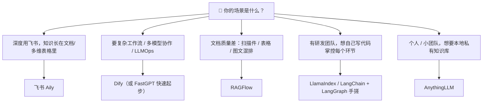

# 11.10 工业级落地：低代码平台与主流框架全景选型

> **“学完 11.1 到 11.9，你已经会从螺丝钉开始手搓一台 RAG 发动机了。但在真实公司里，很少有人真的从零焊一台 —— 大多数团队要么去 4S 店提一辆成品车（低代码平台），要么买一套成熟底盘回来改装（开源框架）。”**  
> 本节把市面上主流的“成品车”和“底盘”都摆到台面上，再补一张选型地图，帮你回答最实际的那个问题：**我的场景，到底该走哪条路？**

---

## 🚗 一、先认清三条路线：买车、改车，还是焊车？

11.2 到 11.9 教你的，是“焊车”的全部手艺 —— 解析、切块、向量化、索引、混合检索、重排、GraphRAG、Agentic 自省、评估。这些手艺的价值在于：**即使你最后不手搓，你也能看懂平台里每一个参数按钮在背后干了什么、出了问题该往哪查。** 但真到落地时，你有三条路可走：

| 路线 | 生活化比喻 | 代表方案 | 适合谁 | 代价 |
| :--- | :--- | :--- | :--- | :--- |
| **低代码 / 无代码平台** | 去 4S 店提成品车，点火就能开 | Dify、飞书 Aily、FastGPT、MaxKB、扣子 Coze | 业务/产品团队、想快速验证、没有专职算法 | 灵活度受限，深度定制要“返厂” |
| **开源框架二次开发** | 买成熟底盘 + 发动机自己改装 | RAGFlow、LlamaIndex、Haystack、DSPy | 有研发团队的软件公司 | 要写代码、要自己运维 |
| **纯手搓** | 从螺丝钉开始焊 | LangChain + LangGraph + 向量库（本书 09/10/11 章） | 需要极致掌控、非标场景 | 工作量大、踩坑多 |

> 💡 **关键认知**：这三条路不是“从低到高”的鄙视链，而是“按场景选工具”。一个小团队用 Dify 三天上线的知识库客服，效果常常吊打一个工程师花一个月手搓的、没人维护的半成品。

---

## 🏭 二、工业级“开箱即用”平台（低代码 / 无代码）

这些平台把 11.2~11.9 里你手写的“解析、清洗、切块、向量化、检索、重排”全部做成了可视化面板 —— 你只管上传文档、点按钮、拖节点、调参数。

### 1. Dify —— LLM 应用开发的“瑞士军刀”

**定位**：开源的 LLM 应用开发平台（LLMOps），不只是 RAG，而是“可视化工作流 + RAG + Agent + 模型管理 + 可观测”全家桶。

**RAG 能力**（与本章知识点一一对应）：
- **混合检索 + 重排序**：语义检索（向量）与关键词检索（全文）按权重融合，再接 Rerank 模型 —— 对应 11.5；
- **父子分段（父子检索）**：大块存全文、小块存向量，检索小块、回填大块 —— 对应 11.2；
- **元数据过滤**：给文档“贴标签”做过滤检索，RAG 检索效率翻倍 —— 对应 11.4 的元数据过滤；
- **多模态知识库**：带 Vision 图标的知识库支持“以图搜文/以文搜图”跨模态检索 —— 对应 11.3；
- **三种建库方式**：快速创建、知识流水线（自定义数据处理管道）、连接外部知识库。

**优点**：Apache 2.0 全开源、支持数百种模型、Docker 一条命令部署、社区最活跃之一。
**短板**：学习曲线相对陡，高级玩法（流水线、插件）需要一定技术底子。
**适合场景**：复杂 AI 应用、多模型协作、需要工作流编排且团队有折腾能力。

- 官网：[dify.ai](https://dify.ai)
- 官方文档：[docs.dify.ai](https://docs.dify.ai/zh)
- 知识库专题：[docs.dify.ai 知识库](https://docs.dify.ai/zh/use-dify/knowledge/readme)
- 源码：[github.com/langgenius/dify](https://github.com/langgenius/dify)

### 2. 飞书 Aily（智能伙伴平台）—— 长在办公协同里的知识问答

**定位**：字节跳动的企业级智能体平台，最大的优势是**知识就长在飞书里** —— 文档、多维表格、云盘、服务台，直接“直连”或“导入”，并自动与最新版本同步。

**它的 RAG 五步流水线**（官方文档原话拆解）：**源知识 → 切片 → 术语和扩写 → 召回 → 答案生成**。
- **术语库**：解决企业内部“黑话”和“别名”问题（如“GMV”“NJ=年假”），这是 11.6 查询重写在工业产品里的落地形态；
- **召回**：在切片库中找最匹配的 n 个切片，日志里能看 `RewriteQueries` 改写详情和被召回切片；
- **四种对话模式**：模型推理、工作流、知识问答、混合调度。

**优点**：知识维护方便（飞书文档在线维护）、企业级权限管控、一键发布到飞书 IM/服务台/Web/客服系统。
**短板**：强绑定飞书生态，非飞书用户吃不到最大红利；深度定制仍需在其工作流/技能里做。
**适合场景**：深度使用飞书的企业，知识天然沉淀在飞书文档/多维表格里。

- 平台入口：[aily.feishu.cn](https://aily.feishu.cn)
- 官方帮助中心：[aily.feishu.cn/hc](https://aily.feishu.cn/hc/1u7kleqg/uwa9ehft)
- 产品介绍：[飞书官网 · 飞书 aily](https://www.feishu.cn/content/3d5z9ttt)

### 3. 扣子 Coze —— 字节系的“积木盒”

**定位**：字节跳动面向个人/团队的 AI Bot 开发平台，国内版 [coze.cn](https://www.coze.cn)、海外版 [coze.com](https://www.coze.com)。

**特点**：零代码创建智能体，插件市场丰富，内置知识库、工作流、长期记忆，与抖音、飞书等字节生态深度集成。

**优点**：上手最快、免费版功能充足、多平台一键发布。
**短板**：云端托管、数据隐私需注意；复杂应用定制能力有限。
**适合场景**：个人/轻量场景、内容创作、快速验证想法。

### 4. FastGPT —— 知识库问答的“卷王”

**定位**：开源（Apache 2.0）的“知识库驱动的工作流平台”，珠海环界云出品，专攻知识库问答这个细分赛道。

**特点**：自动化数据预处理（PDF/Excel 等一键向量化）、混合检索 + 重排序、API 对齐 OpenAI、可视化 Flow 编排、5 分钟对接企业微信/飞书。

**优点**：开箱即用、部署快、企业级权限管理、中文社区热闹。
**短板**：复杂任务拆解与 Agent 能力弱于 Dify；自定义上限相对有限。
**适合场景**：快速搭建企业知识库客服、内部流程自动化。

- 官网：[fastgpt.cn](https://fastgpt.cn)
- 源码：[github.com/labring/FastGPT](https://github.com/labring/FastGPT)

### 5. MaxKB —— 企业知识“最强大脑”（国产化友好）

**定位**：开源（GPLv3）的企业级知识问答系统，1Panel 团队（飞致云）出品，底层基于 LangChain + PostgreSQL + pgvector。

**特点**：开箱即用、自动拆分向量化、零代码嵌入现有系统（内网/wiki）、内置工作流引擎，深度适配国产大模型（通义、智谱、百度千帆等）。

**优点**：本地部署数据有保障、国产化适配好。
**短板**：GPLv3 协议（修改需开源）、社区版功能受限、企业版收费。
**适合场景**：国企/政企、内网部署、对国产化有硬性要求。

- 官网：[maxkb.cn](https://maxkb.cn)
- 源码：[github.com/1Panel-dev/MaxKB](https://github.com/1Panel-dev/MaxKB)

### 6. 补充选手：AnythingLLM 与云厂商低代码

- **AnythingLLM**：开源全栈 RAG 应用，提供桌面版与企业版，主打**本地私有知识库**，个人/小团队友好。[anythingllm.com](https://anythingllm.com) · [github.com/Mintplex-Labs/anything-llm](https://github.com/Mintplex-Labs/anything-llm)
- **云厂商低代码**：百度千帆（[cloud.baidu.com/product/qianfan](https://cloud.baidu.com/product/qianfan)）、阿里云百炼（[bailian.console.aliyun.com](https://bailian.console.aliyun.com)）等，把模型 + 知识库 + 应用托管一站式打包，适合“已经长在对应云上、想少操心运维”的团队。

### 低代码平台对比矩阵

| 平台 | 核心定位 | 上手难度 | 数据隐私 | 可定制性 | 开源协议 | 官方入口 |
| :--- | :--- | :--- | :--- | :--- | :--- | :--- |
| **Dify** | 全栈 LLMOps 平台 | 中 | 可私有化部署 | 高 | Apache 2.0 | [dify.ai](https://dify.ai) |
| **飞书 Aily** | 办公协同里的知识问答 | 低 | 云端（企业级权限） | 中 | 闭源 SaaS | [aily.feishu.cn](https://aily.feishu.cn) |
| **扣子 Coze** | 个人/团队 Bot 开发 | 低 | 云端 | 低 | 闭源 SaaS | [coze.cn](https://www.coze.cn) |
| **FastGPT** | 知识库问答工作流 | 低 | 可私有化部署 | 中 | Apache 2.0 | [fastgpt.cn](https://fastgpt.cn) |
| **MaxKB** | 企业知识问答系统 | 低 | 可私有化部署 | 中 | GPLv3 | [maxkb.cn](https://maxkb.cn) |
| **AnythingLLM** | 本地私有知识库 | 低 | 本地 | 低 | MIT | [anythingllm.com](https://anythingllm.com) |

---

## 🔧 三、主流开源框架（开发者级，拿来二次开发）

低代码平台适合“用”，开源框架适合“改”。当你要把 RAG 深度嵌入自己的产品、控制每一个环节时，就该上框架了。

### 1. RAGFlow —— 深度文档理解的 RAG 引擎

**定位**：开源 RAG 引擎（Apache 2.0，英飞流 infiniteloop 出品），口号是 **“Quality in, quality out”** —— 把“垃圾进、垃圾出”反过来，从文档解析这一层就把质量做上去。

**核心亮点**：
- **深度文档理解（DeepDoc）**：能从复杂格式非结构化数据中提取真知灼见，支持 Word/PPT/Excel/txt/图片/PDF/影印件/复印件/结构化数据/网页等；
- **基于模板的文本切片**：切片可视化、可手动调整，“可控可解释”，不是黑盒；
- **有理有据降幻觉**：答案带关键引用的快照，支持追根溯源；
- **可编排数据管道**：把解析、切片、抽取、索引串成自定义流水线；
- **不断演进**：已支持 Agentic RAG（四种思考档位）、GraphRAG/树索引等知识编译（Knowledge Compilation）、MCP、飞书等渠道接入。

**短板**：资源要求比一般项目高（官方 FAQ 明确解释“为什么需要更多资源”），上手有一定门槛。
**适合场景**：文档质量差、含扫描件/表格/图文混排，对解析精度要求高的企业级 RAG。

- 官网：[ragflow.io](https://ragflow.io)
- 官方文档：[ragflow.io/docs/dev](https://ragflow.io/docs/dev/)（中文：[ragflow.com.cn/docs/dev](https://ragflow.com.cn/docs/dev/)）
- 源码：[github.com/infiniflow/ragflow](https://github.com/infiniflow/ragflow)

### 2. LlamaIndex —— 数据框架与索引引擎

**定位**：“Context-Augmented LLM Applications”的数据框架，把“让 LLM 用上你的私有数据”这件事抽象成一套组件库。

**它的 RAG 五阶段**（官方文档原话）：**Loading（加载）→ Indexing（索引）→ Storing（存储）→ Querying（查询）→ Evaluation（评估）** —— 正好和本章 11.1 的四大层次互为镜像。
- **Document 与 Node**：`Document` 是任意数据源的容器，`Node` 是数据的最小原子单元（相当于 Chunk），带元数据、可回溯；
- **LlamaHub**：数百个社区数据连接器，Notion/Slack/PDF/数据库一键接；
- **查询引擎 / Chat 引擎 / Agent**：从简单问答到多步推理、多 Agent 都有对应抽象。

**短板**：抽象层多、概念多，初学者容易“绕晕”；和 LangChain 生态有重叠，需按团队习惯二选一或混用。
**适合场景**：想用代码灵活控制“数据摄取 + 索引 + 查询”全流程、数据源五花八门的团队。

- 官网：[llamaindex.ai](https://www.llamaindex.ai)
- 官方文档：[docs.llamaindex.ai](https://docs.llamaindex.ai)
- 源码：[github.com/run-llama/llama_index](https://github.com/run-llama/llama_index)
- 连接器市场：[llamahub.ai](https://llamahub.ai)

### 3. LangChain / LangGraph —— 编排层（本书 09/10 章已详解）

**定位**：RAG 的“管道工”和“调度员”。LangChain 用 LCEL 把检索、提示、生成串成管道（对应 09 章），LangGraph 用状态图把 RAG 升级成会自我纠错的 Agentic 闭环（对应 10 章、11.8）。

**适合场景**：需要把 RAG 作为更大系统里的一个“零件”来编排，和工具调用、记忆、多 Agent 深度组合。

- 官方文档：[python.langchain.com](https://python.langchain.com) · [langchain-ai.github.io/langgraph](https://langchain-ai.github.io/langgraph)

### 4. Haystack —— 企业级检索管道

**定位**：deepset 开发的企业级 LLM 编排框架（Apache 2.0），以“管道（Pipeline）+ 可替换组件”为核心，与 Elasticsearch、FAISS 等存储深度集成。

**优点**：组件可自由替换、技术栈无关、文档扎实。
**适合场景**：企业级搜索、需要和 Elasticsearch 体系打配合的问答/摘要系统。

- 官网：[haystack.deepset.ai](https://haystack.deepset.ai)
- 源码：[github.com/deepset-ai/haystack](https://github.com/deepset-ai/haystack)

### 5. DSPy —— 把 RAG 当“程序”来优化

**定位**：斯坦福 NLP 组出品，核心思想是**别手调 Prompt，把整条 RAG/Prompt 流程当成程序，用“签名（Signature）+ 优化器（Optimizer）”自动调优**。

**优点**：有评测集就能自动搜索更优的 Prompt/检索策略，省去人肉调参。
**适合场景**：已经有明确评测集、想让检索与提示词自动进化的团队。

- 官网：[dspy.ai](https://dspy.ai)
- 源码：[github.com/stanfordnlp/dspy](https://github.com/stanfordnlp/dspy)

### 开源框架对比矩阵

| 框架 | 一句话定位 | 优势 | 上手门槛 | 适合场景 |
| :--- | :--- | :--- | :--- | :--- |
| **RAGFlow** | 深度文档理解的 RAG 引擎 | 解析质量高、切片可控、有 UI | 中 | 脏文档、扫描件、表格 |
| **LlamaIndex** | 数据框架 / 索引引擎 | 抽象完整、连接器多 | 中 | 灵活控制数据→索引→查询 |
| **LangChain / LangGraph** | 编排层 | 生态最大、和 Agent 无缝 | 中 | 把 RAG 当零件编排 |
| **Haystack** | 企业级检索管道 | 组件可替换、ES 集成好 | 中 | 企业搜索、复杂 NLP |
| **DSPy** | 可编程优化器 | 自动调 Prompt/策略 | 高 | 有评测集、要自动进化 |

---

## 🧭 四、选型决策树：一句话选型

也可以用一张表“对号入座”：

| 你的诉求 | 推荐方案 |
| :--- | :--- |
| 知识长在飞书文档/表格里，想零门槛问答 | 飞书 Aily |
| 要复杂工作流、多模型协作、可视化编排 | Dify |
| 只想快速搭个知识库客服，少写代码 | FastGPT |
| 国企/政企、内网部署、国产化适配 | MaxKB |
| 文档很脏、扫描件/表格/图文多，重解析质量 | RAGFlow |
| 要自己写代码、灵活控制每个环节 | LlamaIndex / LangChain(+LangGraph) |
| 与 Elasticsearch 体系配合做企业搜索 | Haystack |
| 已有评测集，想让 Prompt/检索自动调优 | DSPy |
| 个人本地私有知识库，桌面即用 | AnythingLLM |

---

## 🔗 五、官方权威资源与优秀教程直达

### 官方文档（首选，信息最权威）

- **Dify 官方文档**：[docs.dify.ai/zh](https://docs.dify.ai/zh) · 知识库专题：[docs.dify.ai/zh/use-dify/knowledge/readme](https://docs.dify.ai/zh/use-dify/knowledge/readme)
- **Dify 官方工作流 101 教程（第 4 课：小抄/知识检索）**：[docs.dify.ai/zh/learn/tutorials/workflow-101/lesson-04](https://docs.dify.ai/zh/learn/tutorials/workflow-101/lesson-04)
- **RAGFlow 官方文档**：[ragflow.io/docs/dev](https://ragflow.io/docs/dev/)（中文：[ragflow.com.cn/docs/dev](https://ragflow.com.cn/docs/dev/)）
- **LlamaIndex 官方文档（RAG 入门）**：[docs.llamaindex.ai](https://docs.llamaindex.ai) · 官方 RAG 概念：[Introduction to RAG](https://developers.llamaindex.ai/python/framework/understanding/rag/)
- **飞书 Aily 官方帮助中心（知识空间）**：[aily.feishu.cn/hc](https://aily.feishu.cn/hc/1u7kleqg/uwa9ehft)
- **LangChain RAG 官方概念文档**：[python.langchain.com/docs/concepts/rag/](https://python.langchain.com/docs/concepts/rag/)
- **Haystack 官方文档**：[docs.haystack.deepset.ai](https://docs.haystack.deepset.ai)
- **DSPy 官方文档**：[dspy.ai](https://dspy.ai)

### 开源仓库直达（看源码、提 Issue）

- Dify：[github.com/langgenius/dify](https://github.com/langgenius/dify)
- RAGFlow：[github.com/infiniflow/ragflow](https://github.com/infiniflow/ragflow)
- LlamaIndex：[github.com/run-llama/llama_index](https://github.com/run-llama/llama_index)
- FastGPT：[github.com/labring/FastGPT](https://github.com/labring/FastGPT)
- MaxKB：[github.com/1Panel-dev/MaxKB](https://github.com/1Panel-dev/MaxKB)
- Haystack：[github.com/deepset-ai/haystack](https://github.com/deepset-ai/haystack)
- DSPy：[github.com/stanfordnlp/dspy](https://github.com/stanfordnlp/dspy)
- AnythingLLM：[github.com/Mintplex-Labs/anything-llm](https://github.com/Mintplex-Labs/anything-llm)

### 现代文档解析器（补齐数据层深水区）

- MinerU（上海人工智能实验室）：[github.com/opendatalab/MinerU](https://github.com/opendatalab/MinerU)
- Docling（IBM）：[github.com/docling-project/docling](https://github.com/docling-project/docling)

---

## 🎯 小结

1. **先选路线，再选工具**：低代码平台是“买车”，开源框架是“改车”，手搓是“焊车”，按场景选，别陷入鄙视链。
2. **平台里每个按钮，背后都是 11.2~11.9、11.11~11.14 的手艺**：学完手艺再用平台，你才能看懂参数、排查问题、不被“黑盒”卡死。
3. **框架各有所长**：RAGFlow 强在解析、LlamaIndex 强在抽象、LangChain/LangGraph 强在编排、Haystack 强在企业检索、DSPy 强在自动调优。
4. **本章的缺口已全部补齐**：数据层深水区（11.2）、检索层进阶（11.11）、生成层溯源（11.12）、评估闭环治理（11.9）、工程化部署与安全（11.13）、多模态与垂直场景（11.14）均已落地；端到端综合实战也已以蒸馏形态收录为 **11.15 KnowledgeForge Lite**（`code/KnowledgeForge_lite/`），生产级完整形态见其升级路线图。

把这张“选型地图”折好揣进兜里，剩下的就是 —— **从 [11.1 RAG 完整生命周期分层](./01_RAG完整生命周期分层.md) 开始，把机器拆开再装回去！**
