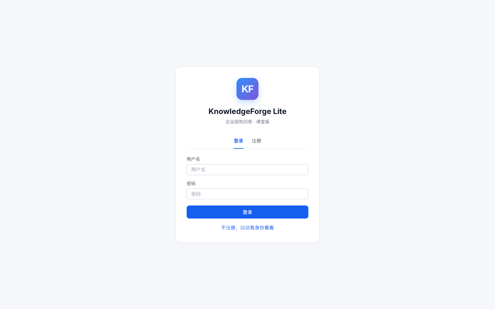
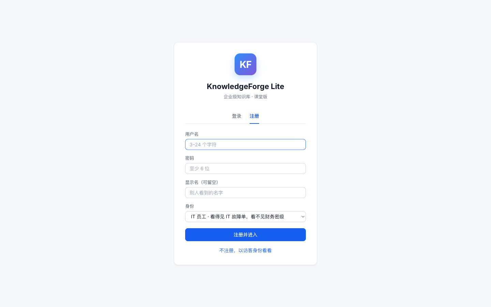
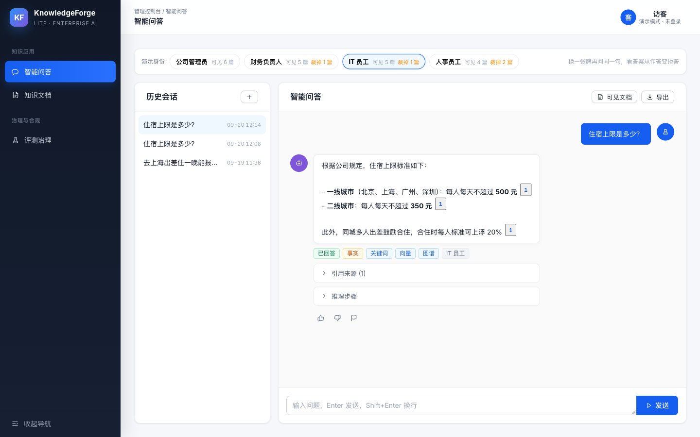
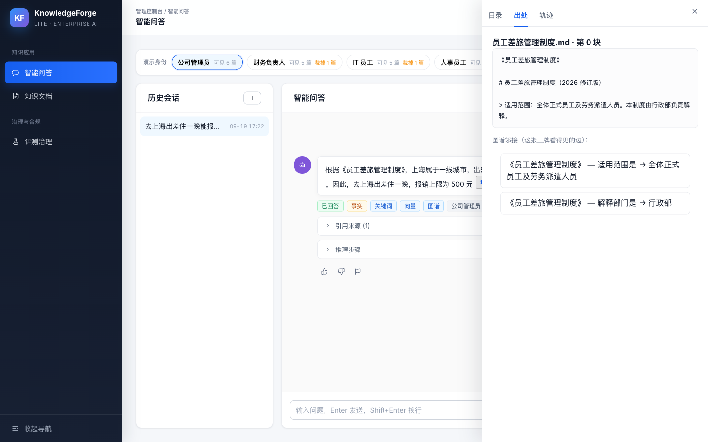
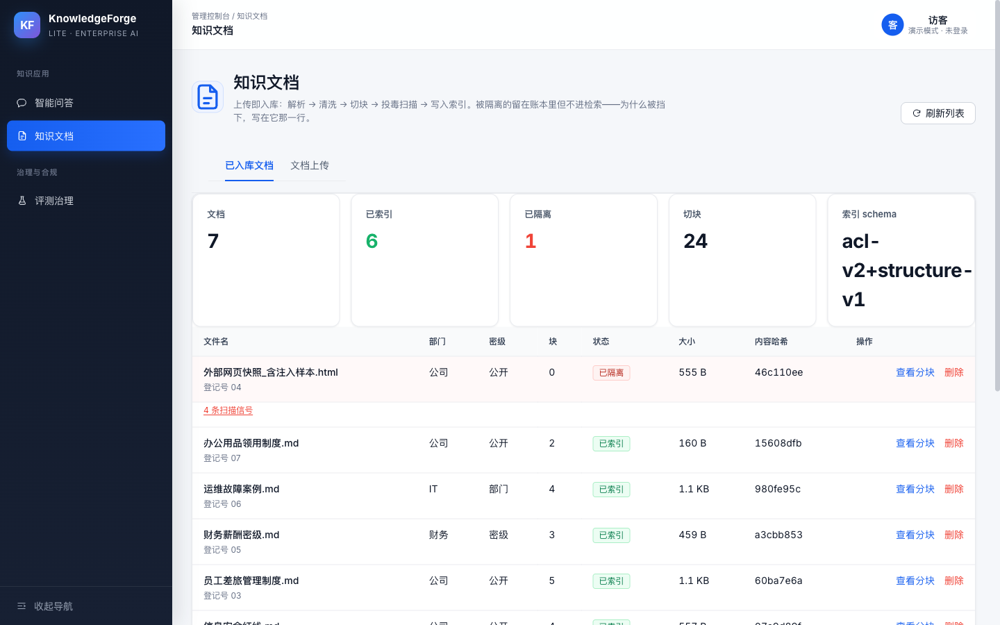
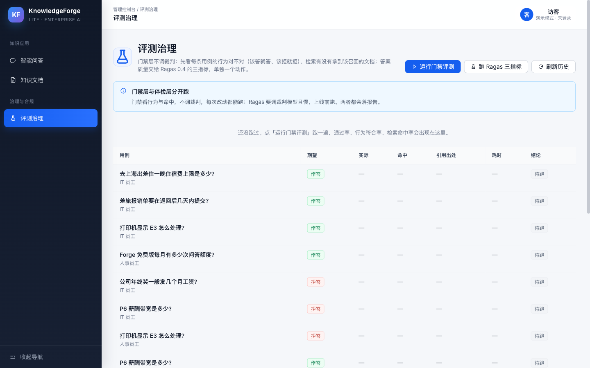

# 11.15 端到端综合实战 —— KnowledgeForge Lite：把零件总装成一台机器

> **痛点场景**：学完 11.2~11.14，你手里攥着九个零件——解析切块、嵌入、索引、混合检索、查询重写、图谱、自省闭环、评估、工程化防护。但零件不等于机器：**它们怎么在一个真实项目里咬合运转？先装哪个、后装哪个、哪里最容易装反？**本节补上这张总装图：我们以一个真实开源项目 [KnowledgeForge](https://github.com/buffer121328/KnowledgeForge) 为蓝本，蒸馏出一个 **一个下午能跑通**的教学版 `KnowledgeForge Lite`，从数据到服务完整走一遍。

---

## 为什么是“蒸馏”，而不是“从零手搓”？

完整版 KnowledgeForge 是一个生产级多 Agent 知识管理平台（FastAPI + LangGraph + Celery + Kafka + pgvector + Neo4j + React），约 9 万行代码。**直接拿它当教程，读者会在配置 Docker 的路上先阵亡**。所以我们做了三刀蒸馏：

| 蒸馏决策 | 砍掉了什么 | 为什么能砍 | 留下了什么（与完整版同构） |
| :--- | :--- | :--- | :--- |
| **砍重型基础设施** | Celery 异步任务、Kafka 消息、K8s 部署 | 教的是 RAG 主干，不是分布式系统 | 同步调用 + FastAPI 服务化；入库仍是「一份切块三路写」 |
| **砍第二存储引擎** | PostgreSQL/pgvector、Redis | 教学版一个向量库足够 | Chroma 向量库 + BM25 + Neo4j 图数据库（NetworkX 仅作零依赖兜底） |
| **砍企业治理外壳** | JWT、限流、maker-checker 评测台 | 登录态和发布流水线不是第一节课 | **工牌 RBAC 仍在检索前裁库**；审计账仍记谁问过什么；接地生成、引用溯源、自省闭环、回归门禁 |

**留下来的恰恰是这台机器的灵魂**：工牌先裁可见范围、三路召回进 RRF、四道质量闸门、拒答机制、评估回归——学生读完整版 `visible_department_ids` / `hybrid_rerank` / `EvidenceQualifier` 时，能在 Lite 里找到同一条咬合顺序。

---

## 总装图：一次问答的完整旅程

<!-- 图表源文件：img/diagrams/15-diagram-01.mmd；视觉风格：House 统一风格 -->
<p align="center">
  <a href="img/diagrams/15-diagram-01.svg">
    
  </a>
</p>

---

## 项目结构：每个文件对应一章课

项目位于本章 `code/KnowledgeForge_lite/`。先装**最基本能跑通、且与完整版同构的主干**：工牌 ACL、三路检索、四道闸门。HyDE、ColBERT、RAPTOR、JWT、Celery 这些进阶件或外壳故意不装，避免总装第一次就变成零件展览。

```
KnowledgeForge_lite/
├── data/docs/            # 种子知识库：差旅/FAQ/故障/安全/薪酬密级/办公用品 + 投毒 HTML
├── forge_lite/           # 源码，按依赖方向分六层（见下）
│   ├── config.py         #   旋钮分三类：索引时 / 检索时 / 评测      ← 11.13
│   ├── contracts.py      #   页面 DOM id 与前端字段契约
│   ├── llm.py            #   模型客户端（叶子件，解环用）
│   │
│   ├── core/             # 零件层：不依赖任何内部模块，谁都能用
│   │   ├── identity.py   #   四张演示工牌，检索前裁部门/密级        ← 11.13
│   │   ├── quality.py    #   纯函数零件：加权 RRF/装箱/去重/引用/预算/投毒 ← 11.5/11.8/11.9/11.13
│   │   ├── chunking.py   #   结构感知切块：按标题分节+标题路径+表格不切碎 ← 11.2
│   │   ├── rewrite.py    #   本地改写护栏：原问题必须保留            ← 11.6
│   │   ├── evidence.py   #   证据资格：够答/部分/背景/冲突/不足      ← 11.8/11.12
│   │   └── labels.py / sseutil.py  # 文案表 / SSE 帧协议与事件白名单
│   │
│   ├── store/            # 持久化层
│   │   ├── conversations.py # 会话柜：SQLite 落盘、工牌隔离、软删除   ← 11.13
│   │   ├── accounts.py   #   注册/登录/会话（pbkdf2；登出即删一行）   ← 11.13
│   │   └── audit.py / query_cache.py  # 审计账 / 精确缓存（带 schema 作用域）
│   │
│   ├── data/             # 数据层：语料的进出
│   │   ├── ingest.py     #   解析→部门密级→投毒扫描→三路写入        ← 11.2/11.4/11.13
│   │   ├── catalog.py    #   目录与切块预览，和检索同一把 ACL        ← 11.13
│   │   ├── acl_matrix.py #   权限矩阵：四张工牌 × 全部文档的可见性    ← 11.13
│   │   └── knowledge_graph.py # 图谱作为第三路召回，命中映射回源切块  ← 11.7
│   │
│   ├── retrieve/         # 检索层：把证据找出来
│   │   ├── search.py     #   授权后 向量+BM25+图谱 加权 RRF + 装箱    ← 11.5/11.7
│   │   ├── citation.py   #   编号引用协议 + 幽灵引用校验             ← 11.12
│   │   └── trace.py      #   检索轨迹：查询/路由/证据资格/预算        ← 11.5/11.12
│   │
│   ├── answer/           # 编排与评测层
│   │   ├── agent.py      #   改写→三路检索→资格→分级→生成→校验→复检 ← 11.6/11.8/11.12
│   │   ├── evaluate.py   #   Ragas 0.4 三指标：faithfulness/recall/相关性 ← 11.9
│   │   ├── evaluation.py #   评测区：逐条跑黄金集、行为与命中、报告留档 ← 11.9
│   │   └── classroom.py / scenarios.py # 空状态剧本 / 越权对照题      ← 11.15
│   │
│   ├── service/          # 面向页面的服务层
│   │   ├── documents.py  #   文档区：总览/上传只嵌单篇/删除级联/切块预演 ← 11.2/11.4/11.13
│   │   ├── status.py     #   运行时体检：索引 schema/图谱/会话/账本
│   │   └── export.py / graph_view.py / demo.py # 导出 / 图谱邻接 / 离线走查
│   │
│   └── web/              # HTTP 层
│       ├── app.py        #   Air(=FastAPI)：SSE + 全部路由            ← 11.13
│       ├── pages.py      #   登录页 + 控制台三视图（问答·文档·评测）    ← 11.13
│       └── static/       #   console.css / console.js / workbench.js / auth.js
├── scripts/              # 01 入库 → 02 问答 → 03 门禁 → 04 Ragas → 05 建图 → 06 走查 → 07 体检
├── tests/                # 450 个离线用例（含 test_layering.py：分层违规当场报错）
├── Dockerfile / docker-compose.yml
└── runtime/              # 运行产物（已 gitignore）
```

### 为什么要分层：一个真实的环

分层不是为了目录好看。改之前 33 个模块全平铺在 `forge_lite/` 下，依赖图跑出来是这样的：

```
agent → retrieve → knowledge_graph → agent        ← 环
```

环的成因很具体：**模型客户端原本住在 `agent.py`**，而需要它的分处两层——编排层要用它
生成与复检，数据层（`knowledge_graph.py` 抽三元组）也要用。客户端建在编排层，数据层就得
反过来依赖它，于是绕成一个圈。

修法不是"把 import 挪个位置"，而是**把客户端抽成叶子模块** `llm.py`（它不依赖任何内部模块，
谁都能依赖它）。两层各自向它取实例、互相不认识，环就断了。

这就是"解耦"最常见的样子：**不是把代码拆小，是把不该碰面的东西隔开。**

分层定下来之后写成六层单向依赖，而且**写成了断言**（`tests/test_layering.py`）：

```
web (L4)  →  service (L3) / answer (L3)  →  retrieve (L2)  →  data (L1) / store (L1)  →  core (L0)
```

同层之间也不许互相 import——那说明这一层的边界划错了，或者本来就该拆成两层。
这条测试值得单独说一句：**分层写在文档里会腐烂（"当时是这么设计的"），写成断言才不会。**
随手一个 `from ..answer.agent import get_llm` 就把环建起来了，而那种代码跑得通、
别的测试也全绿，只在某天导入顺序一变时炸掉。让它在这里当场红掉，比事后画架构图便宜得多。

**模块 ↔ 完整版对照**：`identity.py` 对应检索层 `visible_department_ids`，`ingest.py` 蒸馏自 `ingest_document` 工作流（一份切块三路写），`rewrite.py` 来自 `services/qa/query.py`（本地规则，原问题第一位），`retrieve/search.py` 来自 `retrievers + hybrid_rerank`（三路加权 RRF），`citation.py` 来自 `qa_grounding`，`agent.py` 来自 `qa_agent`，`knowledge_graph.py` 来自 `knowledge_extractor`（图谱进融合，不是事后加餐），`core/chunking.py` 来自完整版切块阶段（按标题分节 + 表格整段保留，是 11.2「标题层级切块」的落地），`evaluate.py` 来自 `evaluation/`——想读工业完整版时，这份地图就是你的翻译词典（详见项目内 [README](./code/KnowledgeForge_lite/README.md)）。

---

## 十分钟跑通

```bash
cd code/KnowledgeForge_lite
python -m venv .venv && source .venv/bin/activate
pip install -r requirements.txt
# 在 .env 里填 OpenAI 兼容端点（DeepSeek/智谱等均可）

python -m unittest discover -s tests -v            # ⓪ 离线门禁（450 个用例，无需 API Key）
python scripts/06_demo.py                          # ① 离线走查：权限矩阵/证据资格/会话柜/图谱（不用 Key 也能看效果）
python scripts/01_ingest.py                        # ② 入库（幂等；投毒隔离；种子图谱垫底）
python scripts/02_ask.py "去上海出差住一晚能报多少？"  # ③ 带引用作答（默认 IT 员工工牌）
python scripts/02_ask.py "出差回来晚了一天，钱最晚啥时候能到手？"  # ④ 口语题：11.6 改写后仍应命中报销时限
python scripts/02_ask.py "公司年终奖一般发几个月？"    # ⑤ 拒答：库里没有就老实说
python scripts/02_ask.py "P6 薪酬带宽是多少？" it_staff     # ⑥ 越权拒答：员工看不见财务密级
python scripts/02_ask.py "P6 薪酬带宽是多少？" finance_head # ⑦ 财务负责人应能引用密级文档
python scripts/03_evaluate.py                      # ⑧ 门禁层：该答的答了没有、该拒的拒了没有（不调裁判）
python scripts/04_ragas_eval.py                    #    体检层：Ragas 0.4 三指标（要裁判模型，可能要几十分钟）
docker run -d --name neo4j -p 7474:7474 -p 7687:7687 \
  -e NEO4J_AUTH=neo4j/forge12345 neo4j:5           # ⑨ 起图数据库（完整版同款 Neo4j）
python scripts/05_build_graph.py                  # ⑩ 可选：LLM 补抽三元组（入库已有种子，第三路默认就能走）
python scripts/07_status.py                        # ⑪ 体检：索引 schema 漂移/图谱/会话柜/账本
uvicorn forge_lite.web.app:app --port 8800         # ⑫ 起服务：浏览器开 http://127.0.0.1:8800/ 三栏工作台
#    旧命令 uvicorn forge_lite.server:app 仍可用（server.py 只是兼容层）
```

> 🐳 **不想配本地 Python 环境？**第 ⑨~⑪ 步可以整条换成 Docker 一键版：`docker compose up -d --build`（详见下文 Docker 小节）。

注意第 ⑤、⑥ 个问题的设计：**知识库里故意没有年终奖**，投毒网页会被入库扫描隔离；**薪酬带宽写在财务密级文档里**，IT 员工工牌在打分前就被裁掉，所以拒答不是模型“懂礼貌”，是检索层根本没看见。第 ④ 题是口语改写，用来验证 11.6 的护栏。一个没装闸门的 RAG 会一本正经地编数字或把密级文档念出来；Lite 会返回“暂无可靠依据，已转人工”。这就是 11.12 / 11.13 说的：企业要的不是聪明，是可追责。

第 ⑫ 步打开浏览器，先看到的是这张登录卡——**库是空的，谁用谁注册，没有预置账号**。课堂上不想建账号，点底下那行「不注册，以访客身份看看」就能进控制台。注册页从四张工牌里挑一张（角色和部门不分开选，就不会拼出不存在的组合）。

<!-- 实拍：img/screenshots/15-login.png；浏览器工作台 1440×900 -->
<p align="center">
  <a href="img/screenshots/15-login.png">
    
  </a>
</p>

<!-- 实拍：img/screenshots/15-register.png；浏览器工作台 1440×900 -->
<p align="center">
  <a href="img/screenshots/15-register.png">
    
  </a>
</p>

---

## 顺便补课：Docker 五个核心概念

十分钟跑通的第 ⑨ 步突然冒出一行 `docker run`——如果你没接触过 Docker，这一节用五个概念把账补齐。**它解决的是那句经典甩锅："在我机器上是好的啊。"**Docker 的思路像航运业的集装箱：把货（应用）和装卸环境（依赖、配置）整体封进一个标准箱子，吊车、货轮、码头（你的 Mac、同事的 Linux、云服务器）都不用关心箱子里面是什么。

<!-- 图表源文件：img/diagrams/15-diagram-02.mmd；视觉风格：House 统一风格 -->
<p align="center">
  <a href="img/diagrams/15-diagram-02.svg">
    
  </a>
</p>

| 概念 | 一句话定义 | 类比 | 本项目里的实例 |
| :--- | :--- | :--- | :--- |
| **镜像（Image）** | 只读的应用模板，打包了代码+运行环境+依赖 | 安装光盘 / 类 | `neo4j:5`、你构建的 `forge-lite` 镜像 |
| **容器（Container）** | 镜像跑起来的实例，彼此隔离，删了不留残骸 | 照光盘装好正在运行的机器 / 对象 | `docker ps` 里 Up 状态的那两行 |
| **Dockerfile** | 描述"怎么一步步做出镜像"的菜谱 | 菜谱 | `code/KnowledgeForge_lite/Dockerfile` |
| **docker compose** | 一份 YAML 描述多个服务，一条命令整组启停 | 乐队总谱 / 一键团建 | `docker-compose.yml` 里的 neo4j + lite |
| **仓库（Registry）** | 存放镜像的"应用商店"，可拉取可推送 | Docker Hub / npm 仓库 | `docker pull neo4j:5` 拉的就是它 |

**它们的关系是一条流水线**：`Dockerfile` 经 `docker build` 做出**镜像**，镜像经 `docker run`/`compose` 变成**容器**；嫌做菜麻烦就去**仓库** `docker pull` 现成的。

几个初学者最容易懵的点，用本项目直接演示：

- **容器是"用完即扔"的**：容器里产生的文件随容器一起消失，所以 compose 里把 Neo4j 数据、Lite 的 `runtime/` 挂在 **volume（数据卷）**上——集装箱可以换，货舱里的货不丢；
- **镜像分层是省时间的**：Dockerfile 里先 `COPY requirements.txt` 装依赖、再拷代码，就是为了改代码重新构建时**不重装依赖**（层缓存命中）；
- **容器之间用服务名互访**：compose 里 Lite 连 Neo4j 写的是 `bolt://neo4j:7687`——`neo4j` 是服务名，不是 localhost（各自是隔离的"房间"，localhost 指的是自己）；
- **密钥永远不进镜像**：`.dockerignore` 排除了 `.env`，API Key 通过环境变量在启动时注入——镜像可以随便分享，密钥只在运行时见面。

Lite 的两条 Docker 上手命令（对应本项目文件）：

```bash
# 只起图数据库（本地跑 Python 代码时用）
docker run -d --name neo4j -p 7474:7474 -p 7687:7687 -e NEO4J_AUTH=neo4j/forge12345 neo4j:5

# 整套起（compose：Neo4j 健康检查通过后才启动 Lite——"进程在"不等于"服务就绪"）
echo "OPENAI_API_KEY=sk-你的key" > code/KnowledgeForge_lite/.env
cd code/KnowledgeForge_lite && docker compose up -d --build
# 全部停掉并清理：docker compose down -v
```

> 💡 想深入可以直接啃官方教程：[Docker Get Started](https://docs.docker.com/get-started/) 与 [Compose 入门](https://docs.docker.com/compose/gettingstarted/)。第十二章 12.1 讲开源许可证时会再次遇到"容器化交付"这个工程惯例。


---

## 先看总装清单：每一节学的东西，在整机里都有位置

第九章 SmartBuyer、第十章旅行助手都是「零件对号入座」。Lite 也按这个规矩装——**先装最基本功能**，进阶件标成「分节课已讲、总装故意不装」：

| 章节 | 总装里装了什么 | 故意不装（留给分节脚本） |
| :--- | :--- | :--- |
| 11.2 解析切块 | 按后缀解析 md/txt/html/docx/文字层 PDF；去页码噪点；**标题层级切块**（认 `#` 与「第X条」）+ 表格整段保护；零成本上下文头 `《文件名》 › 第 X 条` | MinerU 扫描件、父子切块、RAPTOR 摘要树 |
| 11.3 / 11.4 嵌入与索引 | OpenAI 兼容 Embedding + 分批（方舟 10 条上限）；Chroma 持久库 | Qdrant HNSW 调参、MRL 降维 |
| 11.5 混合检索 | 授权后向量 + BM25 + 图谱三路、加权 RRF、近重复装箱、最相关放首尾 | Cross-Encoder 重排、难负例微调 |
| 11.6 查询重写 | 本地规则改写（原问题必须保留 + 顿号拆主题）；多跳只提示不拆图 | HyDE、Step-Back、模型意图路由 |
| 11.7 知识图谱 | 图谱作为第三路召回，命中映射回源切块（Neo4j / 种子 JSON 兜底） | Leiden 社区、Global Search |
| 11.8 Agentic RAG | 证据资格拦在前；资格已放行时不再让分级模型一票否决；`RunBudget` 熔断（每关只许重试 1 次） | 联网兜底、长期记忆库 |
| 11.9 评估 | Ragas 0.4 官方入口三指标 + 离线门禁；课堂默认关掉 MiMo 隐性思考（问答和裁判共用） | RAGChecker 逐 claim、RAFT 样本 |
| 11.12 引用溯源 | 编号协议 + 幽灵引用校验 + 接地 Prompt 第 4 条（资料=数据） | 流式逐句缓冲 |
| 11.13 工程化 | 工牌 ACL（打分前裁库）、内容哈希增量、入库投毒扫描、PII 脱敏、SSE 先验证再发送、审计账 | JWT/限流、语义缓存、蓝绿发布 |
| 11.11 / 11.14 | — | 迟交互、多模态；总装保持「一台文字 RAG」 |

> 🔑 **一句话读懂整机**：文档先过**投毒安检**并打上部门/密级（11.13）再切块入库（11.2）→ 提问先亮**工牌裁库**再**改写但保留原句**（11.6）→ **三路召回 + 加权 RRF + 装箱**（11.5 / 11.7）→ **分级 / 引用 / 复检**三道闸门（11.8 / 11.12）→ 改完跑**回归门禁**（11.9）。图谱是第三路司机之一，挂了就降级，不拦整趟车。

---

## 五个最值得细读的接缝

教程各节已经把零件拆开讲过，这里只讲**零件之间的五个接缝**——总装最容易装反的地方：

### 接缝一：一份语料，三路索引（ingest.py ↔ retrieve/search.py ↔ knowledge_graph.py）

向量、BM25、图谱必须检索**同一批切块**，否则 RRF 融合的就是三批对不上的货。所以 `ingest.py` 把切块同步导出为 `runtime/chunks.json`，并把种子三元组垫进图存储；图谱命中还要映射回 `文件名#切块号`，不能另造一块「知识图谱」幽灵资料——**单一事实来源**，这是混合检索最容易踩的第一个坑。

### 接缝二：编号即协议（retrieve/search.py ↔ citation.py ↔ agent.py）

检索结果按 RRF 名次排好后，`agent.py` 将它们编号为 `[1] [2] …` 并放入 Prompt。编号同时承担三个作用：**组织模型回答**、**把 `[n]` 映射回 `文件名#切块号`**、**供 `check_citations` 校验引用是否存在**。这套协议贯穿三处，改动任何一环都要运行 `03_evaluate.py`（门禁层；Ragas 走 `04_ragas_eval.py`）。

### 接缝三：旋钮分三类——改索引时旋钮必须重建（config.py ↔ ingest.py ↔ retrieve/search.py）

`config.py` 的旋钮不是平权的：`CHUNK_SIZE` / `CHUNK_OVERLAP` 只在 `ingest.py` 的 `make_splitter()` 里被读取，切完就固化进 `runtime/chunks.json` 和 Chroma；`EMBED_MODEL` 更危险——入库时 `ingest.embeddings()` 用它建库，检索时 `retrieve.search.hybrid_search()` 又用它编码问题，**建库与查询必须是同一个模型**。部门/密级属于索引 schema（`INDEX_SCHEMA`），变了也必须重建。而 `TOP_K` / `RRF_K` / `ENABLE_GRAPH` 只在检索侧生效，改完立即有效；`JUDGE_MAX_TOKENS` / `THINKING_MODE` 只影响生成与评测（思考旋钮问答和裁判共用）。所以规矩是：**索引时旋钮一改，必须重跑 `01_ingest.py` 全量重建，向量、BM25、种子图谱三路一起重建**；只换嵌入模型不重建，两套向量空间错配，不报错，只是悄悄变差。呼应 11.13：配置漂移最可怕的不是崩溃，是静默降级。

### 接缝四：图谱是第三路召回，不是事后加餐（knowledge_graph.py ↔ retrieve/search.py）

完整版把向量、BM25、图谱**并行召回再 RRF**。Lite 同步走这条纪律：图谱命中映射回可见切块，带着来源权重 1.05 进融合，而不是在融合后再硬塞一条「知识图谱」Source。图谱挂了记降级码，主链路继续用向量 + BM25——**增强件必须可插拔，不能变成单点依赖**。编号引用协议和质量闸门原样生效：图谱抽错了，分级/复检照样拦住。

### 接缝五：工牌在打分前裁库（identity.py ↔ retrieve/search.py）

完整版的 `visible_department_ids` 在向量/BM25/图谱打分之前就生效。Lite 用四张演示工牌做同一件事：人事员工看不见 IT 故障单，普通员工看不见财务密级，管理员 `None` 表示不过滤。**先检索再丢弃等于把机密当过场字幕放了一遍**——这是读完整版 ACL 时最不能装反的一刀。

自省闭环最危险的 bug 是“校验不过 → 重生成 → 又不过 → 再重生成”的死循环（呼应 10.11 的熔断思想）。Lite 的规矩：**每个质量关卡只给 1 次重试机会**，`RunBudget` 把 retrieval / rewrite / verify 三次动作封顶，重试仍不过就拒答，绝不带病交付。生产系统还应设置总 Token、费用和墙钟时间预算。

### Web 界面：为什么是 Air，而不是 React？

完整版的 `frontend/` 是 React 19 + Ant Design + Three.js 的管理后台（百余个 TS 文件，含 3D 知识图谱）——这是 Lite 砍掉的第一刀。但完全没有界面，读者就错过最有成就感的一幕：**通过质量门禁后的答案分片蹦出来，每个 `[n]` 角标都有出处**；也错过企业系统真正难的那一层——**历史会话存哪、谁能看谁的**。

所以 Lite 用一个零构建的前端同时演示这两件事，而且**界面语言和完整版是同一套**（同一个深藏青侧边栏、同一顶白栏、同一个主色 `#155eef`）：学生在 Lite 上学会的动作，搬到完整版上认得出位置。这不是"抄皮肤"——两边的 token 是逐条对齐的（见 `DESIGN.md` 与完整版 `frontend/src/main.tsx` 的 antd 主题）。

| 视图 | 装了什么 | 对应完整版 |
| :--- | :--- | :--- |
| **智能问答** | 左历史会话卡；右对话卡（问句气泡、答案正文、`[n]` 角标、状态标签、推理步骤与引用来源折叠、反馈）；证据抽屉分目录/出处/轨迹三页 | `pages/QAChat.tsx` + `components/ChatHistory.tsx` |
| **知识文档** | 统计卡、文档表（两行首列、状态标签、文字链操作）、隔离原因可展开、查看分块抽屉、切块实验台 | `pages/DocList.tsx` + `components/DocumentTable.tsx` |
| **评测治理** | 说明条、统计卡、用例表（点行开详情抽屉）、Ragas 三指标、历史报告 | `pages/EvaluationGovernance.tsx` |

浏览器里这四个画面就是上面那张表。问答页顶部那条工牌对照条是课堂教具：换一张牌再问同一句，答案会从作答变成拒答。点答案里的 `[n]` 角标，右侧抽屉打开出处原文——员工能看见「有这么篇文档」，但读不到密级正文。

<!-- 实拍：img/screenshots/15-qa.png；浏览器工作台 1440×900 -->
<p align="center">
  <a href="img/screenshots/15-qa.png">
    
  </a>
</p>

<!-- 实拍：img/screenshots/15-qa-evidence.png；浏览器工作台 1440×900 -->
<p align="center">
  <a href="img/screenshots/15-qa-evidence.png">
    
  </a>
</p>

<!-- 实拍：img/screenshots/15-docs.png；浏览器工作台 1440×900 -->
<p align="center">
  <a href="img/screenshots/15-docs.png">
    
  </a>
</p>

<!-- 实拍：img/screenshots/15-eval.png；浏览器工作台 1440×900 -->
<p align="center">
  <a href="img/screenshots/15-eval.png">
    
  </a>
</p>

有几处是**照完整版的语法来**，值得单独认一下：

- **两行首列**：主名 + 一行灰色副信息（登记号 / 工牌 / 来源）。扫读时先看名字，再看注脚；
- **状态是描边小标签**（antd Tag 的观感），不是实心色块，也不是一堆按钮；
- **详情开右侧抽屉**：分块、用例详情、评测报告都在抽屉里，`Escape` 可关——完整版也是这个用法；
- **图标**是手写的 24 栅格描边 SVG，定义只有 `web/pages.py` 一处，服务端 `<use>` 引用，JS 造同一个引用。`air` 没有 SVG 元素，走 `air.Raw` 内联。

技术上仍然是 [Air](https://github.com/feldroy/air)（Two Scoops of Django 作者出品，FastAPI + Starlette + Pydantic + HTMX 系）的取舍：

| 决策 | 理由 |
| :--- | :--- |
| **`air.Air()` 直接替换 `FastAPI()`** | Air 是 FastAPI 的子类——接口一行不改，页面与 API 同进程，不需要第二个服务 |
| **结构即 Python，样式走静态文件**（`web/pages.py` + `static/`） | 标签树（`air.Div(...)` ≈ `<div>`）不会 React 也能读；CSS/JS 放在 `static/console.css` / `workbench.js` / `console.js`，都带中文注释，零 npm、零打包器。**代价要说清**：antd 的组件外观是手写复刻的，不是引 antd——所以只复刻到用得到的那几个，不追组件库的完整性 |
| **唯一的 JS 只做三件事** | 拉会话柜、消费 SSE（`EventSource` 不支持 POST，用 `fetch + ReadableStream`——这正是 11.13 埋的伏笔）、点角标开证据抽屉 |
| **版本锁死**（`air>=0.35.0`） | Air 尚未到 1.0、API 迭代快——教学代码必须可复现，锁版本是纪律 |

界面之外，这一段最该带走的是**会话的纪律**——和企业里做知识库时踩的坑是同一批：

1. **服务端才是历史的权威来源**：会话写进 `runtime/conversations.sqlite`（完整版是 PostgreSQL），刷新、换浏览器、重启进程都不丢；浏览器 `localStorage` 只记当前工牌和当前会话号；
2. **指针不是权限**：会话号指向的会话必须属于当前工牌。换了工牌，列表里没有它，前端就当没选中；拿别人的 id 硬调接口，服务端按 404 处理——不是「拒绝访问」，是「不存在」，不泄露会话存不存在；
3. **预览原文走同一把 ACL**：点角标打开的切块和检索一样先过 `authorize_chunks`——员工能看见「有这么篇文档」，但读不到密级正文；
4. **可复盘**：每次问答都落一条 run（状态、路由、引用、证据资格摘要）和一条审计事件，页面上点开就是**检索轨迹**（这一跑改了哪些查询、哪几路各召回什么、为什么放行或拦截），会话可一键导出成带引用和轨迹摘要的 Markdown。

**一个诚实的边界**：Air 负责「看得见的演示」，React 完整版负责「用得多的产品」。等你需要 3D 图谱可视化、权限管理台、复杂表单时，就是回到完整版前端形态的信号——这与 11.10 选型地图的「买车/焊车」是同一个决策逻辑。完整版对应的蒸馏关系：`web/pages.py + static/` ← `frontend/`（React 管理后台）。

### 三个视图分别打哪个接口

| 视图 | 学生在这里做的动作 | 后端接口 |
| :--- | :--- | :--- |
| **智能问答** | 问一句 → 点角标读原文 → 看三路名次 | `/ask`（SSE）· `/api/chunks` · `/api/runs/{id}/trace` |
| **知识文档** | 拖文件上传 → 看统计 → 看切块 → **调旋钮重切** → 删文档 | `/api/documents` · `/api/documents/upload` · `/{source}/chunks`（含预演模式） |
| **评测治理** | 跑门禁评测（逐条直播进度）→ 点一行看单条详情 → 跑 Ragas 三指标 → 回看历史报告 | `/api/evaluation/run` · `/api/evaluation/ragas` · `/api/evaluation/reports` |

**知识文档 / 评测治理按角色开放**（只有公司管理员能进）：接口 403 时把原因说清，页面给出同样的提示和一个"切到公司管理员工牌"的按钮。这不是把功能藏起来，而是把第 11.13 节的 RBAC 再演示一遍——**权限在服务端生效，前端只负责把话说明白**。

### 解析与切块：管道前两段做了哪些"不默认"的事

Lite 的入库管道不是"剥标签然后按字数切"。每一步都对应一个真实会踩的坑：

| 环节 | 做了什么 | 不做会怎样 |
| :--- | :--- | :--- |
| 编码 | UTF-8 → GB18030 两档试（`decode_bytes`） | 一份 GBK 老制度直接抛异常，整篇进不了库 |
| Word 表格 | 按**文档原顺序**遍历段落与表格（`_docx_blocks`） | 表格整块消失——正文还通顺，只是关键数字永远查不到 |
| HTML | `script/style/svg/head` 整块删；单元格之间用 `\|` 连接 | 脚本变量名会被 BM25 当关键词召回 |
| 清洗 | 先删控制字符，再归一化空白（含全角空格 U+3000、不换行空格 U+00A0） | 隐含字符夹在词中间，哈希对不上，重传一次就判成"内容变了" |
| 未填模板 | 识别 `×××公司` / `待定` 并**标记**（`find_placeholders`），不删 | 没填的模板混进索引，谁问都召回它，而它什么信息都没有 |
| 切块 | 按标题分节，每块带「《文件名》 › 第 X 条」（`chunking.py`） | 块脱离原文，"这块讲哪一条"就丢了 |
| 表格切块 | 表格行不可分割；超长表格只在行间切且每块补表头 | 一行被劈成两半，「500」和它的城市名分家 |

标题识别同时认 Markdown 的 `#` 和中文编号（第X章 / 第X条 / 一、 / （一））——真实文档大多
不是 Markdown，Word 转出来就长这样。这条路径是**零成本**的：不调模型，就是几行字符串拼接，
正是 11.2 讲的"迟切块"的退化版本。

### 索引形状版本：别让"改了切块但没人记得改版本号"发生

切块策略变了，索引必须重建——但增量同步靠的是"内容哈希 + schema 都没变就跳过"，
而**切块策略不在哈希里**。所以 Lite 让 `INDEX_SCHEMA` 由零件的版本拼出来：

```python
# chunking.py —— 版本号就放在切块代码旁边，改的人顺手就改了
CHUNKER_VERSION = "structure-v1"

# config.py —— 索引形状版本由各轴拼成，而不是手写一个数字
INDEX_SCHEMA = f"acl-v2+{CHUNKER_VERSION}"
```

放进 `CHUNKER_VERSION` 的理由是"离改动最近"：改切块的人在看这个文件，而 `config.py`
在另一个地方。实测过一次它的必要性——先手动改切块，`01_ingest.py` 报 `skipped: 6`
（它认为无事发生），而 BM25 语料已用新切法、向量库还留着旧切块的向量。
**两路索引对"一块是什么"的理解不一致，比索引过期更糟：它不报错，只是悄悄不匹配。**

### 一个只有跑评测才能发现的 bug：装箱与编排的顺序

这轮改完结构化切块，评测从 8/8 掉到 **6/8**。两块单独看都对，凑在一起就成了"越重要的越先被丢"：

- `order_contexts` 为了对抗 lost-in-the-middle，**故意把第二名放到列表最末**；
- 紧接着的 `_pack_hits` 按上下文预算**从尾部截断**。

于是预算一紧，第一个被砍掉的正是那个被特意安排到结尾、最该给模型看的第二名。

为什么以前没暴露：切块变结构化后**块数变多、单块变短、每块还带了标题路径**，
上下文总长度变大，1800 字的预算覆盖不到最后几块了——**结构改动改变了预算的紧张程度，
把潜伏的顺序 bug 顶了出来**。修法是调换顺序：先按相关度装箱（决定谁进得来），
再对装进来的做首尾编排（决定怎么摆）。修完复跑 8/8。

`tests/test_retrieval_slice.py::PackThenOrderTests` 把两种顺序摆在一起对比，
错序那条会明确地丢掉榜眼。

### 登记号不是行号：一个"结构必须承载信息"的例子

文档表里那行灰色小字（`登记号 04`）值得单独讲，因为它是**界面结构里最容易被做成装饰**的一种。它必须是：

| | 行号（`index + 1`） | 登记号（`accession`） |
| :--- | :--- | :--- |
| 删掉一篇 | 后面的全往前挪 | 别的号一个不动，留一个空号 |
| 重传一篇 | 位置随排序变 | 还是原来那个号 |
| 换个排序 | 全乱 | 全不变 |

实现上：`ingest` 在写入账本时给新条目烙一个号，改写已有条目时**沿用旧号**（`stamp_for`）；级联删除发生在同一次入库的末尾，所以删掉的号会留成空号——现实的档案号也不复用。读路径（`list_documents_admin`）用 `accessions_of` 按同一套规则算缺号，所以"还没入过库"和"刚入过库"看到的号一致，不会闪一下再变。

空号看着像缺陷，其实是这个装置成立的证据。**如果它只是个行号，就该被删掉**——那是会随排序乱跳的装饰。结构装置有权存在，前提是它承载了信息；这条判断标准比"好不好看"更硬，也更好用。

上传这条链路值得单独看一遍：`safe_filename` 先削平文件名（挡路径穿越、卡扩展名白名单、限长），落盘后调 `ingest(only=[文件名])`——**只对这一篇做嵌入**，其它文档不重算；BM25 语料则始终全量重建，因为切块是本地计算而嵌入要花钱。删除走的是同一条管道的反向：先删源文件，再让入库逻辑级联清掉向量和账本。

### 切块实验台：让"索引时旋钮"这句话变得可摸

11.13 讲过一条结论：`CHUNK_SIZE` 和 `CHUNK_OVERLAP` 是**索引时旋钮**——改完必须重建索引才生效。文档区底部那块面板就是这条结论的实物，它把 `preview_chunk_plan` 直接接了出来：

| 旋钮 | 看到什么 |
| :--- | :--- |
| 正文（粘一段，或点表里某行的「看切块」把正文带过来） | 块数 / 平均字数 / 最长块，五个读数一排 |
| 每块字数（50–2000） | 每块一张卡片，标题写块号与字数 |
| 重叠字数（0–400） | **块头重复的部分用琥珀色标出来**，注明"头 N 字是上一块的重叠" |

最后一行是这块面板最该被看见的地方。重叠不是个抽象参数，它是"同一句话被两块都装了进去"——检索时这句话就有两次机会被命中，代价是索引变大。把数字从 400 调到 120，看着块数从 2 变成 5，这件事就不用再解释了。而这个动作**不写库、不调模型**，所以可以随便试——试完要真生效，还是得回去改 `.env` 再重建索引，这正好把"实验"和"生效"这两件事分开。

### 评测区为什么能当"体检"用：一次真实抓 bug 的记录

Lite 评测区把判定分成两层，和完整版一致：**门禁层不调裁判**（只看期望行为对不对、期望文档有没有召回），**体检层交给 Ragas 0.4 三指标**。第一次跑门禁就抓到两个真问题：

1. `travel-cap` 用例（"去上海出差住一晚住宿费上限是多少？"）被判**证据冲突**后拒答——同一篇《员工差旅管理制度》里一线 500、二线 350 是正常分档，却被当成两份资料互相矛盾；
2. 往里查一层发现更根本的错：判"这块资料在不在讲住宿"时用了「元」这种通用量词当特征词，于是 FAQ 里的 999 元、办公用品制度的 200 元都被算成"住宿资料"，不相干的文件互相判打架。

修法是两条筛子：**主题筛**（特征词必须是名词性的——住宿/住宿费/过夜/酒店，不用"元"）+ **来源筛**（数值冲突只在两份以上**不同来源**之间判，同一篇文件内的多个数字是分档）。改完复跑：**8/8 全过**（修复前 7/8，挂掉的正是 `travel-cap`），而 `差旅旧版 vs 差旅制度` 的教学冲突用例依旧被拦——该拦的还拦得住，才说明放宽的是误判不是防线。

这段经历本身就是 11.9 最该讲的东西：**闸门误杀的代价是"该答的题拒答"，肉眼看不出，跑一遍才知道**——这就是评测区存在的意义。

### 控制台抓到的第二个 bug：同一个事实存了两份

界面这一层也有一个值得讲的坑，因为它和"评测抓 bug"是不同的病：**前者是判定逻辑错，后者是状态被存了两份**。

现象：管理员登录后刷新页面，头部明明显示"公司管理员"，切到文档区却说"当前工牌：IT 员工"并锁着——两个管理区都进不去，除非换张牌再换回来。

拆开看是三件事：

| 层 | 问题 | 修法 |
| :--- | :--- | :--- |
| 状态归属 | `workbench.js` 会从 `localStorage` 读回上次用的工牌，`console.js` 却自己写死 `it_staff`——**同一个事实存了两份** | 工作台在 `/whoami` 校验完、工牌真正定下来之后**广播一次最终身份**，控制台收到就对齐（不是让控制台也去读 `localStorage`，那只是把两份变三份） |
| 请求竞态 | 换工牌会连发两次请求，谁先回来不确定——旧牌的 403 可能盖掉新牌的数据 | 每个视图一个递增序号，回来时序号对不上就丢弃这次结果 |
| 资源缓存 | 静态资源只有 `ETag` 没有 `Cache-Control`，浏览器按启发式缓存直接拿旧 JS——**改完前端刷新看到的还是上一版** | `/static/` 显式 `Cache-Control: no-cache`：是"用之前先问一句"，不是"不许存"，命中 ETag 就是便宜的 304 |

三条都不是"代码写错了"，而是"两个正确的部件凑在一起不对"。这类 bug 单元测试往往照不到——测试里每个模块各自都对——所以这一轮的验收靠的是浏览器里真的点一遍：换牌、刷新、再换回来。

## 别只看不跑：三个“破坏性实验”

验证这台机器真装对了，最有力的是主动搞破坏：

| 实验 | 操作 | 预期 |
| :--- | :--- | :--- |
| **拆掉引用规矩** | 把 `citation.py` 的 `CITE_PROMPT` 第 2 条（必须标编号）删掉 | `03_evaluate.py` 通过率明显下降——回归门禁逮住退化 |
| **投毒测试** | 种子目录已放好 `外部网页快照_含注入样本.html`（含「忽略指令」和「年终奖 18 个月」）。重新入库后问年终奖 | 入库日志出现「隔离」；答案仍拒答——扫描把投毒挡在索引外，接地 Prompt 第 4 条再把漏网指令当数据 |
| **越权测试** | 同一句「P6 薪酬带宽是多少？」分别用 `it_staff` 和 `finance_head` 问 | 员工拒答、财务负责人引用密级文档——权限在检索层生效，不是生成后再捂嘴 |

跑完这三个实验，你对“防线为什么一层套一层”的理解会比再读十遍课文都深。

### 评估：按 Ragas 0.4 官方入口，只留三个指标

评估最容易滑向两个极端：要么「看着挺好」全凭感觉，要么铺 20 个指标做一张没人看的打分表。Lite 只留三条，**每条指向一层故障**——这正是教程 11.9 三元组定位法的落地：

| 指标 | 官方类（Ragas 0.4 collections） | 低了说明什么 |
| :--- | :--- | :--- |
| **Faithfulness** | `ragas.metrics.collections.Faithfulness` | 生成在编：答案里的陈述超出了资料 |
| **ContextRecall** | `ragas.metrics.collections.ContextRecall` | 检索漏了：标准答案的要点没被召回 |
| **AnswerRelevancy** | `ragas.metrics.collections.AnswerRelevancy` | 答非所问：资料对，但答案没对着问题讲 |

[Ragas](https://github.com/explodinggradients/ragas) 现在的主线是 0.4.x，写法与 0.2 差别不小，Lite 按[官方文档](https://docs.ragas.io/en/stable/)重写而不是沿用旧单例：

```python
from openai import AsyncOpenAI                    # 或任意 OpenAI 兼容客户端
from ragas.llms import llm_factory
from ragas.embeddings.base import embedding_factory
from ragas.metrics.collections import AnswerRelevancy, ContextRecall, Faithfulness

client = AsyncOpenAI(api_key=..., base_url=...)
llm = llm_factory("gpt-4o-mini", client=client)   # 换个模型就能换裁判
faith = Faithfulness(llm=llm)

result = await faith.ascore(                      # 0.4 走 ascore/score，不再 evaluate(...)
    user_input="去上海出差住一晚住宿费上限是多少？",
    response="一线城市住宿上限 500 元 [1]。",
    retrieved_contexts=["一线城市住宿标准为每人每天不超过 500 元。"],
)
print(result.value)                               # 0-1 分
```

三个容易踩的迁移点：① 样本字段是 `user_input / retrieved_contexts / response / reference`，`question / answer / contexts` 那一套是 0.2 的；② 指标是**类**（要 `Faithfulness(llm=...)` 实例化），不是可以直接 import 的单例；③ 归因口诀不变——`context_recall` 低先修检索，`faithfulness` 低先修生成。

还有三个坑不在 API 上，在环境和装配上，而且**都不报人话**（Lite 里逐个实测过）：

| 坑 | 现象 | 解法 |
| :--- | :--- | :--- |
| **裁判端点点错了** | 拿 `.env` 里那套 Chat 的**模型名**，去请求另一家的端点 → `404 UnsupportedModel`。报错只说模型不支持，不说是端点配错了 | 对话裁判与嵌入裁判**各建一个客户端**，各认自己那一对端点——就是 11.13 那条"模型名和端点必须成对"的纪律。11.9 其实早说过：阅卷老师得是你自己请来的 |
| **结构化输出被截断** | `IncompleteOutputException`：裁判要吐 JSON，而 `llm_factory` 默认只给 1024 token。更麻烦的是推理模型——推理 token 也吃这份额度，长短还不稳 | 显式给足：`config.JUDGE_MAX_TOKENS`（默认 8192）。这不是猜的，ragas 源码注释里就写着这个解法 |
| **`import ragas` 直接失败** | `ModuleNotFoundError: langchain_community.chat_models.vertexai`——ragas 0.4.3 顶层 import 了它，而该类在 langchain-community 0.4 已被移除（ragas 声明依赖时不带上界，pip 拦不住） | 在 import ragas 之前补个占位类。它只服务于"把 langchain 模型对象包成 ragas LLM"的分支；用 `llm_factory` 的话根本走不到那里 |

装 ragas 也要留意版本：`ragas>=0.4.3` 才有 `ragas.metrics.collections`。老版本跑 `04_ragas_eval.py` 只会打印一句「缺依赖」然后正常退出——**看起来像跑过了，其实一个指标都没算**。这种"静默降级"比报错更值得警惕，也正是 Lite 把缺依赖写成明文提示、而不是偷偷跳过评测的原因。

Lite 把两层评测拆成两个脚本，别绑在一起：`03_evaluate.py` 是门禁层（行为 + 期望文档召回，不调裁判，改完代码先跑）；`04_ragas_eval.py` 是体检层（Ragas 三指标，要请阅卷模型）。评测默认 `persist=False`——黄金题不往会话柜写，别把课堂演示刷脏。`AnswerRelevancy` 课堂默认 `strictness=1`（官方默认 3），裁判如果是推理模型，三次就是三倍墙钟。

拒答题的分数不要当检索事故读。年终奖那条 faithfulness 可能是 0.50、relevancy 是 0.00——裁判在给拒答话术打分，不是答案编错了；员工/人事越权那两条 context_recall 经常是 0.00，因为工牌 ACL 根本没让那篇文档进上下文。先看门禁层行为对不对，再读体检层分数。作答路径上 AnswerRelevancy 落在 0.66–0.85（`strictness=1`）是预期，不是检索坏了。

---

## 从 Lite 到完整版：什么时候需要升级？

| 信号 | 该升级什么 | 对应完整版组件 |
| :--- | :--- | :--- |
| 文档量大、解析耗时阻塞请求 | 异步任务队列 | Celery + 文档提交工作流 |
| 需要 Leiden 社区摘要、跨文档全局总结 | GraphRAG 全量链路 | Neo4j 之上的社区发现 + 研报摘要（教程 11.7 后半段；图数据库 Lite 已就位） |
| 多部门/多公司共用一套系统 | 把演示工牌换成 JWT + 租户命名空间 | 完整版 PostgreSQL 身份源 + RBAC（教程 11.13）；Lite 已先把「打分前裁库」跑通 |
| 检索质量到达瓶颈 | 迟交互/视觉检索 | pgvector + 重排服务（教程 11.11） |
| 要向老板证明系统在变好 | 持续评测平台与治理 | 评测集规模化 + Badcase 回归治理（教程 11.9 持续治理一节） |

完整版仓库直达：[github.com/buffer121328/KnowledgeForge](https://github.com/buffer121328/KnowledgeForge)（架构边界、模块划分见其 README；注意其中 `uploads/`、`logs/` 等运行产物不属于教学材料）。

---

<!-- CH10-14_EXPANSION -->

## 先跑通，再主动制造两类故障

完成基础运行后，可以删除一份应被引用的文档，确认系统会拒答或提示依据不足；再修改制度版本并重新入库，检查旧片段是否被替换、缓存是否失效、引用是否指向新版。

随后选择一个模块做单变量实验，例如只调整切块大小或 Top-K，并用同一组问题比较。Lite 的价值在于能看到各模块怎样连接；当并发、租户和可靠任务成为明确需求时，再引入更重的基础设施。

---

## 权威官方参考

- [KnowledgeForge 完整版仓库](https://github.com/buffer121328/KnowledgeForge)
- [LangGraph 官方文档（StateGraph 条件边）](https://langchain-ai.github.io/langgraph/)
- [Chroma 官方文档](https://docs.trychroma.com/)
- [rank-bm25：BM25 的极简实现](https://github.com/dorianbrown/rank_bm25)
- [Air：纯 Python web 框架（feldroy）](https://github.com/feldroy/air) · [官方文档](https://docs.airwebframework.org/)
- [FastAPI 官方文档（StreamingResponse/SSE）](https://fastapi.tiangolo.com/)
- [LangChain RAG 概念文档](https://python.langchain.com/docs/concepts/rag/)
