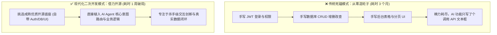
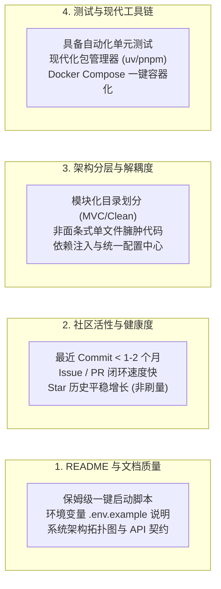
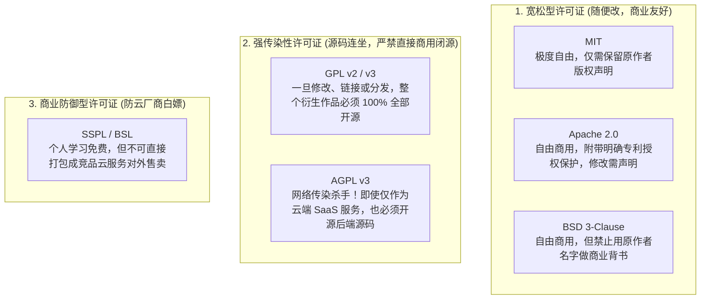
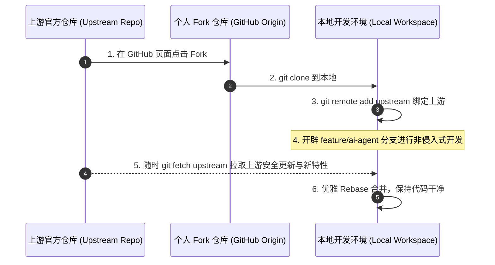

# 11.1 开源选型与二次开发：协议避坑与架构借力

> 💡 **“别在平地上徒手烧砖挖地基，要学会买一套户型完美的毛坯房，把全部精力花在智能家居的精装修上。”**
>
> 在 GitHub 上，全世界顶尖开发者已经为我们铺好了 80% 的地基：用户鉴权、数据库 ORM、后台管理面板、响应式 UI 组件库、支付与消息推送体系。
> 个人开发者和应届生最聪明的做法，不是耗费数月去从零手写枯燥的登录注册或后台表格，而是**站在巨人的肩膀上，挑选维护良好、架构优雅的开源底座进行“二次开发”，将 100% 的精力聚焦在最核心的 AI 差异化业务与智能体创新上**！

---

## 🏗️ 为什么要二次开发？从“打铁烧砖”到“模块装配”

很多初学者存在一个严重的认知误区：**“只有从第 1 行代码写到第 10000 行，才叫真正做项目。”**

在现代软件工程与 AI 时代，这种想法往往会导致项目死在第一阶段：

### 二次开发的核心优势：
1. **开箱即用的工业级基建**：自带密码加密、防 SQL 注入、跨域 CORS 处理、响应式自适应布局。
2. **专注于“AI 增量价值”**：你向面试官或投资人展示的，不是“我写了一个登录框”，而是“我在成熟业务系统中，通过 Agent 架构将客户转化率提升了 35%”。
3. **学习工业级代码规范**：阅读优秀的开源代码库，是快速提升架构认知、掌握设计模式与异常防御的最短路径。

---

## 🔍 GitHub 开源项目“四维黄金筛选法”

GitHub 上的开源项目浩如烟海、良莠不齐。如果选到了一个烂尾项目，二次开发就会变成“给危房刷油漆”，痛苦不堪。请牢记以下**四维筛选法则**：

### 1. 文档维度（README & Docs）
- **合格标志**：配有动图/视频演示、详细的 `.env.example` 环境变量说明、明确的技术栈选型、完善的本地开发踩坑指南；
- **避雷标志**：README 只有两句话，连怎么启动服务、怎么配数据库都没写，依赖版本全是最新 `latest` 导致一装就报错。

### 2. 社区活性维度（Activity & Health）
- **合格标志**：查看仓库的 `Pulse` 和 `Insights`，最近 1~3 个月内有活跃的 commit，maintainer 会耐心解答 Issue 并合并 PR；
- **避雷标志**：最近一次提交停留在 3 年前（说明依赖的技术栈已严重过时，可能依赖被废弃的 Python 3.7 或 Webpack 4）。

### 3. 代码架构维度（Architecture & Decoupling）
- **合格标志**：前后端解耦（如 FastAPI/NestJS + React/Vue3），路由、控制器、服务层、数据库访问层界限分明；
- **避雷标志**：把几千行后端代码全写在 `main.py` 或 `app.js` 里，没有模块划分，二次开发时动一发而动全身。

---

## 📜 开源许可证（Licenses）全景大图与商业红线

> ⚠️ **高危警告**：
> 选开源项目时，**必须第一时间看根目录的 `LICENSE` 文件**！如果踩中了强传染性开源协议，你的二次开发代码可能会被强制要求全部开源，甚至面临知识产权法律纠纷！

### 常见开源许可证横向对比矩阵

| 许可证名称 | 允许闭源商用？ | 修改后必须开源？ | 专利授权保护？ | 核心限制与使用须知 | 权威官方链接 |
| :--- | :---: | :---: | :---: | :--- | :--- |
| **MIT** | ✅ 是 | ❌ 否 | ❌ 默认无 | 最流行、最宽松。只需在代码头部保留原作者版权声明。 | [MIT License](https://opensource.org/licenses/MIT) |
| **Apache 2.0** | ✅ 是 | ❌ 否 | ✅ **提供专利保护** | 适合企业级和严肃开源项目。若修改了文件，必须保留修改说明。 | [Apache-2.0](https://www.apache.org/licenses/LICENSE-2.0) |
| **BSD 3-Clause** | ✅ 是 | ❌ 否 | ❌ 默认无 | 严禁利用原作者或机构名称进行市场推广和商业背书。 | [BSD-3-Clause](https://opensource.org/licenses/BSD-3-Clause) |
| **MPL 2.0** | ✅ 是 | ⚠️ **文件级弱传染** | ❌ 默认无 | 只要求**你修改过的 MPL 文件**继续以 MPL 开源，未修改的部分可保持闭源；Mozilla、Grafana 等采用。 | [MPL-2.0](https://www.mozilla.org/en-US/MPL/2.0/) |
| **GPL v3** | ❌ 否（需连带开源） | ✅ **必须开源** | ✅ 提供专利保护 | **强传染性**。只要在项目中引用/编译了 GPL 代码，你的全部代码都必须开源！ | [GNU GPLv3](https://www.gnu.org/licenses/gpl-3.0.html) |
| **AGPL v3** | ❌ 否（需连带开源） | ✅ **必须开源** | ✅ 提供专利保护 | **云端传染之王**。只要架设在云端提供 Web 服务，任何用户访问都必须向其提供完整源码。 | [GNU AGPLv3](https://www.gnu.org/licenses/agpl-3.0.html) |
| **SSPL / BSL** | ⚠️ 条件限制 | ❌ 否 | 视条款而定 | MongoDB、Redis、Sentry 等采用，个人/内部使用无忧，严禁做成 SaaS 托管竞品。 | [SSPL](https://www.mongodb.com/licensing/server-side-public-license) |

> 📌 **选型口诀**：
> - **个人练手/做商用 SaaS/想保留商业秘密**：首选 **MIT** 或 **Apache 2.0**；
> - **纯学术研究/坚定的自由软件拥护者**：可以选 **GPL / AGPL**；
> - **凡是要写进简历当商业项目展示、甚至准备上线盈利的**：**严禁直接魔改侵入 GPL/AGPL 核心库**！

---

## 🛠️ 生产级二次开发标准工程范式

进行二次开发时，千万不要“下载 zip 压缩包解压直接改”，一旦上游开源作者发布了安全补丁或重构版本，你的本地代码就会彻底变成“孤岛”。请遵循以下**专业四步法**：

### 1. 非侵入式（Non-Invasive）开发哲学
- **尽量不修改上游核心库文件**：采用 **Adapter（适配器模式）** 或 **Middleware（中间件）** 进行扩展；
- **配置隔离**：在 `.env` 或独立的配置文件中配置 AI 模块的开关与 API Key，保证原有系统在关闭 AI 时依然能正常裸奔；
- **目录隔离**：将自己的 AI 智能体代码统一存放在 `src/ai/` 或 `app/agents/` 独立模块中，只通过清晰的接口与原有系统通信。

### 2. 使用 Spec 驱动规范二次开发
在动工前，使用章节 3.5 学到的 **OpenSpec 规范**，写明：
- 为什么要在原系统新增这个 AI 功能？（Problem & Motivation）
- 修改了哪些原有 API？新增了哪些路由？
- **数据持久化方案是什么？对原数据库表结构有什么影响？**

---

## 🧪 开源合规体检：别让“传家宝”项目背上法律地雷

完成了二次开发，你还需要对自己的项目做一次“合规体检”，尤其是当你准备**闭源商用或把开源项目写进简历**时：

- **GitHub Licensee 自动识别**：GitHub 仓库页面会自动识别并展示 `LICENSE` 结果，作为第一道快速筛查；
- **[FOSSA](https://fossa.com/)**：商业级依赖合规扫描平台，自动生成依赖清单（SBOM）与漏洞/协议违规报告；
- **[ScanCode Toolkit](https://github.com/nexB/scancode-toolkit)**：开源许可证与版权声明扫描利器，可扫描整个代码库并输出协议清单；
- **[OSS Review Toolkit (ORT)](https://github.com/oss-review-toolkit/ort)**：面向企业交付的依赖合规审计流水线，可与 CI/CD 集成，自动化拦截不合规依赖；
- **AI 生成代码的特殊风险**：若你用 AI 辅助生成了部分代码，务必留意其训练语料对应的开源协议，避免“看似自己写的、实则仍是 GPL 代码”的隐性传染。

---

## 🔗 优质开源项目检索与工具资源

- **[GitHub Explore 官方精选广场](https://github.com/explore)**：按话题、流行趋势（Trending）探索高质量代码库；
- **[Choose a License 许可证向导](https://choosealicense.com/)**：GitHub 官方出品的开源许可证通俗决策工具；
- **[TLDRLegal 协议大白话速查](https://www.tldrlegal.com/)**：用最接地气的表格告诉你每个协议“可以做什么”、“不能做什么”；
- **[Open Source Initiative (OSI) 官方组织](https://opensource.org/licenses)**：全球权威开源协议认证标准。
