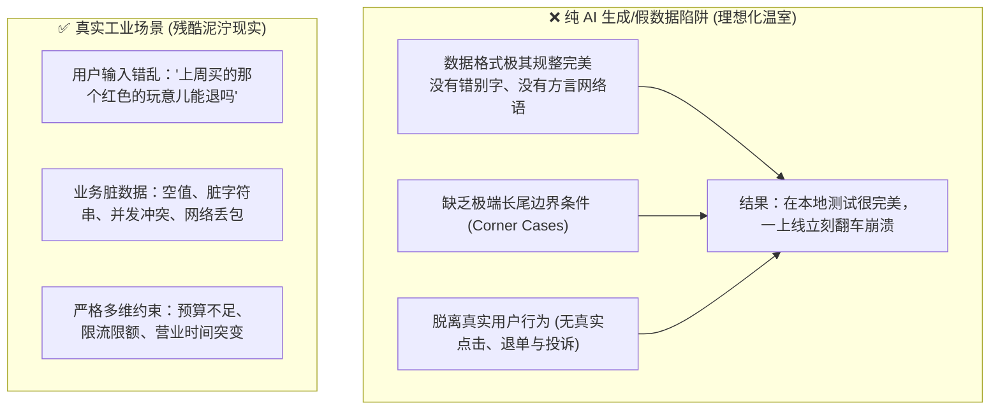
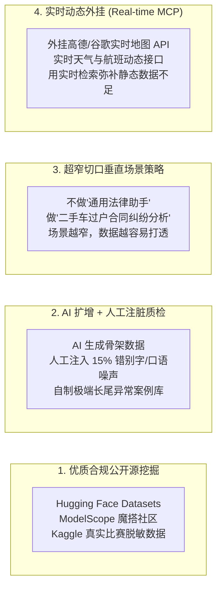
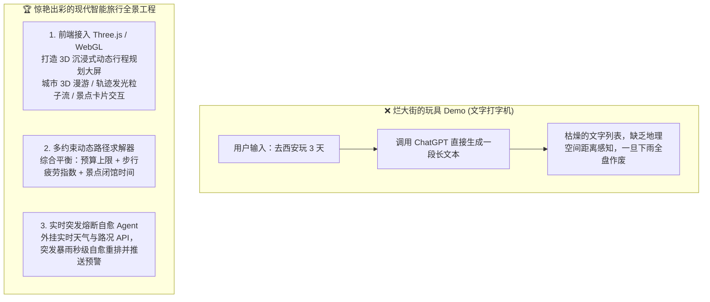
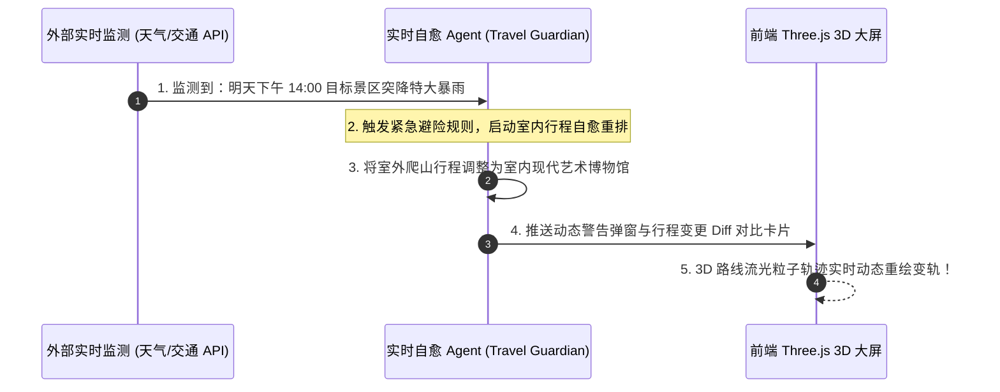

# 11.3 数据困境与业务深耕：拒绝玩具 Demo 与出彩功能设计

> 💡 **“做项目最忌讳‘为了炫技而堆砌代码’。一个真正出彩的项目，绝不在于你调了多少个大模型，而在于你是否用深刻的业务理解，精准解决了一个真实世界里的具体痛点！”**
>
> 很多同学总在苦恼：“我想不到什么颠覆世界的好 Idea。”
> 但现实是，在现代 AI 工程中，**Idea 往往是最廉价的，最昂贵、最稀缺的反而是‘真实的业务场景数据与业务闭环’**！
> 个人开发者往往拿不到企业级真实数据，如果只靠 AI 生成的纯理想化假数据，很容易做出脱离实际的“塑料玩具”。
> **本节将带你打破数据瓶颈，学会用业务深耕与差异化交互创新（如 Three.js 3D 大屏、多约束求解、突发自愈），把看似烂大街的 Demo 爆改成惊艳全场的标杆项目！**

---

## 🛑 个人开发者的隐形痛点：真实数据与反馈断层

为什么很多个人项目给人的感觉像“过家家”？根源就在于**数据的失真**：



### 痛点深度拆解：
1. **合成数据的“幸存者偏差”**：你让 ChatGPT 生成 100 条电商商品数据，它生成得条理分明；但现实中的商家录入商品时，标题经常带有一堆错别字、非法字符和混乱的规格；
2. **缺乏即时反馈回路**：大厂可以根据每天几百万真实用户的点击率来持续微调 Prompt 和模型，而个人开发者往往只能靠“自嗨式臆测”。

---

## 🛠️ 个人开发者破局真实数据的“四大实操法”

在没有大厂海量用户数据的前提下，如何获取高质量且贴近现实的数据？



### 1. 挖掘经过工业界检验的开源公开数据集
- **[Hugging Face Datasets](https://huggingface.co/datasets)**：全球最大的高质量多模态与文本数据集宝库；
- **[ModelScope 魔搭社区数据集](https://modelscope.cn/datasets)**：阿里云开源社区，包含大量本土化中文电商、政务、法律、金融等真实脱敏语料；
- **[Kaggle 数据集广场](https://www.kaggle.com/datasets)**：海量来自真实企业竞赛的高价值结构化与文本数据。

#### 🤗 聚焦：Hugging Face 平台速览——个人开发者最该用的 AI 资源库

Hugging Face 常被称为 **“AI 界的 GitHub”**，是当下全球最大的开源 AI 平台：托管了 **200 万+ 预训练模型、50 万+ 开源数据集、100 万+ 在线演示应用（Spaces）**，几乎覆盖所有 AI 方向。对个人开发者来说，它是**找数据、找模型、发作品**的一站式宝库。

**① 找数据的正确姿势（本节重点）**
- **按筛选器精确检索**：在 [Hugging Face Datasets](https://huggingface.co/datasets) 页面用左侧 Filters 按 `任务类型 / 语言 / License / 数据量` 快速缩小范围，例如先选 `语言: 中文` + `任务: 文本分类`；
- **先看 Dataset Card 再决定**：每个数据集都配有卡片，写明**用途、数据来源、以及 `License` 许可证**——**是否允许商用**在这里一目了然（呼应 01 节“训练数据许可证”那条红线），这是最容易踩雷、也最容易被忽略的一步；
- **一行代码即可加载**：配合 `datasets` 库，内存映射 + 流式读取，再大数据也不爆内存：

```python
from datasets import load_dataset
ds = load_dataset("c4", "en")   # 一键加载
print(ds["train"][0])           # 直接查看第一条样本
```

**② 顺便认识它的另外两大板块（简要）**
- **Models 模型库**：200 万+ 模型，每个都带模型卡（用途、评测、**License**）——挑模型前先看 License，Apache 2.0 随便商用、Llama 有月活门槛（呼应 01 节“模型权重许可证”）；
- **Spaces 在线演示**：用 Gradio / Streamlit 把作品做成可交互网页**免费托管**，生成一个能在线玩的链接——这正是 04 节“简历镀金”的利器。

> 💡 **国内访问提示**：huggingface.co 在国内访问不稳定，可设置环境变量 `HF_ENDPOINT=https://hf-mirror.com` 走官方镜像，或直接用阿里开源的国内版 [ModelScope 魔搭](https://modelscope.cn/)。

### 2. “AI 批量生成 + 人工注入噪声（注脏）”
- 先用大模型批量生成 500 条基础问答数据；
- **核心关键步**：人工随机抽取 100 条，人为修改成**带错别字、口癖（“嗯那个…”）、断句错误、长难句和情绪化抱怨**的真实人话；
- 只有经过“脏数据洗礼”的模型和 Prompt，才具备在工业级实战中不崩溃的抗造能力！

### 3. 极度聚焦的“场景超窄化”策略
- **不要做**：“全能医疗健康管理大师”（需要几千万专业病历数据，个人根本搞不定）；
- **转而做**：“猫咪慢性肾衰早期症状问答与处方粮对比助手”（只需收集 50 篇权威兽医论文与 20 款处方粮营养成分表即可彻底打透）。

> 🔗 **与 00 节呼应**：这里的“场景超窄化”，正是 00 节“垂直领域深耕”在数据层的落地——先选对窄垂直场景，数据才容易打透、评测才容易做准。选方向前，记得先对照 00 节的“垂直项目 × 公司匹配表”，想清楚这个窄场景未来对得上哪些公司。

---

## ⚠️ 数据获取的合规红线（个人开发者必读）

拿真实数据的路上，**合规红线往往比技术更难跨过**，尤其是面向中国市场时：

- **《个人信息保护法》（PIPL）与《数据安全法》**：手机号、身份证、用户画像等个人信息**严禁未经授权爬取与商用**；即使是公开网页，也要尊重 `robots.txt` 与网站服务条款；
- **优先走“官方授权通道”**：政府开放数据平台、企业开放 API、学术数据集（Kaggle / Hugging Face / ModelScope）通常已做脱敏与授权，是个人开发者最安全的首选；
- **脱敏是底线**：任何自建数据集上线前，都要做**去标识化处理**（姓名、电话、地址打码），并留存数据来源与授权记录；
- **做一个“一键删除用户数据”开关**：这既是合规要求，也是面试官非常喜欢的工程细节加分项。

---

## 🚫 拒绝“假大空”：严禁为了做功能而堆叠代码

很多初学者的项目代码往往充斥着这种“为了写代码而写代码”的自嗨式设计：

- ❌ **无意义的堆叠**：一个简单的计算器功能，非要让 5 个 Agent 互相开会讨论 10 轮；
- ❌ **虚假的丰富**：做了 50 个不同的 Prompt 模板，但底层本质完全一模一样，全是换皮问答。

> 🌟 **项目价值黄金法则**：
> **“每一个新增的功能，必须对应解决一个明确的用户痛点或交互障碍。如果把这个功能砍掉，用户完全无感知，那它就是无意义的代码垃圾！”**

---

## 🚀 深度实战重构案例：如何把烂大街的“智能旅行助手”做成惊艳杀手级项目？

大家在 GitHub 和各大教程里，几乎都见过“智能旅行助手”：用户输入“我想去北京玩 3 天”，AI 打印一串“Day 1 去天安门，Day 2 去故宫”的干瘪文字。

**这种项目在面试官和用户眼里就是 0 分的塑料玩具！** 我们如何结合深度业务理解，把它重构为一个具有商业级吸引力的爆款项目？



---

### 杀手级出彩功能设计拆解：

#### 1. 前端接入 Three.js / WebGL：打造 3D 沉浸式动态行程规划大屏
- **解决的真痛点**：纯文本无法让用户感知景点之间的空间距离与先后拓扑顺序；
- **出彩落地**：
  - 利用 [Three.js](https://threejs.org/) 或 [MapLibre GL JS](https://maplibre.org/) 渲染 3D 城市地形与地标建筑；
  - 动态行程规划生成后，地图上以**流光发光粒子弧线**连接各个途径点；
  - 鼠标悬浮或点击 3D 景点模型，实时弹出带有打卡攻略、实景缩略图与建议游玩时长的卡片。

#### 2. 多约束动态路径规划引擎（Multi-Constraint Solver）
- **解决的真痛点**：普通 AI 经常给出“上午在城东，下午跑城西，晚上又回城东”的反人类折返跑路线，或者给老人安排每天走 3 万步的特种兵行程；
- **出彩落地**：
  - 建立硬性约束矩阵：`单日步行上限 <= 8000 步`、`总预算 <= 3000 元`、`景点避开周一闭馆日`；
  - 结合高德地图路径规划 API 计算真实通行耗时，将不合理的路线在 Agent 内部自动重排优化后再呈现给用户；
  - **工程落地推荐**：把“约束求解”交给成熟运筹库，而不是让大模型硬算——例如使用 **Google OR-Tools**（`pip install ortools`），其 CP-SAT 求解器与车辆路径（VRP）模块可以非常优雅地建模“多约束 + 时间窗”的行程规划问题，几行代码即可得到可证明较优的路线解。



#### 3. 突发环境变化实时自愈 Agent（Real-time Self-Healing）
- **解决的真痛点**：现实出行中，暴雨、景区限流、航班延误是常态，传统计划一旦遇险全盘瘫痪；
- **出彩落地**：
  - 后台定时轮询目标地天气与路况；
  - 一旦触发极端事件，Agent **自主执行重规划（Self-Healing Loop）**，自动向前端推送优化前后的 Diff 对比卡片与语音告警。

---

## 🔗 官方权威开源库与工具直达

- **[Three.js 官方文档与官方 3D 示例库](https://threejs.org/)**：构建高审美 3D WebGL 交互的首选神器；
- **[MapLibre GL JS 开源 3D 地图渲染引擎](https://maplibre.org/)**：高性能矢量与三维地形地图库；
- **[Hugging Face Datasets 全球数据集平台](https://huggingface.co/datasets)**；
- **[ModelScope 魔搭社区精选数据集](https://modelscope.cn/datasets)**；
- **[Google OR-Tools 运筹优化库（约束求解 / 路径规划）](https://github.com/google/or-tools)**。

---

## 📌 本节速记卡

- **个人项目最大的坑**：真实业务数据与反馈断层 → 只靠 AI 假数据 = 理想化温室，一上线就翻车；
- **破局 4 招**：公开源挖掘 / AI 生成 + 人工注脏 / 场景超窄化 / 实时 MCP 外挂；
- **合规底线**：PIPL / 数据安全法，脱敏 + 一键删除用户数据，先授权再取数；
- **功能黄金法则**：砍掉它用户毫无感知 = 无意义的代码垃圾；
- **出彩公式**：3D 沉浸大屏 + 多约束求解器 + 实时自愈 Agent = 把烂大街 Demo 爆改成杀手级项目；
- **回看 00 节**：窄垂直场景选得好，这一节的数据与评测才做得扎实。
