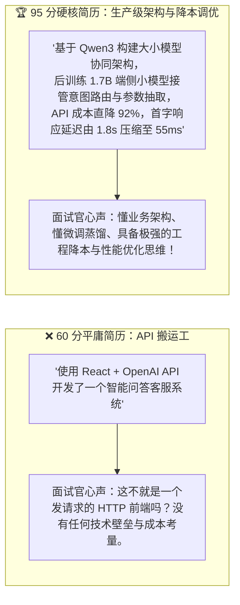
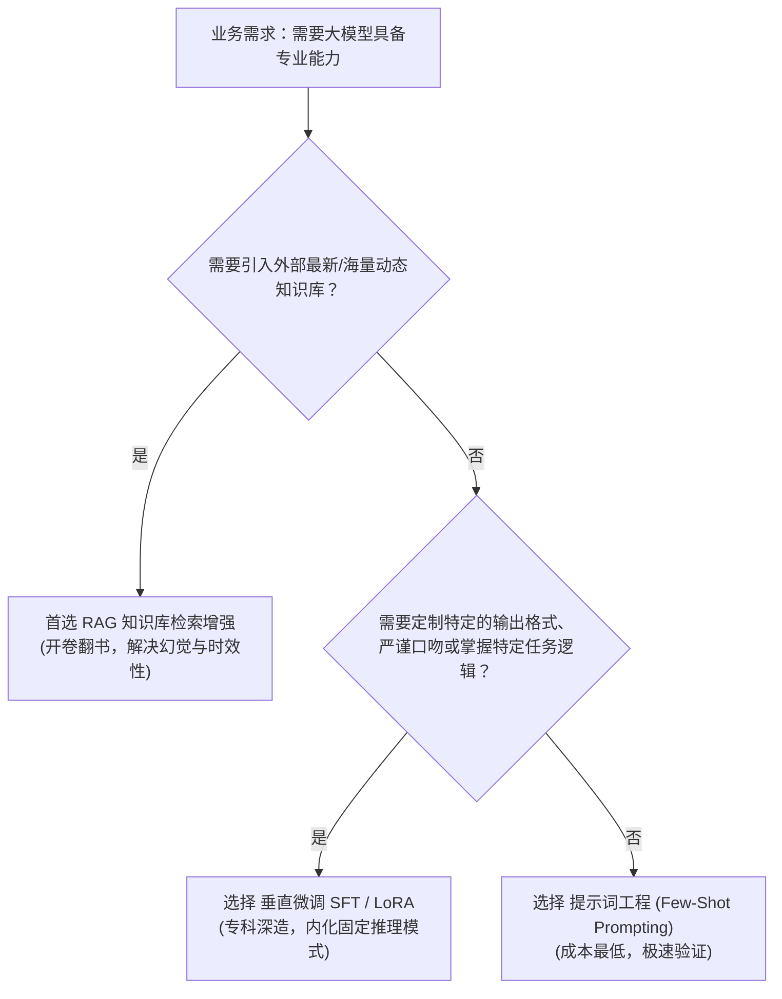
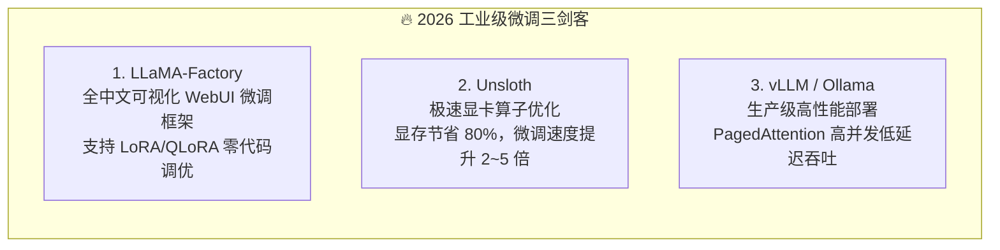
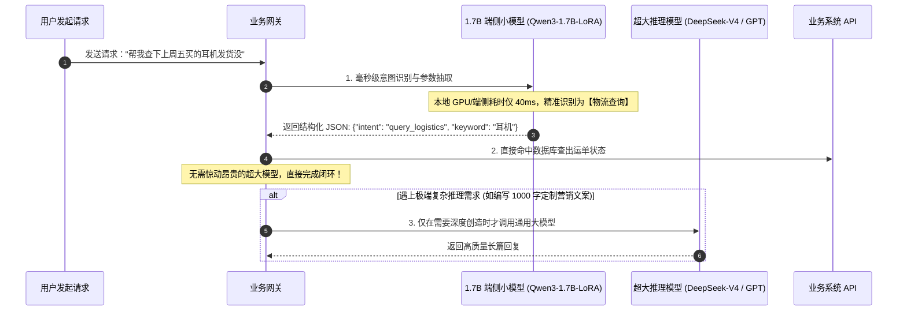
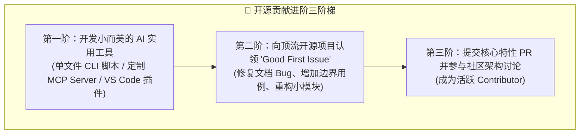
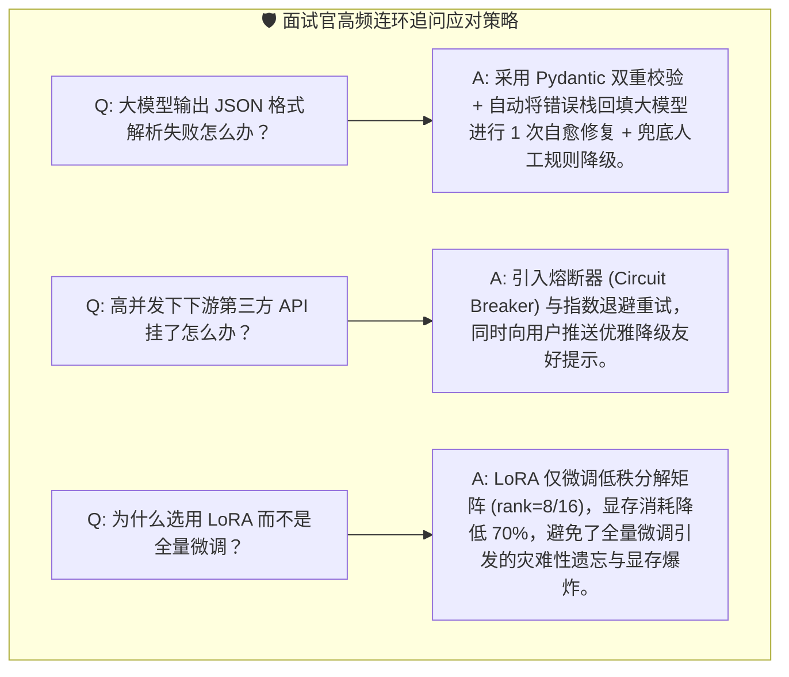

# 11.4 求职与能力进阶：垂直微调、小模型降本与开源贡献

> 💡 **“在面试官眼里，调用成熟 API 包装一个聊天界面的项目只能给 60 分；但如果你能讲清楚‘如何通过微调 1.7B 端侧小模型将系统成本砍掉 90%、如何保证极端异常下的高可用，并且给知名开源项目提过 PR’，你的简历就直接进入了 95 分的精英梯队！”**
>
> 针对应届生、转行开发者与个人独立开发者，求职或做产品的本质是一场“技术壁垒与工程深度”的展示。
> 本节将深入讲解垂直领域微调（SFT / LoRA）、后训练轻量小模型（SLM）端到端极致降本、开源 PR 贡献全流程，以及如何运用 STAR 法则将项目打造成面试杀手锏！

***

## 🧐 为什么“API 搬运工”项目在面试中不再吃香？

随着各种低代码平台和 Cursor/Trae 等 AI 工具的普及，写一个调用大模型 API 的 Web 界面已经没有任何门槛。面试官真正看重的是**工业级工程考量**：



***

## 🎯 垂直领域大模型微调（SFT / LoRA）：选型决策与低门槛实战

### 1. 微调选型决策树：Prompt vs RAG vs 微调（SFT）



- **RAG 负责“记忆事实”**：比如公司的员工手册、实时商品库存（开卷翻书）；
- **微调负责“学习模式与习惯”**：比如将长文本精确抽取出特定嵌套 JSON、学习特定行业的专业对话语气、掌握复杂的业务意图分流规则。

***

### 2. 生产级低成本微调工具链

无需耗费几十万买专业算力集群，利用单张消费级显卡（如 RTX 3090/4090）即可轻松完成轻量微调：



- **[LLaMA-Factory (GitHub 官方)](https://github.com/hiyouga/LLaMA-Factory)**：全栈大模型微调工具，支持主流开源模型（Qwen、Llama、DeepSeek、ChatGLM 等），提供开箱即用的数据转换与评估面板；
- **[Unsloth (GitHub 官方)](https://github.com/unslothai/unsloth)**：通过定制手写 Triton 算子，在不损失精度的前提下实现极低显存占用；
- **[vLLM (官方推理引擎)](https://github.com/vllm-project/vllm)**：企业级大模型高并发服务首选，支持连续批处理（Continuous Batching）与 PagedAttention。

***

## 💰 后训练轻量小模型（SLM）替代方案：端到端“极致降本与极低延迟”

在真实的商业项目或高并发系统中，**用云端旗舰大模型（如 GPT / DeepSeek-V4-Pro）去处理简单的“意图分流”或“文本抽取”是极其奢侈且缓慢的（大炮打蚊子）**。

以 **Qwen3 系列**为例，端侧小模型早已不是“傻白甜”：`Qwen3-0.6B / 1.7B / 4B / 8B` 全部内置 **`/think`（思考模式）与** **`/no_think`（非思考模式）双模切换**——简单意图分流走非思考模式毫秒级返回，复杂推理才临时开启思考模式，既快又准，且全部采用 **Apache 2.0** 协议可放心商用。

### 1. 大小模型协同分工架构（MoE-style Pipeline）



### 2. 降本与性能实测数据对照

| 指标维度              | 云端旗舰大模型（GPT / DeepSeek-V4-Pro） | 后训练端侧小模型（Qwen3-1.7B / 4B） | 优化幅度 / 商业收益      |
| :---------------- | :----------------------------- | :------------------------ | :--------------- |
| **每百万 Token 费用**  | 约 $0.5 \~ $4（随模型与峰谷时段波动）       | **$0.00**（本地/私有单卡常驻托管）    | **降本 95% 以上**    |
| **首字响应延时 (TTFT)** | 1200ms \~ 2500ms               | **35ms \~ 60ms**          | **响应提速 30 倍！**   |
| **部署要求**          | 依赖外部网络、额度与限流                   | 单张普通消费级显卡或轻量云主机           | **数据 100% 隐私合规** |
| **意图分类准确率**       | 98.2%                          | 98.5%（垂直领域精调后格式极度严格）      | **零格式偏离风险**      |

> 📌 **2026 定价变化提醒**：国内主流大模型已普遍采用**峰谷定价**（如 DeepSeek-V4 高峰时段价格为闲时的 2 倍）。批量任务尽量安排在**闲时**，并善用**缓存命中**与 **V4-Flash 轻量档**，可在云端成本上再省一半。

***

## 🌟 个人开源影响力与简历镀金

除了打磨项目本身，积极参与开源社区是证明你具备“团队协作能力、代码品味与自驱力”的最佳名片！



### 向顶流开源项目提 PR 的标准 SOP：

1. **寻找切入点**：在知名仓库（如 [LangChain](https://github.com/langchain-ai/langchain)、[Dify](https://github.com/langgenius/dify)、[Ollama](https://github.com/ollama/ollama)）的 Issues 页面筛选标签：`good first issue` 或 `help wanted`；
2. **规范复现与讨论**：在 Issue 下留言声明认领（如 *"I'd like to work on this issue, please assign it to me."*）；
3. **提交规范**：
   - 保持代码风格符合官方配置（运行 `ruff`、`black` 或 `eslint`）；
   - 补齐对应的**自动化单元测试（Unit Tests）**；
   - 提交原子化 Commit（如 `fix(router): resolve empty intent edge case in multi-turn conversation`）。

***

## 📝 简历撰写 STAR 黄金法则与面试官高频连环追问

### 1. 项目描述 STAR 模板

```markdown
- **项目背景 (Situation)**：针对传统电商客服响应慢、人工审核成本高及通用大模型 API 成本高昂痛点；
- **核心任务 (Task)**：主导设计高可用智能客服与导购 Agent 系统，解决意图分类准确率、数据一致性与端到端运行成本；
- **技术行动 (Action)**：
  1. 基于 FastAPI 与 Redis 搭建流式 SSE 与分布式会话状态机，设计 Function Calling 敏感操作双重确认机制；
  2. 使用 LLaMA-Factory 在消费级单卡上完成 Qwen3-1.7B 意图识别小模型的 LoRA 微调与量化部署；
  3. 针对长尾脏数据构建 2000+ 条含口语方言与错别字的评测集，引入结构化 JSON 校验降级重试；
- **量化结果 (Result)**：系统单次交互成本降低 92%，端到端响应首字延迟降低至 50ms 内，意图分类准确率达到 98.6%，相关成果与工具已开源并在 GitHub 斩获 200+ Stars。
```

> 🎯 **投递前先对表（呼应 00 节）**：简历 STAR 写得再漂亮，投错了方向也是白搭。投递前先用 00 节的“垂直项目 × 公司匹配表”自检：你的项目跟目标公司业务**像不像**？匹配，就重点讲行业理解与业务指标；不匹配，就别硬投，或者提前把项目往对方业务方向做“微调适配”。方向匹配的垂直项目，哪怕只是 Demo，也比方向不相关的“生产级通用系统”更容易过初筛。

***

### 2. 面试官高频技术追问防身术



***

## 🔗 官方权威框架与开源仓库

- **[LLaMA-Factory 官方代码库](https://github.com/hiyouga/LLaMA-Factory)**；
- **[Unsloth AI 极速微调框架](https://github.com/unslothai/unsloth)**；
- **[vLLM 官方高性能推理引擎](https://github.com/vllm-project/vllm)**；
- **[Qwen3 官方开源模型全家桶 (阿里通义千问)](https://github.com/QwenLM/Qwen3)**；
- **[DeepSeek 官方模型与定价页](https://api-docs.deepseek.com/zh-cn/)**；
- **[Ollama 本地大模型生态](https://ollama.com/)**。

---

## 📌 本节速记卡

- **别做“API 搬运工”**：调用大模型包个聊天框 = 60 分；讲清架构、降本、异常与开源贡献 = 95 分；
- **能力选型**：动态知识 → RAG；固定输出格式 / 语气 / 任务 → SFT（LoRA / QLoRA）；否则先试 Prompt；
- **降本三板斧**：大小模型协同分流 / 端侧小模型常驻 / 峰谷定价 + 结果缓存；
- **开源镀金**：Good First Issue → 规范 PR（跑 lint + 补单测 + 原子 Commit）；
- **简历 STAR**：Situation / Task / Action / **Result（务必数字化！）**；
- **回看 00 节**：投递前先对“垂直项目 × 公司匹配表”，在 STAR 里强调与目标公司的业务匹配度。

