# 12.5 如何让自己不可替代：AI 替代不掉的是什么

> 💡 **"AI 时代不是传统开发死了，而是'不需要理解也能干活'的幻觉死了。写代码这件事正在变成水电煤——拧开就有；但判断往哪儿写、怎么扛住线上、出了事谁负责，从来都买不到。抓风口赚的是浪花的钱，修内功攒的是大海的深度。"**
>
> 本节是全章的收束与升华：聊清楚 AI 时代职业焦虑的真实来源、AI 的真实能力边界，以及一份可以立刻上手的"内功修炼清单"。

***

## 🧊 淘汰的不是程序员，而是"只会把活儿丢给 AI 的人"

先泼一盆冷水，再给一颗定心丸。

**冷水**：AI 时代确实有程序员在掉队——但被替代的从来不是"程序员"这个职业，而是一种工作方式：只会写 CRUD，需求不消化就原样丢给 AI，测试靠"它自己说没问题"，Code Review 一律点"继续"，上线效果不闻不问。这类人把**判断力也外包了**，只剩下替 AI 点头的双手——业界戏称 **"Yes & Continue 工程师"**。

**定心丸**：传统开发没有死，死的是"不理解也能交差"的生存空间。AI 能替代的地方确实变多了，但多出来的都是**可描述、可验证的执行层**；判断层的工作反而更值钱了——挖掘机再强，也得有人决定往哪儿挖、挖多深、挖出水了算数。

<!-- 图表源文件：img/diagrams/05-diagram-01.mmd；视觉风格：Latte 彩色（色值见源文件 %% colors 指令） -->

  

同一个 AI，两种用法，结局天差地别：

| 环节 | "Yes & Continue" 用法 | 掌控者的用法 |
| :--- | :--- | :--- |
| 接需求 | 原样转发给 AI，能跑就行 | 先问为什么做、做到什么程度算好 |
| 写代码 | 全部 AI 生成，不读不审 | AI 起草，人逐段审：边界条件、并发、安全 |
| 测试 | "它自己说测过了" | 补齐异常与边界用例，看数据不看口头保证 |
| 上线 | 出了事故先怪 AI | 容量、回滚、监控在上线前就设计好 |
| 成长 | 工龄在涨，判断力原地踏步 | 每个项目沉淀架构经验与踩坑教训 |

> 📌 **一句话**：AI 把"写代码"变成了水电煤，把"判断力"变成了稀缺品。前者随便买，后者有钱也买不到。

***

## 🐢 快时代更要慢思考：两三个月能学会的，凭什么不被替代

技术更替越来越快，招聘节奏越来越快，但我们的建议恰恰相反：**慢下来**。

判断一项技能护城河深度的标准很朴素：**如果你的技能两三个月就能学到"够就业"，那它同样只要两三个月就能被别人学会**——无论是 AI，还是从其他行业转进来的人。谁都能几个月到半年入行的地方，就没有护城河可言。

真正的护城河从来不是抓风口。抓风口当然能赚一笔——台风来了猪都能飞，但风停之后，天上还剩几头猪？最后能留下来的，永远是那些不管什么天气都在练肌肉的人。而内功的特点恰恰是**慢**：它没法速成，也因此没法被速成者替代。

<!-- 图表源文件：img/diagrams/05-diagram-02.mmd；视觉风格：Latte 彩色（色值见源文件 %% colors 指令） -->

  

| 对比维度 | 抓风口派 | 修内功派 |
| :--- | :--- | :--- |
| 起步速度 | 快，蹭着热点三个月入场 | 慢，前期像在打地基 |
| 收益曲线 | 尖峰状：来得猛，退得也快 | 缓坡状：一直在涨，复利积累 |
| 技术退潮时 | 技能与平台一同贬值 | 换个框架也只是"换层皮" |
| 被 AI 替代的风险 | 高（速成技能 = 可复制技能） | 低（判断力与经验难以言传） |
| 三年后的状态 | 重新归零，寻找下一个风口 | 能带团队、能扛架构、能拍板 |

***

## 🧱 AI 的能力边界：写得出 100 行，扛不动 100 万行

给 AI 一个明确的任务——增删一个模块、加一个功能、写一个 MVP——它快得惊人。但把它放进真实的工程语境，边界立刻显形：

<!-- 图表源文件：img/diagrams/05-diagram-03.mmd；视觉风格：Latte 彩色（色值见源文件 %% colors 指令） -->

  

| AI 现在很擅长 | AI 现在扛不动 |
| :--- | :--- |
| 增删模块、修一个描述明确的 Bug | 在百万行代码里做架构演进（牵一发动全身的隐性依赖） |
| 写新功能、搭脚手架、生成样板代码 | 扛线上事故：凌晨定位内存泄漏、做回滚决策 |
| 产出能演示的 MVP 原型 | 从 0 定义一个市面上没有的项目原型（先回答"它该不该存在"） |
| 把 A 方案翻译成 B 方案 | 为技术选型签字负责：做最后一责任人 |

**为什么维护百万行代码的项目这么难？** 因为它的难点根本不是"写"，而是"记住与权衡"：两年前的历史包袱、谁都不敢轻易动的核心模块、只在深夜出现的偶发 Bug、文档里永远查不到的隐性约定——这些**没法用一段 Prompt 描述清楚**，只能靠人在长期维护中一点点积累手感。AI 可以帮你写一个新模块，但"这个改动会不会弄坏三年前的老功能"，只有守过这个系统的人心里有数。

**更值得警惕的是"拒绝思考"的滑坡**：每次遇到分歧就"听 AI 的"，每次 unsure 就"继续"，本质上是把职业成长的练习题全部跳过。而高级工程师的溢价，恰恰藏在这些被跳过的练习里——拍板、取舍、兜底。不断拒绝思考的代价只有一个：**迟迟无法突破高级工程师**。工具越强，"会思考的人"和"会点头的人"的差距反而越大。

***

## 🏋️ 内功修炼清单：把 Web 基本功重新捡起来

去除市面上各种营销 Agent 的喧哗，我们还能做什么？答案朴素得有点无聊：**修炼内功——把 Java Web 或 Python Web 的基本功重新捡起来**。

注意，这不是让你回归古法编程、手写 XML 配置缅怀青春，而是补上被 AI "跳过"的地基：**框架每年换皮，地基十年不变**。有了地基，AI 才从"替你做决定的人"变回"听你指挥的施工队"。

<!-- 图表源文件：img/diagrams/05-diagram-04.mmd；视觉风格：Latte 彩色（色值见源文件 %% colors 指令） -->

  

用三道自测题检验内功成色（答不上来，就说明还欠火候）：

| 自测题 | 考的是什么 | 不过关的典型信号 |
| :--- | :--- | :--- |
| 给你一个熟悉的开源项目，能否**指挥 AI 用另一种语言实现其核心模块**？ | 是否真的理解了设计，而不只是记住了语法 | 只会喊"帮我翻译成 Go"，说不出它为什么这么分层 |
| 一个业务需求来了，能否讲清**架构选项与取舍**（单体 / 模块化 / 微服务）？ | 架构决策有没有自己的判断依据 | 只有一个选项："听 AI 的" |
| **服务器压力、数据库压力**有没有算过账（QPS 估算、索引与慢查询、连接池、缓存）？ | 容量思维：上线前把账算清 | 上线靠祈祷，扩容靠重启 |

> 📌 **一个低成本的练法**：挑一个你读过源码的开源项目（比如第 8 章手搓的 Mini-Agent），让 AI 用另一门语言重写核心模块，然后**逐行审它的方案**——哪里翻译得好、哪里丢掉了原设计的意图、为什么。练上三轮，你对"架构"的理解会超过读十篇教程。

***

## 🧭 收个尾：Agent 最终服务于业务

把这一节放回全章的坐标系里：12.0 讲了什么才算生产级，12.1 教你借力开源，12.2 教你改造传统业务，12.3 教你破数据困境，12.4 教你把项目讲成价值——而 12.5 想说的是这一切的底层逻辑：

**Agent 不是目的，业务才是。** 模型会换代、框架会更名、风口会轮转，唯一不变的是：有人提出对的问题、有人做出靠谱的取舍、有人对最终结果负责。这三个"有人"，就是你穿越周期的位置。

***

## 官方权威资源

- **[Spring Boot 官方文档](https://spring.io/projects/spring-boot)**（Java Web 基本功首选）；
- **[Django 官方文档](https://www.djangoproject.com/)** / **[FastAPI 官方文档](https://fastapi.tiangolo.com/)**（Python Web 基本功两件套）；
- **[PostgreSQL 官方文档](https://www.postgresql.org/docs/)**（索引、事务、连接与容量调优的一手资料）；
- **[Designing Data-Intensive Applications（DDIA）](https://www.oreilly.com/library/view/designing-data-intensive-applications/9781491903063/)**（数据系统设计的内功心法，经得起十年重读）。

***

## 本节速记卡

- **淘汰的不是程序员**：是"只会在 AI 上写 CRUD + 全程 Yes & Continue"的工作方式；
- **可替代性自测**：两三个月能速成到就业水平的技能，同样两三个月就能被别人（或 AI）追平——护城河 = 积累深度 × 不可描述度；
- **AI 边界**：能增删模块 / 加功能 / 写 MVP；扛不动百万行项目的维护，也从 0 发明不出市面上没有的原型；
- **拒绝思考的代价**：所有"听 AI 的、继续"都在跳过晋升高级工程师的必做练习题；
- **内功三件套**：Web 基本功（手写核心链路）+ 架构与容量思维（选型讲取舍、压力算得清）+ 业务对齐（Agent 服务业务）；
- **修炼检验**：能指挥 AI 跨语言复刻开源核心模块、能讲清架构取舍与服务器 / 数据库压力，才算出师。
