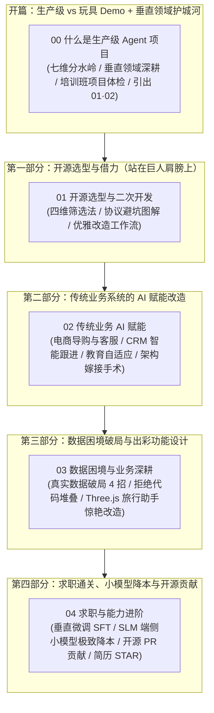

# 📖 第十二章：如何做一个自己的项目 —— 个人开发者与应届生 AI 落地通关全指南

欢迎来到 **《Vibe Coding 极速通关》第十二章：如何做一个自己的项目**！

在前面的章节中，我们已经掌握了从基础概念、开发脚手架、Dify 工作流，到 OpenCode / Trae 实战以及手搓 Agent、LangChain、LangGraph 和现代 RAG 知识库检索的完整技术栈。

然而，当很多同学跃跃欲试准备做自己的项目、甚至准备拿项目去求职面试时，往往会陷入以下四大迷茫与误区：

1. **盲目从零造轮子**：不知道如何借助 GitHub 海量优质开源项目快速启动，甚至踩中了 GPL/AGPL 开源协议的商用与源码连坐红线；
2. **以为 AI 必须颠覆一切**：忽视了传统 Web/小程序/企业管理系统的业务价值，不知道如何给传统系统做轻量而优雅的 AI 赋能改造；
3. **陷入真实数据与玩具 Demo 困境**：以为做项目最缺的是点子，殊不知个人开发者最缺的是**真实的业务场景数据与业务闭环**，最终做出一堆无脑堆叠代码、一问一答式的塑料 Demo；
4. **求职简历缺乏硬核技术壁垒**：千篇一律地写着“调用 OpenAI/DeepSeek API 实现了聊天机器人”，无法体现工程思维、架构深度、成本意识（垂直微调、小模型端侧降本、开源 PR 贡献）。

本章正是为了彻底解决这些痛点而生！我们将以**极度接地气的大白话、工业级架构视野、生动生活化比喻与真实案例**，手把手带你破除思维盲区，打造出真正能跑通商业闭环、惊艳面试官的优秀 AI 项目！

---

## 🧭 第十二章全景知识图谱

---

## 📑 章节目录导航

点击下方链接逐一阅读各小节的深度精讲、避坑法则与权威官方资源：

0. **[12.0 什么是生产级 Agent 项目：Demo 与生产级的分水岭](./00_什么是生产级Agent项目.md)**
   - **核心内容**：生产级 Agent 项目“七维分水岭”判定框架；Demo 与生产级的逐维对照；用标尺“体检”培训班典型结业项目；**别盲目追“生产级”——垂直领域深耕才是个人开发的护城河**（含垂直项目 × 公司匹配表与 Demo 针对性迭代路径）；为何必须先掌握 01 开源底座与 02 业务闭环。

1. **[12.1 开源选型与二次开发：协议避坑与架构借力](./01_开源选型与二次开发.md)**
   - **核心内容**：毛坯房精装修理念；GitHub 项目“四维黄金筛选法”；MIT / Apache 2.0 / BSD / GPL / AGPL / SSPL 协议深度剖析与商用红线；Fork 与 Upstream 同步；非侵入式插件化二次开发工程范式。

2. **[12.2 传统业务 AI 赋能：从普通 Web / 小程序到智能体系统](./02_传统业务AI赋能.md)**
   - **核心内容**：为什么传统系统是 AI 最坚实的着陆场；四大高频改造场景（电商商城、企业 CRM/OA、在线教育、本地生活）；系统级嫁接架构（SSE 流式混排、Redis 状态锁、Function Calling 业务 API 闭环与敏感操作双重确认）。

3. **[12.3 数据困境与业务深耕：拒绝玩具 Demo 与出彩功能设计](./03_数据困境与业务深耕.md)**
   - **核心内容**：个人开发者最大的痛点——真实业务数据与反馈缺失；AI 合成数据偏离现实与脏数据缺失的致命伤；4 大破局方案；**Hugging Face 平台速览**（AI 界 GitHub：找数据/看 License/免费托管 Spaces）；拒绝无脑堆叠代码；**案例重构**：如何把烂大街的“智能旅行助手”结合 **Three.js 3D 大屏规划、多约束冲突求解与突发天气实时自愈 Agent** 打造为杀手级项目！

4. **[12.4 求职与能力进阶：垂直微调、小模型降本与开源贡献](./04_求职与能力进阶.md)**
   - **核心内容**：应届生与个人开发者求职突围核心逻辑；垂直微调（SFT / LoRA / QLoRA）选型决策与低门槛工具链；后训练轻量小模型（SLM 如 Qwen3-1.7B/4B 端侧模型）替代昂贵通用大模型实现 90%+ 极致降本与毫秒级延迟；向开源顶流项目提 PR 贡献全流程；简历 STAR 法则与技术深度追问防身指南。

---

> 💡 **学习建议**：
> 无论你是想做一个能带来商业收益的独立独立产品（Indie Hacker），还是想在秋招/社招中斩获高薪 Offer，请务必以**解决真实世界问题、权衡工程成本与架构健壮性**为指引。AI 时代不是比谁写代码速度快，而是比谁更能洞察业务本质与工程杠杆！
