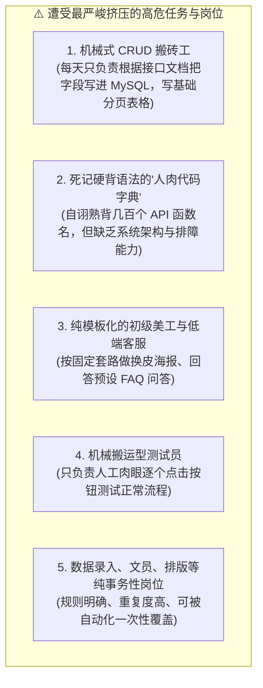
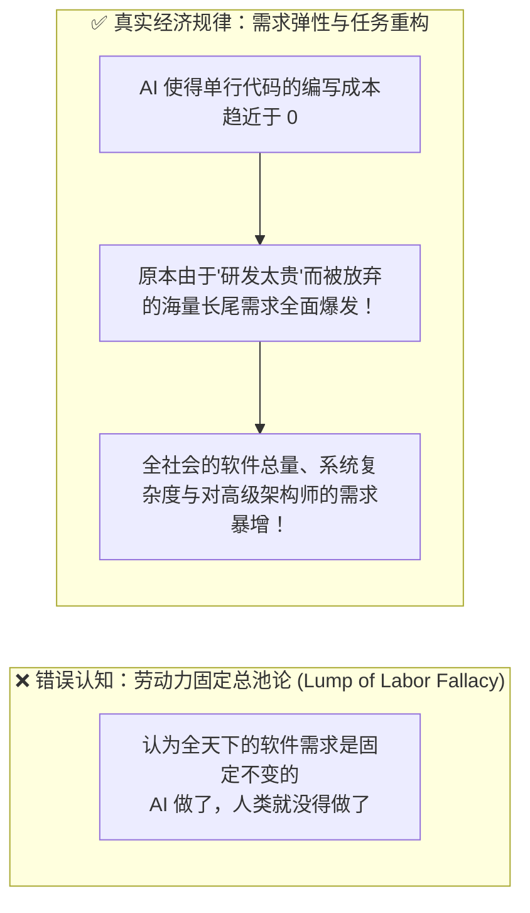
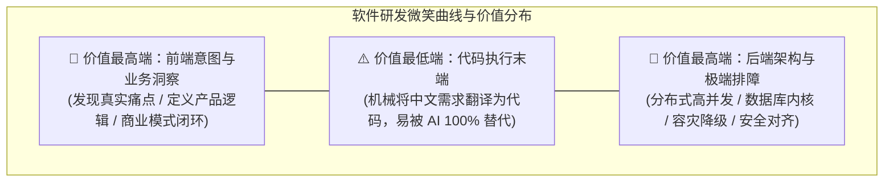

# 12.2 结构性阵痛与传统岗位洗牌：哪些人在承压？谁在被时代倒逼？

> 💡 **“回避矛盾从来不能解决问题。正视真实的冲击，才是在时代巨浪中看清方向的第一步。”**
>
> 谈论 AI，我们不能只沉浸在生产力暴增的欢呼中，更必须清醒、严肃地审视它对传统职场与就业市场带来的**结构性震荡与阵痛**。
> 为什么初级开发岗位的招聘门槛越来越高？为什么单纯死记硬背语法的“代码搬运工”越来越难找工作？
> 本节将用**权威机构的真实数据**回答这个问题，并揭示这场洗牌背后最容易被误解的一个事实：**“岗位暴露于 AI” ≠ “岗位被 AI 消灭”。**

---

## 🌪️ 正视现实：哪些岗位正面临实质性的挤压？

在 AI 智能体成熟的今天，如果你的核心竞争力仅仅是**“把别人的需求机械地翻译成代码”**，那么这种岗位正在以肉眼可见的速度被压缩：

### 为什么大厂对“纯初级实习生”的需求在放缓？
- **过去**：一个 10 年经验的技术架构师，需要带领 3 个初级程序员帮他写基础的 DTO 类、配置路由、写单元测试样板代码；
- **现在**：同一个架构师配合 Cursor、Trae、Claude Code 或自主 Agent，可以在 1 个小时内自动生成并自愈测试完原本 3 个人写一天的基础代码；
- **结果**：企业不再愿意为“纯粹敲击键盘的体力劳动”买单，**初级岗位的考核标准被直接拉升到了“过去准中级工程师”的综合水平**！

> 📊 **中国招聘市场的真实印证**（脉脉高聘《2025 年度人才迁徙报告》）：
> - 2025 年 1–10 月，面向“1 年以内工作经验”的新发岗位量同比下降 **40%**——最被 AI 挤压的，恰恰是“只能写基础代码”的新人层；
> - 新经济行业整体人才供需比升至 **2.23**（平均 2.23 人抢 1 个岗位），求职压力创近三年新高；
> - 同时，AI 相关岗位同比暴增 **543%**、算法工程师招聘需求 **+80%**、AI 产品经理 **+178%**。

---

## 📊 权威数据盘点：AI 对就业的真实影响有多大？

网络上“AI 明天消灭 90% 岗位”与“AI 根本不会减少岗位”两种极端说法同时存在。我们只看**主流权威机构的研究口径**：

| 机构 / 报告 | 核心结论 |
| --- | --- |
| 世界经济论坛《未来就业报告 2025》 | 2025–2030 年全球将**新创造 1.7 亿**岗位、**消失 9200 万**岗位，净增 **7800 万**；AI 与信息处理技术单独创造 1100 万、替代 900 万 |
| 高盛《生成式 AI 对就业的影响》 | 全球约 **3 亿**个岗位“暴露”于生成式 AI（约占 18%），但最终被完全替代的劳动力仅约 **6–7%**（美国约 1100 万人） |
| 麦肯锡全球研究院 | 到 2030 年中国约 **2.2 亿**个岗位将被 AI 重塑、约 **50% 工时**实现自动化——但“重塑”不等于“消失”，而是技能升级 |
| 花旗银行《AI 与就业报告》 | 中国 **7030 万**岗位（9.6%）面临直接替代风险，另有 **1.57 亿**岗位（21.4%）面临结构性收缩 |
| 麦肯锡（AI 人才） | 到 2030 年中国 AI 专业人才需求达 **600 万**，现有供给约 200 万，**净缺口 400 万** |

### 最被误解的三个数字概念
1. **“暴露（Exposed）” ≠ “被替代（Replaced）”**：一个会计岗位可能 60% 的任务能被 AI 做，但该岗位并不会因此消失——它更可能变成“会用 AI 的会计”，效率更高、要求更高；
2. **“替代”与“创造”不是同一批人**：消失的是事务性岗位，长出的是 AI 工程师、算法工程师、数据科学家——**它们需要完全不同的技能栈**；
3. **影响有先后、有地域、有代际**：历史证明，转型阵痛往往持续 **10–30 年**，且高度集中于特定行业与地区（如“锈带”），绝不可能“无缝切换”。

### 中国就业市场的“结构性矛盾”一目了然
- **供给端“过剩”**：每年计算机类本科毕业生超 **百万**（2025 年约 92 万人），叠加低代码/AI 工具普及，纯初级开发者供给过剩——初级开发者约占全部开发者的 50%–60%（约 460 万–560 万），但多数只能完成重复性 CRUD；
- **需求端“缺口”**：能独立设计高并发系统的高级工程师缺口超 **30%**；工信部测算，具备“云原生 + AI 编码协同”能力的复合型人才严重不足；
- **结果**：学历在贬值，但“项目经验 + 业务理解 + 系统能力”在升值。普华永道调查显示，**77% 的中国企业选择“技能提升 + 内部调岗”而非裁员**——中国的转型更偏“稳岗赋能”。这既是国情，也是个人顺势而为的窗口：**与其等岗位被 AI 替换，不如主动让 AI 把自己升级。**

---

## 📊 经济学透视：结构性阵痛（Structural Shift） vs 总体性毁灭（Total Destruction）

很多恐慌论者断言：“AI 将让所有程序员失业，人类软件工程即将终结。”
这在经济学与技术历史上是完全站不住脚的伪命题。

### 任务（Tasks）与岗位（Jobs）的本质区别：
1. **岗位由数十个任务构成**：一个“软件工程师”的日常任务包括：理解用户业务、权衡架构取舍、编写代码、测试排错、部署运维、安全合规、跨部门沟通；
2. **AI 吞噬的是“规则明确的机械任务”**：写样板代码被自动化了，但“定义正确的问题”、“权衡系统一致性与高并发”、“保护用户隐私”等高阶决策任务不仅没有减少，反而变得前所未有的关键！

### 用数据检验“恐慌论”的破产
- 曾有两份著名的“末日预测”后来被现实**证伪**：
  - 牛津大学 Frey & Osborne 2013 年预测 **47%** 美国岗位面临高度自动化风险——至今未发生；
  - 麦肯锡 2017 年预测全球 **4–8 亿**人将因自动化失业——同样未兑现。
- 反面证据：**ATM 普及后，美国银行柜员总数在 2007 年前反而上升**；**互联网消灭了旅行中介的标准化环节，但全球软件开发者数量在过去 20 年翻了数倍**。

---

## 🎯 为什么只做“代码执行末端”最危险？

在现代软件工程流水线中，价值分布呈现出典型的**“微笑曲线”**：

### “代码打字机”的致命软肋：
- **不关心“为什么”**：产品经理给什么需求就写什么，从不思考这个功能用户究竟用不用得上；
- **不关心“上下游”**：不关心数据库索引是否合理，不关心网络超时如何优雅降级，只管在本地跑通；
- **缺乏系统大局观**：一旦线上发生分布式死锁或内存泄漏，完全不知从何下手排查。

> ⚠️ **警示录**：
> **如果你的日常工作只是充当“需求到代码的传话筒”，那么 AI 必然比你更快、更便宜、且不需要休息！**
> 走出危机的唯一解法，就是主动打破边界：要么向上跃迁为**“懂业务、懂产品灵魂的意图架构师”**，要么向下扎根为**“精通底层原理与复杂系统设计的技术硬核舵手”**！

---

## 🗺️ 危机也是分层的：三种人的三种命运

同样的浪潮，对不同人是完全不同的故事。请对号入座，理性规划：

| 人群画像 | 面临处境 | 破局路径 |
| --- | --- | --- |
| 只会“写代码执行命令”的纯初级搬砖工 | 挤压最剧烈（新发初级岗位同比 -40%） | 向上补“业务洞察/架构能力”，向下补“底层原理”，用 AI 把自己升级成中级工程师能力 |
| 精通架构、排障、性能调优的资深工程师 | 反而更吃香（高性能计算工程师 3 岗抢 1 人） | 把 AI 当超级实习生，专注高价值判断与兜底 |
| 非技术岗位（会计、行政、文员、初级美工） | 结构性收缩，但岗位内容升级 | 转型“业务 + AI 工具”复合型人才，如 AI 产品经理（需求 +178%） |

> 💡 **记住一个残酷而公平的真相**：AI 淘汰的不是“人”，而是“只会重复旧动作的人”。**它同时也在用远超旧时代的速度，批量制造“会驾驭新工具的人”的需求。**

> 🧩 **打个中国味的比方**：上一代人讲究“铁饭碗”，端上一个岗位就能吃一辈子；AI 时代“铁饭碗”正在变成“泥饭碗”——岗位本身不再坚固，真正坚固的是你的“金手艺”。就像老话说的“荒年饿不死手艺人”，在 AI 浪潮里，**“手艺”的定义被彻底升级了：不再是某个具体动作，而是底层原理 + 快速学习 + 独立判断力。**

---

## 🔗 经济学权威研究与经典定律

- **[世界经济论坛《未来就业报告 2025》（1.7 亿 / 9200 万 / 净增 7800 万）](https://cn.weforum.org/publications/the-future-of-jobs-report-2025/in-full/2-jobs-outlook/)**；
- **[高盛研究：生成式 AI 或将取代 3 亿个全职岗位（但仅 6–7% 被完全替代）](https://www.goldmansachs.com/insights/articles/AI-and-the-future-of-work)**；
- **[麦肯锡：Jobs lost, jobs gained（自动化对岗位的真实影响）](https://www.mckinsey.com/featured-insights/future-of-work/jobs-lost-jobs-gained-what-the-future-of-work-will-mean-for-jobs-skills-and-wages)**；
- **[脉脉高聘《2025 年度人才迁徙报告》（初级岗位 -40% / 供需比 2.23）](https://www.maimai.cn/)**；
- **[Acemoglu & Restrepo (MIT 经济学系)：自动化与劳动力市场任务重构经典论文](https://economics.mit.edu/)**；
- **[阿马拉定律 (Amara's Law)](https://en.wikipedia.org/wiki/Amara%27s_law)**：*“我们往往对一项新技术的短期影响过度恐慌与高估，却对它的长期深远重构过度低估。”*
