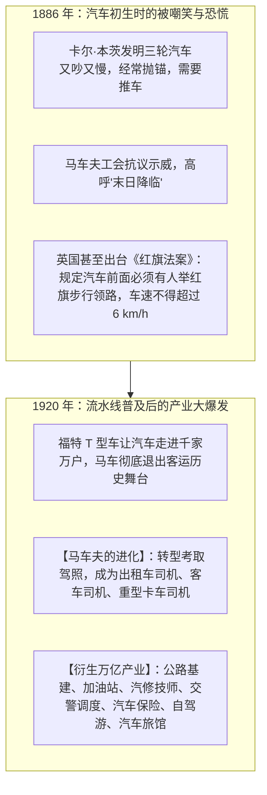
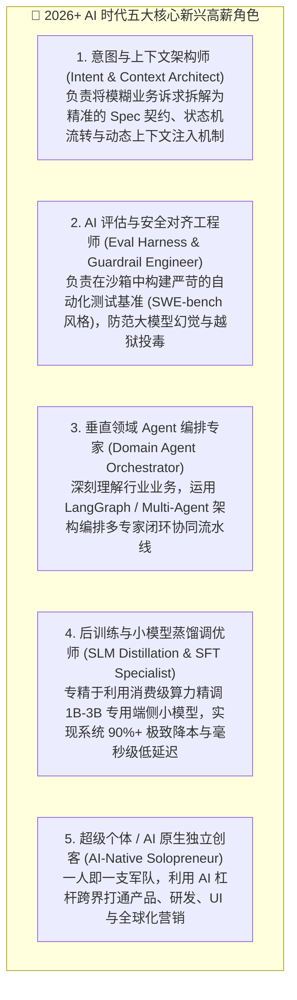

# 12.3 从马夫到司机的历史回响：百年汽车大博弈与新兴职业浪潮

> 💡 **“每一次颠覆性技术的降临，都会毫不留情地碾碎旧世界的饭碗，但同时也会在废墟之上，浇灌出一整片百倍于旧世界的全新产业森林。”**
>
> 当内燃机取代马车时，马车夫并没有永远消失，他们中的绝大多数进化成了出租车司机与卡车司机；
> 汽车的普及更催生了加油站、高速公路、交通警察、汽车维修、公路旅行与现代物流等数以千万计的前所未有的新岗位！
> **AI 亦是如此。技术消灭的是旧的特定劳动动作（Tasks），创造的却是全新的高价值职业生态（Ecosystem）！**
>
> **但本节更要讲清一个被鸡汤故事掩盖的真相：转型不会自动发生，也不会没有代价。正视代价，才能真正抓住机遇。**

***

## 🚗 历史是一面镜子：马车与内燃机汽车的百年博弈

让我们把时光倒流到 19 世纪末。这场博弈不仅有故事，更有硬邦邦的统计数字：

### 用数据回看这场大博弈（美国数据）

| 指标    | 旧时代（马车）                     | 新时代（汽车）                                                                                                  |
| ----- | --------------------------- | -------------------------------------------------------------------------------------------------------- |
| 保有量   | 1900 年约 **2000 万匹**马        | 1900 年仅 **8000 辆**汽车 → 1930 年 **2300 万辆**                                                                |
| 制造企业  | 1890 年约 **1.38 万家**马车公司     | 到 1920 年马车公司仅剩 **不到 90 家**                                                                               |
| 车夫人数  | 1900–1920 年维持约 **36–40 万**人 | 1920–1930 十年间锐减 **超 50%**（约减 20 万）                                                                       |
| 配套岗位  | 马厩管理员 1910 年 6.3 万人         | 1920 年仅剩 1.9 万人                                                                                          |
| 新产业岗位 | —                           | 汽车制造业 7.5 万（1910）→ 64 万（1930）→ 超 **100 万**（1950）；私人司机 4.6 万→28.5 万；卡车司机达**百万级**；1930 年美国已有约 **12 万个加油站** |

### 历史大规律：

- **消灭的是“挥舞马鞭”的手法，升级的是“掌控方向盘”的能力**；
- 当社会的交通出行速度从每小时 15 公里提升到 100 公里时，全社会的经济活力被释放了千百倍，对司机的总需求不降反升！
- 伦敦 1899 年全城养了约 **30 万匹马**、近 **10 万人**靠“马经济”吃饭（当时全城仅约 200 万人）——放到今天，这相当于“一个城市 5% 的人依赖马车产业链”。而这条产业链最终被一条更大的产业链（汽车 + 石油 + 公路）整体接住了。

***

## ⚖️ 必须承认的另一面：历史不是童话

很多“AI 乐观派”喜欢用“马车夫都去当司机了”来安抚焦虑。**但真实历史要残酷得多。我们诚实面对它，才能做出清醒的决策：**

### 1. 转型跨越了整整一代人，不是无缝切换

- 从 1900 年汽车问世到 1930 年马车基本退出城市客运，历时约 **30 年**；
- 1900 年前后的纽约有超过 **10 万名**马车夫，其中**大量缺乏机械知识的人没能转型**为汽车司机或修理工，沦落为底层劳工——**不是每个人都赶上了下一班车**。

### 2. 旧岗位的消亡是毁灭性的、成规模的

- 英国**手工织布工人**：1815 年 **25 万人** → 1850 年 **4 万人** → 1860 年仅 **3 万人**，45 年间几乎从英国消失；
- **手工纺纱工**：1770 年前后雇佣了英国约 **8% 的人口**，机械化后失业潮持续数十年；
- **工资断崖**：兰开斯特郡织布工周薪从 1800 年的 25 先令跌到 1811 年的 14 先令，10 年腰斩，而物价还在涨。

### 3. 愤怒与反抗（卢德运动）也真实发生过

- 1811 年 3 月，诺丁汉的织袜工砸毁 80 架织袜机；此后“砸机器”运动席卷英国多个工业区；
- 当时被机器直接冲击的群体约 **100 万人**，占英国总人口十分之一；
- 英国政府 1812 年通过《破坏机器法案》，将毁坏机器者判处**死刑**——用最暴烈的方式镇压了反抗。

> 🎯 **这一节想传达的诚实结论**：技术确实会创造更多总量，但它**不会自动把新饭碗递到每个旧人手里**。中间隔着：**一代人的时间、剧烈的收入下降、大规模的社会阵痛，以及最重要的——主动的学习与转型。**
> 所以请务必读到最后：**AI 时代的“司机驾照”，现在就握在你自己手里。**

***

## 🇨🇳 中国自己的“马车夫到司机”：就在我们身边的历史回响

西方马车与汽车的故事，总让人觉得有些遥远。其实中国近几十年的产业变迁里，藏着好几段**活生生的“马车夫到司机”**——它们就发生在你我身边，而且都有一个共同点：**旧岗位消失的同时，一个更庞大的新生态拔地而起。**

### 1. 🔥 汉字激光照排：王选与“告别铅与火”

- **旧世界**：20 世纪 80 年代前的中国印刷业是“以火熔铅、以铅铸字”。排字工人每天在铅字架间来回走动，把一个个铅字捡出来排版，一天走十几里路、双手乌黑；当时全国铸字耗用**铅合金 20 万吨、铜模 200 多万副、价值约 60 亿元**，出一本书往往要压上一整年；
- **新技术**：1974 年国家启动“748 工程”，北大教授王选顶着“小助教骗人的数学游戏”的冷嘲热讽，**跨过国外二代、三代照排机，直接研制世界尚无商品的第四代汉字激光照排系统**，让中国印刷业直接**跨越了国外 40 年的演进史**；
- **转折点**：1987 年《经济日报》率先采用华光 III 型系统，出版世界第一张计算机屏幕组版的中文日报；1988 年，这家报社**卖掉了整整一层楼的铅字、砸掉了铅锅**，成为全国第一家“告别铅与火、迎来光与电”的报社；
- **结局**：铅字排字工这个庞大的职业消失了，但**方正集团与整个电子出版、桌面排版产业**拔地而起，王选也因此被称为“当代毕昇”——这就是“消灭一个旧动作、长出一片新森林”最典型的中国注脚。

### 2. 🛣️ ETC 与高速收费员：1.2 万人“转岗不下岗”

- **旧岗位**：2019 年前，全国 29 个联网省份有 **487 个省界收费站**，数千名收费员每天伸手、递卡、找零；
- **新技术**：2019 年国家推动取消省界收费站、普及 ETC（电子不停车收费），客车过省界时间从 **15 秒降到 2 秒**（下降 86.7%），货车从 29 秒降到 3 秒；ETC 用户一年从 8072 万飙升到 **2.04 亿**；
- **人怎么安置？** 交通运输部坚持“**转岗不下岗**”，近 **1.2 万名**收费员被妥善安置，转岗到 ETC 客服、清分结算后台、服务区运营、机电维修、养护巡查等**全新岗位**——正如当年马车夫去考驾照、开出租；
- **启示**：收费员的“收钱动作”没了，但全国高速公路“一张网”的**运营、客服、清分、机电**等新岗位体系诞生了。效率大提升 + 人升级转岗，一个都没落下。

### 3. 🧮 算盘、收银台与“无现金社会”

- 曾几何时，“打一手好算盘”是财会人员的看家本领，算盘甚至被誉为“中国第五大发明”；后来的电子计算器、财务软件，让珠算退出了日常经营；
- 再后来，移动支付又让收银台上的“找零”动作几乎消失。但**消失的是“点钞与找零”，长出来的是移动支付、跨境电商、即时零售、物流快递的千万级就业**——全国快递员约 **320 万**、网约配送员超 **1200 万**，都是当年“收银员”做梦也想不到的新物种。

### 4. 🚄 从窗口排长队到 12306 电子客票

- 曾经，春运买票是全民大考，售票窗口与售票员是刚需；
- 如今，12306 与电子客票让“一张身份证走天下”，传统窗口售票员大幅减少；但铁路信息化、无纸化票务、人脸闸机、大数据客流调度，造就了一批全新的技术岗位。

### 5. 🚕 网约车与外卖：393 万“去产能职工”的再就业

- 这是**当代中国最像“马车夫→司机”的一幕**：2016–2017 年间，滴滴平台累计有 **2108 万人**获得收入，其中 **393 万来自去产能行业职工、178 万复员转业军人、133 万失业人员、137 万零就业家庭**——他们就像当年放下马鞭去考驾照的马车夫；
- 截至 2025 年，全国**网约车司机约 700 万、网约配送员超 1200 万**，已成为吸纳就业的重要“蓄水池”。曾经的钢铁、煤矿工人没有“被时代抛下”，而是换了个“方向盘”，开进了数字经济。

***

## 🏛️ 经典历史镜像：人类历次技术大变革的深度启示

不仅是马车与汽车，纵观人类近代科技史，每一次重大技术突破都曾引发同样的“失业恐慌”，却最终无一例外地创造了更繁荣的产业奇迹。我们用一张“案例库”一次讲透：

| 技术变革                          | 当时恐慌               | 真实结局                                                                 | 诚实的注脚                          |
| ----------------------------- | ------------------ | -------------------------------------------------------------------- | ------------------------------ |
| 📷 **照相机** vs 肖像画家（1839）      | “绘画彻底死了！”          | 催生印象派、毕加索与现代艺术；开创电影、新闻摄影、视觉传媒万亿美元产业                                  | 绘画没死，但“只靠画得像赚钱”的职业死了           |
| 📑 **电子表格** vs 会计（1980s）      | 40 万手工记账员失业        | 杰文斯悖论：核算成本降 99%，精细化财务需求爆发 20 倍，催生 CFA、精算师、BI 工程师                     | 记账被自动化，但“财务分析”含金量暴涨            |
| 🏧 **ATM** vs 银行柜员（1970s–90s） | “柜员将灭绝”            | 单网点柜员 21 人→13 人，但网点运营成本降 40%、银行多开了 43% 的网点，柜员总数不降反升，且转向理财顾问          | 机械点钞没了，关系式销售与咨询岗起来了            |
| ⌨️ **打字机/排版机** vs 打字员、排字工     | 打字员、排字工失业          | 催生“信息处理”新职业群，最终通向 PC、互联网与整个数字产业                                      | 打字员这个职业确实消失了——但“信息工作者”总量爆炸     |
| ☎️ **自动交换机** vs 电话接线员         | 接线员（美国女性最普遍职业之一）失业 | 岗位被自动化和直拨大量替代                                                        | **诚实案例：这个职业真的基本消失了**，只保留少量特殊场景 |
| 🛗 **按钮电梯** vs 电梯操作员          | 电梯操作员失业            | 岗位消失                                                                 | **诚实案例：又一个真的消失的职业**            |
| 📠 **电报→电话→互联网** vs 电报员、送报童   | 电报员失业              | 电报业 2006 年彻底终止（Western Union 停运），但通讯业总就业大幅扩张                         | 旧管道消失，新管道十倍于旧                  |
| 🎳 **自动摆瓶机** vs 保龄球球童         | 球童（多为少年）失业         | 岗位消失                                                                 | **诚实案例：真的消失了**，且几乎没有新岗位直接替代    |
| 🥛 **冰箱+超市** vs 送奶工           | 送奶工失业              | 岗位基本消失                                                               | 真实消失，但零售/冷链产业链扩张               |
| 💻 **大型机** vs 人肉计算员           | “计算员”失业            | 计算机编程成为全新职业，1970 年从业者已超 **20 万**                                     | “人肉算账”没了，“喂给机器指令”的职业诞生         |
| 🧭 **GPS** vs 手绘地图师           | 地图社裁员              | 手绘商业制图消失，但 GIS 地理信息系统专家、导航工程师崛起                                      | 制图旧工艺没了，空间数据产业放大百倍             |
| ✈️ **在线预订** vs 传统旅行社          | 旅行社“将死”            | 美国旅行社从业者 14.2 万（1997）→ 7.4 万（2014），**标准化环节被砍掉 48%**，但高端定制与体验旅行留存     | 一部分真的没了，一部分升级了                 |
| 🔥 **汉字激光照排** vs 铅字排字工（1980s） | “计算机时代是汉字的末日”      | 王选让中国“告别铅与火、迎来光与电”，1987《经济日报》率先启用；铅排工消失，方正与电子出版产业崛起，让中国**跨越国外 40 年** | 中国版“马车→汽车”，民族产业自主创新典范          |
| 🛣️ **ETC** vs 高速收费员（2019）    | 收费员将大规模失业          | 487 个省界收费站取消，**1.2 万收费员“转岗不下岗”**，转岗到 ETC 客服/清分/机电等新岗；客车过站 15 秒→2 秒   | 当代活案例：效率大提升 + 人升级转岗            |

### 三句话总结这张案例库

1. **“消失”与“新生”并存**：电梯操作员、接线员、电报员、送奶工确实消亡了，没有直接替补；
2. **但产业总盘子在膨胀**：每一次技术革命后，社会总就业量与总财富都大幅增长——因为**成本下降带来了十倍的需求释放**（杰文斯悖论）；
3. **关键变量是“人”**：同样面对变革，主动转型者（学开车的年轻马车夫）收入翻倍，固守旧技能者（老马车夫）被淘汰。**机会永远留给主动的人。**

***

## 🌊 AI 时代正在爆发的五大新兴高价值职业浪潮

就像当年的出租车司机与电影导演一样，AI 时代已经诞生出一批全新的黄金职业（且都有真实的中国招聘数据背书）：

### 用真实的中国招聘数据给这波浪潮“盖章”

- **AI 算法工程师**：招聘需求同比增长 **80%**（智联招聘 2025），大模型算法月薪约 7.1 万元，应届生最热门的两个技术岗之一；
- **AI 产品经理**：需求同比暴增 **178%**（智联招聘），是增幅最大的岗位——因为企业缺的是“把技术变成产品”的人，而不只是写代码的人；
- **数据标注 / AI 训练师**：需求同比增长 **171%**（脉脉）——门槛相对较低，是**非技术背景者进入 AI 领域最现实的入口**；
- **高性能计算工程师**：人才供需比 **0.31**，即 **3 个岗位抢 1 个人**——底层硬核能力永远稀缺；
- **AI 科学家 / 负责人**：平均月薪 **12.7 万元**，登顶高薪榜（脉脉 2025）；
- **AI 专业人才总盘**：麦肯锡测算到 2030 年中国 AI 人才需求 **600 万**、净缺口 **400 万**；DeepSeek 曾以应届生最高年薪 **112 万** 登上热搜——**“造 AI”的能力远比“用 AI”稀缺。**

### 国家已经为新职业“盖章”：人社部近百个新职业

- 人社部近年来已陆续发布**近百个新职业**，其中“数字”“绿色”“民生”成为关键词：**人工智能训练师、数字化解决方案设计师、无人机装调检修工、互联网营销师、碳排放管理员、老年人能力评估师**……很多 5 年前还不存在的工种，如今已经是正规军；
- **低空经济**：截至 2024 年 7 月，全国持证无人机操控员超 **22.5 万人**（半年新增约 3 万），而专业飞手缺口高达 **100 万**——一个全新的“空中职业”正在诞生；
- **新就业形态总盘**：全国新就业形态劳动者已达 **8400 万人**（约占职工总数 21%），其中网约车司机约 700 万、网约配送员超 1200 万、快递员约 320 万、职业主播千万级；
- **AI 直接催生**：大模型工程师、人工智能训练师、数据标注员成为“刚需新岗”，**“技术 + 行业背景”的复合型 AI 就业群体**正快速壮大。

### 一个冷静的提醒

以上岗位分三类，请对号入座：

- **门槛极高**（算法、模型蒸馏、高性能计算）：需要扎实数学/系统功底——这是“长期主义”的回报；
- **门槛中等**（Agent 编排、Eval、意图架构）：需要工程实践 + 业务理解——适合当下的你；
- **门槛较低**（数据标注、AI 运营、提示词落地）：适合快速切入，但要清醒认识到**它的天花板**，边做边向更高层爬。

***

## ⏳ 转型的节奏：快于以往，但不会太快——放平心态，快乐前行

讲完历史的残酷与新生的繁盛，最后必须回答一个很多人真正关心的问题：**AI 转型到底有多快？我会不会被"瞬间淘汰"？**

### 快于以往（这是事实，不必自欺）

- 马车到汽车，走了约 **30 年**；铅字到激光照排，也经历了近 **10 年**；
- 而 AI 从 2022 年底 ChatGPT 爆火，到 2025 年 Agent 全面进入开发工作流，只有 **3 年**。技术扩散的速度确实在指数级加快——**这正是我们这代人与前代人的不同之处**。

### 但不会太快（这一点同样重要）

- 一项技术要真正重塑产业，靠的不是"发布会上的惊叹"，而是**成本、习惯、制度、人才、信任的层层渗透**：企业要改流程、要过合规、要培训员工、要批预算、要看到真金白银的 ROI——这些都会让"变革"在真实世界里温柔下来；
- 正如前面看到的：**旧岗位不会在一年内消失，新职业也不会在一年内补齐**。20 世纪那几次大变革，真实阵痛期都长达 10–30 年；AI 大概率会压缩这个周期，但绝不是"明天醒来就天翻地覆"。

### 所以，请放平心态

- **别用"末日焦虑"透支今天的快乐**：AI 在加速，但你的时间线上，有充足的窗口去学习、去转型、去尝试。一天改变不了的事，一年、三年足够开始；好好工作，好好生活，好好锻炼身体；
- **"开心过好每一天"不是鸡汤，而是战略**：焦虑会让人短视、慌乱、容易被割韭菜（见 12.4节拒绝焦虑割韭菜\_）；而平和的心态，才能支撑你长期主义地读书、写代码、做产品——**所有穿越周期的能力，都是在不焦虑的日复一日里长出来的**；
- **真正的确定性不在外部，而在你自己的积累里**：每多掌握一个原理、每多交付一个真实产品、每多理解一个业务痛点，你就多一分"无论 AI 怎么变，我都接得住"的底气。

> 🌤️ **一句话收尾**：时代的列车确实比从前更快了，但它依然是一辆"列车"，不是一枚"导弹"。该学习的学习，该生活的生活——**不焦虑，也不躺平，稳稳地往前走，就是最好的姿态。**

***

## 💡 终极启示：从“被迫转型的马夫”到“主动驾驭的司机”

技术的车轮滚滚向前，它从不等待任何人的叹息与抱怨：

1. **不必为马车的离去而落泪**：天天手写枯燥的样板 CRUD，本身就不是人类心智的最优归宿；
2. **主动考取 AI 时代的“驾照”**：学会在编辑器里用自然语言精确指挥 Agent、学会用架构图与第一性原理审查代码、学会用小模型去优化成本——**“考驾照”这件事，没人能替你完成**；
3. **享受大飞跃带来的全新可能**：当你从一个苦力搬砖码农，蜕变为一个坐在驾驶舱里掌控全局的系统架构师与超级创作者时，你会发现——**这绝不是寒冬，而是人类软件工程史上最令人振奋的黄金黎明！**

***

## 🔗 经典经济学理论与历史文献直达

- **[Jevons Paradox 杰文斯悖论 (Wikipedia 权威词条)](https://en.wikipedia.org/wiki/Jevons_paradox)**：阐述效率提升如何带来总需求指数级反弹；
- **[约瑟夫·熊彼特：“创造性破坏”经济学理论 (Creative Destruction)](https://www.econlib.org/library/Enc/CreativeDestruction.html)**：含马车/汽车、电报/互联网等经典案例与历史数据；
- **[Ford Model T 历史档案：福特流水线与现代劳动力大演进](https://corporate.ford.com/articles/history/model-t.html)**；
- **[世界经济论坛《未来就业报告 2025》最快增长/最快消失岗位清单](https://cn.weforum.org/publications/the-future-of-jobs-report-2025/in-full/2-jobs-outlook/)**；
- **[Automation History 自动化两百年史（卢德运动 / 大型机 / ATM 等完整案例时间线）](https://www.aiexposure.org/history)**；
- **[脉脉高聘《2025 年度人才迁徙报告》（AI 岗位 +543% / 高薪榜 / 紧缺岗位）](https://www.maimai.cn/)**；
- **[智联招聘《2025 年人工智能产业人才发展报告》（算法 +80% / AI 产品经理 +178%）](https://www.zhaopin.com/)**；
- **[北京大学王选计算机研究所：王选与汉字激光照排系统（“告别铅与火”全过程）](https://www.wangxuan.pku.edu.cn/)**；
- **[交通运输部：取消高速公路省界收费站（ETC 撤站与 1.2 万收费员转岗安置）](https://www.gov.cn/xinwen/2019zccfh/27/index.htm)**；
- **[人社部：扩容提质培育就业新动能（近百个新职业 / 无人机操控员缺口 100 万）](https://www.mohrss.gov.cn/SYrlzyhshbzb/ztzl/dsschy/mtbd/202412/t20241213_532340.html)**；
- **[滴滴政策研究院《新经济 新就业》报告（393 万去产能职工在平台再就业）](https://www.shujuju.cn/)**。

