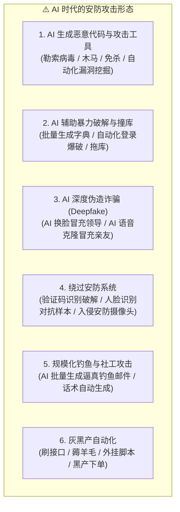
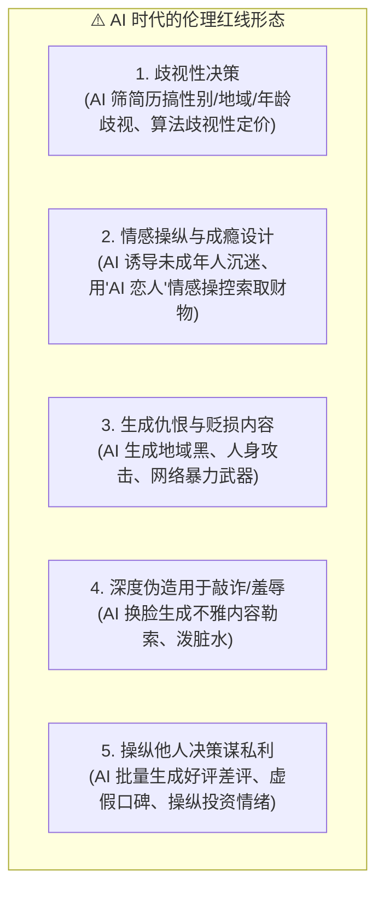
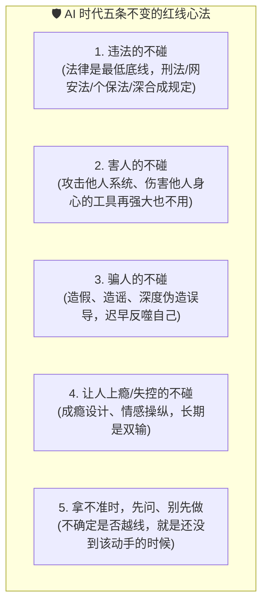

# 12.5 AI 绝不能碰的红线：技术有边界，敬畏是底线

> 💡 **“能力越大，红线越清晰。AI 给人类带来了前所未有的力量，但越是强大的工具，越需要一套不可逾越的边界——这不是技术的边界，而是法律、伦理与人性的边界。”**
>
> 前面几节我们讲了 AI 带来的红利、阵痛与新机遇，这一节，我们聊聊**绝对不能碰的雷区**。
> 技术可以加速你的成长，但一旦越线，轻则背上债务、毁掉职业生涯，重则触犯刑法、锒铛入狱。
> 更要命的是：**AI 会让“作恶”变得空前容易——你甚至不需要懂技术，就能用 AI 批量制造攻击。**
> 本节将逐一拆解 AI 时代的红线清单。第一条，就是最致命也最常见的——**安防攻击**。

---

## 🛑 红线一：安防攻击（用 AI 发起攻击 / 攻击安全系统）

### 什么是“安防攻击”？它正在被 AI 变得“平民化”

在过去，搞一次网络攻击需要相当的技术门槛；而今天，AI 把攻击的门槛拉到了**“会用对话框就会攻击”**的程度。这包括但不限于：

### 为什么说这是“红线中的红线”？

1. **法律代价极其沉重**：在中国，未经授权实施上述行为，可能同时踩中多条刑法：
   - **《刑法》第 285 条**——非法侵入计算机信息系统罪、非法获取计算机信息系统数据罪、非法控制计算机信息系统罪（情节特别严重的，最高可判**七年**有期徒刑）；
   - **《刑法》第 286 条**——破坏计算机信息系统罪（后果特别严重的，处**五年以上**有期徒刑）；
   - **《刑法》第 253 条之一**——侵犯公民个人信息罪（情节特别严重的，最高**七年**）；
   - 再加上《网络安全法》《数据安全法》《个人信息保护法》的行政与民事责任，**一旦越线，就是整个职业生涯的终点**。
2. **现实案例已经很多，且离我们并不远**：
   - AI 换脸诈骗：2023 年起国内已发生多起“AI 换脸冒充老板/亲友”转账诈骗案，单案涉案金额从几十万到数百万不等；
   - 撞库/拖库/爬虫判刑：多起“利用脚本批量抓取公民个人信息并出售”的案件，行为人被以侵犯公民个人信息罪追究刑事责任；
   - 制售外挂、攻击工具：明知用于入侵仍编写/售卖“外挂”“木马”程序，同样构成提供侵入、非法控制计算机信息系统程序、工具罪。
3. **“技术留痕”让侥幸心理无处遁形**：网络攻击一定有 IP、设备指纹、日志、流量特征留痕；安防系统本身也在用 AI 做检测。**你以为的“神不知鬼不觉”，只是还没被查到。**

### 合法与违法的分界线：一个字——**“授权”**

同样是“攻”，白帽黑客与黑帽黑客的区别，只在于**是否获得了系统所有者的明确授权**：

| 行为 | 性质 | 后果 |
| --- | --- | --- |
| 未经授权扫描、入侵、脱库、破坏 | ❌ 违法（黑帽） | 刑事 + 民事赔偿 |
| 获得授权的渗透测试（企业雇佣） | ✅ 合法（白帽） | 正当职业 |
| 在 SRC 漏洞众测平台提交漏洞 | ✅ 合法且**有奖金** | 补天 / 漏洞盒子 / CNVD / 各厂商 SRC |
| 参加护网行动、国家级攻防演练、CTF 竞赛 | ✅ 合法 | 官方组织，比拼攻防技术 |

### 正确姿势：让 AI 成为“盾”，而不是“矛”

同样在“安防”领域，把 AI 用在正道上，恰恰是 AI 时代最值钱、最稀缺的能力之一：
- **AI 安全检测**：用大模型辅助分析恶意样本、识别钓鱼邮件、审计代码漏洞（Snyk、CodeQL、AI 辅助 SAST/DAST）；
- **异常流量与入侵检测**：用 AI 在海量日志中找出异常行为（这是 12.2 里“后端架构与极端排障”高端能力的延伸）；
- **合规攻防研究**：在企业授权或国家组织的攻防演练中，用 AI 提升“蓝队/红队”效率。

> ⚠️ **最后叮嘱三句**：
> 1. **永远不要用“练手”“好奇”“研究一下”当借口，去碰未经授权的系统**——法律不看你动机，只看行为；
> 2. **AI 不会替你背锅**：不管代码是 AI 写的还是你写的，责任都在操作者本人；
> 3. **真感兴趣，就走合法路线**：从 CTF 入门、到 SRC 众测、再到企业授权的渗透测试，这条路既能涨技术，还能拿奖金和名企 offer，何乐而不为？

---

## � 红线二：伦理道德（用 AI 作恶于“人”）

“安防攻击”攻击的是系统，而**伦理红线，攻击的是人本身**——它有时不直接触犯刑法，却一样能毁掉一个人、一个家庭、一段人生。

- **为什么是红线**：AI 会把人的偏见“放大到系统级”。一个带着偏见的 AI 招聘系统，可能让成百上千的求职者被系统性地挡在门外——**这种“冷暴力”比单个偏见更隐蔽、也更可怕**；
- **伦理 ≠ 合法，但同样致命**：很多伦理问题未必直接触犯刑法，但一旦曝光，**个人信誉、公司声誉、职业生涯会瞬间归零**，还可能面临民事赔偿与平台封禁；
- **正确姿势**：把“公平性测试”写进你的 AI 流程——训练数据是否偏斜？决策是否可解释？是否加了 **Human-in-the-Loop（人工兜底）**？**AI 可以帮你做决策，但“对谁负责”这件事，永远要由人来承担。**

---

## 🛑 红线三：暴力与违法内容（AI 不应成为“恶的放大器”）

- **AI 生成暴力血腥内容**：血腥图、暴力视频、犯罪细节教学；
- **AI 生成违法“教程”**：制毒配方、武器制造、危险物品制作、犯罪方法论；
- **AI 生成有害自伤内容**：教唆自残、自杀、极端行为；
- **AI 用于涉未成年人违法内容**：这一条是全社会零容忍的红线，法律后果极其严重；
- **越狱绕过模型安全**：故意用 Prompt Injection 诱导 AI 突破安全护栏去生成上述内容——**“让 AI 越狱作恶”本身就是红线**。

> ⚠️ 记住：**大模型之所以“拒绝”回答某些问题，不是因为它“笨”，而是因为那是护栏，不是缺陷。** 试图绕过护栏的人，法律也不会绕过他。

---

## 🛑 红线四：造谣与误导舆论（AI 谣言 / P 图造假 / 深度伪造）

这是普通人最容易“顺手”踩中的红线，也是近年治理最严的领域：

- **AI 一键批量造谣**：用 AI 生成“某地发生事故”“某品牌翻车”“某人塌房”等图文“新闻”，发到群里、贴吧、社交平台；
- **AI P 图 / 换脸造假**：把图片 P 成“证据”、用 Deepfake 伪造名人讲话、伪造聊天记录截图去“实锤”别人；
- **AI 水军带节奏**：批量注册账号、生成刷屏评论，操纵舆论风向；
- **后果有多重**：
  - **行政层面**：散布谣言扰乱公共秩序，依据《治安管理处罚法》可处行政拘留；
  - **刑事层面**：编造、故意传播虚假信息，严重扰乱社会秩序的，可构成**编造、故意传播虚假信息罪**（最高**七年**有期徒刑）；捏造事实诽谤他人可构成诽谤罪；
  - **监管层面**：网信部门持续开展“清朗”系列专项行动，**专门整治 AI 造谣、AI 换脸造假、AI 水军**，平台对相关账号一律从严处置。

> 🛡️ **自保三原则**：
> 1. **不编**——不生成、不 P 图、不伪造“证据”；
> 2. **不转**——看到爆款“瓜”先核实来源（官方通报、权威媒体），存疑不转；
> 3. **标注**——确属 AI 生成的图文，按《生成式人工智能服务管理暂行办法》要求**如实标注“AI 生成”**，不装成真实发生的事。

---

## 🛑 红线五：数据与隐私（AI 的“燃料”不能偷）

数据是 AI 的燃料，但**“燃料”必须合法取得**：

- 用爬虫批量抓取用户个人信息（手机号、住址、肖像、行为数据）用于训练或出售；
- 未经授权收集人脸、指纹等生物识别信息；
- 把用户数据交给 AI 处理却**不脱敏、不授权**；
- 把用户私有数据“喂”给云端模型而不做最小化与加密。

- **为什么是红线**：《个人信息保护法》《数据安全法》《网络安全法》共同构成数据合规的铁三角，违法最高可处**五千万元或上一年度营业额 5%** 的罚款；涉及个人信息的爬取与售卖，更可能直接构成刑事犯罪；
- **正确姿势**：数据**最小化采集、明确授权、脱敏处理、加密存储**；给用户“一键删除数据”的能力——这既是法律要求，也是 11.3 里提到的面试加分工程细节。

---

## 🛑 红线六：学术诚信与作弊（AI 不是你的“枪手”）

- 用 AI 代写论文、代做作业、代考，伪造实验数据与代码；
- 后果：学位撤销、退学、学术生涯终结——**多所高校已部署 AIGC 检测工具，AI 写作痕迹很难藏住**；
- **正确姿势**：**“AI 辅助”与“AI 代写”是两回事**——用 AI 查资料、润色、解释原理、检查逻辑，这叫辅助，值得鼓励；让 AI 从 0 到 1 替你产出成果并署你之名，这叫作弊。**工具可以帮你走得更快，但路必须你自己走。**

---

## 🛡️ 红线总原则：五条不变的心法

无论 AI 怎么迭代，下面五条原则不会变。遇到拿不准的场景，默念一遍：

> 🕊️ **最后一句**：AI 是放大镜——它放大你的效率，也放大你的选择。**把技术用在光里，它会照亮你的路；用在暗处，它也会照亮你的脸。** 红线不是限制，而是保护你走得更远的护栏。

---

## 🔗 红线相关的法律法规与学习资源

- **[《中华人民共和国刑法》第 285 / 286 / 253 条（计算机犯罪相关条款）](http://www.gov.cn/xinwen/2016-12/16/content_5149300.htm)**；
- **[《生成式人工智能服务管理暂行办法》（AI 内容标注与合规，2023）](https://www.cac.gov.cn/2023-07/13/c_1690898327029107.htm)**；
- **[《中华人民共和国个人信息保护法》（PIPL）](http://www.npc.gov.cn/npc/c30834/202108/a8c4e3672c74491a80b53a172bb753fe.shtml)**；
- **[网信办“清朗”系列专项行动（整治 AI 造谣、AI 换脸造假、AI 水军）](https://www.cac.gov.cn/)**；
- **[补天漏洞响应平台（合法提交漏洞获取奖金）](https://www.butian.net/)**；
- **[漏洞盒子（Vulbox）众测平台](https://www.vulbox.com/)**；
- **[国家信息安全漏洞共享平台（CNVD）](https://www.cnvd.org.cn/)**；
- **[OWASP Top 10（Web 应用安全权威清单）](https://owasp.org/www-project-top-ten/)**。
