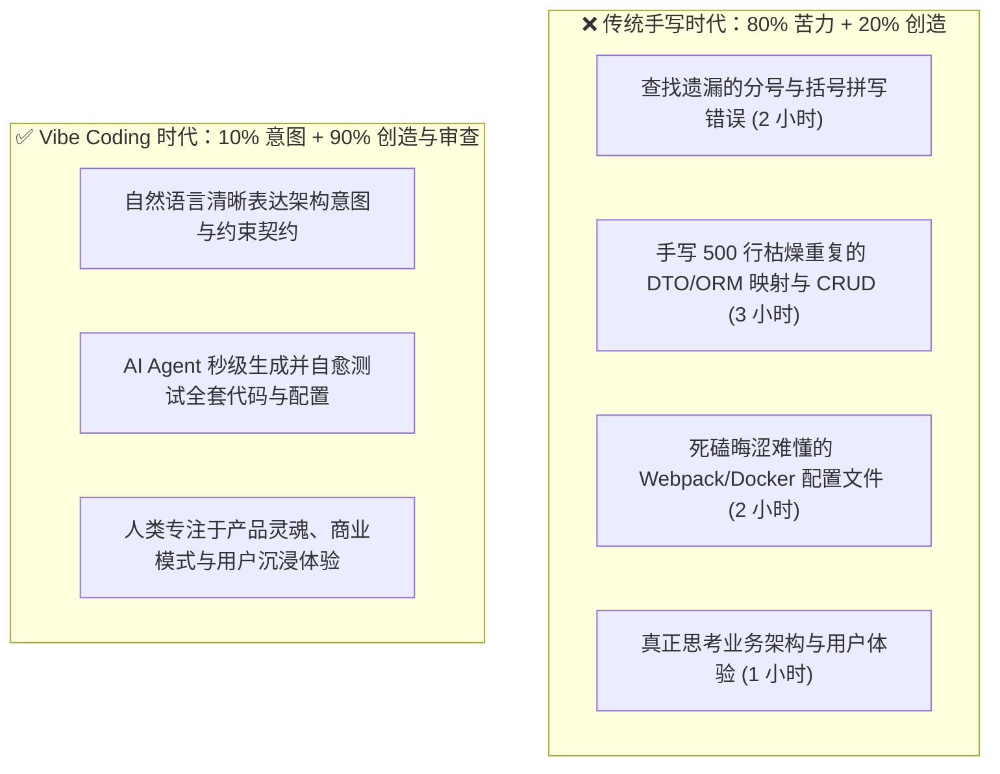
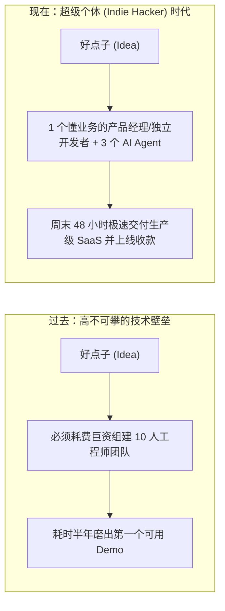
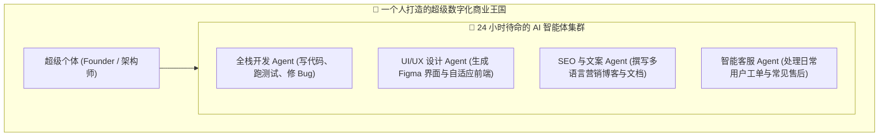

# 12.1 生产力跃迁与超级个体红利：从“机械打字员”到“交响乐指挥官”

> 💡 **“历史上每一次伟大工具的诞生，从来不是为了把人类变成废人，而是为了把人类从日复一日的体力与机械苦役中拯救出来，去从事更具创造性、更宏大的探索。”**
>
> 当我们在 2026 年谈论 AI 辅助编程与 Agent 智能体时，我们谈论的绝不是一个“花哨的自动补全插件”，而是一场**软件工程生产力的超级核裂变**。
> 它将人类从繁琐的语法分号、冗长的样板代码（Boilerplate）、死板的正则表达式和环境依赖地狱中彻底解放出来。
> 本节将用**真实的实验数据**与**真实的超级个体案例**告诉你：这场跃迁不是营销话术，而是正在发生的事实。

---

## ⚡ 生产力的本质跃迁：告别“搬砖苦役”，拥抱“意图创造”

在传统手写编程时代，一个程序员 80% 的工作时间其实都在处理**“与核心业务创造无关的低效苦力”**：

### 1. 样板代码与低级语法的秒级消灭
- **再也不用死记硬背**：不用再去死记正则表达式的复杂语法、不用反复翻查特定框架的配置文件格式；
- **智能体沙箱闭环**：AI Agent 能够自主执行依赖安装、运行单元测试、捕捉报错堆栈并在后台自我修复，人类只需要喝着咖啡审查最终结果。

### 2. 跨语言跨技术栈的“通天塔”瞬间抹平
- 过去，一个纯 Python 开发者想要开发 iOS Swift 原生应用或写一个高性能 Rust 扩展，需要付出数月甚至半年的学习成本；
- 现在，只要你掌握了**数据结构、网络通信与系统设计的基本哲学**，AI 就能充当完美的跨语言实时翻译官与结对编程专家。

---

## � 真实世界的数据：从“宣传口号”到“实验证据”

很多人怀疑“AI 提效”只是厂商的营销话术。让我们看看**公开发表的研究**到底怎么说：

### 一组需要区分的数字（避免被夸大宣传误导）
| 数据来源 | 提效幅度 | 说明 |
| --- | --- | --- |
| GitHub 官方研究（厂商口径） | 任务完成速度 **55%** 提升 | 实验室环境，偏向乐观 |
| 3 个随机对照田间实验（SSRN，独立学者） | 任务完成率平均提升 **26%** | 更接近真实开发场景 |
| Sourcegraph 500 人实测聚合 | 编码总耗时 **20–25%** 提升 | 其中样板代码 +45%、CRUD +35%、测试编写 +40% |
| 英国政府公共部门试点（GDS） | 每人每天平均节省 **56 分钟** | 真实政府项目，非营销 |

### 关键洞察：AI 提速的“不均匀分布”
- **提速最明显**：样板代码、CRUD、单元测试、正则/配置类机械任务（40–45%+）；
- **提速极有限**：复杂算法（约 5%）、**系统架构决策（约 0%）**——AI 对“定义正确的问题”几乎帮不上忙；
- **反而更耗时**：代码评审时间 **+15%**（AI 生成了更多代码要审）、Bug 修复时间 **+25%**（AI 会埋下微妙 bug）。

> 🎯 **结论**：AI 给你的不是“凭空多出一倍时间”，而是把时间从“打字”重定向到了“思考、评审与架构”上。**这正是超级个体得以诞生的底层逻辑——省出来的每一分钟，都该流向更高价值的创造。**

---

## �🚀 创造力的大平民化（Democratization of Creation）

软件开发不再是少数“计算机科班天才”的专属特权。

- **业务专家的逆袭**：懂法律的律师可以做出智能合同审查工具；懂财税的会计可以做出精准退税申报插件；懂临床的医生可以做出辅助诊断导医小程序；
- **从“苦于不会写代码”到“专注于解决真问题”**：技术的实现门槛被彻底打穿，**决定产品上限的不再是代码敲击速度，而是对真实世界痛点的深刻洞察力**。

---

## 👤 “超级个体（Indie Hacker）”的黄金爆发期：真实案例大盘点

在硅谷和全球开源界，正在发生一个前所未有的现象：**“一个人，就是一家年营收百万美元的微型独角兽公司（One-person Unicorn）”**。

### 那些“一个人打一个团”的传奇案例
1. **Base44（Maor Shlomo）——一人公司被 8000 万美元收购**：一名普通以色列工程师，几乎零启动资金，靠 Claude 等 AI 工具单人开发 AI 建站产品，**“连续几个月没写过一行前端代码”**。上线 3 周即盈利、四周年化收入（ARR）达 150 万美元、25 万+ 用户，6 个月内从 1 人扩张到 8 人，最终被 Wix 以 **8000 万美元现金**收购。AI 承担了约 90% 的代码编写，创始人把精力全部投向“用户反馈→极速迭代”。
2. **Pieter Levels——一人年入 300 万美元**：Nomad List、Photo AI 等 4 个年盈利超百万美元的项目全部一人维护。2025 年他仅用 3 小时 + 两款 AI 工具做出空战游戏原型，上线 17 天年化收入突破 **100 万美元**。他的座右铭是：“Ship more（多发布）”。
3. **TypingMind（Tony Dinh）——月入 10 万美元级的“更好的 AI 客户端”**：一个给 AI 聊天工具做更好 UI 的小产品，单人维护，月收入稳定在 **13–16 万美元**，20 个月累计收入破百万美元，启动成本为 0。
4. **统计验证**：Stripe《2024 独立创始人报告》显示，**全球盈利的 SaaS 产品中已有 44% 由单人创始人运营**（较 2018 年翻倍）——这不是个别天才，而是一个成规模的新物种。

### 中国市场的呼应
- 脉脉高聘《2025 年度人才迁徙报告》：2025 年 1–10 月新发 AI 岗位量同比暴增 **543%**，单月同比最高超 **11 倍**；AI 领域平均月薪 **6.18 万元**，比新经济行业整体高出 35.59%；AI 科学家平均月薪达 **12.7 万元**；
- 智联招聘《2025 年人工智能产业人才发展报告》：算法工程师招聘需求同比增长 **80%**，AI 产品经理需求增长 **178%**；
- 81.9% 的企业把“AI 能力”写进岗位 JD 要求（较前一年提升约 7 个百分点）——**AI 已从“加分项”变成“必选项”**。

### 中国开发者的“AI 土壤”同样肥沃
- **全球最大开发者群体之一**：工信部统计，全国登记在册软件开发人员约 **862 万人**，其中独立开发者与学生开发者合计约 **271 万人**（占 31.5%）——这是一片天然的超个体试验田；
- **国产 AI 编码助手已深度普及**：通义灵码、百度 Comate、腾讯 CodeBuddy 等国产 AI 编码助手，2025 年合计覆盖活跃开发者超 **1200 万人**，占全国注册开发者约 34.7%；中国开发者平均每日调用 AI 编码功能 **17.3 次**——AI 早已不是“试用玩物”，而是日常工作流的一部分；
- **Gitee（码云）** 已托管 **1280 万个**代码仓库、聚集超 **1200 万**注册开发者——从“用 AI 写代码”到“用代码建生态”，中国开发者正在走出一条自己的路。

---

## 🌐 认知探索门槛的指数级降低

在过去，遇到一个冷门的底层 Bug 或学习一个前沿算法，通常意味着：
- 在 Stack Overflow 上翻看 10 个已过期的提问帖子；
- 啃 300 页枯燥生涩的英文原版手册；
- 反复踩坑调试 3 天依然一头雾水。

现在，AI 就像一个**7×24 小时随叫随到、通晓人类所有开源代码与学术论文的资深博导**：
- 它不仅能用最通俗的大白话为你解释“为什么会出现这个报错”；
- 还能针对你的具体上下文给出**最小可复现用例（MRE）**与最佳实践；
- 知识的传递效率提升了百倍，让人类能够以惊人的速度跨越未知的技术深水区。

---

## ⚠️ 给狂热降温：AI 提效的三条“边界红线”

越是拥抱杠杆，越要看清它的边界。否则你会在错误的期望上摔得最惨：

1. **AI 提速的是“执行”，不是“方向”**：架构决策、技术选型、需求定义（0% 提速）恰恰是产品生死攸关的部分——这部分永远属于人类；
2. **AI 生成的代码不等于零 Bug 代码**：研究显示 AI 代码（原样接受）Bug 率约为人工的 1.5 倍（23 vs 15 每千行），但**经过人类认真修改后的 AI 代码反而更优**（12 每千行）——所以“审查与批判”是 AI 时代的核心元技能；
3. **超级个体 ≠ 躺赚**：所有案例里的创始人都在做“AI 不会做的事”——用户调研、产品判断、商业闭环、快速试错。**AI 放大了他们的能力，而不是替代了他们的判断。**

---

## 🔗 官方前沿观点与深度阅读

- **[Andrej Karpathy 提出 Vibe Coding 时代的推文总纲](https://twitter.com/karpathy/status/1886192184808247467)**；
- **[GitHub Copilot 官方生产力研究（55% 数据出处）](https://github.blog/news-insights/research/research-quantifying-github-copilots-impact-on-developer-productivity-and-happiness/)**；
- **[随机对照田间实验：AI 对高技能工作影响的 3 项研究（26% 数据出处）](https://papers.ssrn.com/sol3/papers.cfm?abstract_id=4945566)**；
- **[英国政府公共部门 AI 编程助手试点报告（GDS，每天节省 56 分钟）](https://www.gov.uk/government/publications/ai-coding-assistant-trial/ai-coding-assistant-trial-uk-public-sector-findings-report)**；
- **[Stack Overflow 2025 开发者调查（84% 开发者使用 AI 工具）](https://survey.stackoverflow.co/2025/)**；
- **[Stripe《2024 独立创始人报告》（44% 盈利 SaaS 为单人运营）](https://stripe.com/)**；
- **[Indie Hackers 全球独立开发者社区](https://www.indiehackers.com/)**：探索数以万计单人利用 AI 实现财富自由的真实实战案例；
- **[脉脉高聘《2025 年度人才迁徙报告》（AI 岗位 +543% 等中国数据）](https://www.maimai.cn/)**；
- **[智联招聘《2025 年人工智能产业人才发展报告》（算法 +80% 等）](https://www.zhaopin.com/)**；
- **[Gitee 码云开源社区（中国开发者生态数据）](https://gitee.com/)**。
