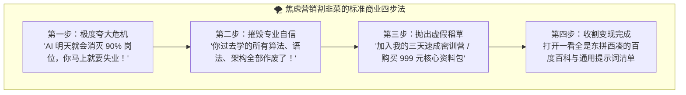
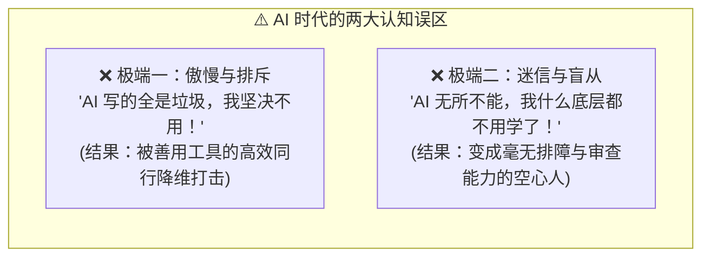
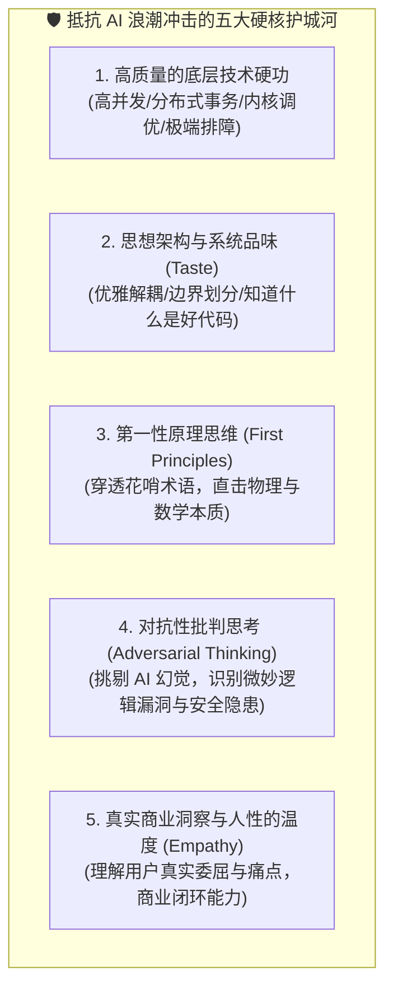

# 12.4 拒绝焦虑割韭菜：构建 AI 时代不可替代的个人护城河

> 💡 **“制造焦虑的唯一目的，就是为了向惊慌失措的人兜售廉价的‘解药’。在狂热的造神与灭世喧嚣中，保持内心的清醒定力与第一性原理思考，是你最宝贵的财富。”**
>
> 打开社交媒体，你是否经常被这类标题轰炸：
>
> - *“再不学 AI，你将被时代列车彻底无情抛下！”*
> - *“3 天带你用 AI 变现百万，普通人最后一次逆袭翻盘的机会！”*
> - *“程序员全部完蛋，所有传统软件工程瞬间归零！”*
> - *“跟着我学 AI，月入过万不是梦，名额只剩最后 3 个！”*
>
> 记住：**可以主动学习 AI，但绝不能被恐惧裹挟着盲从！**
> 本节将用**真实的消费维权数据**扒开焦虑营销的商业遮羞布，给你一把**判断课程好坏的价值标尺**，并教会你如何在喧嚣中守住本心，打造出任凭大模型如何迭代都无法被复刻的个人核心护城河！

***

## 🎭 扒开“AI 焦虑贩卖”的底层商业套路

为什么网络上关于 AI 的恐慌言论永远铺天盖地？因为在营销心理学中，**“恐惧（Fear）”是转化率最高、最容易让人冲动掏钱的情绪毒药**：



### 这不是猜测，而是被官方反复点名的真实乱象

- **中消协 2026 年点名“7 类技能培训陷阱”**：技能培训平均涉诉金额**超过 7000 元**，AI、短视频类“数字技能培训”位列第一类陷阱——机构用“AI”“数字人”“副业变现”包装，实际服务大打折扣，甚至**诱导办理分期消费贷款**；
- **四川省消委会**：2025 年全年“AI+”培训相关投诉达 **3739 件**，同比上升，且**受骗者以涉世未深的大学生为主**；
- **天眼查**：全国涉及“AI 培训”的企业超 **21 万家**，其中成立不足一年的超 6 万家——大量机构是趁风口临时注册的“速成生意”；
- **黑猫投诉平台**：AI 课程相关投诉超 **3800 条**，内容差、虚假宣传占绝大多数；
- **头部“知识付费”翻车样本**：某“清华博士”的 199 元《每个人的人工智能课》一年卖出约 25 万套、销售额高达 **5000 万元**，最终被平台全网封号；某头部视频团队 49 元 AI 课上线一天销量破 10 万份、销售额超 **600 万元**，学员差评直指“内容烂大街、学不到东西”。
- **套壳重灾区**：有媒体实测发现，**4.9 元购买的“DeepSeek 从入门到精通”资料，实际就是清华大学免费公开的资料被倒卖**；15 元的“店铺引流课”内容竟是大杂烩。

### 客观理性看待市场培训（不泼脏水，但要擦亮眼）

- **并非所有课程都不好**：市面上确实存在极少数真正由一线资深架构师打造的高质量、重实践、讲透底层原理的硬核课程；
- **但绝大多数“名师”自己都没搞明白**：大量机构的“AI 讲师”，昨天才刚刚注册 ChatGPT 账号，今天就靠洗稿拼凑了几百页 PPT 出来授课；
- **牢记铁律**：**任何向你承诺“不劳而获、几天速成、无脑暴富”的 AI 课程，本质上都是在收割你的认知税！** 真正有价值的知识，从来不需要靠制造恐慌来推销。

### 中式“割韭菜”的几副面孔（防身图谱）

- **“AI 副业 / 变现”训练营**：标榜“AI 写作月入过万”“AI 绘画接单”“数字人直播躺赚”，卖的是**包装出来的焦虑**，而非能落地的商业能力；
- **“提示词 / 资料包”倒卖**：把官方免费文档、高校公开资料打包成“独家核心资料”出售（前文提到的 4.9 元倒卖清华公开资料就是典型）；
- **“包就业 / 包过”话术**：承诺“学完内推大厂”“100% 包就业”，实则连师资资质都无法验证；
- **“低价引流 + 高价进阶”连环套**：先用 9.9 元体验课引流，再用“账号流量低、变现难”制造焦虑，诱你买 5000–10000 元的进阶课和流量套餐；
- **“分期贷”埋雷**：诱导经济能力有限的学生办分期贷款，一旦想退款，才发现合同里藏着高额违约金。

> 💰 **记住一句中国老话**：**“天上不会掉馅饼。”** 凡是先让你焦虑、再给你“解药”的生意，底层逻辑往往只有一个字——**卖你“智商税”**。真正值得付费的课，从来不需要靠恐吓来成交。

***

## 📱 平台乱象现场：从“AI 打鸡血”到“卖课开割”的流量闭环

打开小红书、抖音、B 站，你是否刷到过这类内容：

- **“我用 AI 几个小时做出了一个网站，程序员要失业了！”**——配一个炫酷的界面演示视频；
- **“文科生 vibe coding 三个月，吊打十年老程序员！”**——晒出所谓“月入 XX 万”的收益截图；
- **“我的个人网站上线了！大家快来访问！”**——结果点进去只是一个 **localhost（本机地址）** 的演示页面，根本没部署到公网。

> ⚠️ **先说清楚立场：我们完全不否定 AI 时代的技术平权和真诚分享。** 有人用 vibe coding 做出了很棒的东西，坦诚记录过程，这本身就很有价值——这正是 12.1 里那些真实榜样。**本节要指出的，是这类流量剧本背后的“规律”**，而不是否定所有分享者。

### 为什么说这种内容值得警惕？

1. **“几个小时的 demo” ≠ “能上线的产品”**：在本地跑通一个炫酷网页，和真正上线一个成熟产品之间，隔着**安全审计、漏洞修复、性能压测、数据备份、支付合规、灰度发布、用户反馈迭代**……这绝不是“几天”能完成的工程。**localhost 是给自嗨看的，公网才叫上线；demo 是给眼睛看的，产品是要扛住真实流量的。**
2. **流量剧本的规律**：这类内容的评论区、私信里，**十个里往往有七八个，最终都会走向同一个动作——发私信、挂链接、卖资料、拉你进付费社群**。标题有多“打鸡血”，收割就有多“丝滑”：先用“AI 取代程序员”制造焦虑，再顺势推出“学会这套提示词，你也能 3 天做出爆款网站”的 199 元课程。
3. **幸存者偏差**：你刷到的是“3 天爆款”，你看不到的是背后无数个没被刷到的失败尝试，更看不到真正把产品做到上线的团队，为此花了多久、踩了多少坑。

### 给“正在考虑转行 / 报班”的你泼一盆清醒水

- **别被“AI 吊打程序员”的爽文带进培训班。** 当一条内容让你“热血上头、马上想掏钱报名”时，请立刻回到本节的“5 道验货关”；
- **AI 确实让入门变得前所未有的简单**，但“会用 AI 做一个 demo”和“能靠 AI 交付一个生产级产品”是两种完全不同的能力：前者任何愿意花几天的人都能做到，后者需要长期主义地补齐工程、架构与业务判断力；
- **报班前先自己动手**：官方文档 + 免费教程（文末清单）足够你跑通第一个 demo。跑通之后你自然会知道——**自己缺的究竟是“提示词技巧”，还是真正需要系统学习的底层功底**。

***

## 🧭 买课之前先过这 5 道“验货”关（自测清单）

与其被直播间的话术牵着走，不如在下单前冷静三分钟，问自己 5 个问题：

| # | 验货问题            | 好课信号 ✅                  | 割韭菜信号 ❌                |
| - | --------------- | ----------------------- | ---------------------- |
| 1 | 它在教“原理”还是教“按钮”？ | 讲透为什么这么设计、底层机制、取舍权衡     | 只教“点哪里、复制哪段提示词”        |
| 2 | 它有“作品”还是只有“口嗨”？ | 能展示真实项目、可运行的代码、可核验的产出   | 只有收益截图、豪车豪宅、粉丝数        |
| 3 | 它敢不敢“反向证伪”？     | 明确告诉你 AI 的边界、失败案例、哪些做不到 | 只说“无所不能”，零反面信息         |
| 4 | 它在制造紧迫感吗？       | 不催单、支持试听、讲不清可退          | “最后 3 个名额”“明天涨价”“不学就废” |
| 5 | 它的老师“下场写过”吗？    | 有可查证的开源项目、论文、作品         | 履历无法验证，全是“大厂背景”口头承诺    |

> 💡 **顺便说一句实话**：大多数基础 AI 知识，在**官方文档、开源社区、权威机构免费资料**里都能找到（文末有清单）。你花几千上万买的，本质上买的是“别人的整理 + 情绪价值”。在动辄数千元的培训费面前，请先问自己：**这笔钱买的到底是“信息差”，还是“心安”？**

***

## 🚫 警惕两种危险的心态极端

面对 AI，最忌讳走向两个互相对立的偏激死胡同：



- **健康的姿态**：把 AI 当作一个“智商极高、打字极快、博览群书，但缺乏责任心、偶尔会一本正经胡说八道的超级实习生”。
- 你是**总架构师与最后把关人**，你享受它带来的百倍提速，但绝不把大脑思考与系统决断权拱手相让！
- 补充一个很有意思的数据：脉脉 2025 年调查中，职场人最渴望提升的能力里，**“AI 工具应用能力”排第一（57.84%），“核心思维能力”紧随其后排第二（51.83%）**——大家已经本能地意识到：**工具会迭代，思考能力才是长期资产。**

***

## 🏰 AI 时代真正不可替代的“五大个人护城河”

当代码生成的边际成本趋近于零，什么才是你真正的不可替代性？



### 1. 💎 高质量的底层技术硬功（High-Craftsmanship Engineering）

- 大模型可以秒级写出一个简单的 HTTP 接口；
- 但当线上高并发流量打进来，遭遇“数据库死锁、分布式事务不一致、Redis 缓存穿透雪崩、JVM 内存泄漏与 Full GC 频繁卡顿”时，AI 无法替你冲到一线；
- 能够在一堆混乱的监控指标与日志中，一眼洞穿底层操作系统、网络协议与硬件瓶颈的工程师，永远是企业最不可或缺的定海神针！
- **数据佐证**：高性能计算工程师人才供需比 0.31（**3 个岗位抢 1 人**），AI 时代最稀缺的恰恰是“能造 AI、能兜住 AI 出错”的底层硬功。

### 2. 🎨 思想架构与系统品味（Taste & Architectural Wisdom）

- 什么是“品味（Taste）”？
  - 知道什么时候该用单体架构，而不是为了炫技强上微服务；
  - 知道什么时候该做异步削峰，而不是盲目引入复杂的消息队列；
  - 能够设计出清晰、可维护、职责分明的 API 契约与状态机；
- **AI 拥有海量知识，但缺乏“克制与品味”**。好的架构师懂得在复杂与简单之间做出最优雅的权衡。上面 12.1 的数据也告诉我们：**架构决策的提效是 0%**——这一项，永远只属于你。

### 3. 🔬 第一性原理思维（First Principles）

- 不管技术名词包装得多么花哨（从 Web3、元宇宙到各类 Agent 概念），永远回到最底层的本质思考：
  - 这个系统的**时间复杂度与空间复杂度**是多少？
  - 这个方案的**网络 I/O 延迟物理极限**是多少？
  - 这个商业模式的\*\*单次交互成本（Unit Economics）\*\*能否打平收益？
- 掌握了第一性原理，任何新概念在你面前都不过是底层逻辑的重新排列组合，你将永远不会感到迷茫与焦虑——**这也是对抗“割韭菜”最根本的免疫能力：因为你能自己拆穿一切花哨话术。**

### 4. 🕵️ 对抗性思考与批判性判断（Adversarial & Critical Thinking）

- 永远不要把 AI 输出的内容当成标准答案；
- 带着挑剔、怀疑和找茬的眼光去审视每一段生成的代码：
  - *“这里有没有可能出现空指针异常？”*
  - *“高并发下这段代码是否具备线程安全性？”*
  - *“这个提示词有没有被 Prompt Injection（提示词注入）越狱攻击的风险？”*
- **数据提醒**：AI 代码（原样接受）的 Bug 率约为人工的 1.5 倍；但经过人类批判性修改后的 AI 代码反而优于纯人工代码。**“会不会挑 AI 的毛病”，正在成为 AI 时代工程师的核心分水岭。**

### 5. ❤️ 真实商业洞察与人性的温度（Empathy & Domain Insight）

- 软件是写给人用的，不是写给机器看的；
- AI 永远无法真正体会一个母亲在深夜为孩子挂号时的焦虑，也无法真正理解一个外卖骑手在暴雨天导航时的绝望；
- **对人类真实痛苦的深刻同理心、对商业痛点的敏锐嗅觉，才是孕育伟大产品的终极源泉！**

***

## 🌟 总结：做时代的主人，享受创造的快乐

```
🌊 不要害怕潮水的方向，
因为你不是随波逐流的落叶，
你是手握罗盘与方向盘的舵手。
```

- **放下焦虑**：AI 不是来剥夺你的饭碗，而是来赋予你一个属于你自己的数字化研发军团；
- **扎实内功**：把省下来的机械打字时间，用来研读计算机底层原理、思考商业逻辑、提升审美品味；
- **享受创造**：在 Vibe Coding 的时代，去构建那些真正能改善人类生活、带来美好体验的伟大作品吧！
- **最后再叮嘱一句**：可以买课，但**要买“讲原理”的课，不买“卖焦虑”的课**；可以学 AI，但**要主动学，不要被裹挟着学**。你的护城河从来不在别人嘴里，而在你自己脑子里。

***

## 🆓 附：高质量免费学习路径清单（少花冤枉钱）

- **官方一手文档**：OpenAI / Anthropic / Google / 阿里通义 / 百度文心 的官方文档与 API 指南；
- **开源社区**：Hugging Face（模型与数据集）、GitHub Trending（真实项目）、Gitee 码云（国产开源）、arXiv（最新论文）；
- **权威免费课程**：吴恩达《AI For Everyone》、李沐《动手学深度学习》、斯坦福 CS229/CS224n、李宏毅《机器学习》；
- **国内高校公开资料**：清华大学等高校的免费 AI 公开课与资料（很多“卖课机构”的素材其实就来自这些免费资源）；
- **中文社区**：B 站（海量优质技术 UP 主）、知乎（深度问答）、慕课网 / 网易公开课（系统课程）、CSDN / InfoQ（技术文章与一线实践）；
- **本书本身**：这本《Vibe Coding 极速通关》就是一步步教你用官方免费工具把项目做出来的全程实录。

***

## 🔗 推荐阅读与大师经典

- **[埃隆·马斯克论第一性原理 (First Principles Thinking)](https://en.wikipedia.org/wiki/First_principle)**；
- **[史蒂夫·乔布斯论产品品味 (Steve Jobs on Taste & Technology)](https://www.folklore.org/)**；
- **[理查德·费曼：如何成为一个有独立思考能力的人](https://en.wikipedia.org/wiki/Richard_Feynman)**；
- **[中国消费者协会：技能培训消费提示（AI 培训陷阱官方点名）](https://www.cca.org.cn/)**；
- **[新华每日电讯调查：部分“AI+”培训“围猎”年轻人](http://www.ce.cn/xwzx/gnsz/gdxw/202603/t20260317_2833550.shtml)**；
- **[齐鲁晚报调查：AI 培训课，“变现神器”还是“割韭菜”陷阱？](http://www.ce.cn/xwzx/gnsz/gdxw/202503/13/t20250313_39318614.shtml)**。

