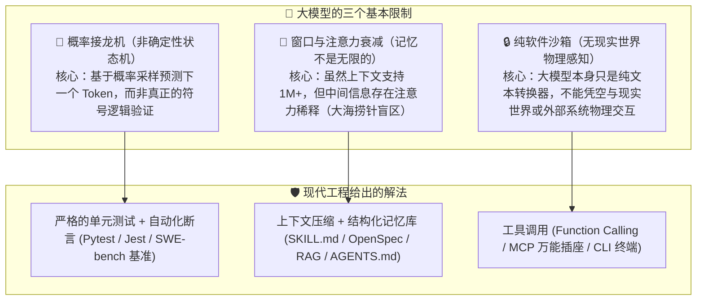
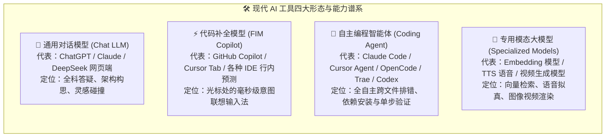
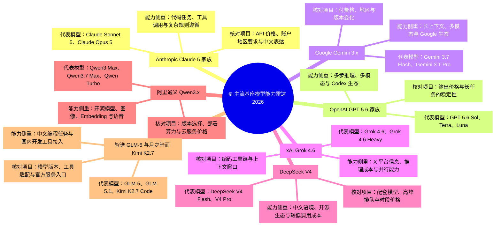
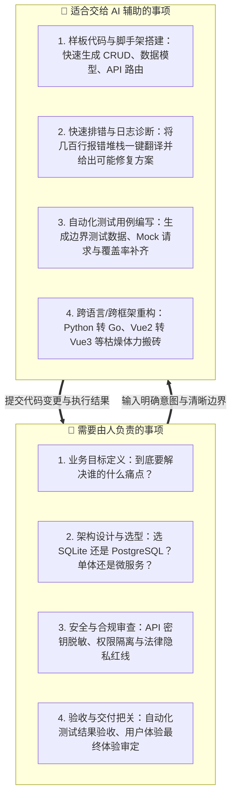

# 14.1 认清各类 AI 的界限：生成机制、工具形态与人机责任

> **本节要点**：
> 大模型擅长根据上下文生成内容、归纳信息和提出方案，但它的知识范围、上下文、工具权限和验证能力都有边界。使用 AI 之前，应先确认任务需要哪些资料和操作权限，再为结果安排测试、审查或事实核对。

***

## 一、先理解大模型的工作方式与客观局限

人们对 AI 的判断有时会随一次结果大幅摆动：看到高质量回答便把架构决策交给模型，遇到错误又认定它无法进入严肃项目。这两种判断都忽略了任务难度、上下文质量、可用工具和验证流程的差别。

要形成稳定判断，可以先理解现代大语言模型（LLM）的三个基本限制：

### 1. 🎲 概率接龙 vs 确定性逻辑（它在"猜"下一个字，而不是在"运行"代码）
- **底层逻辑**：大模型本质上是通过海量代码和人类文本训练出来的**超大规模自回归概率模型**。当你给它一段报错信息时，它是在推演"在人类知识库中，通常哪种回答最像这个报错的标准答案"，而不是在它的硅基脑子里真实启动了一个 Python 解释器或 Java 虚拟机。
- **现实表现**：面对位运算边界、高并发锁竞争等问题，AI 可能生成结构完整、语法正确，却会在特定输入下出错的代码。[Anthropic 的代码审查文档](https://docs.anthropic.com/en/docs/build-with-claude/code-review)也强调审查与测试的重要性。
- **使用方式**：模型可以生成实现和测试思路，单元测试、静态检查与运行结果负责验证。公开基准如 [SWE-bench](https://www.swebench.com/) 可以作为参考，项目选型仍应使用自己的代表性任务复测。

### 2. 🧠 上下文窗口限制与注意力稀释（"失忆"与"注意力涣散"）
- 即使一个人拥有速读整套《四库全书》的能力，如果你让他在第 500 页的脚注里找一个地名，并在第 800 页给出综合推理，随着文本越来越长，他也难免会"漏看"或"前后矛盾"。
- **现实表现**：一些模型支持很长的上下文，但窗口容量并不等于其中每项信息都能被同样准确地使用。一次加入几十个源码文件后，模型仍可能忽略前面的约束，或者混淆不同模块的职责。具体窗口长度应以 [Claude 模型文档](https://platform.claude.com/docs/en/models/overview)、[Gemini 模型文档](https://ai.google.dev/gemini-api/docs/models)和相应厂商页面为准。
- **使用方式**：按模块提供相关文件，把长期约束写入项目规范，并在阶段切换时整理已完成事项、未决问题和验收条件。[OpenSpec](https://github.com/openspec/openspec) 一类规范工具也可用于保存这类上下文。

### 3. 🔌 纯文本模型 vs 外部世界的桥梁（没有手脚的"缸中之脑"）
- **底层逻辑**：一个纯 LLM 只是无状态的文本计算引擎。它不能直接查你的本地文件系统，不能帮你向云服务器发请求，也不能帮你重启数据库。
- **现实表现**：普通网页对话通常只能处理你主动提供的内容；在 [Claude Code](https://code.claude.com)、[Cursor](https://www.cursor.com)、[OpenCode](https://opencode.ai)、[Trae](https://www.trae.ai) 等 Agent 产品中，模型可以通过终端、文件接口和 [MCP（Model Context Protocol）](https://modelcontextprotocol.io/) 连接外部能力。最终能做什么，还取决于客户端开放了哪些工具和权限。

***

## 二、AI 工具形态谱系：各个形态的分工与界限

同一个模型放在网页对话、代码补全和编程 Agent 中，能够获得的上下文和权限并不相同。因此，选工具时应同时看模型与产品形态：

### 1. 各形态详细对比与选型界限

| AI 工具形态 | 典型代表产品 | 较适合的任务 | 主要限制 | 限制来自哪里？ |
| :--- | :--- | :--- | :--- | :--- |
| **通用对话模型 (Chat)** | [ChatGPT](https://chatgpt.com)、[Claude](https://claude.ai)、[DeepSeek](https://chat.deepseek.com)、[Kimi](https://www.kimi.com) | 概念通俗讲解、架构设计草图、业务逻辑梳理、技术选型推演 | 直接操作本地多文件、执行环境构建命令、端到端自动化测试 | 运行在云端网页沙箱中，缺乏本地上下文环境与系统级操作权限 |
| **行内补全 (Copilot)** | [GitHub Copilot](https://github.com/features/copilot)、[Cursor Tab](https://cursor.com)、[Supermaven](https://supermaven.com) | 光标行内毫秒级补全、重复样板代码生成、根据前后文预判下一行 | 大规模跨模块重构、从 0 规划完整项目结构、复杂深层逻辑反思 | 追求极低延迟（<100ms），模型参数量受限且上下文感知有限 |
| **编程智能体 (Agent)** | [Claude Code](https://code.claude.com)、[Cursor Agent](https://www.cursor.com)、[OpenCode](https://opencode.ai)、[Trae SOLO](https://www.trae.ai)、[OpenAI Codex](https://openai.com/index/introducing-codex/) | 自动阅读工程目录、跨文件读写代码、运行终端命令安装依赖、看报错自动改代码 | 替你做出商业利益权衡、替代人类审查安全密钥、在无规范约束下瞎改 | Agent 拥有真实破坏力（可删文件、装依赖、跑命令），若没有 Spec 约束容易陷入死循环或乱改代码 |
| **专用模态模型 (Specialized)** | [Qwen-Embedding](https://github.com/QwenLM/Qwen3)、[CosyVoice](https://github.com/FunAudioLLM/CosyVoice)、[通义万相](https://github.com/Wan-Video/Wan2.1) | 高维语义相似度计算（RAG 必备）、高拟真人类语音、电影级视频生成 | 进行复杂的编程逻辑推理、编写复杂的系统架构、执行条件分支逻辑 | 专为特定模态设计的网络架构与目标函数，专精专攻无跨界推理力 |

***

## 三、主流基座模型的能力侧重（编写时资料，使用前请核对）

不同模型在训练数据、后训练方法、上下文、工具生态和价格上各有侧重。下面的整理用于展示比较维度，不应作为长期固定的排名；模型版本和价格以使用时的官方页面为准：

### 1. Claude 5 家族（代码美学与 Agent 的金标准）
- **适用边界**：复杂工程级代码重构、多文件拓扑修改、极度严苛的系统规范（System Prompt / Rules / AGENTS.md）遵循、自动化 CLI 工具调用。Anthropic 官方 [SWE-bench Verified](https://www.anthropic.com/news/claude-opus-4-6) 成绩长期领跑，[Claude Sonnet 5](https://platform.claude.com/docs/en/models/sonnet-5/overview) 已把 1M 上下文与 128K 输出做到标准价。
- **边界警示**：不要指望用它进行低成本海量闲聊；海外官方网络环境要求极高，容易因 IP 污染被封号。

### 2. DeepSeek V4（中文逻辑推理与工程性价比之王）
- **适用边界**：算法逻辑攻坚（思考模式）、中文技术文档撰写、日常高频代码辅导、预算敏感型批量处理。官方 [API 定价页](https://api-docs.deepseek.com/quick_start/pricing) 显示 V4-Flash 高峰时段缓存未命中输入仅 $0.44/1M、输出 $1.32/1M，并**原生兼容 OpenAI 与 Anthropic 两种接口格式**（`https://api.deepseek.com/anthropic`），可直接塞进 Claude Code / Cursor。
- **边界警示**：DeepSeek 官方目前主要聚焦于语言与推理，若需要做向量检索（RAG）或语音生成，需搭配外部向量模型或语音模型。

### 3. OpenAI GPT-5.6 家族（通用智能与全模态多功能武器）
- **适用边界**：前沿多模态识别、超难算法逻辑与数学建模（旗舰档）、Codex 智能体与全球主流工具生态的最早适配者。官方 [API 定价](https://openai.com/zh-Hans-CN/api/pricing/) 将 GPT-5.6 分为 Sol/Terra/Luna 三档，分别对应"最难任务 / 均衡吞吐 / 高性价比"。
- **边界警示**：普通档位的模型在超长程跨文件任务中偶尔会"偷懒"——输出"请在此处补充你的业务逻辑"之类的省略号，必须用测试兜底。

### 4. xAI Grok 4.6（实时信息与成本较低的推理选项）
- **适用边界**：需要联网信息或对成本较敏感的中等复杂度任务。官方入口为 [Grok 官网](https://grok.com)（订阅）与 [xAI API Console](https://console.x.ai)（按量）；实时信息范围和价格以当前说明为准。
- **边界警示**：编码工程化生态（原生 CLI、Agent 工具链）较 Claude/GPT 起步晚，复杂多文件重构仍建议交给 Claude 5 系列，Grok 更适合当"廉价步兵"。

### 5. 国内新锐：智谱 GLM-5 与 Kimi K2.7 Code
- **GLM-5 / 5.1**：2026 年 3 月发布的 [GLM-5.1](https://bigmodel.cn/) 在 SWE-bench 进入第一梯队，且智谱是最早推出 [GLM Coding Plan](https://open.bigmodel.cn/pricing) 订阅的国内大模型原厂。
- **Kimi K2.7 Code**：[月之暗面官方发布](https://www.kimi.com/zh-cn/resources/kimi-k2-7-code) 显示其为 1T 参数 MoE（激活 32B）、256K 上下文的**编程特化开源模型**，在长程编程任务中比上一代 K2.6 显著提升，适合直接跑 Claude Code / Roo Code / VS Code 插件。

***

## 四、人机分工：哪些决定需要由人承担

AI 可以承担资料整理、代码生成和重复操作，但需求取舍、安全责任和最终验收仍要由人负责。把这些职责写清楚，才能减少误改、数据泄露和错误交付：

### 三条人机分工原则
1. **AI 负责提供选项，人类负责拍板决策**：你可以让 AI 给出 3 种数据库设计方案并对比优缺点，但最终选哪一种，必须由你根据实际业务规模拍板。
2. **AI 负责写代码，人类负责定义测试**：如果你连期望的输入和输出是什么都说不清楚，AI 写出的代码 100% 会偏离预期。
3. **AI 可以执行，人类承担安全与交付责任**：涉及用户密码存储（Bcrypt 哈希）、支付链路或删除数据库表（`DROP TABLE`）的操作，应设置权限限制和人工复核。[Claude Code 的安全文档](https://code.claude.com/docs/en/security)介绍了相应的权限控制机制。

### 补充：用规则和权限约束 Agent
- 从 [Anthropic 官方安全指南](https://code.claude.com/docs/en/security) 与 [OpenAI 安全最佳实践](https://platform.openai.com/docs/guides/safety-best-practices) 中可以看到，业界共识是：**Agent 的能力边界不是靠"自觉"，而是靠"围栏"**。
- 常用做法包括：① 在项目根目录的 `AGENTS.md` 或规则文件中写明可以修改和禁止修改的目录；② 用 Hooks 在读写与命令执行前后记录或拦截；③ 遵循最小权限原则，只开放任务所需的工具。

***

<!-- CH10-14_EXPANSION -->

## 用同一组任务认识工具边界

模型排行榜和产品宣传只能提供候选，真正的边界要通过任务验证。可以准备代码解释、跨文件修改、联网查证和长文整理四类任务，记录每个工具能否访问所需资料、是否正确调用工具、错误能否被发现，以及结果如何撤销。

可以把测试结果记成一张简单的边界表：

| 检查项 | 要记录的事实 | 发现问题后的处理 |
| :--- | :--- | :--- |
| 资料 | 模型实际读取了哪些文件、网页和历史消息 | 补充缺失资料，删除与任务无关的上下文 |
| 工具 | 是否真的执行了搜索、测试或文件修改 | 检查工具返回值，不能把“计划执行”当成“已经执行” |
| 权限 | 能否写文件、访问网络或调用外部系统 | 只开放完成任务所需的权限，敏感操作保留人工确认 |
| 验证 | 结论由测试、日志还是来源链接支持 | 为关键结果增加可重复的检查步骤 |
| 撤销 | 修改失败后怎样恢复 | 使用版本记录、备份或事务机制保存回退路径 |

这张表也能解释“同一个模型为什么在两个产品里表现不同”：差异可能来自可见文件、系统指令、工具集合或默认权限，而不一定来自模型本身。比较产品时，应尽量保持任务、输入和验收标准一致。

在团队项目中，还可以把这张边界表放进仓库文档。新成员据此知道 Agent 可以读取哪些目录、哪些命令允许自动执行、哪些修改必须人工审查。工具或模型升级后，重新跑同一组任务，就能看出能力变化是否真的改善了项目，而不是只比较产品介绍。

模型本身、客户端和外部工具是三层能力。回答不知道最新消息，可能是模型知识截止，也可能是没有联网工具；无法修改文件，可能是权限未开，而不是模型不会写代码。排查时先判断缺的是知识、工具、权限还是上下文。

本节列出的模型名称与版本属于编写时的示例。产品能力变化很快，选择前应查看各厂商当前官方文档，并用自己的任务复测，不把版本排名写成长期结论。

---

## 本节小结与行动清单

- [x] **认清本质**：大模型是高维概率接龙机，确定性的对错必须交给测试套件验证。
- [x] **选对工具形态**：Chat 谈构想，Copilot 补单行，Agent 跑多文件，专用模型做多模态。
- [x] **跟进模型代际**：2026 年主流梯队已是 Claude 5 / GPT-5.6 / Gemini 3.x / Grok 4.6 / DeepSeek-V4 / Qwen3.x，选型时以官方文档与 SWE-bench 等基准为准。
- [x] **明确人机边界**：由人负责需求定义、架构决策、安全审查与最终验收。
