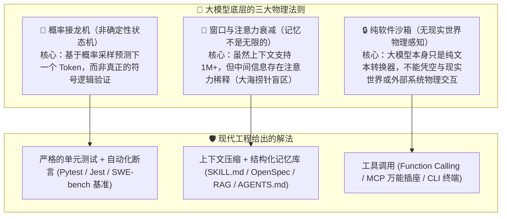
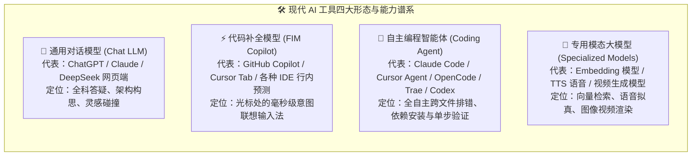
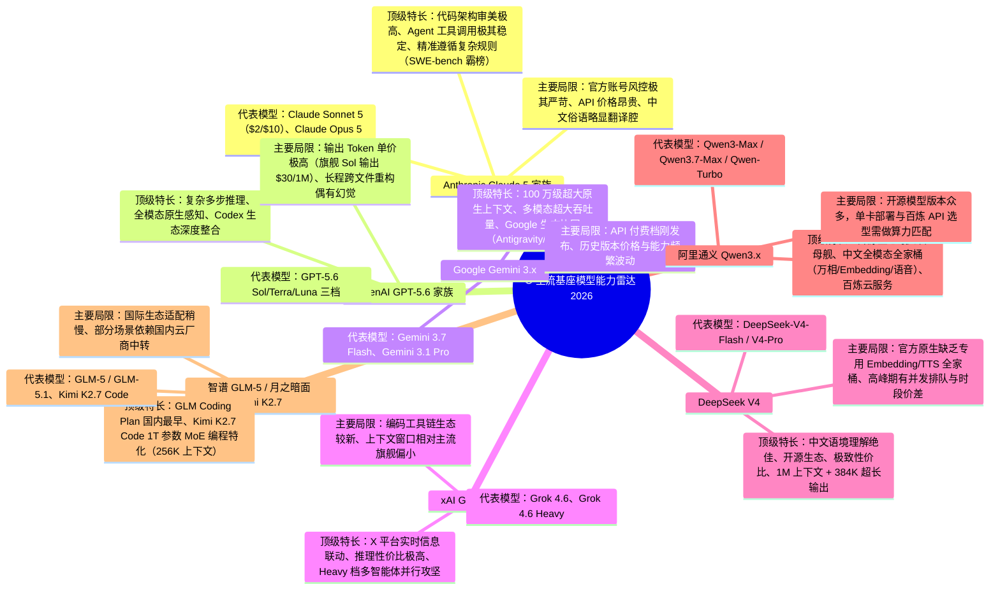
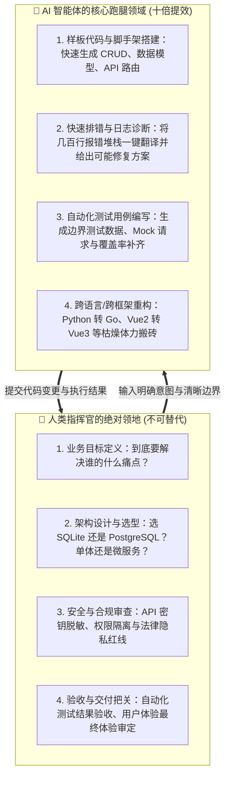

# 14.1 认清楚各个 AI 的界限：概率接龙的物理法则、工具形态谱系与人机责任边界

> **💡 核心认知心法**：
> **不要把 AI 当成全知全能的"造物主神仙"，也不要把它当成毫无智力的"弱智聊天机器人"。AI 在本质上是极其精密的"超级概率推演机"与"全天候外包打工人"。认清每一个 AI 工具的物理上限、特长盲区与能力边界，是成为一名合格 Vibe Coder 与 AI 指挥官的第一道分水岭。**

***

## 🌐 一、第一性原理：大模型的"物理法则"与客观局限

很多人在使用 AI 或 Agent 时容易产生极端的两种心理：要么因 AI 偶尔的惊艳表现而**过度迷信**，把所有架构决策全盘甩锅；要么因 AI 的一次胡说八道而**彻底失望**，觉得 AI 根本不能用于严肃生产。

要打破这种心理波动，我们必须理解现代大语言模型（LLM）底层的三条"硬性物理法则"：

### 1. 🎲 概率接龙 vs 确定性逻辑（它在"猜"下一个字，而不是在"运行"代码）
- **底层逻辑**：大模型本质上是通过海量代码和人类文本训练出来的**超大规模自回归概率模型**。当你给它一段报错信息时，它是在推演"在人类知识库中，通常哪种回答最像这个报错的标准答案"，而不是在它的硅基脑子里真实启动了一个 Python 解释器或 Java 虚拟机。
- **现实映射**：对于复杂的深层位运算、极端边界条件、高并发锁竞争，AI 往往会写出"看起来特别优雅规范、但一运行就爆死锁"的代码。这正是[Anthropic 官方文档](https://docs.anthropic.com/en/docs/build-with-claude/code-review)反复强调"代码必须经过人工审查与测试"的原因。
- **指挥官应对**：**永远不要信任未经测试的代码**。AI 负责产出代码，测试套件（Unit Test / Linter）负责确定性验证。用 [SWE-bench](https://www.swebench.com/) 这类官方评测基准来衡量模型真实写代码能力，而不是听宣传语。

### 2. 🧠 上下文窗口限制与注意力稀释（"失忆"与"注意力涣散"）
- **生活化比喻**：即使一个人拥有速读整套《四库全书》的能力，如果你让他在第 500 页的脚注里找一个地名，并在第 800 页给出综合推理，随着文本越来越长，他也难免会"漏看"或"前后矛盾"。
- **现实映射**：虽然现在的模型支持 128K、1M 甚至 2M Token（如 [Claude Sonnet 5 的 1M 上下文](https://platform.claude.com/docs/en/models/sonnet-5/overview)、[Gemini 3.x 的 1M 上下文](https://ai.google.dev/gemini-api/docs/models)、[DeepSeek-V4 的 1M 上下文](https://api-docs.deepseek.com/quick_start/pricing)），但在实际单次会话塞入几十个源码文件后，模型依然容易出现"顾头不顾尾"、"悄悄把之前的核心约束忘掉"的现象。
- **官方佐证**：Anthropic 在 [Claude 4.7 发布说明](https://www.anthropic.com/news/claude-opus-4-6)中坦承，新 tokenizer 会让同样文本多产生约 30% 的 token——**"喂进去多少字"直接决定"能记住多少"和"要花多少钱"**。
- **指挥官应对**：不要一次性把整个 10 万行的工程代码一股脑喂给对话框，必须通过模块拆解、[OpenSpec 规范](https://github.com/openspec/openspec) 与子智能体隔离来精准喂养。

### 3. 🔌 纯文本模型 vs 外部世界的桥梁（没有手脚的"缸中之脑"）
- **底层逻辑**：一个纯 LLM 只是无状态的文本计算引擎。它不能直接查你的本地文件系统，不能帮你向云服务器发请求，也不能帮你重启数据库。
- **现实映射**：当你在普通网页端 ChatGPT/Claude 对话框里要求"帮我修一下这个 Bug"时，你必须自己充当人肉搬运工；而当它处于 **Agent 架构**（如 [Claude Code](https://code.claude.com)、[Cursor](https://www.cursor.com)、[OpenCode](https://opencode.ai)、[Trae](https://www.trae.ai)）中时，它是通过调用外部 Shell、文件读写 API、MCP 协议才长出了"手和脚"。这也解释了为什么 [MCP（Model Context Protocol）](https://modelcontextprotocol.io/) 会被 Anthropic 与 OpenAI、Google 等共同推为行业标准——**只有接上工具，模型才有手脚**。

***

## 🧩 二、AI 工具形态谱系：各个形态的分工与界限

在日常开发与业务中，AI 不仅是单个模型，而是呈现为不同的产品形态。千万不要用"开卡车的方法去跑赛道"，我们必须对主流形态有清晰的定位界限：

### 1. 各形态详细对比与选型界限

| AI 工具形态 | 典型代表产品 | 擅长做什么（甜蜜区） | 绝对做不好什么（禁忌区） | 为什么会有这种界限？ |
| :--- | :--- | :--- | :--- | :--- |
| **通用对话模型 (Chat)** | [ChatGPT](https://chatgpt.com)、[Claude](https://claude.ai)、[DeepSeek](https://chat.deepseek.com)、[Kimi](https://www.kimi.com) | 概念通俗讲解、架构设计草图、业务逻辑梳理、技术选型推演 | 直接操作本地多文件、执行环境构建命令、端到端自动化测试 | 运行在云端网页沙箱中，缺乏本地上下文环境与系统级操作权限 |
| **行内补全 (Copilot)** | [GitHub Copilot](https://github.com/features/copilot)、[Cursor Tab](https://cursor.com)、[Supermaven](https://supermaven.com) | 光标行内毫秒级补全、重复样板代码生成、根据前后文预判下一行 | 大规模跨模块重构、从 0 规划完整项目结构、复杂深层逻辑反思 | 追求极低延迟（<100ms），模型参数量受限且上下文感知有限 |
| **编程智能体 (Agent)** | [Claude Code](https://code.claude.com)、[Cursor Agent](https://www.cursor.com)、[OpenCode](https://opencode.ai)、[Trae SOLO](https://www.trae.ai)、[OpenAI Codex](https://openai.com/index/introducing-codex/) | 自动阅读工程目录、跨文件读写代码、运行终端命令安装依赖、看报错自动改代码 | 替你做出商业利益权衡、替代人类审查安全密钥、在无规范约束下瞎改 | Agent 拥有真实破坏力（可删文件、装依赖、跑命令），若没有 Spec 约束容易陷入死循环或乱改代码 |
| **专用模态模型 (Specialized)** | [Qwen-Embedding](https://github.com/QwenLM/Qwen3)、[CosyVoice](https://github.com/FunAudioLLM/CosyVoice)、[通义万相](https://github.com/Wan-Video/Wan2.1) | 高维语义相似度计算（RAG 必备）、高拟真人类语音、电影级视频生成 | 进行复杂的编程逻辑推理、编写复杂的系统架构、执行条件分支逻辑 | 专为特定模态设计的网络架构与目标函数，专精专攻无跨界推理力 |

***

## 🔬 三、主流基座大模型的能力界限与特长雷达（2026 年 8 月版）

即使同样是处于行业第一梯队的基座大模型，各家厂商在训练数据、后训练（RLHF / RLAIF）偏好和架构设计上也存在极其明显的"脾气性格"与能力分界。以下为 2026 年中最新一代模型梯队：

### 1. Claude 5 家族（代码美学与 Agent 的金标准）
- **适用边界**：复杂工程级代码重构、多文件拓扑修改、极度严苛的系统规范（System Prompt / Rules / AGENTS.md）遵循、自动化 CLI 工具调用。Anthropic 官方 [SWE-bench Verified](https://www.anthropic.com/news/claude-opus-4-6) 成绩长期领跑，[Claude Sonnet 5](https://platform.claude.com/docs/en/models/sonnet-5/overview) 已把 1M 上下文与 128K 输出做到标准价。
- **边界警示**：不要指望用它进行低成本海量闲聊；海外官方网络环境要求极高，容易因 IP 污染被封号。

### 2. DeepSeek V4（中文逻辑推理与工程性价比之王）
- **适用边界**：算法逻辑攻坚（思考模式）、中文技术文档撰写、日常高频代码辅导、预算敏感型批量处理。官方 [API 定价页](https://api-docs.deepseek.com/quick_start/pricing) 显示 V4-Flash 高峰时段缓存未命中输入仅 $0.44/1M、输出 $1.32/1M，并**原生兼容 OpenAI 与 Anthropic 两种接口格式**（`https://api.deepseek.com/anthropic`），可直接塞进 Claude Code / Cursor。
- **边界警示**：DeepSeek 官方目前主要聚焦于语言与推理，若需要做向量检索（RAG）或语音生成，需搭配外部向量模型或语音模型。

### 3. OpenAI GPT-5.6 家族（通用智能与全模态多功能武器）
- **适用边界**：前沿多模态识别、超难算法逻辑与数学建模（旗舰档）、Codex 智能体与全球主流工具生态的最早适配者。官方 [API 定价](https://openai.com/zh-Hans-CN/api/pricing/) 将 GPT-5.6 分为 Sol/Terra/Luna 三档，分别对应"最难任务 / 均衡吞吐 / 高性价比"。
- **边界警示**：普通档位的模型在超长程跨文件任务中偶尔会"偷懒"——输出"请在此处补充你的业务逻辑"之类的省略号，必须用测试兜底。

### 4. xAI Grok 4.6（实时信息与高性价比推理黑马）
- **适用边界**：需要联网追踪实时热点与最新资讯的任务、对成本敏感的中等复杂度推理、作为"便宜跑腿档"承接高并发琐碎任务。官方入口为 [Grok 官网](https://grok.com)（订阅）与 [xAI API Console](https://console.x.ai)（按量）。
- **边界警示**：编码工程化生态（原生 CLI、Agent 工具链）较 Claude/GPT 起步晚，复杂多文件重构仍建议交给 Claude 5 系列，Grok 更适合当"廉价步兵"。

### 5. 国内新锐：智谱 GLM-5 与 Kimi K2.7 Code
- **GLM-5 / 5.1**：2026 年 3 月发布的 [GLM-5.1](https://bigmodel.cn/) 在 SWE-bench 进入第一梯队，且智谱是最早推出 [GLM Coding Plan](https://open.bigmodel.cn/pricing) 订阅的国内大模型原厂。
- **Kimi K2.7 Code**：[月之暗面官方发布](https://www.kimi.com/zh-cn/resources/kimi-k2-7-code) 显示其为 1T 参数 MoE（激活 32B）、256K 上下文的**编程特化开源模型**，在长程编程任务中比上一代 K2.6 显著提升，适合直接跑 Claude Code / Roo Code / VS Code 插件。

***

## 🛡️ 四、人机边界：人类指挥官与 AI 员工的黄金契约

在 Vibe Coding 时代，最危险的做法就是**彻底躺平，把一切责任交给 AI**。明确"人机边界"是保障项目不翻车、不破产、不泄密的基石：

### 💡 黄金人机分工法则：
1. **AI 负责提供选项，人类负责拍板决策**：你可以让 AI 给出 3 种数据库设计方案并对比优缺点，但最终选哪一种，必须由你根据实际业务规模拍板。
2. **AI 负责写代码，人类负责定义测试**：如果你连期望的输入和输出是什么都说不清楚，AI 写出的代码 100% 会偏离预期。
3. **AI 负责冲锋陷阵，人类负责安全兜底**：任何涉及用户密码存储（Bcrypt 哈希）、支付链路、删除数据库表（`DROP TABLE`）的操作，必须由人类眼睛死死盯住！这正是 [Claude Code 的 Human-in-the-Loop 权限体系](https://code.claude.com/docs/en/security) 存在的意义——危险命令默认拦截，等人类签字放行。

### 📌 补充：Agent 时代的"规范边界"——没有纪律的 Agent 等于失控的野兽
- 从 [Anthropic 官方安全指南](https://code.claude.com/docs/en/security) 与 [OpenAI 安全最佳实践](https://platform.openai.com/docs/guides/safety-best-practices) 中可以看到，业界共识是：**Agent 的能力边界不是靠"自觉"，而是靠"围栏"**。
- 围栏三件套：① 项目根目录的 `AGENTS.md` / `.cursorrules` 明文约定可改/禁改的目录；② Hooks 机制在读写与命令执行前后做拦截审计；③ 最小权限原则，只给 Agent 它必须用的工具，不给万能钥匙。

***

## 🎯 本节小结与行动清单

- [x] **认清本质**：大模型是高维概率接龙机，确定性的对错必须交给测试套件验证。
- [x] **选对工具形态**：Chat 谈构想，Copilot 补单行，Agent 跑多文件，专用模型做多模态。
- [x] **跟进模型代际**：2026 年主流梯队已是 Claude 5 / GPT-5.6 / Gemini 3.x / Grok 4.6 / DeepSeek-V4 / Qwen3.x，选型时以官方文档与 SWE-bench 等基准为准。
- [x] **坚守人机边界**：牢牢抓紧需求定义、架构决策、安全审计与最终验收四项核心主权。
