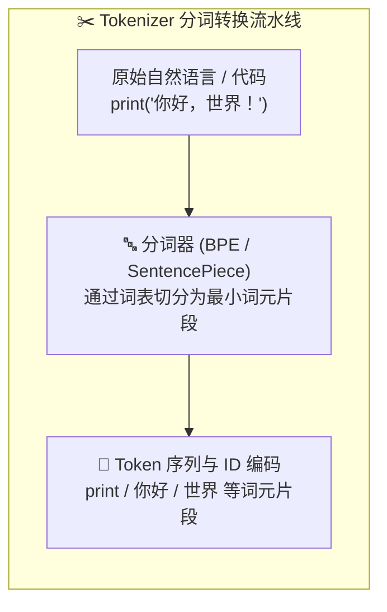
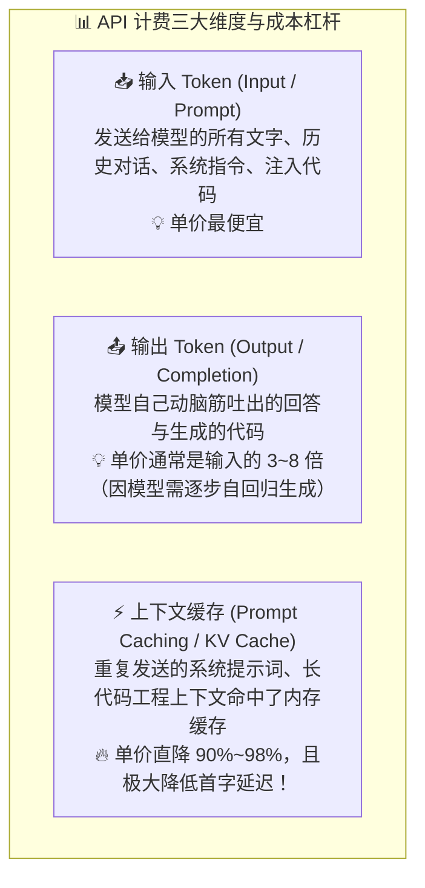
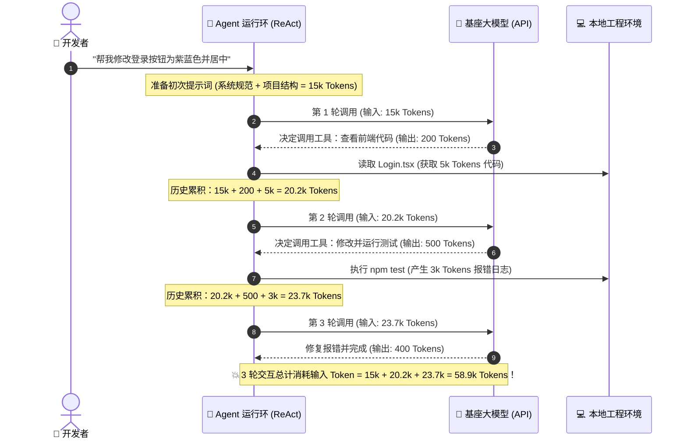
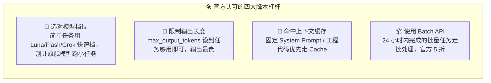

# 14.2 搞清楚各个 AI 是如何计费的：Token 原理、官方价格全景表与 Agent 乘法风暴

> **💡 核心认知心法**：
> **很多初学者用 AI 编程时，经常会遇到两大困惑："为什么我买了 20 美元的包月会员，用了半天就被限流了？"或者"为什么我手搓 Agent 跑了一会儿，几十块钱的 API 余额瞬间见底了？"。算清 Token 经济账、搞懂缓存命中机制与订阅配额陷阱，是守护你钱包的硬核基本功！**
>
> **📌 本节所有价格均引用各大厂商 2026 年 8 月官方定价文档，汇率按 1 美元 ≈ 7.2 元人民币粗略折算，实际以官网为准。**

***

## 🪙 一、第一性原理：大模型的计价度量衡——Token

在大模型的世界里，计算机不按"字数"计费，也不按"时间"计费，而是按 **Token（词元）** 计费。

### 1. Token 折算常识速查

- **英文单词**：1 个英文单词通常等于 $1 \sim 1.3$ 个 Token（如 `function` 是 1 个 Token，复杂长单词会被拆开）。OpenAI 官方口径：**约 1000 Token ≈ 750 个英文单词**（见 [OpenAI 官方 Token 说明](https://platform.openai.com/docs/guides/token-usage)）。
- **中文汉字**：在经过针对中文优化的现代分词器（如 DeepSeek、Qwen、GLM）下，**1 个汉字通常等于** **$0.6 \sim 1.2$** **个 Token**；而在早期的老旧国外模型（如早期 GPT-3.5）下，由于中文字表稀疏，1 个汉字可能会被拆成 2\~3 个 Token。
- **代码与标点符号**：代码中的缩进空格（4 个空格）、括号换行、特殊字符会单独切分成 Token。**一份 1000 行的 Python 源码，通常会膨胀为 4,000 \~ 8,000 个 Token**。
- ⚠️ **新坑预警**：Anthropic 在 [官方定价文档](https://platform.claude.com/docs/en/about-claude/pricing) 中明确指出，**Claude 4.7 及以后的新模型使用了新 tokenizer，同样文本约多产出 30% 的 token**。也就是说，同一段代码在旧模型上是 1000 个 Token，在 Claude 4.7+/Sonnet 5 上可能变成 1300 个 Token——**计费基数变大了**，这是很多老用户"突然变贵"的隐藏原因。

***

## 💳 二、API 计费的三大核心维度

如果你使用的是开发者 API（按量计费），你的每一笔账单都由以下三个维度决定：

### 1. 为什么"输出 Token"比"输入 Token"贵那么多？

- **并行吞吐 vs 串行生成**：当服务器接收你的输入时，GPU 可以用矩阵乘法一次性**超高速并行处理**全部输入文本；但在生成输出时，大模型必须像吐泡泡一样，**吐出一个字才能作为下一个字的输入**（自回归串行），霸占 GPU 显存的时间极长，因此各厂商对输出 Token 的定价往往是输入 Token 的 3 到 8 倍。
- 以 2026 年 8 月官方价为例：Claude Sonnet 5 输出/输入 = \$10/\$2 = **5 倍**；GPT-5.6 Terra = \$12/\$2 = **6 倍**；Gemini 3.7 Flash 标准价 = \$7.5/\$1.5 = **5 倍**。**控制成本的第一个杠杆永远是压缩无意义的超长输出**（设置 `max_output_tokens`）。

### 2. 神级降本武器：Prompt Caching（上下文缓存）

- **核心机制**：在 Agent 或长文本场景中，前置的 `System Prompt`、项目架构规范（`AGENTS.md`）以及未改动的几万行代码其实是固定不变的。
  - [Anthropic Claude Prompt Caching 官方文档](https://platform.claude.com/docs/en/build-with-claude/prompt-caching)：缓存命中（Cache Read）仅按基础输入价的 **0.1 倍**（打一折，省 90%）；
  - [OpenAI 官方定价](https://developers.openai.com/api/docs/pricing)：GPT-5.6 缓存输入约为普通输入价 **1/10**（如 Terra 从 \$2 降到 \$0.20）；
  - [Google Gemini 上下文缓存](https://ai.google.dev/gemini-api/docs/caching)：读取按输入价的约 **1/10**，另收每小时每百万 token 约 \$1 的存储费；
  - [DeepSeek 官方 KV Cache](https://api-docs.deepseek.com/guides/kv_cache)：缓存命中输入仅 **\$0.014/1M**（高峰），是缓存未命中 (\$0.44) 的 **1/31**，相当于省 **97%**；
  - [阿里百炼上下文缓存](https://help.aliyun.com/zh/model-studio/context-cache)：Qwen3.8-Max 缓存命中 ¥1.5/1M，是普通输入 ¥12 的 1/8。
- **降本效果**：一旦命中缓存，重复输入的 Token 价格直接打 1\~2 折（立省 80%\~97%），且首字吐出速度提升数倍！**重度使用 Agent 的人，务必选支持 Prompt Caching 的模型与工具。**

***

## 🌪️ 三、Agent 运行时的"Token 乘法风暴"

很多人不理解："我只是让 Agent 帮我改一个登录按钮的颜色，为什么后台跑掉了 50 万 Token？"

这就是 **Agent 循环的 Token 乘法风暴**：

### 💡 乘法风暴揭秘：

大模型本身是**无状态**的。Agent 每执行一步工具（看文件、跑命令、看报错），都必须把**前面所有步骤的历史记录 + 新产生的工具输出**全量打包，重新塞给大模型作为下一次推理的输入。

- 第 1 轮：输入 1.5 万
- 第 2 轮：输入 2.0 万
- 第 3 轮：输入 2.4 万
- 第 10 轮：输入可能单次就达到 6 万！
- **累加总账单**：$1.5 + 2.0 + 2.4 + \dots + 6.0 = 30$ 万+ Token！这就是为什么放任 Agent 无休止打转会迅速烧干额度。
- **真实案例**：2026 年初，一位开发者用 Claude Code 连续运行 **13 小时烧掉约 200 美元** 的 API 账单截图在社区疯传，直接引爆了后来国内各家厂商推出"固定月费 Coding Plan"的浪潮（详见 14.3 节）。

***

## 🍿 四、订阅制（包月套餐）的真相与"公平使用配额"

除了按量 API，大部分人接触的是各种 \$20/月的订阅套餐（如 ChatGPT Plus、Claude Pro、Cursor Pro、GitHub Copilot 等）。

### 1. "无限使用"真的无限吗？—— 了解 Fair Use Policy（公平使用原则）

- **商业本质**：大模型算力是昂贵的真金白银。没有一家商业公司能够承受用户 24 小时不间断用顶配模型跑高并发脚本。
- **限制手段**：
  - **滑动时间窗口限制**：Claude 采用"每 5 小时滚动窗口 + 每周上限"双重额度（[官方说明](https://support.anthropic.com/)），Pro 每 5 小时约 45 条消息 / 10\~40 次 Claude Code 提示；
  - **并发排队与模型降级**：在高并发用量过大时，平台会自动将你的请求从满血旗舰模型（如 Claude Opus 5）降级为速度快但智商较低的轻量档模型，或者直接提示"请稍后再试"。

### 2. 三大主流计费模式对比

| 计费形态                        | 代表产品                                                                                                                                                                                                      | 收费标准                 | 适合场景                                 | 隐藏避坑点                             |
| :-------------------------- | :-------------------------------------------------------------------------------------------------------------------------------------------------------------------------------------------------------- | :------------------- | :----------------------------------- | :-------------------------------- |
| **个人订阅制 (Subscription)**    | [Cursor Pro](https://cursor.com/pricing) (\$20/月)、[Claude Pro](https://claude.com/pricing) (\$20/月)、[ChatGPT Plus](https://chatgpt.com/pricing) (\$20/月)、[Trae Pro](https://www.trae.ai/pricing) (\$10/月) | 固定月租或年租              | 个人日常高频手写代码、交互式即时问答、小规模迭代             | 遇到复杂长会话极易触碰 5 小时额度墙；多开几个会话额度瞬间耗尽  |
| **开发者 API (Pay-as-you-go)** | [DeepSeek 开放平台](https://platform.deepseek.com)、[Anthropic Console](https://console.anthropic.com)、[OpenAI Platform](https://platform.openai.com)、[阿里百炼](https://bailian.console.aliyun.com/)              | 用多少扣多少（按百万 Token 计价） | 驱动 Agent 自动化脚本、CLI 工具、后台批量流水线、轻量偶发用户 | 没有设置预算上限（Hard Limit）时，死循环可能产生意外账单 |
| **团队席位制 (Seat-based)**      | [GitHub Copilot Business](https://github.com/features/copilot/plans) (\$19/席/月)、[Cursor Teams](https://cursor.com/pricing) (\$40/席/月)、[Claude Team](https://claude.com/pricing) (\$25/席/月)                | 按公司员工人头按月计费          | 企业统一部署、组织代码资产私密性保障、集中开票与审计           | 团队成员中如果不常用也会白白扣除月租席位费             |

***

## 📊 五、2026 主流前沿模型 API 价格全景速查表（官方文档整理）

> 💡 *以下价格为 2026 年 8 月各厂商官方定价文档整理（单位：美元 / 每 100 万 Tokens，部分标注人民币）。价格为标准档、短上下文基准价，长上下文与数据驻留可能有溢价。*

### 1. 海外主流厂商最新代际官方价格

| 模型供应商与型号 | 输入 (1M) | 输出 (1M) | 缓存命中 (1M) | 最大上下文 | 综合定位 |
| :--- | :--- | :--- | :--- | :--- | :--- |
| **Claude Sonnet 5**（[官方模型页](https://platform.claude.com/docs/en/models/sonnet-5/overview)） | **\$2.00** | **\$10.00** | **\$0.20** | **1M** | 👑 代码与 Agent 金标准（性价比最佳） |
| **Claude Opus 5**（[官方模型页](https://platform.claude.com/docs/en/models/opus-5/overview)） | **\$5.00** | **\$25.00** | **\$0.50** | **1M** | 🏆 旗舰：最复杂工程重构 |
| **Claude Fable 5**（[官方模型页](https://platform.claude.com/docs/en/models/fable-5/overview)） | **\$10.00** | **\$50.00** | **\$1.00** | **1M** | 🌌 超旗舰：深度推理与超大输出 |
| **GPT-5.6 Luna**（[OpenAI 定价](https://developers.openai.com/api/docs/pricing)） | **\$0.20** | **\$1.20** | **\$0.02** | — | 💰 日常廉价档：分类/信息提取/批量 |
| **GPT-5.6 Terra** | **\$2.00** | **\$12.00** | **\$0.20** | — | ⚖️ 均衡档：高吞吐通用任务 |
| **GPT-5.6 Sol** | **\$4.00** | **\$20.00** | **\$0.40** | — | 🧠 旗舰 Agent 档（长上下文 \$8/\$30） |
| **Grok 4.6**（[xAI 定价](https://docs.x.ai/docs/models)） | **\$1.50** | **\$7.50** | **\$0.15** | **256K** | ⚡ 推理性价比黑马 + X 实时信息联动 |
| **Grok 4.6 Heavy** | **\$6.00** | **\$30.00** | — | **256K** | 🧠 xAI 旗舰：多智能体并行攻坚最难任务 |
| **Gemini 3.7 Flash**（[Gemini 定价](https://ai.google.dev/gemini-api/docs/pricing)，2026-08-13 发布） | **\$0.75**（限时）→\$1.50 | **\$3.75**→\$7.50 | **\$0.075**→\$0.15 | **1M** | 🚀 超大窗口 + 便宜，优惠价到 2026 年底 |
| **Gemini 3.1 Pro Preview** | **\$2.00**（≤200K）/\$4.00 | **\$12.00**/\$18.00 | — | **1M** | 🏛️ 旗舰推理档，长上下文溢价 |

> 💡 **关键解读**：
>
> 1. **Gemini 3.7 Flash 目前是限时促销价**（\$0.75/\$3.75 到 2026-12-31），之后涨回 \$1.50/\$7.50，预算要按标准价算。
> 2. **OpenAI 长上下文有溢价**：GPT-5.6 Sol 短上下文 \$4/\$20，超过阈值进入长上下文档后涨到 \$8/\$30，塞长代码要小心。

### 2. 国内厂商官方价格（人民币 / 每 100 万 Tokens）

| 模型供应商与型号 | 输入 (1M) | 输出 (1M) | 缓存命中 (1M) | 最大上下文 | 综合定位 |
| :--- | :--- | :--- | :--- | :--- | :--- |
| **Qwen3.8-Max**（[百炼模型页](https://help.aliyun.com/zh/model-studio/qwen3-8-max)） | **¥12** | **¥36** | **¥1.5** | **1M** | 🏆 阿里旗舰（长上下文 Agent） |
| **Qwen3.7-Plus**（[百炼模型页](https://help.aliyun.com/zh/model-studio/qwen3-7-plus)） | **¥2**（≤256K）/¥6 | **¥8**/¥24 | **¥0.4**/¥1.2 | **1M** | ⚖️ 阿里均衡档（多模态智能体） |
| **GLM-5.3**（[智谱开放平台](https://open.bigmodel.cn/pricing)） | **¥8** | **¥28** | **¥2** | **1M** | 🧠 智谱旗舰推理 |
| **GLM-5.3-Flash** | **¥0.8** | **¥2.8** | **¥0.23**（限时半价 ¥0.115） | **1M** | ⚡ 智谱轻量极速档（白菜价） |
| **Kimi K3**（[Kimi 官方定价](https://platform.kimi.com/docs/pricing/chat-k3)） | **¥20** | **¥100** | **¥2** | **1M** | 🧠 月之暗面编程特化 |
| **MiniMax M3**（[MiniMax 定价](https://platform.minimaxi.com/docs/guides/pricing-paygo)） | **¥2.1**（≤512K） | **¥8.4** | **¥0.42** | **1M** | 🧠 MiniMax 旗舰 |
| **小米 MiMo V2.5 Pro**（[小米 Mimo](https://mimo.mi.com)） | **¥3** | **¥6** | **¥0.025** | **1M** | 💰 小米高性价比 |
| **DeepSeek-V4-Flash**（[DeepSeek 定价](https://api-docs.deepseek.com/quick_start/pricing)） | **¥3.0**（高峰）/¥1.5（闲时） | **¥9.0**/¥4.5 | **¥0.1**/¥0.05 | **1M**（输出 384K） | 🏆 **极致性价比之王** |
| **DeepSeek-V4-Pro** | **¥9.0**/¥4.5 | **¥27.0**/¥13.5 | **¥0.3**/¥0.15 | **1M** | 🧠 深度推理档 |

> 💡 **国内档位小结**：按需使用推荐 **DeepSeek-V4-Flash** 和 **GLM-5.3-Flash**（白菜价够用）；需要旗舰推理能力则看各家最新旗舰（Qwen3.8-Max / GLM-5.3 / Kimi K3 / MiniMax M3）；重度 Agent 用户建议直接买各家 **Coding Plan 订阅**（见 14.3）封顶账单。
>
> 📌 **DeepSeek 有"高峰/闲时"两套价**：高峰为北京时间周一至周五 9:00-12:00、14:00-18:00，闲时打 5 折。批量脚本、定时任务可以挪到夜间跑，立省一半！

***

## 💸 六、四大官方省钱杠杆（必须掌握的 API 成本公式）

1. **🎯 选对档位**：同一厂商里 Luna/Flash/Grok 快速档与 Opus/Sol/Pro 可能差 10\~25 倍价格。把"高并发琐碎任务"交给小模型，把"复杂推理"留给大模型，是成本控制的第一要义。
2. **🧮 限制输出**：输出 Token 是输入价格的 3\~8 倍。分类、JSON 提取、关键词生成本来 200 Token 就够，没必要允许模型输出几千 Token。
3. **🔁 缓存命中**：RAG、Agent、长 System Prompt 场景下，缓存命中价通常只有普通输入的 1/10 甚至 1/31（DeepSeek）。**这是所有官方文档一致推荐的头号省钱手段**。
4. **📦 Batch API**：Anthropic、OpenAI、Gemini、百炼全部提供 Batch 批处理接口，**输入输出一律 5 折**，适合 24 小时内不着急的任务（离线跑批、数据分析、批量标注）。

***

## 🎯 本节小结与省钱指南

- [x] **建立 Token 意识**：牢记 1000 行代码约为 5000+ Tokens，输出 Token 价格是输入 Token 的 3\~8 倍。
- [x] **用好上下文缓存**：选型时优先支持 Prompt Caching 的模型，让不变的代码与规范享受 1\~3 折特惠。
- [x] **警惕 Agent 乘法风暴**：不要放任 Agent 自主跑几十轮无意义的报错排查，及时人工干预或拆解任务。
- [x] **看清包月限制**：20 美元买的是"有限额度的 VIP 通道"，遇到高并发期要搭配 API 备选方案。
- [x] **善用 Batch 与闲时价**：批量任务走 5 折 Batch API，非实时任务挪到 DeepSeek 闲时档，能省一大笔。

