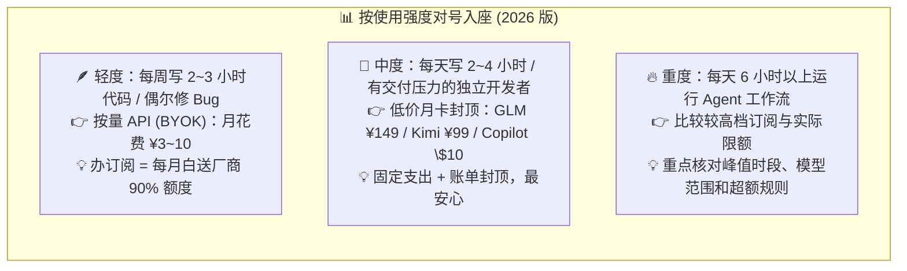
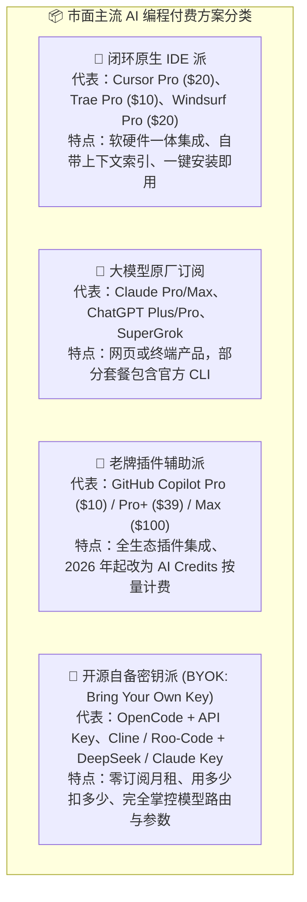
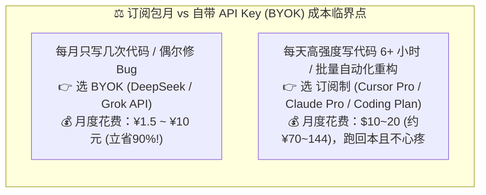
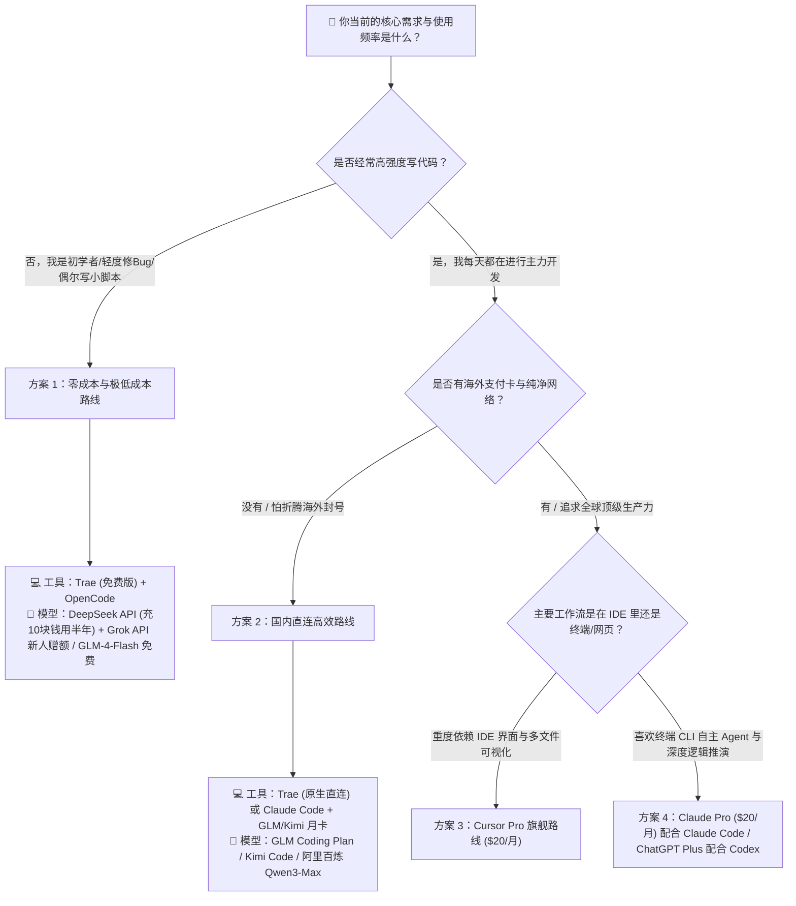

# 14.3 到底需不需要订阅 Coding Plan 和 Agent Plan：订阅选择与价格快照

> **本节要点**：
> Coding Plan、网页会员和按量 API 的计费方式不同。选择之前，应先记录自己的使用频率、常用任务、可接受的限流方式和月度预算，避免同时购买多个功能重叠的套餐。
>
> **📌 下列套餐用于展示订阅选择时应比较的项目，价格与权益是编写时快照。购买前请以各厂商官方定价页和结算页为准。**

***

## 一、先看基本逻辑：订阅制到底是一门什么生意？

在掏钱之前，先搞懂订阅制的商业本质——**它和健身房卖年卡是同一门生意**：

- **套餐按平均用量定价**：如果每周只使用几次，包月费用可能高于按量 API；如果长期高频使用，包月方案可能更容易控制预算。
- **包月不等于无限使用**：滚动时间窗口、每周上限和 Fair Use 条款仍会限制高强度调用，具体规则以购买页面为准。
- **判断依据是自己的使用强度**：同一个套餐对不同用户的价值差异很大，不能只比较标价。

> **建议**：先用 BYOK 或免费额度记录一周的调用次数、Token 和等待时间，再判断包月套餐能否降低成本或减少限流影响。

***

## 二、主流 Coding Plan 与 Agent Plan 的类型

在 AI 辅助编程领域，付费产品主要分为以下几大派系：

### 1. 海外主流方案整体对比表（2026-08 官方价）

| 方案类别 | 代表产品 | 官方价格 | 核心优势 | 潜在短板 / 限制 | 适合人群 |
| :--- | :--- | :--- | :--- | :--- | :--- |
| **Cursor Pro** | [Cursor 定价页](https://cursor.com/pricing) | **\$20 / 月**（年付折合 \$16/月） | 代码库全局向量索引超快、Composer 多文件编辑、内置 \$20/月 API 用量、学生免费 1 年 Pro | 用量用尽后需按 API 价续量；Pro+\$60、Ultra\$200 进阶 | 每天写 4 小时以上代码的重度全职开发者 |
| **Claude Pro** | [Claude 定价页](https://claude.com/pricing) | **\$20 / 月**（年付 \$200 ≈ \$17/月） | 包含套餐范围内的 Claude 模型与 Claude Code CLI | 有滚动窗口和周用量限制，账户需符合服务地区与条款 | 高频使用 Claude 进行推理与代码工作的用户 |
| **Claude Max 5x / 20x** | [Claude 定价页](https://claude.com/pricing) | **\$100 / \$200 每月** | 分别为 Pro 额度的 5 倍 / 20 倍、高峰优先、新功能抢先 | 价格昂贵，仅适合全天候重度 Agent 工作流 | 把 Claude 当唯一主力生产力工具的极客 |
| **ChatGPT Plus** | [ChatGPT 定价页](https://chatgpt.com/pricing) | **\$20 / 月** | 包含套餐范围内的 GPT 模型、Codex 及部分多模态功能 | 不同功能有各自用量限制；Codex 的上下文与用量规则见当前官方说明 | 同时需要通用办公、代码与多模态功能的用户 |
| **ChatGPT Go** | [OpenAI 官方博客](https://openai.com/index/introducing-chatgpt-go/) | **\$8 / 月**（美区） | 最便宜订阅、GPT-5.2 Instant、10 倍于免费层消息量 | 含广告、模型为快速版、无深度思考 | 预算敏感、仅需日常问答的学生党 |
| **GitHub Copilot Pro** | [Copilot 计划页](https://github.com/features/copilot/plans) | **\$10 / 月**（含 \$15 月 AI Credits） | 价格亲民、全平台插件（VS Code/JetBrains/Neovim）、2026-06 起按 AI Credits 计费 | 用量按 Credits 计，重度 Agent 容易烧完 | 传统工程师日常写代码时的"行内智能输入法" |
| **Copilot Pro+ / Max** | [Copilot 计划页](https://github.com/features/copilot/plans) | **\$39 / \$100 每月** | Pro+ 含 \$70 Credits、Max 含 \$200 Credits、Opus 等旗舰模型 | 越往上价格越高，需评估是否真用得完 | AI 重度用户、全天候 Agent 工作流 |
| **Windsurf Pro** | [Windsurf 定价](https://windsurf.com/pricing) | **\$20 / 月**（2026-03 起按日/周配额制） | 额度每日/每周刷新、超额按 API 价购买、2026-06 并入 Devin 体系 | 配额是"速率上限"而非月总额，密集使用受限 | 喜欢 Cascade 智能体的 IDE 用户 |
| **SuperGrok（xAI）** | [Grok 订阅](https://grok.com) | **\$30 / 月** | 提供套餐范围内的 Grok 模型、思考模式和 X 信息能力 | 编码工具链与可用额度需按当前产品说明核对 | 高频使用 X 与 Grok 系列的用户 |
| **OpenRouter（BYOK）** | [OpenRouter](https://openrouter.ai/) | **\$0 订阅 + 充值**（充值时收 5.5% 平台费） | 一个 Key 访问多家模型，可配置供应商与路由 | 无固定额度，按量扣费；充值余额与服务费规则需定期核对 | 希望统一管理多模型调用与成本的开发者 |

### 2. 国内 Coding Plan 整体对比表（2026 年官方价）

> 📌 **背景**：2026 年初"13 小时烧掉 200 美元"的 Claude Code 账单事件引爆了国内 Coding Plan 浪潮。智谱 2025 年底率先推出 [GLM Coding Plan](https://open.bigmodel.cn/pricing)，2026 年 2 月阿里云百炼以低价跟进，随后 Kimi、MiniMax、腾讯云等纷纷入局，把"固定月费封顶账单"变成了国产 AI 编程的标配。

| 平台 | 套餐档位 | 官方价格 | 额度机制 | 兼容工具 |
| :--- | :--- | :--- | :--- | :--- |
| **智谱 GLM Coding Plan** | Lite / Pro / Max | **¥49 / ¥149 / ¥469 每月** | 每 5 小时约 80 / 400 / 1600 Prompts；每周约 400 / 2000 / 8000 Prompts；GLM-5 消耗 3 倍额度 | Claude Code、Cline、Cursor 等 20+ 工具 |
| **Kimi Code（月之暗面）** | Andante / Moderato / Allegretto / Allegro | **¥49（连续包月 ¥39）/ ¥99（¥79）/ ¥199（¥159）/ ¥699（¥559）每月** | 每周刷新配额 + 5 小时/周限额；额度池与 Kimi 会员共享；Kimi K2.7 Code 模型 | Kimi CLI、Claude Code、Roo Code、VS Code 插件 |
| **Trae（国内版）** | Free / Lite / Pro / Pro+ / Ultra | **¥0 / ¥49 / ¥99 / ¥239 / ¥699 每月**（首月优惠） | 每月积分制（500 / 2000 / 4000 / 12000 / 40000 积分），Doubao-Seed 模型 2.5 折 | Trae 原生 IDE + TraeWork 云端 |
| **Trae（国际版）** | Free / Lite / Pro / Pro+ / Ultra | **\$0 / \$3 / \$10 / \$30 / \$100 每月** | 按 Token 计费折算 Dollar Usage（\$3 / \$5 / \$20 / \$90 / \$400 基础用量） | Trae 原生 IDE + TraeWork 云端 |

> **海外与国内月卡怎样比较**：除了月费，还要看支付方式、支持地区、可用模型、滚动限额和数据条款。国内套餐通常更便于人民币支付；海外订阅可能提供不同的模型或客户端能力。选择哪一种，应由实际任务和所在地区的服务条件决定。

***

## 三、订阅制 (Subscription) vs 自带 Key (BYOK) 深度算账

到底该包月，还是该按量付 API 费用？我们用一张**真实收支平衡账单**来对比：

### 1. 场景 A：轻度/偶尔开发者（每周写 2~3 小时）
- **如果买订阅**：固定支出 \$20（约 144 元人民币）。不管你用不用，月底都归零。
- **如果用 BYOK（以 DeepSeek-V4-Flash 为例）**：每周调用 50 万 Token，一个月消耗 200 万 Token，按高峰价输入 \$0.44 + 输出 \$1.32 折算，**一个月仅需花费约 3~5 元人民币**。
- **结论**：轻度用户买订阅等于白白给人送钱，**强烈推荐 BYOK 自带 Key**。

### 2. 场景 B：重度职业开发者 / Vibe Coder（每天高强度产出）
- **如果用 BYOK（全量跑 Claude Sonnet 5 原生 API）**：每天 Agent 读写几十万 Token，一个月可能吃掉 5,000 万 Token 输入 + 500 万 Token 输出，API 账单可能高达 **\$150 ~ \$300 美元**（Anthropic 官方口径：Claude Code 平均每个活跃开发日烧掉约 \$13，见 [官方文档](https://platform.claude.com/docs/en/about-claude/pricing)）。
- **如果买订阅（Cursor Pro / Claude Pro）**：只需固定支出 **\$20 美元**，就能在额度内享受海量计算。
- **结论**：如果高频使用某个套餐包含的模型，订阅的平均任务成本可能低于按量 API，但仍要把限流等待计入比较。

### 3. 场景 C：中等强度 / 害怕账单焦虑的开发者
- **一种做法**：先试用价格较低的月卡，把主要支出变成固定月费；同时确认套餐并非无限使用，并为超额或不可用时保留按量方案。
- 这是 2026 年最主流的做法——**用月卡封顶账单，用 BYOK 做兜底扩容**。

### 4. 🧮 自己动手算临界点：一个万能土办法
不想看别人的结论？教你一个一分钟估算法：
1. **先测用量**：用 BYOK 模式跑一周正常工作，记录总 Token 消耗（各家 Console 后台都有用量报表）；
2. **再乘四**：周消耗 × 4.3 ≈ 月消耗，按目标模型的官方单价折算成美元；
3. **对比决策**：折算月费明显低于订阅价时继续 BYOK；明显高于订阅价时再试用订阅；差距不大时，把限流、模型质量和使用便利性一并纳入判断。

***

## 四、2026 四类人群选择决策树

请对照你自己的真实角色与预算，直接查看你的最佳配置路线：

### 1. 🐣 路线一：零基础 / 学生 / 业余尝鲜者（预算：¥0 ~ ¥10 / 月）
- **推荐搭配**：**[Trae](https://www.trae.cn) 免费版 + [OpenCode](https://opencode.ai)（挂载 [DeepSeek API](https://platform.deepseek.com)）+ [GLM-4-Flash 免费档](https://open.bigmodel.cn/pricing)**
- **理由**：Trae 国内直接下载即用，界面友好；DeepSeek API 充值 10 块钱就能体验几个月的全自主编程；GLM-4-Flash 完全免费，学生零成本起步。
- **学生专属福利**：GitHub 认证学生可**免费使用 [GitHub Copilot Pro](https://github.com/education/students)**；Cursor 对符合条件的大学生提供 **1 年免费 Pro**（[Cursor Students](https://cursor.com/students)）。

### 2. 🚀 路线二：高频独立开发者 / 商业交付工程师（预算：\$20 ~ \$40 / 月）
- **推荐搭配 A（国际）**：**[Cursor Pro](https://www.cursor.com)（\$20/月） + [OpenCode](https://opencode.ai)（挂载备用 Key 作为降级容灾）**
- **推荐搭配 B（国内）**：**Trae Pro（¥59 首月 / ¥99 包月）或 GLM Coding Plan Pro（¥149/月）**
- **理由**：主力订阅保证日常手写代码畅快（固定成本）；遇到高并发限流时，立刻无缝切到 OpenCode + BYOK API 继续干活，保证交付不延期。

### 3. 🏢 路线三：企业团队与商业组织
- **推荐搭配**：**GitHub Copilot Business（\$19/席/月）/ Cursor Teams（\$40/席/月）/ Claude Team（\$25/席/月）统一席位 + 专有 VPC / 阿里百炼企业私有 API**
- **理由**：商业公司最核心的是**知识产权保护与代码防泄露**，企业版能确保代码不进入公共训练集，并支持员工离职一键吊销权限、统一开票与审计。

### 4. 🌌 路线四：极客 / 全天候 Agent 重度用户
- **推荐搭配**：**Claude Max 5x（\$100/月）或 ChatGPT Pro（\$100/月）或 Copilot Max（\$100/月）**——把单一大厂订阅顶到最高档，换取 5~20 倍额度 + 高峰优先 + 新功能抢先。
- **理由**：当你的工作流已经 100% 依赖 Agent 时，\$100/月换来的是"额度用不完"和"响应永远优先"，综合性价比反而最高。

***

## 五、订阅前必看：那些藏在条款里的"隐藏机关"

很多踩坑不是选错了产品，而是没看懂计费条款的细节。付费前请逐条核对：

### 1. ⏳ 5 小时窗口是"沙漏"，不是"水池"
- Claude 系订阅的额度是**每 5 小时滚动重置 + 每周总量上限**的双重机制（[官方说明](https://support.anthropic.com/)）。
- **怎样理解**：额度可能按滚动时间窗口恢复，同时还受周上限约束。安排任务时要同时看两个限制，并准备在触发限额后切换到按量方案或延后非紧急工作。

### 2. 💳 年付折扣真香，但先月付"试驾"一个月
- Cursor 年付折合 \$16/月、Claude 年付 \$200（≈\$17/月），普遍有 15%~20% 的折扣。
- **还要考虑套餐变化**：年付会降低月均价格，也会减少中途更换方案的灵活性。先月付一个结算周期，确认用量和权益稳定后，再决定是否年付。

### 3. 🎓 学生身份是最大的免费使用杠杆
- [GitHub 学生包](https://github.com/education/students) 认证后 **Copilot Pro 完全免费**；[Cursor 学生计划](https://cursor.com/students) 送 1 年 Pro。
- 在读生和部分教育项目学员可能符合认证条件。购买前先查看学生计划，可以避免重复付费。

### 4. 🧾 \$20 不是 \$20：汇率、税费与支付成本
- 海外订阅实际支付 = \$20 × 汇率 + 可能的跨境支付手续费（虚拟卡开卡费、充值费率），综合成本通常比官方汇率贵 3%~8%；
- 国内 Coding Plan 用人民币一口价定价，微信/支付宝直付，**零汇率风险、零支付风控**——这是它对国内用户最大的隐性优势之一。

### 5. 🎰 "Credits 制"订阅的低月费幻觉
- 2026 年起 [GitHub Copilot 转向 AI Credits 计费](https://github.blog/news-insights/company-news/github-copilot-individual-plans-introducing-flex-allotments-in-pro-and-pro-and-a-new-max-plan/)、Trae 用积分制：**月费低 ≠ 花得少**。
- Credits 耗尽后通常需要补购，而 Agent 的多步调用可能比单次对话消耗更多。订阅前应按自己的任务类型估算每月 Credits，并查看是否允许设置超额上限。

***

## 六、减少功能重叠的重复订阅

很多开发者在接触 AI 之后，往往会陷入"工具收集癖"的陷阱：

> ❌ **典型错误组合**：
> - 买了 ChatGPT Plus（\$20/月）
> - 买了 Claude Pro（\$20/月）
> - 买了 Cursor Pro（\$20/月）
> - 买了 GitHub Copilot（\$10/月）
> 👉 **每月固定扣费 \$70 美元（超 500 元人民币）**，但人的精力和时间是有限的，同一时间你只能在一个编辑器里写代码，结果 70% 的额度都在白白浪费。

### 最终精简建议：
1. **原则：同生态位只留 1 个订阅**：
   - 如果你已经订阅了 **Cursor Pro**，它内部就已经包含了 Claude、GPT、Grok 的调用额度，你**完全没有必要再去单独订阅 Claude Pro 或 ChatGPT Plus**（除非你有极重度的手机端语音/Canvas 绘图需求）。
2. **用“1 个常用订阅 + 1 个按量 API”覆盖主要需求**：
   - 核心订阅保证日常手写代码畅快（固定成本）；
   - 按量 API（如 DeepSeek/OpenRouter）用于特殊任务或订阅限流时的备用调用。
3. **留意按 AI Credits 计费的规则**：套餐包含的 Credits、不同模型的折算倍率和超额费用会影响实际支出。购买前根据真实任务估算每月消耗，并设置可用的消费上限。
4. **按需升级**：先用最低档完成一个结算周期，再根据实际消耗和限流情况决定是否升档。
5. **定期检查自动续费**：每季度核对一次信用卡或支付宝的扣费记录。连续两个月很少使用、且没有独特功能的套餐，可以取消续费。

***

## 七、订阅前 30 秒自检清单

下单前，把这 5 个问题快速过一遍，全答上来再掏钱：

1. **我上周实际写代码 / 使用 AI 的小时数是多少？**（低于 10 小时/周 → BYOK 路线，别订阅）
2. **我的任务吃"算力"还是吃"次数"？**（少量复杂推理 → 旗舰按量 API；海量琐碎任务 → 低价月卡/订阅更划算）
3. **我有没有海外支付卡与纯净节点？**（没有 → 直接国内 Coding Plan，别为难自己）
4. **我现有的工具里是不是已经内含同款模型额度？**（Cursor 里再买 Claude Pro，八成是重复消费）
5. **我能不能先用免费档 / 最低档试驾一周？**（任何不让你试用的"限时折扣"，都是在制造冲动）

***

<!-- CH10-14_EXPANSION -->

## 先试一个月，再根据记录决定

连续记录两到四周：实际使用天数、完成任务数、触发限制的次数、额外 API 支出和节省的人工时间。没有这些数据时，年付折扣容易掩盖闲置成本。

记录时不要只写“用了多久”，还要注明任务类型。例如，代码补全、跨文件修改、长文分析和图片生成消耗额度的方式可能不同。若套餐把不同模型或功能折算成 Credits，应把一次典型任务实际扣除的 Credits 一并记下。月底再比较“每个完成任务的平均成本”，比只看月费更接近真实使用情况。

可以直接按下面的项目建立月度记录：

| 项目 | 记录方式 | 它会影响什么决定 |
| :--- | :--- | :--- |
| 完成任务数 | 只统计通过验收的任务，返工单独计数 | 计算每个有效结果的平均费用 |
| 主要任务类型 | 补全、排错、跨文件修改、资料分析分别统计 | 判断套餐内模型是否匹配常用任务 |
| 限流与等待 | 记录触发时间、持续多久、是否影响交付 | 判断更高档套餐是否真的有价值 |
| 额外支出 | API 超额、Credits 补购、支付手续费 | 避免只比较页面上的基础月费 |
| 质量与返工 | 记录测试失败、人工修改和重新生成次数 | 判断低价方案是否增加了隐性成本 |
| 数据要求 | 是否处理公司代码、客户资料或内部文档 | 判断个人套餐的数据条款是否适用 |

例如，一个人每周只做两次短代码修改，几乎没有遇到限流，即使订阅单价看起来划算，闲置额度仍可能使每个完成任务的成本更高。另一个人每天都进行跨文件修改，按量费用持续超过包月价格，而且套餐中的模型能够满足测试要求，那么订阅可能更合适。两种情况都不能只凭“每天使用几小时”判断，还要看完成的任务和返工。

团队采购还要增加几项检查：成员能否统一管理、离职后数据怎样移交、管理员能看到哪些审计信息、个人账号是否允许处理组织资料。团队版单价较高时，差价可能对应身份管理和数据条款，不能直接与个人版按席位价格比较。

轻度使用者可以先用免费额度或 API 设置低额预算；高频使用者则要看峰值时段是否受限、首选模型是否包含、超额后怎样计费。团队还需考虑账号管理、数据策略、权限和审计，而不只是人均价格。

表中的套餐和优惠应理解为编写时快照。供应商会调整价格、限额和可用模型，购买前以官方页面和结算页为准，不通过非官方承诺推算长期权益。

---

## 本节小结与行动清单

- [x] **认清订阅本质**：订阅是"厂商赌你用不满"的对赌，先用 BYOK 摸清用量再上牌桌。
- [x] **评估个人频次**：根据实际任务量比较 BYOK 与单一常用订阅的成本。
- [x] **善用国内 Coding Plan**：GLM / Kimi / Trae 的固定月费模式能彻底封顶账单焦虑，适合国内直连用户。
- [x] **看懂隐藏机关**：5 小时沙漏、年付锁价、Credits 膨胀、汇率税费，付费前逐条核对。
- [x] **清理多余账单**：检查信用卡自动扣费列表，退订功能重叠的月租会员，每季度做一次订阅断舍离。
- [x] **搭建一主一备**：主力使用稳定订阅，备用使用开源终端 + 按量 API，实现生产力与成本的最佳平衡。
- [x] **看清 Credits 新规**：Copilot 等 2026 年新计费模式下，务必先算清月消耗再下单。
