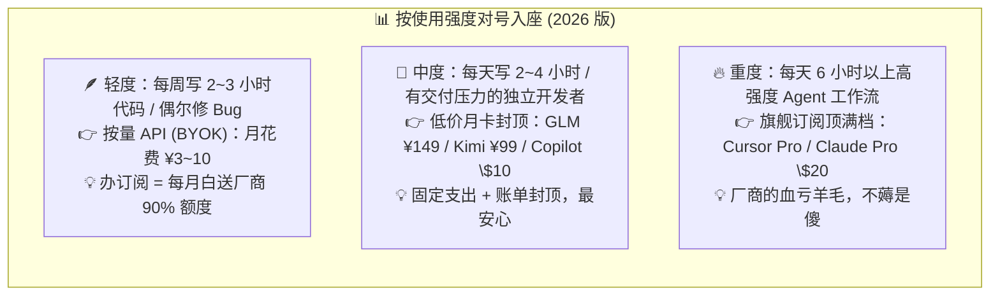
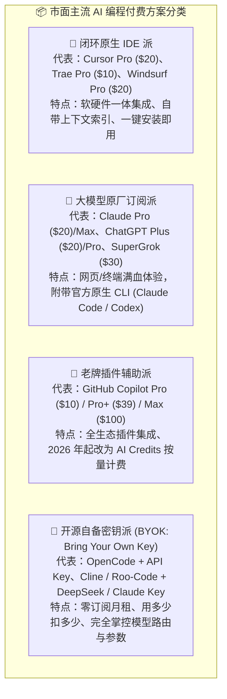
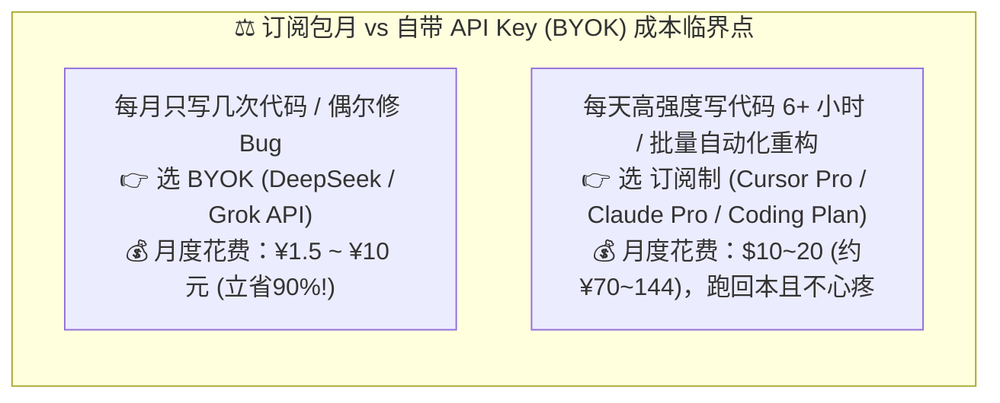
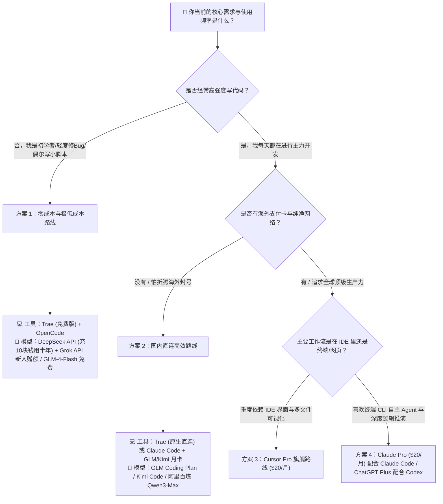

# 14.3 到底需不需要订阅 Coding Plan 和 Agent Plan：2026 订阅价格全景与选型决策树

> **💡 核心认知心法**：
> **市面上各种 "AI 会员" 眼花缭乱——Cursor Pro、Claude Pro/Max、ChatGPT Plus/Pro、GitHub Copilot Pro/Pro+/Max、Trae、Windsurf、SuperGrok，再加上国内 GLM Coding Plan、Kimi Code……很多人往往一时冲动"全家桶订阅"，一个月默默扣掉上百美元，最后发现绝大部分额度都在闲置。订阅不是虚荣心消费，根据你的代码产出强度与使用频次做精打细算的选型，才是成熟工程师的第一步。**
>
> **📌 本节订阅价格均整理自 2026 年 8 月各厂商官方定价页，实际以官网为准。**

***

## 🏋️ 一、先讲人话：订阅制到底是一门什么生意？

在掏钱之前，先搞懂订阅制的商业本质——**它和健身房卖年卡是同一门生意**：

- **健身房赌的是你不来**：按"一个人天天来"的成本根本养不起场馆，所以年卡定价赌的是 90% 的人办卡后一个月就去两次。AI 订阅也一样：厂商按"平均使用强度"定价，赌绝大多数用户**用不满额度**——你办了 Claude Pro 却一周只用三次，等于每周都在给重度用户发补贴；
- **重度用户薅的是厂商的羊毛**：反过来，真有人一天 12 小时拿 Claude Code 跑满额度，厂商反而亏钱——所以才有了"5 小时滚动窗口""每周上限""Fair Use 公平使用条款"这些"限流沙漏"（原理详见 14.2）；
- **所以正确的问题从来不是"哪个会员最便宜"，而是"我的使用强度落在哪个档位"**。

> 💡 **一句话总结**：订阅制是一场"厂商赌你用不满、你赌自己用得满"的对赌。**先用 BYOK 或免费档跑一周，摸清自己的真实用量，再决定要不要上牌桌**。

***

## 🧩 二、市面主流"Coding Plan"与"Agent Plan"大点兵

在 AI 辅助编程领域，付费产品主要分为以下几大派系：

### 1. 海外主流方案全景对比表（2026-08 官方价）

| 方案类别 | 代表产品 | 官方价格 | 核心优势 | 潜在短板 / 限制 | 适合人群 |
| :--- | :--- | :--- | :--- | :--- | :--- |
| **Cursor Pro** | [Cursor 定价页](https://cursor.com/pricing) | **\$20 / 月**（年付折合 \$16/月） | 代码库全局向量索引超快、Composer 多文件编辑、内置 \$20/月 API 用量、学生免费 1 年 Pro | 用量用尽后需按 API 价续量；Pro+\$60、Ultra\$200 进阶 | 每天写 4 小时以上代码的重度全职开发者 |
| **Claude Pro** | [Claude 定价页](https://claude.com/pricing) | **\$20 / 月**（年付 \$200 ≈ \$17/月） | 满血 Claude Sonnet 5 / Opus 5（代码审美天花板）、**直接包含 Claude Code CLI** | 封号风控严苛、5 小时滚动窗口 + 每周上限 | 重度依赖 Claude 顶级推理与架构设计的工程师 |
| **Claude Max 5x / 20x** | [Claude 定价页](https://claude.com/pricing) | **\$100 / \$200 每月** | 分别为 Pro 额度的 5 倍 / 20 倍、高峰优先、新功能抢先 | 价格昂贵，仅适合全天候重度 Agent 工作流 | 把 Claude 当唯一主力生产力工具的极客 |
| **ChatGPT Plus** | [ChatGPT 定价页](https://chatgpt.com/pricing) | **\$20 / 月** | 满血 GPT-5.x、包含 Codex 编码智能体、Sora 视频/语音全模态 | 纯网页/App 交互，无原生工程级跨文件编辑 IDE；Codex 超 258k 上下文计费加倍（见 14.6） | 需要通用办公 + 多模态创作 + 算法攻坚的综合用户 |
| **ChatGPT Go** | [OpenAI 官方博客](https://openai.com/index/introducing-chatgpt-go/) | **\$8 / 月**（美区） | 最便宜订阅、GPT-5.2 Instant、10 倍于免费层消息量 | 含广告、模型为快速版、无深度思考 | 预算敏感、仅需日常问答的学生党 |
| **GitHub Copilot Pro** | [Copilot 计划页](https://github.com/features/copilot/plans) | **\$10 / 月**（含 \$15 月 AI Credits） | 价格亲民、全平台插件（VS Code/JetBrains/Neovim）、2026-06 起按 AI Credits 计费 | 用量按 Credits 计，重度 Agent 容易烧完 | 传统工程师日常写代码时的"行内智能输入法" |
| **Copilot Pro+ / Max** | [Copilot 计划页](https://github.com/features/copilot/plans) | **\$39 / \$100 每月** | Pro+ 含 \$70 Credits、Max 含 \$200 Credits、Opus 等旗舰模型 | 越往上价格越高，需评估是否真用得完 | AI 重度用户、全天候 Agent 工作流 |
| **Windsurf Pro** | [Windsurf 定价](https://windsurf.com/pricing) | **\$20 / 月**（2026-03 起按日/周配额制） | 额度每日/每周刷新、超额按 API 价购买、2026-06 并入 Devin 体系 | 配额是"速率上限"而非月总额，密集使用受限 | 喜欢 Cascade 智能体的 IDE 用户 |
| **SuperGrok（xAI）** | [Grok 订阅](https://grok.com) | **\$30 / 月** | Grok 4.6 满血额度、Think 深度思考、X 平台实时热点联动 | 工程化工具链不如 Claude/OpenAI 完整，无原生编码 CLI | X 重度用户、想尝鲜 Grok 系列的开发者 |
| **OpenRouter（BYOK）** | [OpenRouter](https://openrouter.ai/) | **\$0 订阅 + 充值**（充值时收 5.5% 平台费） | 一个 Key 调全球 400+ 模型、价格原样透传不加价、自由路由 | 无固定额度，按量扣费；充值一年未用可能清零 | 追求极致性价比、喜欢掌控路由的极客 |

### 2. 国内 Coding Plan 全景对比表（2026 年官方价）

> 📌 **背景**：2026 年初"13 小时烧掉 200 美元"的 Claude Code 账单事件引爆了国内 Coding Plan 浪潮。智谱 2025 年底率先推出 [GLM Coding Plan](https://open.bigmodel.cn/pricing)，2026 年 2 月阿里云百炼以低价跟进，随后 Kimi、MiniMax、腾讯云等纷纷入局，把"固定月费封顶账单"变成了国产 AI 编程的标配。

| 平台 | 套餐档位 | 官方价格 | 额度机制 | 兼容工具 |
| :--- | :--- | :--- | :--- | :--- |
| **智谱 GLM Coding Plan** | Lite / Pro / Max | **¥49 / ¥149 / ¥469 每月** | 每 5 小时约 80 / 400 / 1600 Prompts；每周约 400 / 2000 / 8000 Prompts；GLM-5 消耗 3 倍额度 | Claude Code、Cline、Cursor 等 20+ 工具 |
| **Kimi Code（月之暗面）** | Andante / Moderato / Allegretto / Allegro | **¥49（连续包月 ¥39）/ ¥99（¥79）/ ¥199（¥159）/ ¥699（¥559）每月** | 每周刷新配额 + 5 小时/周限额；额度池与 Kimi 会员共享；Kimi K2.7 Code 模型 | Kimi CLI、Claude Code、Roo Code、VS Code 插件 |
| **Trae（国内版）** | Free / Lite / Pro / Pro+ / Ultra | **¥0 / ¥49 / ¥99 / ¥239 / ¥699 每月**（首月优惠） | 每月积分制（500 / 2000 / 4000 / 12000 / 40000 积分），Doubao-Seed 模型 2.5 折 | Trae 原生 IDE + TraeWork 云端 |
| **Trae（国际版）** | Free / Lite / Pro / Pro+ / Ultra | **\$0 / \$3 / \$10 / \$30 / \$100 每月** | 按 Token 计费折算 Dollar Usage（\$3 / \$5 / \$20 / \$90 / \$400 基础用量） | Trae 原生 IDE + TraeWork 云端 |

> 💡 **海外 vs 国内月卡怎么选**：国内 Coding Plan 用人民币定价、微信/支付宝直付、无汇率与支付卡风控问题，性价比极高，适合绝大多数国内开发者当"主力口粮"；海外订阅的优势是能用到 Claude 5 / GPT-5.6 这类顶级旗舰的**满血原厂体验**。最稳的配置是**国内月卡当主力、海外旗舰当特种兵**。

***

## ⚖️ 三、订阅制 (Subscription) vs 自带 Key (BYOK) 深度算账

到底该包月，还是该按量付 API 费用？我们用一张**真实收支平衡账单**来对比：

### 1. 场景 A：轻度/偶尔开发者（每周写 2~3 小时）
- **如果买订阅**：固定支出 \$20（约 144 元人民币）。不管你用不用，月底都归零。
- **如果用 BYOK（以 DeepSeek-V4-Flash 为例）**：每周调用 50 万 Token，一个月消耗 200 万 Token，按高峰价输入 \$0.44 + 输出 \$1.32 折算，**一个月仅需花费约 3~5 元人民币**！
- **结论**：轻度用户买订阅等于白白给人送钱，**强烈推荐 BYOK 自带 Key**。

### 2. 场景 B：重度职业开发者 / Vibe Coder（每天高强度产出）
- **如果用 BYOK（全量跑 Claude Sonnet 5 原生 API）**：每天 Agent 读写几十万 Token，一个月可能吃掉 5,000 万 Token 输入 + 500 万 Token 输出，API 账单可能高达 **\$150 ~ \$300 美元**（Anthropic 官方口径：Claude Code 平均每个活跃开发日烧掉约 \$13，见 [官方文档](https://platform.claude.com/docs/en/about-claude/pricing)）。
- **如果买订阅（Cursor Pro / Claude Pro）**：只需固定支出 **\$20 美元**，就能在额度内享受海量计算。
- **结论**：重度用户跑 Claude 顶配模型时，**订阅制的羊毛非常值得薅**。

### 3. 场景 C：中等强度 / 害怕账单焦虑的开发者
- **最优雅的解法**：买一张**国内 Coding Plan 月卡**（GLM ¥149 / Kimi ¥99）或国际 **\$10 档**（Copilot Pro / Trae Pro），把"按 Token 计费"变成"固定月费封顶"，彻底告别账单焦虑。
- 这是 2026 年最主流的做法——**用月卡封顶账单，用 BYOK 做兜底扩容**。

### 4. 🧮 自己动手算临界点：一个万能土办法
不想看别人的结论？教你一个一分钟估算法：
1. **先测用量**：用 BYOK 模式跑一周正常工作，记录总 Token 消耗（各家 Console 后台都有用量报表）；
2. **再乘四**：周消耗 × 4.3 ≈ 月消耗，按目标模型的官方单价折算成美元；
3. **对比决策**：折算月费 **< 订阅价的一半** → 继续 BYOK；**> 订阅价的 1.5 倍** → 果断订阅；中间地带 → 买低价月卡过渡。

***

## 🌳 四、2026 四类人群黄金选型决策树

请对照你自己的真实角色与预算，直接查看你的最佳配置路线：

### 1. 🐣 路线一：零基础 / 学生 / 业余尝鲜者（预算：¥0 ~ ¥10 / 月）
- **推荐搭配**：**[Trae](https://www.trae.cn) 免费版 + [OpenCode](https://opencode.ai)（挂载 [DeepSeek API](https://platform.deepseek.com)）+ [GLM-4-Flash 免费档](https://open.bigmodel.cn/pricing)**
- **理由**：Trae 国内直接下载即用，界面友好；DeepSeek API 充值 10 块钱就能体验几个月的全自主编程；GLM-4-Flash 完全免费，学生零成本起步。
- **学生专属福利**：GitHub 认证学生可**免费使用 [GitHub Copilot Pro](https://github.com/education/students)**；Cursor 对符合条件的大学生提供 **1 年免费 Pro**（[Cursor Students](https://cursor.com/students)）。

### 2. 🚀 路线二：高频独立开发者 / 商业交付工程师（预算：\$20 ~ \$40 / 月）
- **推荐搭配 A（国际）**：**[Cursor Pro](https://www.cursor.com)（\$20/月） + [OpenCode](https://opencode.ai)（挂载备用 Key 作为降级容灾）**
- **推荐搭配 B（国内）**：**Trae Pro（¥59 首月 / ¥99 包月）或 GLM Coding Plan Pro（¥149/月）**
- **理由**：主力订阅保证日常手写代码畅快（固定成本）；遇到高并发限流时，立刻无缝切到 OpenCode + BYOK API 继续干活，保证交付不延期。

### 3. 🏢 路线三：企业团队与商业组织
- **推荐搭配**：**GitHub Copilot Business（\$19/席/月）/ Cursor Teams（\$40/席/月）/ Claude Team（\$25/席/月）统一席位 + 专有 VPC / 阿里百炼企业私有 API**
- **理由**：商业公司最核心的是**知识产权保护与代码防泄露**，企业版能确保代码不进入公共训练集，并支持员工离职一键吊销权限、统一开票与审计。

### 4. 🌌 路线四：极客 / 全天候 Agent 重度用户
- **推荐搭配**：**Claude Max 5x（\$100/月）或 ChatGPT Pro（\$100/月）或 Copilot Max（\$100/月）**——把单一大厂订阅顶到最高档，换取 5~20 倍额度 + 高峰优先 + 新功能抢先。
- **理由**：当你的工作流已经 100% 依赖 Agent 时，\$100/月换来的是"额度用不完"和"响应永远优先"，综合性价比反而最高。

***

## 🕳️ 五、订阅前必看：那些藏在条款里的"隐藏机关"

很多踩坑不是选错了产品，而是没看懂计费条款的细节。付费前请逐条核对：

### 1. ⏳ 5 小时窗口是"沙漏"，不是"水池"
- Claude 系订阅的额度是**每 5 小时滚动重置 + 每周总量上限**的双重机制（[官方说明](https://support.anthropic.com/)）。
- **人话**：你的额度不是一个月一大桶水，而是一个 5 小时漏完一次的沙漏。**策略**：把重活集中在窗口开启后的前段干，窗口快漏完时切 BYOK 或干轻活；别在周五晚上烧光周额度，然后周末干瞪眼。

### 2. 💳 年付折扣真香，但先月付"试驾"一个月
- Cursor 年付折合 \$16/月、Claude 年付 \$200（≈\$17/月），普遍有 15%~20% 的折扣。
- **但模型迭代太快了**：2026 年的旗舰模型半年一换代，你年付锁定的可能是一个即将被降智/降配的旧套餐。**正确姿势**：先月付跑满一个月摸清真实用量，确认自己"天天来健身"，再上年卡锁定折扣。

### 3. 🎓 学生身份是最大的白嫖杠杆
- [GitHub 学生包](https://github.com/education/students) 认证后 **Copilot Pro 完全免费**；[Cursor 学生计划](https://cursor.com/students) 送 1 年 Pro。
- 应届生、在读生、甚至部分bootcamp学员都能认证。**如果你符合条件却还在花钱订阅，这属于纯纯的智商税**。

### 4. 🧾 \$20 不是 \$20：汇率、税费与支付成本
- 海外订阅实际支付 = \$20 × 汇率 + 可能的跨境支付手续费（虚拟卡开卡费、充值费率），综合成本通常比官方汇率贵 3%~8%；
- 国内 Coding Plan 用人民币一口价定价，微信/支付宝直付，**零汇率风险、零支付风控**——这是它对国内用户最大的隐性优势之一。

### 5. 🎰 "Credits 制"订阅的低月费幻觉
- 2026 年起 [GitHub Copilot 转向 AI Credits 计费](https://github.blog/news-insights/company-news/github-copilot-individual-plans-introducing-flex-allotments-in-pro-and-pro-and-a-new-max-plan/)、Trae 用积分制：**月费低 ≠ 花得少**。
- Credits 一旦耗尽就要按量补购，而 Agent 工作流烧 Credits 的速度远超直觉（乘法风暴原理见 14.2）。**订阅前务必按自己的任务类型折算一下"每月真实 Credits 消耗"**，别被 \$10 的门槛价骗进门、月底被超额账单刺客补刀。

***

## 🚫 六、防割避坑指南：拒绝"多重订阅智商税"

很多开发者在接触 AI 之后，往往会陷入"工具收集癖"的陷阱：

> ❌ **典型错误组合**：
> - 买了 ChatGPT Plus（\$20/月）
> - 买了 Claude Pro（\$20/月）
> - 买了 Cursor Pro（\$20/月）
> - 买了 GitHub Copilot（\$10/月）
> 👉 **每月固定扣费 \$70 美元（超 500 元人民币）**，但人的精力和时间是有限的，同一时间你只能在一个编辑器里写代码，结果 70% 的额度都在白白浪费！

### 💡 终极精简建议：
1. **原则：同生态位只留 1 个订阅**：
   - 如果你已经订阅了 **Cursor Pro**，它内部就已经包含了 Claude、GPT、Grok 的调用额度，你**完全没有必要再去单独订阅 Claude Pro 或 ChatGPT Plus**（除非你有极重度的手机端语音/Canvas 绘图需求）。
2. **用"1 个核心订阅 + 1 个按量 API"替代"全家桶订阅"**：
   - 核心订阅保证日常手写代码畅快（固定成本）；
   - 按量 API（如 DeepSeek/OpenRouter）保证在遇到特殊任务或并发限流时充当廉价跑腿外包（动态低成本）。
3. **警惕"按 AI Credits 计费"的新规则**：2026 年 6 月起 [GitHub Copilot 全面转向 AI Credits 用量计费](https://github.blog/news-insights/company-news/github-copilot-individual-plans-introducing-flex-allotments-in-pro-and-pro-and-a-new-max-plan/)，Pro 的 \$10 里只有 \$10 基础额度 + \$5 弹性额度。**订阅前一定要算清"我每个月到底会消耗多少 Credits"，别被便宜月费吸引后疯狂超额**。
4. **按需升级而非一步到位**：先买最低档试用一周，摸清自己的真实消耗，再决定要不要升档。绝大多数人用 `\$20` 档绰绰有余，`\$100` 档属于重度玩家。
5. **定期"订阅断舍离"**：每季度翻一次信用卡/支付宝的自动扣费列表，问自己"上个月我用满过它吗？"——连续两个月没用满的订阅，果断退掉。

***

## ✅ 七、订阅前 30 秒自检清单

下单前，把这 5 个问题快速过一遍，全答上来再掏钱：

1. **我上周实际写代码 / 使用 AI 的小时数是多少？**（低于 10 小时/周 → BYOK 路线，别订阅）
2. **我的任务吃"算力"还是吃"次数"？**（少量复杂推理 → 旗舰按量 API；海量琐碎任务 → 低价月卡/订阅更划算）
3. **我有没有海外支付卡与纯净节点？**（没有 → 直接国内 Coding Plan，别为难自己）
4. **我现有的工具里是不是已经内含同款模型额度？**（Cursor 里再买 Claude Pro，八成是重复消费）
5. **我能不能先用免费档 / 最低档试驾一周？**（任何不让你试用的"限时折扣"，都是在制造冲动）

***

## 🎯 本节小结与行动清单

- [x] **认清订阅本质**：订阅是"厂商赌你用不满"的对赌，先用 BYOK 摸清用量再上牌桌。
- [x] **评估个人频次**：轻度用户坚决走 BYOK 路线，重度用户果断订阅单一主力 IDE。
- [x] **善用国内 Coding Plan**：GLM / Kimi / Trae 的固定月费模式能彻底封顶账单焦虑，适合国内直连用户。
- [x] **看懂隐藏机关**：5 小时沙漏、年付锁价、Credits 膨胀、汇率税费，付费前逐条核对。
- [x] **清理多余账单**：检查信用卡自动扣费列表，退订功能重叠的月租会员，每季度做一次订阅断舍离。
- [x] **搭建一主一备**：主力使用稳定订阅，备用使用开源终端 + 按量 API，实现生产力与成本的最佳平衡。
- [x] **看清 Credits 新规**：Copilot 等 2026 年新计费模式下，务必先算清月消耗再下单。
