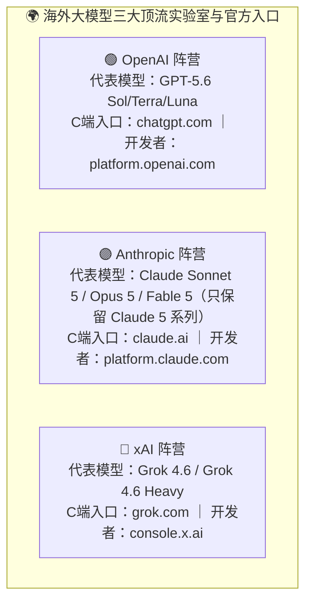
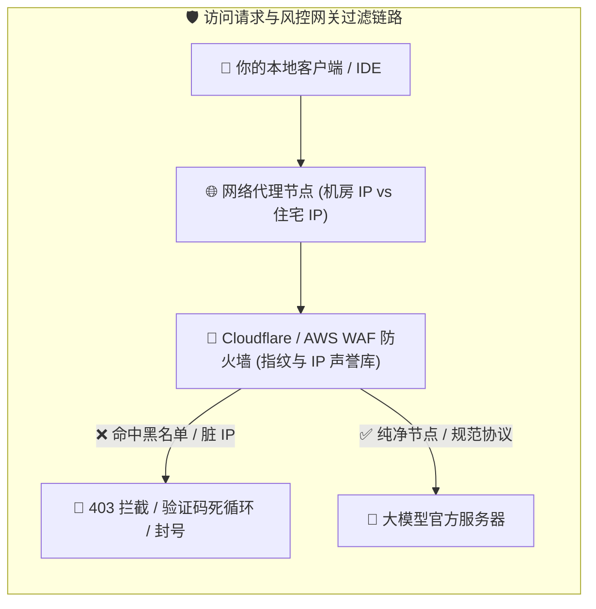
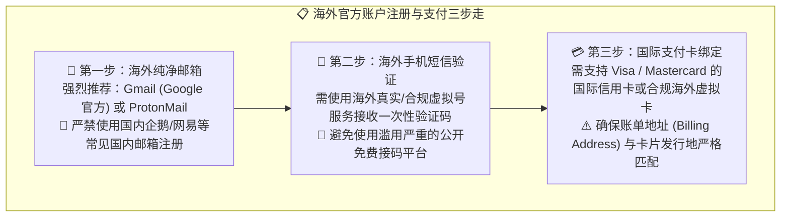
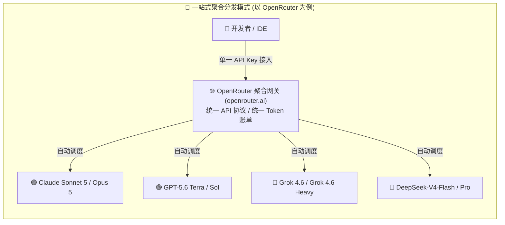

# 14.4 国外模型的使用方式：2026 官方模型矩阵、网络风控与聚合分发指南

> **💡 核心认知心法**：
> **使用海外前沿大模型（如 Claude 5、GPT-5.6、Grok 4.6）是很多开发者的刚需。然而，高耸的"网络节点门槛"、"支付卡风控"和"封号大潮"常常让初学者摸不着头脑。掌握规范、稳定、低风控的访问姿势，既能让你用上全球最顶级的大脑，又能避免辛辛苦苦充值的账号一夜蒸发。**
>
> **📌 本节所有官方入口与模型信息均引用 2026 年 8 月官方文档。**

***

## 🌐 一、海外主流大模型生态全景与官方门户

全球前沿大模型生态主要由几大技术巨头与顶尖实验室构建，它们的官方入口与开发者平台如下：

### 1. 官方平台核心矩阵速查（2026 版）

| 厂商名称 | C 端交互入口 (Chat 网页/App) | 开发者 API 平台 (API Key & 调试) | 核心风控严格程度 | 最优使用姿势 |
| :--- | :--- | :--- | :--- | :--- |
| **Anthropic (Claude)** | [Claude 官网](https://claude.ai) | [Anthropic Console](https://console.anthropic.com) / [platform.claude.com](https://platform.claude.com) | 🔴 **极度严格**（严查机房 IP、严查账单地址） | 网页端慎用机房节点；开发者优先走 [Amazon Bedrock](https://aws.amazon.com/bedrock/) 或 [Google Cloud Vertex AI](https://cloud.google.com/vertex-ai) 云托管 |
| **OpenAI** | [ChatGPT 官网](https://chatgpt.com) | [OpenAI Platform](https://platform.openai.com) | 🟡 **中度严格**（严查注册邮箱与支付卡发行地） | 绑定国际纯净信用卡；API 设置月度消费上限（Hard Limit） |
| **xAI (Grok)** | [Grok 官网](https://grok.com) | [xAI API Console](https://console.x.ai) | 🟡 **中度严格**（X 账号体系互通，API 风控相对宽松） | 订阅走 [SuperGrok](https://grok.com)，API 走 [console.x.ai](https://console.x.ai) 按量计费，注册即有新人赠额可练手 |

### 2. 2026 主流海外模型快速定位（按场景选型）

| 你的任务类型 | 首选模型 | 官方文档 | 理由 |
| :--- | :--- | :--- | :--- |
| 日常代码补全 / 轻量问答 | GPT-5.6 Luna / Grok 4.6（快速档） | [OpenAI](https://developers.openai.com/api/docs/pricing) · [xAI](https://docs.x.ai/docs/models) | 便宜、极速，足以覆盖 80% 的日常任务 |
| 复杂工程重构 / Agent 工具调用 | Claude Sonnet 5 | [官方模型页](https://platform.claude.com/docs/en/models/sonnet-5/overview) | \$2/\$10 性价比最佳、SWE-bench 领先、工具调用稳定 |
| 极限推理 / 数学 / 算法攻坚 | Claude Opus 5 / GPT-5.6 Sol / Grok 4.6 Heavy | [Claude](https://platform.claude.com/docs/en/models/opus-5/overview) · [OpenAI](https://openai.com/zh-Hans-CN/api/pricing/) · [xAI](https://docs.x.ai/docs/models) | 旗舰推理能力，适合最难的任务 |
| 超长文档 / 百万级上下文分析 | Claude Sonnet 5（1M 上下文） | [Claude](https://platform.claude.com/docs/en/models/sonnet-5/overview) | 原生 1M 窗口，一次性吞下大代码库 |

***

## 🛡️ 二、网络与环境基础设施：避开 403 与 Cloudflare 拦截

很多初学者打开网页看到 `403 Forbidden`、`Sorry, you have been blocked` 或 `Region Not Supported`，往往以为是账号被封，其实是**网络节点和环境指纹被拦截**。

### 1. 常见报错原因与根治方案

1. **`403 Forbidden / Cloudflare 5秒盾死循环`**：
   - **原因**：你使用的网络节点是公开机场的**数据中心机房 IP（Data Center IP）**，已有成千上万人在该 IP 上进行过爬虫或批量注册，已被 Cloudflare 声誉库标记为高危欺诈风险。
   - **解法**：切换为节点人数较少、纯净度高的原生节点或专属节点；清除浏览器 Cookie 或使用无痕模式。
2. **`OpenAI's services are not available in your country` / `Claude is not available in your region`**：
   - **原因**：系统检测到了非支持地区的 IP，或浏览器的本地 DNS / WebRTC 泄露了真实地理位置。Anthropic 官方 [支持地区页面](https://support.claude.com/en/articles/9538633-supported-regions-and-languages) 明确限制了部分国家/地区。
   - **解法**：开启全局代理模式（TUN Mode / 增强模式），并在浏览器设置中关闭 WebRTC 真实 IP 广播。
3. **`Account on hold / Suspended`（账号冻结）**：
   - **原因**：在同一个登录 Session 中频繁在不同国家/地区的节点之间秒级切换（如前一秒在新加坡，后一秒跳到美国），触发了银行级防盗号异地登录风控。
   - **解法**：固定使用某一个特定地区的节点，切忌在短时间内频繁跳跃节点。
4. **`429 Too Many Requests / Limit reached`（额度耗尽）**：
   - **原因**：订阅额度或 API 并发限制被触发。
   - **解法**：等待 5 小时滚动窗口 / 周额度重置；或直接换一个"一主一备"模型（见 14.3）。

### 2. 🧊 代理节点怎么选：只推荐"纯净节点"

访问海外模型时，**节点纯净度直接决定你的账号寿命**。混用脏节点轻则 403 验证码死循环，重则账号被判定为欺诈直接封停。选节点记住三条铁律：

1. **住宅/原生 IP 优先，机房 IP 靠边**：优先选择 ISP 类型显示为"住宅（Residential）"或当地原生运营商的原生 IP，坚决避开成千上万人共用的数据中心机房线路；
2. **独享 / 小众节点优先，万人骑的公共热门线路靠边**：热门机场的"公共节点"就像一辆被无数人坐过的公交车——前面任何一个人在上面干过坏事，都会拉低整个 IP 的声誉分。条件允许就上独享节点，至少选用户量少的小众线路；
3. **节点一旦选定就固定使用**：今天美国、明天日本、后天新加坡的"环球旅行式"切换，是触发异地登录风控的最快方式。把节点当成你的"常驻地"，注册时在哪，以后就一直在哪。

> 💡 **自检小工具**：拿当前节点 IP 到 [Scamalytics](https://scamalytics.com/) 查一下欺诈风险分（低风险 < 25 分为佳），再到 [BrowserLeaks](https://browserleaks.com/webrtc) 确认 WebRTC 没有泄露真实 IP。两关都过，才算"纯净"。

***

## 💳 三、官方渠道注册与支付绑定门槛

想要直接在官方平台按月订阅或充值 API，通常需要跨越三道门槛：

### 1. 支付风控的核心底层逻辑（Stripe 3DS 验证）
- OpenAI 和 Anthropic 底层均使用全球最大的支付网关 **[Stripe](https://stripe.com)**。
- Stripe 在扣款时会对用户的 **IP 所在地、浏览器时区语言、信用卡发卡行（BIN 码）和账单邮编（Zip Code）** 进行四重交叉比对。
- 如果你的 IP 处于香港，但绑定的卡片是美国虚拟卡，且邮编填的是加州，Stripe 就会判定为高风险交易直接拒付（Card Declined）。
- **关键提示**：OpenAI 还要求 **API 账户设置月度消费上限（Hard Limit）**（[官方计费文档](https://platform.openai.com/docs/guides/your-data)），防止死循环烧爆余额。

### 2. 支付方式三条主流路线
1. **国际信用卡（Visa/Mastercard）**：最稳定，但需要真实海外银行账户或长期美签/留学背景；
2. **合规海外虚拟卡平台**：支持支付宝/微信充值 USDT 或人民币兑换美元，生成可绑定的 Visa/MC 卡，适合国内用户（务必选择合规实名制平台，见 14.5 防坑）；
3. **官方聚合平台（OpenRouter / Poe 等）**：无需绑定海外卡，直接用国际卡或加密货币充值，见下一节。

***

## ⚡ 四、一站式聚合分发平台：优雅低门槛的平替方案

如果你觉得折腾海外信用卡和网络节点过于繁琐，**一站式大模型聚合分发平台**是目前全球开发者最推崇的平替方案。

### 1. 为什么推荐 [OpenRouter](https://openrouter.ai/)？
- **全球模型一网打尽**：汇聚了 OpenAI、Anthropic、xAI、Meta、DeepSeek、Mistral 等全球 **400+ 主流模型**（官方 2026 年口径）；
- **无需切换多个 Key**：只需要申请一个 OpenRouter API Key，就能在你的终端（如 OpenCode、Claude Code、Cursor）中任意切换调用所有模型；
- **100% 官方透明定价与按量计费**：OpenRouter 官方承诺"不加价"——**模型目录显示的每百万 token 价格就是各厂商官方定价**（[官方 FAQ](https://openrouter.ai/docs/faq)），只在充值时收一笔 **5.5% 平台费**（Stripe 渠道，最低 \$0.80；加密货币渠道 5%）；
- **免费模型福利**：平台上有 20+ 个 \$0 模型，免费账号每天 50 次请求，充值 \$10 后升至每天 1000 次（[OpenRouter 官方教程](https://openrouter.ai/blog/tutorials/how-to-get-the-lowest-cost-llm-inference-on-openrouter/)）；
- **高级路由技巧**：给模型 ID 加后缀 `:floor` 自动选全网最便宜的供应商，`:nitro` 选吞吐最快的供应商，还能用 `max_price` 设死预算上限，超支直接失败而不是烧钱。

### 2. 消费级聚合客户端与搜索工具
- **[Poe](https://poe.com/)**（Quora 旗下）：按月积分制，适合在网页和手机端一站式体验全球所有对话模型；
- **[Perplexity](https://www.perplexity.ai/)**：专注于 AI 联网实时搜索与研报检索，适合替代传统搜索引擎查找最新的技术文档与学术论文；
- **[xAI Console](https://console.x.ai)**：Grok 系列官方 API 控制台，按量计费、文档清爽，新人注册有赠送额度，适合想直接试跑 Grok 4.6 的开发者练手。

### 3. 🚧 2026 年中转站现状提醒：OpenRouter 之外，请先观望
- **[OpenRouter](https://openrouter.ai/) 是本教程目前唯一推荐的聚合渠道**：它是正规注册的官方级聚合平台，上游对接企业合约与官方 API，稳定性和透明度有保障。
- **除 OpenRouter 以外的其他中转站，暂不在此推荐**：OpenAI 正在大肆打击 sub2api 类反代渠道（详见 14.5），大量站点朝不保夕、随时跑路。建议等这轮打击潮稳定下来再评估，眼下贸然把生产工作流绑上去，大概率给站长"陪葬"。
- **刚需人群的稳妥路径**：海外任务走 OpenRouter 按量计费，国内任务走 GLM / Kimi / Trae 官方 Coding Plan（见 14.3），两条腿走路，完全不碰野路子。

### 4. 🎒 容易被忽略的"顺带"用法：订阅内嵌多模型
除了官方原生渠道与聚合平台，还有一些"买订阅顺带用模型"的方式：
- **[GitHub Copilot](https://github.com/features/copilot/plans)**：Pro 订阅内可切换 Claude、GPT 等多家模型，写代码时顺手就能换大脑；
- **[Cursor](https://cursor.com/pricing)**：Pro 订阅内置 Claude / GPT / Grok 等模型的调用额度，一个编辑器通吃多家旗舰；
- **[ChatGPT Plus](https://chatgpt.com/pricing)** / **[Claude Pro](https://claude.com/pricing)** 的官方客户端与 CLI（Codex / Claude Code）本身就覆盖了各自主力模型的满血体验。

> ⚠️ **但要说清楚**：这类"顺带"用法的**额度一般都不宽裕**——Copilot 已转为 AI Credits 按量计费、Cursor 的内置额度超额要按 API 价续费、各家订阅还有 5 小时/每周滚动窗口限制。它们适合"轻度尝鲜 + 主力备用"，真正全天候的 Agent 重度工作流，还是得靠 14.3 讲的"单一主力订阅顶满档"策略。

***

## 🚨 五、安全与合规红线

在使用海外模型时，无论个人还是团队，必须牢记以下安全底线：

1. **绝对不要将明文 API Key 提交到 GitHub 公开仓库**：各大平台的扫描机器人会在 1 秒内抓取到泄露的 Key 并盗刷殆尽。必须严格使用 `.env` 并在 `.gitignore` 中排除。
2. **商业项目注意数据出境合规**：企业级生产环境若涉及用户敏感身份数据、金融交易数据，应优先选用国内合规通过备案的大模型，或使用海外大厂在中国合规区域部署的企业级私有化端点（如 [AWS Bedrock 数据驻留](https://aws.amazon.com/bedrock/)、[Azure OpenAI 区域](https://azure.microsoft.com/)）。
3. **警惕"便宜代充"账号买卖**：详见 14.5，远离黑卡代充与共享车队，账号资产安全与代码隐私永远是第一位的。

***

## 🎯 本节小结与行动清单

- [x] **认清三大阵营**：Claude 抓工程重构，GPT 抓多模态与推理，Grok 抓实时信息与高性价比推理；2026 年各自旗舰为 Sonnet 5 / GPT-5.6 / Grok 4.6。
- [x] **排查网络环境**：避开机房脏 IP，坚持住宅原生 + 独享 + 节点固定三铁律，告别 403 与 Cloudflare 拦截。
- [x] **善用聚合分发**：不想折腾海外支付时，首选 OpenRouter 这一官方级聚合平台；其他中转站暂且观望，等 sub2api 打击潮稳定再说。
- [x] **守住安全红线**：API Key 永远进 `.env`，商业数据合规出境。
