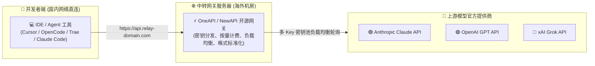
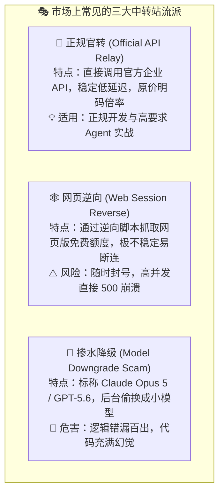
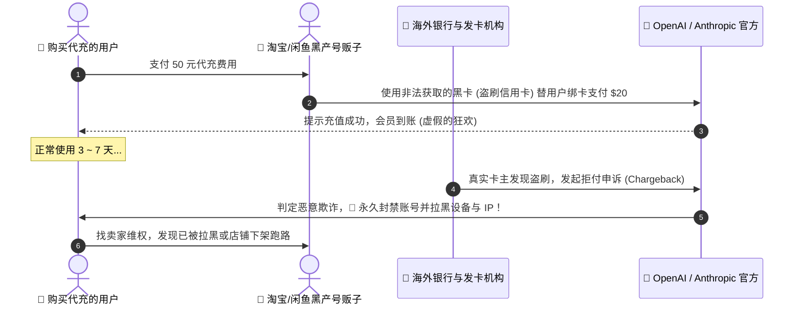
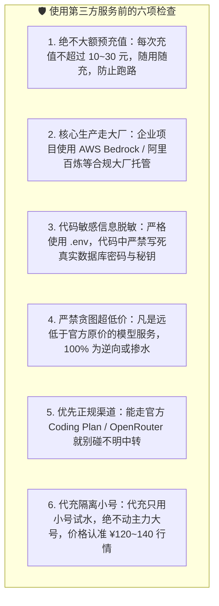

# 14.5 中转站和代充：工作原理、常见风险与核查方法

> **本节要点**：
> 中转服务会经手请求内容、密钥和账单信息，其可靠性取决于上游来源、网关实现和运营者。使用前应核对模型来源、价格、日志与隐私政策，并避免把生产代码、密钥或敏感数据交给来源不明的服务。
>
> **选择顺序**：在官方服务、合规云平台或明确披露上游与数据条款的渠道可以满足需求时，优先选择这些渠道。套餐和可用地区会变化，使用前仍需核对当前规则。

***

## 一、API 中转站的底层原理与开源生态

所谓的"API 中转站"，本质上是一个架设在海外网络环境下的 **API 路由与计费反向代理网关**。

### 1. 开源中转网关生态
市面上绝大多数中转站，都是基于开源项目（如 [OneAPI](https://github.com/songquanpeng/one-api)、[NewAPI](https://github.com/Calcium-Ion/new-api)）二次开发搭建的：
- **格式标准化**：将不同厂商五花八门的接口（如 Anthropic 的 `messages` 格式、Google 的 `generateContent` 格式）统一转换为开发者最熟悉的 **OpenAI `/v1/chat/completions` 标准格式**；
- **密钥池负载均衡**：中转站站长在后台配置了几十个甚至上百个官方 API Key，当用户请求过来时，网关自动轮询调度，避免单 Key 触发官方速率限制（RPM/TPM）。

> **风险判断**：即使服务价格透明、运行稳定，第三方中转仍增加了一层数据和供应链风险。无法确认上游、日志保留和运营主体时，不应传输生产代码、访问令牌或其他敏感资料。

***

## 二、中转站的三种常见来源与服务差异

中转站提供的服务质量天差地别，市场上主要存在以下三大流派：

### 1. 官转（正规官方原路转发）
- **实现原理**：站长通过合规渠道充值官方 API 余额或使用 [AWS Bedrock](https://aws.amazon.com/bedrock/) / [Azure OpenAI](https://azure.microsoft.com/) 企业通道，扣除汇率与少量服务器运营成本后提供给用户。
- **特征**：价格透明（通常为官方标准资费的 1.0~1.3 倍左右），支持流式打字输出，支持上下文缓存（Prompt Caching），工具调用（Function Calling）极度精准。

### 2. 逆向转接（Web Session 逆向池）
- **实现原理**：通过编写自动化脚本批量注册网页端免费账号，提取 Session Token 模拟人类在网页端对话。
- **特征**：价格极其便宜（甚至宣称几块钱无限调用），但**延迟极高（经常转圈 10 秒才出字）**，不支持 Function Calling，且官方一旦更新网页反爬规则就会大面积瘫痪。

### 3. 掺水与降级（黑心偷梁换柱）
- **欺诈手法**：用户在前端下拉框选择的是 `claude-opus-5` 或 `gpt-5.6-sol`，但中转站后台在路由表中悄悄将其映射为成本极低的开源 7B/8B 小模型。
- **如何火眼金睛识别掺水？**
  - **测逻辑陷阱题**：发送一道复杂逻辑陷阱题（例如："9.11 和 9.9 哪个数字大？"、"请用 5 种不同设计模式重构以下代码"）；
  - **测结构化输出**：要求返回符合给定 Schema 的 JSON，并用程序校验。一次失败不能单独证明模型被替换，但多次稳定测试可以作为与延迟、Token 统计和模型标识交叉核对的信号；
  - **测打字首字延迟与吞吐**：正规 Claude Opus 5 思考模型会有明显的 Thinking 推理流，假冒模型则会瞬间秒吐简短答案。

### 4. 🕸️ 2026 年新流派：sub2api 反代中转与"官方对齐度"检测法

近几年还冒出一类特殊渠道：**sub2api 反代**——把 ChatGPT Plus / Claude Pro 等**网页订阅账号**，通过逆向协议伪装成标准 API 对外分发。它的本质是"订阅账号车队"的 API 化：你调用的不是官方 API，而是别人订阅账号里的网页额度。

> 🚨 **2026 年现状**：OpenAI 正在大肆打击 sub2api 反代，批量封号、风控持续升级，大量此类站点朝不保夕。**本项目暂不推荐 OpenRouter（正规官方聚合）以外的任何中转站，等这轮打击潮稳定后再评估**。眼下把生产工作流绑上去，等于跟站长一起排队"陪葬"。

**如何判断一个中转站是不是"真官转"？核心就看它和官方的"对齐粒度"**——真正的官转通道与官方账号同呼吸、共命运，官方生病它也得跟着咳嗽：

1. **过载对照法（最灵验）**：当官方渠道明确出现过载或限流时（比如 Claude 高峰期 5 小时窗口提前耗尽、ChatGPT 官方全员降速排队），立刻去中转站跑同样的任务。**如果此时你的中转依然秒出首字、长任务一气呵成从不掉链子——多半有问题**：要么是逆向池根本不走官方 API 配额，要么干脆掺了水。真官转此刻应该和你一样在排队。
2. **限流窗口对照法**：官方有 5 小时滚动窗口、每周上限这些明牌规则；真官转的账户额度消耗节奏应该与这些窗口对得上。如果你的中转号称"官方原价"却永远无限流、无窗口，那必然有诈。
3. **最终大招：自己充一个官方 Plus 当对照组**：花 \$20 冲一个正牌 Plus，两边同时跑相同 Prompt，对比首字延迟、Thinking 推理流、限流触发时段——是不是官转、掺没掺水，一次对照全露馅。这 \$20 是最值的"验货费"。

***

## 三、代充与账号买卖的黑产陷阱

在淘宝、闲鱼、微信群中，经常能看到"50 元代充 20 美元 Claude 会员"或"低价购买独享账号"的广告。天下没有免费的午餐，这些低价背后几乎全部是黑产链条：

### 1. ⚠️ 黑卡代充的四大毁灭性后果：
1. **封号封号封号**：官方收到银行退单（Chargeback）后，会在 24 小时内无情封停你的账号，所有聊天记录、项目配置一并销毁；
2. **设备指纹与 IP 连带拉黑**：你的电脑浏览器指纹和 IP 地址会被记录在风控黑名单中，未来你自己想合规注册新号都会被秒封；
3. **资金打水漂**：代充卖家在收钱后几天内就会注销店铺换个马甲重新行骗，售后完全归零；
4. **法律与道德风险**：使用盗刷信用卡在国际法律中属于信用卡欺诈洗钱链路的一部分。

### 2. 共享车队与团队池的隐私泄露
- 有些低价服务采用"几十人共用一个账号"的共享模式（俗称"拼车/车队"）。
- **数据安全问题**：共享账号可能让其他使用者或运营者接触历史记录。商业代码、数据库连接信息和业务资料不应通过这类账号处理，账户异常时也很难确认责任和恢复数据。

### 3. 2026 年新坑：Coding Plan 代充与"半价月卡"
- 随着国内 GLM / Kimi Coding Plan 爆火，电商平台上出现了大量"半价代开 Coding Plan"、"代充积分"的店铺。
- **常见套路**：用黑卡/盗刷方式支付，或使用"组织补贴价"漏洞使用优惠——一旦平台核查，**你充进去的积分会被冻结、账号可能被限制，且代充的钱大概率追不回**。
- **正确做法**：Coding Plan 本就几十元一个月，直接走官方微信/支付宝/官方信用卡支付，不要为了省十几块去赌账号安全。

### 4. 💰 代充的行情价与自保纪律（2026 实战版）
如果你评估再三还是想找代充（例如海外支付卡实在办不下来），请把下面四条纪律焊死在脑子里：

1. **永远不要代充自己的大号**：主力账号里积累的聊天记录、项目资产、订阅信誉，一旦因代充黑卡被官方连坐封禁就全部归零。要试代充，**先用无足轻重的小号试水**，跑上一两个月确认稳定，也绝不要把大号交出去。
2. **价格纪律：别图便宜，也别当冤大头**：以 ChatGPT Plus 为例，正常代充行情在 **¥120 ~ 140 之间**。远低于这个区间的（"50 元包月"）几乎清一色是黑卡盗刷，封号概率极大；**超过 ¥140（官方汇率折算价附近）就失去了代充的意义**，不如咬牙自己官充，安心睡觉。
3. **别完全相信"质保"**：卖家嘴上说"封号包赔、掉订阅秒补"，但质保的兑现前提是店铺还活着——**真遇到大规模封号潮，他们提桶跑路的速度比谁都快**，赔偿承诺随店铺一起消失。把质保当成"听个响"，别当成保险。
4. **小额试、短周期、勤备份**：一次只代充一个月，绝不一次充半年一年；重要对话记录和项目配置随时导出备份，假设账号明天就消失来安排自己的工作流。

***

## 四、防坑自保的六大判断原则

如果你确实需要使用中转服务或第三方渠道，必须严格遵守以下自保法则：

### 靠谱服务商的特征清单：
- [x] 提供精确到每笔请求的 Token 消耗、耗时、模型名称审计日志；
- [x] 支持标准 HTTPS 自定义域名接入，并兼容原生 OpenAI 客户端；
- [x] 价格能说明上游成本、汇率和服务费，不以明显低于上游成本的价格承诺同等模型能力；
- [x] 支持单次小额充值（如 5 元、10 元起充），支持工单与技术交流支持。

### 更优的替代路线（强烈推荐）：
1. **国内任务** → 直接注册 [GLM Coding Plan](https://open.bigmodel.cn/pricing) / [Kimi Code](https://www.kimi.com/membership/pricing) / [Trae](https://www.trae.cn)，官方直连、微信支付宝支付、账单封顶；
2. **海外任务** → [OpenRouter](https://openrouter.ai/) 官方聚合，价格不加价、只收 5.5% 充值手续费、模型可路由；
3. **企业生产** → [AWS Bedrock](https://aws.amazon.com/bedrock/) / [Azure OpenAI](https://azure.microsoft.com/) / [阿里百炼](https://bailian.console.aliyun.com/) 等合规云厂商，享受 SLA 与数据驻留保障。

***

<!-- CH10-14_EXPANSION -->

## 第三方服务要按供应链风险评估

API 中转站能够看到请求内容、密钥使用和返回结果，因此不仅是网络通道，也是数据处理方。评估时应查看主体信息、隐私政策、数据保留、上游来源、账单明细、退款和安全事件通知机制。

不要把生产密钥、客户资料或未公开代码交给无法说明责任主体的服务。即便模型调用暂时正常，也可能在配额、版本、日志保存和账号来源上存在风险。可以使用脱敏测试数据做短期验证，并设置独立密钥和消费上限。

代充和共享账号还会混淆账号所有权。支付争议、账号找回或平台封禁时，使用者通常缺少申诉凭据。能走官方购买、组织采购或有合同的合规渠道时，应优先选择这些可追踪方式。

---

## 本节小结与行动清单

- [x] **认清中转本质**：了解 OneAPI/NewAPI 路由网关原理，明白官转与逆向的根本区别。
- [x] **看穿 sub2api 反代**：用"官方过载对照法"检验中转的对齐粒度——官方都排队它却秒回，必有诈；拿不准就自己充个 Plus 当对照组。
- [x] **远离黑卡代充**：绝不购买远低于汇率的代充服务，代充只用小号试水，价格认准 ¥120~140 行情、不信空头质保。
- [x] **严防代码泄密**：不在任何非官方共享账号中传输未经脱敏的核心生产代码。
- [x] **坚持小额多次**：使用第三方中转时坚持轻量充值，将风险降至最低。
- [x] **拥抱官方低价**：2026 年 GLM / Kimi / Trae / OpenRouter 官方方案已足够便宜，能官方就别中转。
