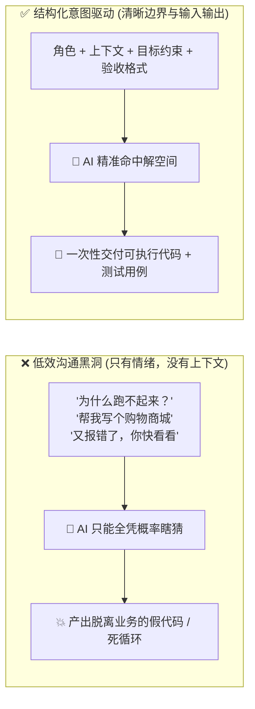
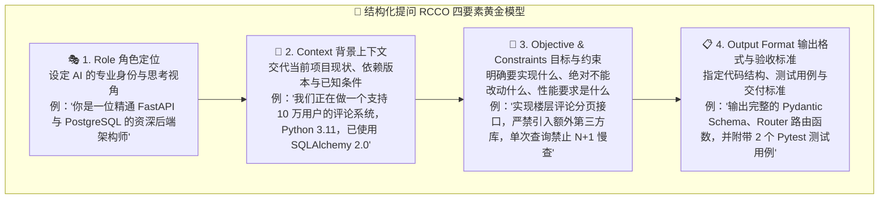
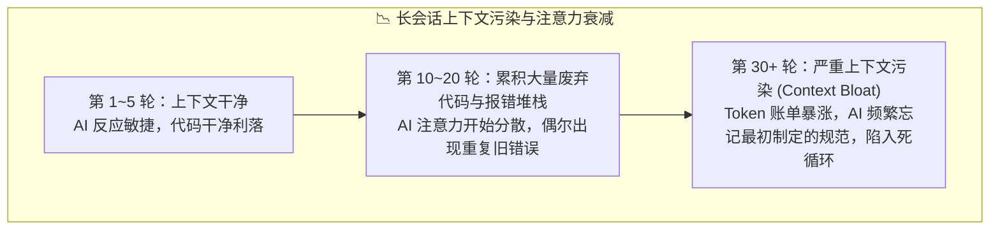
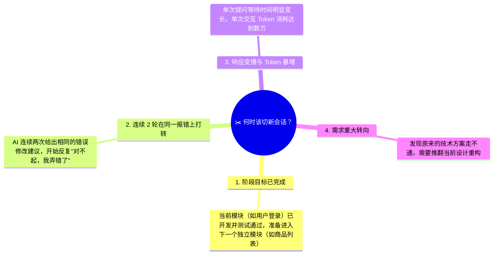
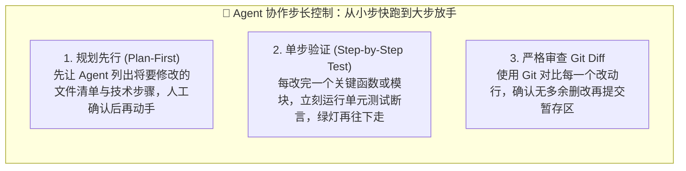

# 14.6 如何正确的使用 AI：结构化提问、会话生命周期与 Agent 步长控制

> **💡 核心认知心法**：
> **给高级 AI 喂垃圾信息，只会得到格式优美的垃圾代码；给普通 AI 喂高质量的结构化意图，却能产出工业级的工程交付物。用好 AI 的关键不在于掌握多少神秘的"咒语黑话"，而在于掌握"结构化表达的底层逻辑"、"会话生命周期的科学管理"以及"与 Agent 协同的步长控制"。**
>
> **📌 2026 年官方共识**：Anthropic 与 OpenAI 均发布了官方提示工程（Prompt Engineering）指南，核心结论高度一致——**"把上下文喂清楚"比"喊什么咒语"重要 100 倍**。

***

## 🎯 一、提问的第一性原理：垃圾进，垃圾出 (GIGO)

在大模型交互中，最经典的铁律是 **GIGO 原则（Garbage In, Garbage Out）**。Anthropic 在[官方提示工程指南](https://docs.anthropic.com/en/docs/build-with-claude/prompt-engineering/overview)里把"清晰具体的指令"列为第一条最佳实践，OpenAI 在[提示工程指南](https://platform.openai.com/docs/guides/prompt-engineering)中同样强调"给出足够上下文"。



### 1. 常见无效提问负面清单（避坑速查）

- ❌ **"这代码报错了，怎么办？"**（不给报错日志，不给环境版本，不给前因后果）；
- ❌ **"给我写一个类似抖音的 App"**（需求范围极其庞大，没有任何功能拆分与技术栈约束）；
- ❌ **"不对不对，还是不行，你重新写一下"**（不指出具体哪里不符合预期，导致 AI 盲目重写已有正确代码）。

---

## 📐 二、结构化提问黄金公式：RCCO 模型

高效开发者向 AI 提问时，都遵循一套标准化的结构化输入范式：**RCCO 模型（Role 角色 + Context 上下文 + Constraints 约束 + Output 期望输出）**。这与 [Anthropic 官方提示工程](https://docs.anthropic.com/en/docs/build-with-claude/prompt-engineering/overview) 倡导的"角色 + 任务 + 上下文 + 格式"四要素高度一致。



### 💡 提问实战模版（直接套用）：

```markdown
【角色设定】：你是一位专注于现代全栈开发的 Senior Engineer。
【项目背景】：我正在使用 Vue 3 (Composition API) + TypeScript + Tailwind CSS 编写前端后台。
【核心目标】：请帮我编写一个通用的数据表格分页组件 `CustomPagination.vue`。
【边界约束】：
1. 支持传入 `total`（总条数）、`page`（当前页）、`pageSize`（每页大小）；
2. 当总页数超过 7 页时，中间展示省略号（...）；
3. 严格遵循 `<script setup lang="ts">` 语法，不使用任何外部 UI 库（如 Element Plus）；
4. 样式使用 Tailwind CSS 实现响应式适配。
【期望输出】：
1. 完整的单文件组件代码；
2. 组件的 Props 与 Emits TypeScript 接口定义；
3. 一个父组件的极简调用示例。
```

### 📌 进阶：Spec 驱动开发——把"一次性提问"升级为"工程级规格"
- 2026 年最被业界推崇的做法是 **Spec 驱动开发**：不是每次提问都临时编背景，而是把需求写成一份 `spec.md` 规格文档（见本项目 3.5 节的 [OpenSpec 实战](../03_脚手架搭建/05_Spec驱动开发与OpenSpec实战.md)），让 AI 每次开工前都先读规格。
- 好处：**上下文 100% 一致**、**可追溯**、**切新会话也能无缝续接**——从源头消灭"AI 忘了需求"的问题。

---

## ⏳ 三、会话生命周期的科学管理：什么时候必须切新会话？

许多初学者喜欢在一个聊天窗口里从项目第一天一直聊到项目上线，结果越到后面，AI 越显得"智商滑坡"、"反应迟钝"、"答非所问"。



### 1. 为什么长会话会导致 AI "变蠢"？
- **注意力稀释**：大模型的 Attention 机制会在整个上下文窗口中分配注意力。如果会话历史里充斥着前 20 轮被废弃的旧逻辑和几十页无用的报错堆栈，模型的注意力就会被严重稀释。
- **错误记忆锚定**：当你在前面几轮贴过错误的思路，AI 在后续生成时会潜意识参考前面的错误文本，导致"道歉了但下次还犯"。
- **账单暴增**：每轮都把全量历史重新塞给模型（见 14.2 的"Token 乘法风暴"），长会话的 Token 消耗呈二次方级膨胀。

### 2. 🚨 切新会话的 4 大黄金信号



### 3. 优雅切会话姿势：阶段性归纳交接棒法 (Summary Handoff)

不要直接两手空空关掉旧会话！在开启新会话之前，执行以下优雅交接步骤：

1. **在旧会话最后让 AI 总结**：
   > *"请用一段结构化的 Markdown 总结我们当前完成的成果、当前项目的核心文件路径以及接下来需要完成的下一步任务清单。"*
2. **复制总结作为新会话的第 1 条消息**：
   > *"你好！我们正在开发 XX 系统。以下是上个阶段的完成成果与当前代码状态：[粘贴总结]。现在请帮我执行下一步任务：[输入新任务]。"*

这样既彻底清空了旧会话的历史垃圾噪点，又 100% 保留了核心项目进度！进阶用户还可以把这份交接总结直接写进 `AGENTS.md` / `spec.md`，让 AI 每次开工都自带"记忆"。

### 4. ⚡ Codex 专题：258k 上下文红线与"压缩计数"切会话法

用 [Codex](https://developers.openai.com/codex)（GPT-5.x 编码智能体）日常开发时，有一条必须刻在脑子里的红线：

- **单会话上下文上限 258k Token，一旦超出 258k，超出部分的计费直接加倍**。所以日常开发的第一目标就是：把工作节奏控制在 258k 以内，既保智商又保钱包。
- **千万不要等会话弹窗提示"本次会话已超过上限"才动手**。等到系统提示的那一刻，会话早已经历了不知道多少轮自动压缩（Auto-Compaction）——上下文被摘要了一遍又一遍，响应变慢只是表象，细节丢失、需求遗忘、质量滑坡才是真伤。**别把系统提示当闹钟，要自己看表。**

**那压缩几次该切？实战阈值建议如下**：

| 自动压缩次数 | 会话状态 | 建议 |
| :--- | :--- | :--- |
| 0 次 | 黄金状态，上下文干净 | 放心干 |
| 1 次 | 质量基本无损 | 可以继续 |
| **2 次** | 细节开始明显丢失 | **当前任务收尾后立即切新会话** |
| 3 次及以上 | 严重劣化，答非所问高发 | 别硬撑，立即总结交接、开新会话 |

配合体感信号一起用：**明显感觉响应变慢、AI 开始复读旧结论、简单指令也要确认半天——不用数压缩次数，直接切**。切会话时套用上面的"总结交接棒法"，一分钟完成无痛迁移。

---

## 🛠️ 四、Agent 工具高阶使用心法：控制步长与人类在环

当使用 [Claude Code](https://code.claude.com)、[Cursor](https://www.cursor.com)、[OpenCode](https://opencode.ai)、[Trae SOLO](https://www.trae.ai) 等自主 Agent 工具时，如果彻底放手让它"全自动狂奔"，往往会带来灾难性的多文件破坏。



### 💡 核心进阶操作技巧：
1. **用规则文件死死锁住规范**：在项目根目录维护 [AGENTS.md](../AGENTS.md) 或 `.cursorrules`，将代码风格、禁止使用的库、架构分层铁律写入其中，AI 在每次执行前会自动读取——这是 Anthropic、OpenAI、Google 2026 年一致推荐的 [AGENTS.md 标准](https://agents.md/)；
2. **给 AI 报错时提供"完整调用栈"**：不要只截取最后一行 `IndexError`，必须附带完整的 Traceback 与相关代码片段，AI 才能定位真正的根因；
3. **提供最小可复现示例 (MRE)**：在排查疑难杂症时，把相关逻辑抽离成一个只有 20 行的单文件脚本给 AI 分析，排错效率提升 10 倍！
4. **使用 Agent 的"计划模式/交互模式"**：Cursor 的 Plan 模式、Claude Code 的 Plan 模式、Trae 的交互模式，都会让 Agent **先出方案、等人类批准再动手**——这是防止 Agent 乱改文件的最强保险丝；
5. **开启 Hooks 审计**：在 [Claude Code 的 Hooks 机制](https://code.claude.com/docs/en/hooks) 中挂上 `PreToolUse` / `PostToolUse`，对危险命令（`rm -rf`、`DROP TABLE`、`git push --force`）自动拦截或告警。

### 📌 2026 年新增心法：Agent 的"上下文预算"管理
- 长 Agent 会话同样会遭遇上下文膨胀。高级用法是**按阶段拆分 Agent 任务**（每完成一个阶段就 `/compact` 或切新会话），而不是让一个 Agent 从早跑到晚。Codex 用户建议直接采用上文第三节的"压缩计数法"：自动压缩满 2 次就切，绝不硬撑到系统弹窗。
- 如果 Agent 开始"忘记最初需求"，**别继续对话硬撑，立即开新会话 + 粘贴 AGENTS.md / spec.md 交接**，这是社区公认最有效的提效手段。

---

## 🎯 本节小结与行动清单

- [x] **掌握提问模版**：每次提问严格套用 RCCO 四要素，拒绝情绪化低效沟通。
- [x] **建立会话纪律**：出现 4 大信号果断切新会话，善用"总结交接棒法"无缝迁移。
- [x] **守好 Codex 258k 红线**：压缩满 2 次或明显变慢立即切会话，不等系统弹窗、不烧加倍计费。
- [x] **控制 Agent 步长**：计划先行、单步测试验证、随时检查 Git Diff，做胸有成竹的技术指挥官。
- [x] **拥抱 Spec 工程**：用 AGENTS.md / spec.md 让 AI 自带"记忆"，从源头消灭上下文漂移。
- [x] **关注官方最佳实践**：持续跟进 [Anthropic 提示工程](https://docs.anthropic.com/en/docs/build-with-claude/prompt-engineering/overview) 与 [OpenAI 提示工程](https://platform.openai.com/docs/guides/prompt-engineering) 的最新指南。
