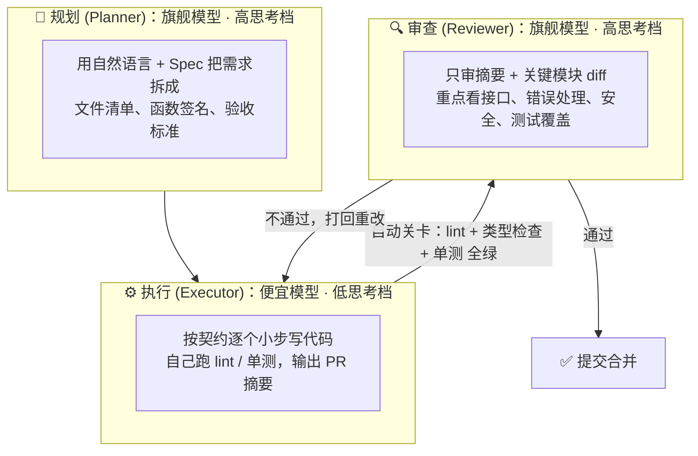
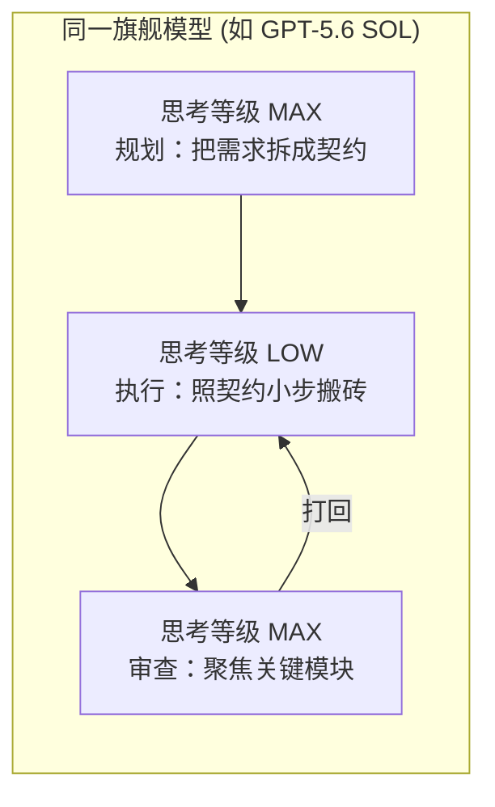

# 14.7 思考等级与多模型分工：用最便宜的方式把事做对

> 一个"全能冠军"打天下很酷，但在 Agent 时代往往既烧钱又慢。更聪明的做法是学一支**分工明确的球队**：让"教练"（旗舰模型）负责定战术，让"体力好的角色球员"（便宜小模型）负责跑动执行，再让"教练"回来把关——这就是**多模型分工流水线**与**思考等级路由**。

***

## 💡 先建立核心认知：为什么"一个模型打天下"在 Agent 时代很亏？

在 14.2 我们讲过 **Agent 乘法风暴**：Agent 每执行一步工具（看文件、跑命令、看报错），都要把**全量历史上下文重新打包喂给大模型**再算一次。这意味着：

1. **便宜 vs 旗舰的差价会被"放大很多倍"**：一个跑 30 步的 Agent 任务，如果全程用旗舰模型，等于把旗舰价格乘了 30 次；如果中间大量机械步骤换成便宜模型，省下的就是这 30 步里每一步的差价。
2. **"思考"也是可以调档的**：2026 年的主流模型普遍开放了**推理强度/思考等级**参数——`reasoning_effort` 可以从 `low`（秒回、少想）调到 `high/max`（深思熟虑、烧脑更烧钱）。同一个模型，`low` 档和 `max` 档的成本可能差几倍。官方文档：[OpenAI 推理强度指南](https://platform.openai.com/docs/guides/reasoning) · [Anthropic 扩展思考](https://docs.anthropic.com/en/docs/build-with-claude/extended-thinking) · [Google Gemini Thinking](https://ai.google.dev/gemini-api/docs/thinking-mode) · [智谱深度思考](https://docs.bigmodel.cn/cn/guide/capabilities/thinking)。
3. **关键洞察**：**规划与审查是"想得多"，执行是"跑得多"**。想的次数少、但质量决定成败；跑的次数多、但大多是重复劳动。所以最省钱又最稳的组合是——**让贵的模型"多想"（规划+审查），让便宜模型"多跑"（执行）**。

***

## 🧩 方案 A：多模型"规划 → 执行 → 审查"流水线

这是最经典的"教练-球员-裁判"三权分立打法：



### 三步职责表

| 角色                | 用谁                                      | 思考档位 | 产出什么                   | 验收标准                          |
| :---------------- | :-------------------------------------- | :--- | :--------------------- | :---------------------------- |
| **规划 (Planner)**  | 旗舰（如 GPT-5.6 SOL / Claude Opus）         | 高    | 计划书：文件清单 + 函数签名 + 验收标准 | 能直接当"契约"交给另一个模型执行，不含歧义        |
| **执行 (Executor)** | 便宜（如 GPT-5.6 Luna / Grok 4.6 / Flash 系） | 低    | 可运行代码 + 自测记录 + PR 摘要   | lint/typecheck/单测全绿；改动范围不超过契约 |
| **审查 (Reviewer)** | 旗舰（同上）                                  | 高    | 批注/修改意见 + 最终放行         | 接口、错误处理、安全、测试覆盖达标             |

### ✅ 优点

- **省钱**：机械执行占了 Agent 循环 80% 以上的步数，这部分的"乘法风暴"差价被便宜模型吃掉了。
- **省时**：旗舰模型只在"开头定方向"和"结尾把关"出现两次，不用陪着跑完几十步。
- **质量更稳**：审查是独立视角（不是自己写自己审），更容易发现执行器的"自嗨式错误"。

### ⚠️ 缺点与"屎山防线"

最大的坑就是：**便宜执行器可能生成一堆"屎山"**，还**看起来挺像样**。防它靠六道保险：

1. **规划要写成"模型无关的契约"**：文件清单 + 函数签名 + 验收标准（参考 [Spec 驱动开发 / OpenSpec](../03_脚手架搭建/05_Spec驱动开发与OpenSpec实战.md)），别写散文——散文跨模型交接最容易丢上下文。
2. **限制执行器步长**：一次只改一个可审查的小 diff，禁止"一口气重写整个模块"。
3. **掐紧输出**：思考等级调低——屎山不是"写出来的"，是"一步写太多"憋出来的。
4. **自带自动关卡再交卷**：执行器提交前必须自己跑 `lint + typecheck + 单测`，全绿才允许进审查；别让旗舰审查去抓编译器就能抓的错。
5. **执行器必须附 PR 摘要**：改了什么、为什么、哪里没把握（3 句话），审查者先读意图 + 疑点，不逐行读。
6. **审查按清单聚焦**：只审接口签名、错误处理、安全、测试覆盖；格式化交给 Prettier/Ruff 自动处理，不浪费旗舰时间。

***

## 🎛️ 方案 B：同一模型"思考等级路由"

如果你不想维护多个账号、也不想面对"跨模型方言漂移"（SOL 写计划、Luna 看不懂），可以**只用同一个旗舰模型，靠切换思考等级**来分工：



- **规划/审查**：`reasoning_effort = high/max`（烧脑但次数少，撑得住）；
- **执行**：`reasoning_effort = low`（秒回、少想，省 token 省时间，靠契约约束它不跑偏）。

**它的好处**：

- 不用养两套账号，API Key 管理更简单；
- 计划/执行/审查是**同一个"人"**，上下文和"语言习惯"完全一致，没有交接损耗；
- 适合预算有限、但任务复杂度中等的个人开发者。

**它的问题**：同模型低思考档的执行力上限，不如"专门跑得快的便宜模型"（后者往往参数量小但吞吐高）。所以**任务量极大、跑 50 步以上**时，方案 A 更香。

### 📊 方案 A vs 方案 B 速览

| 对比维度        | 方案 A：多模型分工       | 方案 B：思考等级路由      |
| :---------- | :--------------- | :--------------- |
| **省钱效率**    | 更高（便宜模型吃下大部分步数）  | 中（同模型 low 档省一部分） |
| **跨模型交接成本** | 有（计划必须写成契约）      | 无（同一个人）          |
| **执行吞吐**    | 高（专门模型跑得快）       | 中                |
| **适合谁**     | 重活多、Agent 长任务、团队 | 个人中等任务、想省事的你     |

***

## 🚀 进阶补充：弱执行 + 强验证（Generate-and-Test）

当任务是"有多个可行实现可选"时（比如"实现一个限流器，给三种方案"），可以再升级一档：

1. **让便宜模型批量生成多个候选实现**（快、便宜、量大）；
2. **让自动测试跑一遍**，把明显不合格的筛掉；
3. **旗舰模型只做"验证 + 挑选"**：看每个候选的接口与边界处理，挑最优或融合。

这样旗舰模型的每次出现，都是在**做决策**而不是**搬砖**，性价比最高。

***

## 🎯 实战组合参考

### 组合一：多模型三件套

```
规划：GPT-5.6 SOL（思考 MAX，把需求写成契约）
执行：Cursor 里的 Grok 4.6（低思考 + 小步 + 自测 + PR 摘要）
关卡：lint + typecheck + 单测全绿
审查：GPT-5.6 SOL（只审摘要 + 关键模块 diff）
```

### 组合二：同模型思考等级路由

```
规划：GPT-5.6 SOL（reasoning_effort = max）
执行：GPT-5.6 Luna（reasoning_effort = max）
审查：GPT-5.6 SOL（reasoning_effort = max）
```

### 组合三：低成本起步（学生 / 新手）

```
规划 + 审查：GLM-5 / DeepSeek-V4-Pro（高思考档）
执行：DeepSeek-V4-Flash / GLM-4-Flash（几乎白菜价）
```

> 不建议一开始就上"三模型豪华流水线"——先把 14.6 的 RCCO 提问、Plan 模式、步长控制练熟，再上分工流水线，否则容易"三个模型互相听不懂"。

***

## ✅ 本节小结与行动清单

- [x] **记住乘法风暴**：Agent 长任务里"步数×单步差价"才是省钱大头，别只盯着单次调用价格。
- [x] **贵的多想，便宜的多跑**：规划与审查交给旗舰高思考档，执行交给便宜低思考档。
- [x] **计划写成契约**：文件清单 + 函数签名 + 验收标准，才能跨模型安全交接。
- [x] **先上自动关卡**：lint/typecheck/单测全绿才轮到旗舰审查，别浪费旗舰时间抓低级错。
- [x] **审查按清单聚焦**：只审接口、错误处理、安全、测试覆盖，格式化交给工具。
- [x] **关键路径不省钱**：支付、安全、核心算法，该旗舰就旗舰；省钱只省在样板/机械代码上。
- [x] **多尝试、找自己舒服的搭配**：没有唯一正确答案，方案 A / B / Generate-and-Test 都值得各跑几个真实任务对比效果。

