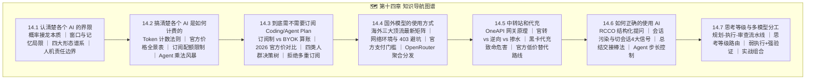

# 第十四章：如何正确的使用 Agent 工具 —— 认知破局、算清账本与高效驾驭

> **"在 AI 时代，最好的程序员不是代码敲得最快的人，而是最清楚工具边界、最会算经济账、最懂得如何向 AI 清晰表达意图的指挥官。"**

***

## 📖 章节导读 (Chapter Overview)

欢迎来到**第十四章《如何正确的使用 Agent 工具》**！

在前面的章节中，我们学习了大模型原理、Agent 架构、环境脚手架搭建以及各种工具框架的实战（Dify、OpenCode、Trae、LangChain、LangGraph、RAG 等）。然而，在真实的日常开发与工程落地中，许多人常常陷入一系列困惑与误区：

- *"为什么我让 AI 写代码，它总是写出看起来很漂亮但一跑就崩的代码？"*
- *"每个月几十美元的 AI 订阅会员到底有没有必要买？API 计费和 Token 乘法风暴到底是怎么扣钱的？"*
- *"海外顶级大模型怎么合规稳定使用？中转站和代充到底有哪些坑？"*
- *"为什么同一个模型，高手用起来如臂使指，小白用起来却漏洞百出、陷入死循环？"*

本章将作为你的 **"AI 驾驶员全景必修指南"**，从**能力界限、计费账单、订阅选型、海外访问、中转避坑到提问与会话管理**，全方位帮助你建立成熟理性的工具观，做一名清醒、高效的现代 Vibe Coder。

> 📌 **2026 年 8 月更新说明**：本章已根据各厂商最新官方文档全面重写，模型梯队更新至 **Claude 5 / GPT-5.6 / Grok 4.6 / DeepSeek-V4 / Qwen3.x / GLM-5 / Kimi K2.7**，API 与订阅价格均引用 2026 年 8 月官方定价页。新增**国内 Coding Plan（GLM / Kimi / Trae）** 全景对比与选型决策树，帮助大家在官方低价通道普及的当下做最理性的选择。另新增 **14.7 思考等级与多模型分工**，系统讲解"规划→执行→审查"流水线、Reasoning Effort 思考等级路由与弱执行+强验证打法。

***

## 🗂️ 章节目录 (Table of Contents)

| 小节编号     | 标题                                                                        | 核心内容提要                                                                                        |
| :------- | :------------------------------------------------------------------------ | :-------------------------------------------------------------------------------------------- |
| **14.1** | [认清楚各个 AI 的界限](./01_认清楚各个AI的界限.md)                                        | 大模型的概率接龙物理法则、窗口遗忘、四大形态分工（Chat/Copilot/Agent/专用模态）、2026 最新模型梯队与人机权力边界                          |
| **14.2** | [搞清楚各个 AI 是如何计费的](./02_搞清楚各个AI是如何计费的.md)                                  | Token 原理、输入/输出/上下文缓存（Prompt Caching）差价、2026 海外+国内官方价格全景表、Agent 循环乘法风暴与四大省钱杠杆                  |
| **14.3** | [到底需不需要订阅 Coding Plan 和 Agent Plan](./03_到底需不需要订阅CodingPlan和AgentPlan.md) | 订阅生意的对赌本质（健身房年卡比喻）、订阅包月 vs 自带 API Key (BYOK) 成本临界点与自算法、2026 海外订阅 + 国内 Coding Plan 官方价对比、四类人群黄金选型决策树、隐藏机关（5小时沙漏/年付锁价/Credits 膨胀）与订阅前 30 秒自检清单、防割指南 |
| **14.4** | [国外模型的使用方式](./04_国外模型的使用方式.md)                                            | OpenAI/Claude/Grok 最新模型矩阵、纯净代理节点三铁律与 IP 风控排查、海外支付门槛、[OpenRouter](https://openrouter.ai/) 聚合分发与订阅内嵌多模型的"顺带"用法 |
| **14.5** | [中转站和代充](./05_中转站和代充.md)                                                  | OneAPI/NewAPI 网关原理、正规官转 vs 逆向 vs 掺水识别探针、sub2api 反代"官方对齐度"检测法、黑卡代充封号黑产内幕、代充行情价（¥120~140）与自保铁律               |
| **14.6** | [如何正确的使用 AI](./06_如何正确的使用AI.md)                                           | 提问 RCCO 黄金模型、长会话上下文污染机理、切新会话 4 大信号、阶段性总结交接棒法、Agent 步长控制与 Spec 工程                              |
| **14.7** | [思考等级与多模型分工：用最便宜的方式把事做对](./07_思考等级与多模型分工_用最便宜的方式把事做对.md)                  | 多模型"规划→执行→审查"流水线与屎山防线、同一模型思考等级（Reasoning Effort）路由、弱执行+强验证（Generate-and-Test）、三套实战组合参考        |

***

## 💡 全章核心心法速览 (Key Takeaways)

1. **认清概率本质**：AI 是极其聪明的概率接龙机，不是真正的确定性编译器。代码必须经过单元测试与静态检查，绝不能盲信。
2. **算好 Token 经济账**：轻度用户坚决走 BYOK 按量 API 路线（一月几块钱）；重度用户订阅单一主力 IDE（Cursor Pro / Trae / Claude Pro），并善用上下文缓存（省 90%\~97%）与 Batch API（5 折）大幅降本。
3. **拥抱官方低价通道**：2026 年国内 GLM / Kimi / Trae 的 Coding Plan（月卡封顶）与海外 OpenRouter（不加价）已足够便宜，能官方就别碰中转与黑卡代充。
4. **远离黑产诱惑**：切忌贪图便宜购买来路不明的黑卡代充与共享车队，账号资产安全与代码隐私永远是第一位的。
5. **科学管理上下文**：出现思路打转或模块切换时果断开启新会话，用"RCCO 结构化提问"和"总结交接棒法"保持 AI 处于最佳智商状态。
6. **贵的多想，便宜的多跑**：复杂任务用旗舰模型 + 高思考档做规划与审查，用便宜模型 + 低思考档做机械执行，关键路径不省钱、样板代码使劲省。

***

## 🔗 本章常用官方权威参考链接

> 以下链接为本章各小节引用的官方定价与文档，建议收藏并定期核对最新价格：

- **Anthropic Claude**：[模型与定价](https://platform.claude.com/docs/en/about-claude/pricing) · [Claude Sonnet 5](https://platform.claude.com/docs/en/models/sonnet-5/overview) · [订阅方案](https://claude.com/pricing) · [提示工程](https://docs.anthropic.com/en/docs/build-with-claude/prompt-engineering/overview)
- **OpenAI**：[API 定价](https://developers.openai.com/api/docs/pricing) · [ChatGPT 订阅](https://chatgpt.com/pricing) · [提示工程](https://platform.openai.com/docs/guides/prompt-engineering)
- **xAI Grok**：[模型与定价](https://docs.x.ai/docs/models) · [API 控制台](https://console.x.ai) · [Grok 订阅](https://grok.com)
- **DeepSeek**：[模型与定价](https://api-docs.deepseek.com/quick_start/pricing)
- **阿里百炼 Qwen**：[Qwen3-Max 定价](https://help.aliyun.com/zh/model-studio/model-qwen3-max) · [选型与定价](https://www.aliyun.com/product/bailian/pricing)
- **智谱 GLM**：[开放平台定价](https://open.bigmodel.cn/pricing)
- **月之暗面 Kimi**：[K2.7 Code 定价](https://www.kimi.com/resources/kimi-k2-7-code-pricing) · [会员定价](https://www.kimi.com/membership/pricing)
- **Cursor**：[定价与套餐](https://cursor.com/pricing)
- **GitHub Copilot**：[计划与定价](https://github.com/features/copilot/plans)
- **Trae**：[国际版定价](https://www.trae.ai/pricing) · [国内版定价](https://www.trae.cn/pricing)
- **Windsurf**：[定价](https://windsurf.com/pricing)
- **OpenRouter**：[官网](https://openrouter.ai/) · [最低成本指南](https://openrouter.ai/blog/tutorials/how-to-get-the-lowest-cost-llm-inference-on-openrouter/)
- **AGENTS.md 规范**：[agents.md](https://agents.md/) · [Model Context Protocol (MCP)](https://modelcontextprotocol.io/)

