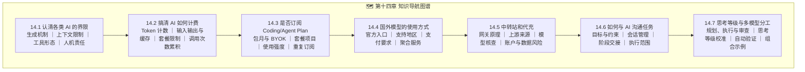

# 第十四章：如何正确使用 Agent 工具 —— 能力边界、使用成本与任务沟通

使用 Agent 的效果取决于三个基本条件：工具能否接触完成任务所需的资料和环境，使用者是否给出了清楚的目标与验收要求，执行结果是否经过验证。本章围绕这三个条件展开。

***

## 章节导读

前面的章节介绍了大模型、Agent 架构和多种开发工具。实际使用时，模型能力只是其中一个变量，账户方案、上下文长度、工具权限、任务拆分和验证方式都会影响结果。常见问题包括：

- *"为什么我让 AI 写代码，它总是写出看起来很漂亮但一跑就崩的代码？"*
- *"每个月几十美元的 AI 订阅会员到底有没有必要买？API 计费和 Token 乘法风暴到底是怎么扣钱的？"*
- *"海外成熟大模型怎么合规稳定使用？中转站和代充到底有哪些坑？"*
- *"为什么同一个模型，在不同任务说明和验证流程下会产生明显不同的结果？"*

本章依次讨论能力界限、计费方式、订阅选择、服务获取方式、第三方中转风险，以及任务说明和会话管理。目标是让选择建立在真实任务、实际用量和可验证结果上。

> **资料时点说明**：模型名称、套餐价格、用量限制和支持地区都会调整。文中的表格记录了编写时查阅到的信息，用于解释计费和选型方法；购买或配置前，请重新打开对应厂商的官方页面核对。14.7 具体讨论“规划—执行—审查”的任务分工，以及如何用代表性任务校准思考等级。

***

## 章节目录 (Table of Contents)

| 小节编号     | 标题                                                                        | 核心内容提要                                                                                        |
| :------- | :------------------------------------------------------------------------ | :-------------------------------------------------------------------------------------------- |
| **14.1** | [认清楚各个 AI 的界限](./01_认清楚各个AI的界限.md)                                        | 大模型的生成机制与上下文限制；Chat、Copilot、Agent 和专用模型的能力差异；需求、安全和验收责任怎样划分                          |
| **14.2** | [搞清楚各个 AI 是如何计费的](./02_搞清楚各个AI是如何计费的.md)                                  | Token、输入输出、上下文缓存和调用次数如何形成账单；怎样用一次真实任务记录成本；价格表如何核对                  |
| **14.3** | [到底需不需要订阅 Coding Plan 和 Agent Plan](./03_到底需不需要订阅CodingPlan和AgentPlan.md) | 包月订阅与自带 API Key（BYOK）的成本差异；滚动时间窗口、Credits、年付和重复订阅；根据实际用量做选择 |
| **14.4** | [国外模型的使用方式](./04_国外模型的使用方式.md)                                            | OpenAI、Claude、Grok 等服务的官方入口、支持地区和支付要求；[OpenRouter](https://openrouter.ai/) 等聚合服务的使用条件与数据条款 |
| **14.5** | [中转站和代充](./05_中转站和代充.md)                                                  | OneAPI/NewAPI 网关原理、上游来源差异、模型降级核查方法、代充的账户与支付风险，以及使用第三方服务前的数据安全检查               |
| **14.6** | [如何正确地使用 AI](./06_如何正确的与AI进行对话.md)                                           | 如何说明背景、目标、约束和验收标准；何时整理或切换会话；怎样控制 Agent 的修改范围并安排人工检查                              |
| **14.7** | [思考等级与多模型分工：用较低成本把任务做对](./07_思考等级与多模型分工_用最便宜的方式把事做对.md)                  | “规划—执行—审查”的职责划分；同一模型思考等级（Reasoning Effort）的选择；用自动化检查验证执行结果        |

***

## 本章要点

1. **先确认能力边界**：模型生成的代码和结论需要单元测试、静态检查或来源核对；产品能否执行任务还取决于工具和权限。
2. **按真实用量计算费用**：输入、输出、缓存和多轮工具调用都会影响账单。BYOK 与订阅谁更合适，要看一段时间内完成任务的实际成本。
3. **购买前核对当前规则**：模型、价格、配额和支持地区变化较快，表格只能作为方法示例，最终以官方页面和结算页为准。
4. **评估第三方服务的数据风险**：无法说明运营主体、上游模型、日志保留和申诉渠道的服务，不适合传输敏感代码或账户凭据。
5. **管理长任务的上下文**：阶段切换时整理目标、已完成事项、遗留问题和验收条件；当历史内容开始干扰当前模块时，再开启新会话。
6. **按阶段选择模型配置**：规划和审查通常需要更完整的推理，边界清楚并能自动验证的执行步骤可以使用成本较低的配置，最终以对照测试结果决定。

***

## 本章常用官方资料

> 以下链接为本章各小节引用的官方定价与文档，建议收藏并定期核对最新价格：

- **Anthropic Claude**：[模型与定价](https://platform.claude.com/docs/en/about-claude/pricing) · [Claude Sonnet 5](https://platform.claude.com/docs/en/models/sonnet-5/overview) · [订阅方案](https://claude.com/pricing) · [提示工程](https://docs.anthropic.com/en/docs/build-with-claude/prompt-engineering/overview)
- **OpenAI**：[API 定价](https://developers.openai.com/api/docs/pricing) · [ChatGPT 订阅](https://chatgpt.com/pricing) · [提示工程](https://platform.openai.com/docs/guides/prompt-engineering)
- **xAI Grok**：[模型与定价](https://docs.x.ai/docs/models) · [API 控制台](https://console.x.ai) · [Grok 订阅](https://grok.com)
- **DeepSeek**：[模型与定价](https://api-docs.deepseek.com/quick_start/pricing)
- **阿里百炼 Qwen**：[Qwen3-Max 定价](https://help.aliyun.com/zh/model-studio/model-qwen3-max) · [选型与定价](https://www.aliyun.com/product/bailian/pricing)
- **智谱 GLM**：[开放平台定价](https://open.bigmodel.cn/pricing)
- **月之暗面 Kimi**：[K2.7 Code 定价](https://www.kimi.com/resources/kimi-k2-7-code-pricing) · [会员定价](https://www.kimi.com/membership/pricing)
- **Cursor**：[定价与套餐](https://cursor.com/pricing)
- **GitHub Copilot**：[计划与定价](https://github.com/features/copilot/plans)
- **Trae**：[国际版定价](https://www.trae.ai/pricing) · [国内版定价](https://www.trae.cn/pricing)
- **Windsurf**：[定价](https://windsurf.com/pricing)
- **OpenRouter**：[官网](https://openrouter.ai/) · [最低成本指南](https://openrouter.ai/blog/tutorials/how-to-get-the-lowest-cost-llm-inference-on-openrouter/)
- **AGENTS.md 规范**：[agents.md](https://agents.md/) · [Model Context Protocol (MCP)](https://modelcontextprotocol.io/)

---

<!-- CH10-14_README_EXPANSION -->

## 使用本章时先区分三类动态信息

模型名称和能力会更新，套餐价格与用量限制会调整，服务支持地区和支付条件也会变化。文中的表格适合作为理解计费方式和选择因素的例子，实际购买或配置前应重新查看对应厂商的官方页面。

更稳定的学习主线是：明确工具能访问什么，给任务写清结果与验收条件，记录一次真实任务的用量，再根据准确性、耗时、费用和可撤销性选择模型与执行方式。

如果只想先解决当前问题，可以按需求选读：判断某个工具能否完成任务看 14.1；核算 API 花费看 14.2；比较包月与按量看 14.3；了解官方入口和服务地区看 14.4；评估第三方渠道看 14.5；改善任务说明和长会话管理看 14.6；需要在多个模型或思考等级之间分配任务时看 14.7。读完后最好拿同一个真实任务做一次对照记录。

一次完整的对照练习可以选“修复一个带测试的代码问题”。开始前保存任务说明、相关文件和验收命令；运行时记录模型、思考等级、可用工具、调用次数、等待时间和费用；完成后检查修改范围、测试结果以及能否回退。若第一次失败，再记录失败来自资料不足、工具权限、任务说明还是模型判断。这样得到的记录能够同时验证 14.1 的能力边界、14.2 的成本计算和 14.6 的沟通方法。

比较两个工具时，尽量保持代码版本、任务说明和验收命令相同。若其中一个工具能访问更多文件或自动运行测试，应把这种产品能力单独写入结果，避免把客户端差异全部归因于模型。涉及动态价格时，保留核对日期和官方页面；涉及订阅时，再把限流等待和闲置月份算进总成本。

这套记录不必复杂，一张表就够用。关键是让后续选择能够回到事实：哪类任务完成得更稳定，哪一步最常返工，费用是否在预算内，敏感操作是否留下了人工确认和回退路径。

第三方聚合、中转和代充涉及账号、数据与支付风险。不要把敏感代码、客户资料或主账号凭据交给无法说明责任主体的服务；优先选择能够核对主体、条款、账单和申诉渠道的方式。
